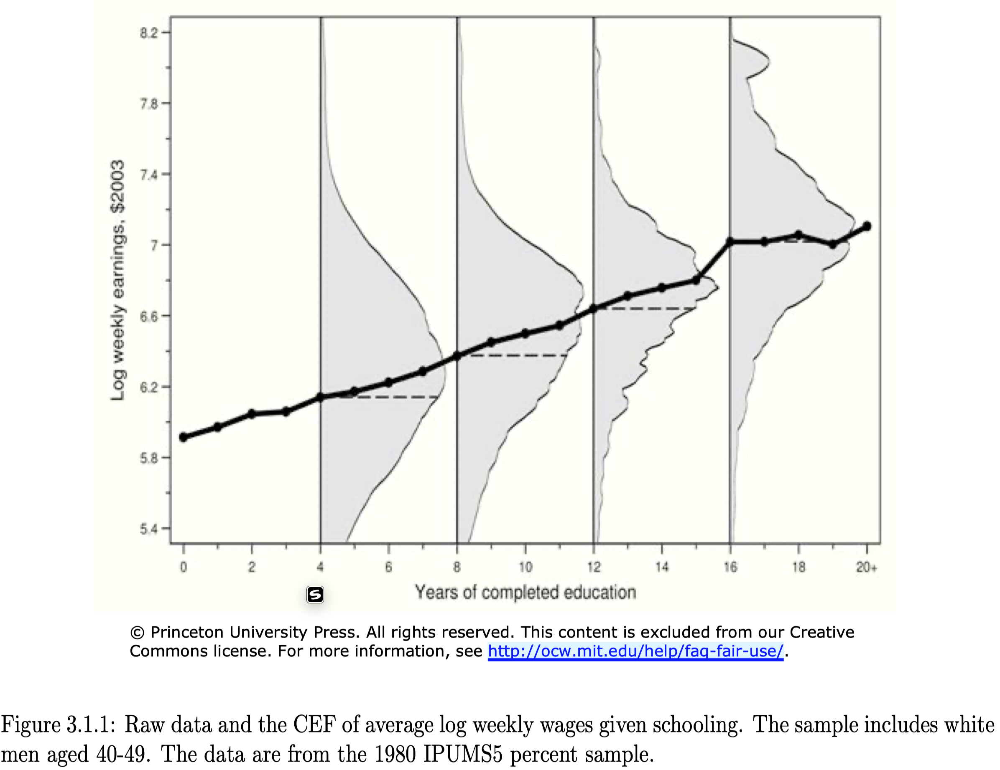

class: center, middle, inverse

```{R, setup, include = F}
# devtools::install_github("dill/emoGG")
library(pacman)
p_load(
  broom, tidyverse,
  ggplot2, ggthemes, ggforce, ggridges,
  latex2exp, viridis, extrafont, gridExtra,
  kableExtra, snakecase, janitor,
  data.table, dplyr, estimatr,
  lubridate, knitr, parallel,
  lfe,dslabs,
  here, magrittr, RcmdrPlugin.KMggplot2
)

options(htmltools.dir.version = FALSE)

# Notes directory
dir_slides <- "~/Users/zhouzhengqing/Desktop/SportsEconAnalysis-master/02_Regression_and_causality1/"
# Define pink color
red_pink <- "#e64173"
turquoise <- "#20B2AA"
orange <- "#FFA500"
red <- "#fb6107"
blue <- "#3b3b9a"
green <- "#8bb174"
grey_light <- "grey70"
grey_mid <- "grey50"
grey_dark <- "grey20"
purple <- "#6A5ACD"
slate <- "#314f4f"
met_slate <- "#272822" # metropolis font color 

# Dark slate grey: #314f4f

# Knitr options
opts_chunk$set(
  comment = "#>",
  fig.align = "center",
  fig.height = 7,
  fig.width = 10.5,
  warning = F,
  message = F
)
opts_chunk$set(dev = "svg")
options(device = function(file, width, height) {
  svg(tempfile(), width = width, height = height)
})
options(crayon.enabled = F)
options(knitr.table.format = "html")
# A blank theme for ggplot
theme_empty <- theme_bw() + theme(
  line = element_blank(),
  rect = element_blank(),
  strip.text = element_blank(),
  axis.text = element_blank(),
  plot.title = element_blank(),
  axis.title = element_blank(),
  plot.margin = structure(c(0, 0, -0.5, -1), unit = "lines", valid.unit = 3L, class = "unit"),
  legend.position = "none"
)
theme_simple <- theme_bw() + theme(
  line = element_blank(),
  panel.grid = element_blank(),
  rect = element_blank(),
  strip.text = element_blank(),
  axis.text.x = element_text(size = 18, family = "STIXGeneral"),
  axis.text.y = element_blank(),
  axis.ticks = element_blank(),
  plot.title = element_blank(),
  axis.title = element_blank(),
  # plot.margin = structure(c(0, 0, -1, -1), unit = "lines", valid.unit = 3L, class = "unit"),
  legend.position = "none"
)
theme_axes_math <- theme_void() + theme(
  text = element_text(family = "MathJax_Math"),
  axis.title = element_text(size = 22),
  axis.title.x = element_text(hjust = .95, margin = margin(0.15, 0, 0, 0, unit = "lines")),
  axis.title.y = element_text(vjust = .95, margin = margin(0, 0.15, 0, 0, unit = "lines")),
  axis.line = element_line(
    color = "grey70",
    size = 0.25,
    arrow = arrow(angle = 30, length = unit(0.15, "inches")
  )),
  plot.margin = structure(c(1, 0, 1, 0), unit = "lines", valid.unit = 3L, class = "unit"),
  legend.position = "none"
)
theme_axes_serif <- theme_void() + theme(
  text = element_text(family = "MathJax_Main"),
  axis.title = element_text(size = 22),
  axis.title.x = element_text(hjust = .95, margin = margin(0.15, 0, 0, 0, unit = "lines")),
  axis.title.y = element_text(vjust = .95, margin = margin(0, 0.15, 0, 0, unit = "lines")),
  axis.line = element_line(
    color = "grey70",
    size = 0.25,
    arrow = arrow(angle = 30, length = unit(0.15, "inches")
  )),
  plot.margin = structure(c(1, 0, 1, 0), unit = "lines", valid.unit = 3L, class = "unit"),
  legend.position = "none"
)
theme_axes <- theme_void() + theme(
  text = element_text(family = "Fira Sans Book"),
  axis.title = element_text(size = 18),
  axis.title.x = element_text(hjust = .95, margin = margin(0.15, 0, 0, 0, unit = "lines")),
  axis.title.y = element_text(vjust = .95, margin = margin(0, 0.15, 0, 0, unit = "lines")),
  axis.line = element_line(
    color = grey_light,
    size = 0.25,
    arrow = arrow(angle = 30, length = unit(0.15, "inches")
  )),
  plot.margin = structure(c(1, 0, 1, 0), unit = "lines", valid.unit = 3L, class = "unit"),
  legend.position = "none"
)
theme_market <- theme_bw() + theme(
  axis.line = element_line(color = met_slate),
  panel.grid = element_blank(),
  rect = element_blank(),
  strip.text = element_blank(),
  text = element_text(family = cnfont, color = met_slate, size = 17),
  axis.title.x = element_text(hjust = 1, size = 17),
  axis.title.y = element_text(hjust = 1, angle = 0, size = 17),
  # axis.text.x = element_text(size = 12),
  # axis.text.y = element_text(size = 12),
  axis.ticks = element_blank()
)
theme_gif <- theme_bw() + theme(
  axis.line = element_line(color = met_slate),
  panel.grid = element_blank(),
  rect = element_blank(),
  text = element_text(family = cnfont, color = met_slate, size = 17),
  axis.text.x = element_text(size = 12),
  axis.text.y = element_text(size = 12),
  axis.ticks = element_blank()
)
theme_goods <- theme_bw() + theme(
  axis.line = element_line(),
  panel.grid = element_blank(),
  rect = element_rect(size = 1),
  strip.text = element_blank(),
  text = element_text(size = 17, family = cnfont), 
  axis.text.x = element_text(size = 17),
  axis.text.y = element_text(size = 17, angle = 90, hjust = 0.5),
  axis.title.x = element_text(color = purple, size = 19),
  axis.title.y = element_text(color = red_pink, size = 19),
  axis.ticks = element_blank(),
  plot.title = element_blank(),
  legend.position = "none"
)
theme_game <- theme_bw() + theme(
  axis.line = element_line(),
  panel.grid = element_blank(),
  rect = element_rect(size = 1),
  strip.text = element_blank(),
  text = element_text(size = 20, family = cnfont), 
  axis.text.x = element_text(size = 20, color = met_slate),
  axis.text.y = element_text(size = 20, angle = 90, color = met_slate, hjust = 0.5),
  axis.title.x = element_text(color = met_slate, size = 20),
  axis.title.y = element_text(color = met_slate, size = 20),
  axis.ticks = element_blank(),
  plot.title = element_blank(),
  legend.position = "none"
)
shift_axis <- function(p, y=0){
  g <- ggplotGrob(p)
  dummy <- data.frame(y=y)
  ax <- g[["grobs"]][g$layout$name == "axis-b"][[1]]
  p + annotation_custom(grid::grobTree(ax, vp = grid::viewport(y=1, height=sum(ax$height))), 
                        ymax=y, ymin=y) +
    geom_hline(aes(yintercept=y), data = dummy, size = 0.5, color = met_slate) +
    theme(axis.text.x = element_blank(), 
          axis.ticks.x = element_blank())
}
wrapper <- function(x, ...) paste(strwrap(x, ...), collapse = "\n")
# functions
demand <- function(x) 10 - x
demand_2 <- function(x) 9 - x
demand_3 <- function(x) 8 - x
demand_inc <- function(x) 11 - x
demand_dec <- function(x) 5 - x
supply <- function(x) 1 + (4/5)*x
step_demand <- tibble(x = c(0, 1, 2, 3, 4, 5, 6, 7, 8), mv = c(8, 7, 6, 5, 4, 3, 2, 1, 0))
step_demand2 <- tibble(x = c(0, 1, 2, 3, 4, 5, 6, 7, 8, 9, 10, 11, 12), mv = c(10, 10, 9, 9, 8, 8, 7, 7, 6, 6, 5, 4, 4))
step_supply <- tibble(x = c(0, 1, 2, 3, 4, 5, 6, 7, 8, 9, 10, 11, 12), mv = c(2, 2, 3, 3, 4, 4, 5, 5, 6, 6, 7, 8, 8))
step_supply_tax <- step_supply %>% 
  mutate(mv = mv + 2)

data <- read_csv("/Users/zhouzhengqing/Desktop/SportsEconAnalysis-master/05_MicroeconBasics2/Activity_Pit_Market/Results.csv") %>% 
  dplyr::filter(!is.na(price))

theme_set(theme_gray(base_size = 20))
# Column names for regression results
reg_columns <- c("Term", "Est.", "S.E.", "t stat.", "p-Value")
# Function for formatting p values
format_pvi <- function(pv) {
  return(ifelse(
    pv < 0.0001,
    "<0.0001",
    round(pv, 4) %>% format(scientific = F)
  ))
}
format_pv <- function(pvs) lapply(X = pvs, FUN = format_pvi) %>% unlist()
# Tidy regression results table
tidy_table <- function(x, terms, highlight_row = 1, highlight_color = "black", highlight_bold = T, digits = c(NA, 3, 3, 2, 5), title = NULL) {
  x %>%
    tidy() %>%
    select(1:5) %>%
    mutate(
      term = terms,
      p.value = p.value %>% format_pv()
    ) %>%
    kable(
      col.names = reg_columns,
      escape = F,
      digits = digits,
      caption = title
    ) %>%
    kable_styling(font_size = 20) %>%
    row_spec(1:nrow(tidy(x)), background = "white") %>%
    row_spec(highlight_row, bold = highlight_bold, color = highlight_color)
}
```

```{css, echo = F, eval = T}
@media print {
  .has-continuation {
    display: block !important;
  }
}
```


# 引言

---
name: schedule

# 课程进度

### 上节课

- 经验研究
- 条件期望函数CEF

### 今天 + 1或2

- CEF .mono[-->] LPF .mono[-->] 回归 .mono[-->] 因果推断
<br><br>
**.qa[重点阅读] ** *MHE* 3.1
---
layout: true

# 回归分析
---
class: inverse, middle
---
name: why

## 为什么使用回归？

回归研究结果变量 $Y$ 与一系列原因变量 $X$ 之间关系的众多方法。(C&T, Ch4.1)

**.qa[Q]** 为什么经验研究者偏好使用线性回归和最小二乘方法 （LS）?

**.qa[A]**  使用回归分析可以帮助研究者：(1) 因果识别（causal identification） 和（2） 推断 （inference）。另外，系数估计的科学性（无偏、一致、有效）和计算可操作性的兼顾也是重要考虑。

常见的线性回归和OLS背后有共同基础: 条件期望函数（CEF）

---

## 为什么使用回归？


暂不考虑因果关系，理解回归分析的步骤:

- 深入理解CEF（条件期望函数）

- 总体回归函数（PRF by MHE）或者 线性投影函数(LPF by Hansen)

- 参数估计值的样本分布
---
layout: true

# 回归分析
## *CEF* 
---
name: cef
 
**.qa[上节课]:** 当涉及多个“条件”时，可以写作向量形式：

$$E[ Y \mid X=x]=m(x)$$
CEF $=m(x)=E[Y \mid X=x]$ 是 $x \in \mathbb{R}^{k}$的函数 ，意味着“ 当 $X$ 取值 $x$ 时, $Y$ 的平均值为 $m(x)$ ”,由于 $X$ 可以取值任意的 $x$ , 因此将CEF视为随机变量 $X$ 的函数, **CEF也是随机变量**。
 
 期望本身是总体概念，现实中面对的一个个样本，因而需要用样本信息推断总体信息（利用抽样分布与统计推断）,**i.e** 用样本均值推断总体期望。拿到样本，关心的其实是总体。
 
CEF是从**总体视角**出发，那么样本如何呈现？

---

 通过实验或者抽样得到N个观测点， CEF重新写作:
$E[Y_i \mid {X}_{i}]$ 

- 若 $X_i$ 是1维的， 比如 $X_i = 学历$，  $E[Y_i \mid {X}_{i} = 研究生]$ ， 总体中所有“研究生学历”的 $Y$ 的均值；若 $X_i$ 是2维的， 比如 $X_i = \{学历,性别\}$ ， $E[Y_i \mid {X}_{i} = \{本科,男性\}]$ ，总体中所有“男性本科学历”的 $Y$ 的均值

**.qa[Key]:  再次深刻理解条件期望函数是 $x$ 的函数 **  

---
layout: false
class: clear, middle

从图形上看CEF...
---
class: clear, center, middle
name: graphically

条件分布 ${Y}_{i}$,  对于8, ..., 22不同教育年限的 ${X}_{i}=x$.

```{R, data_cef, echo = F, cache = T}
# Set seed
set.seed(12345)
# Sample size
n <- 1e4
# Generate extra disturbances
u <- sample(-2:2, size = 22, replace = T) * 1e3
# Generate data
cef_df <- tibble(
  x = sample(x = seq(8, 22, 1), size = n, replace = T),
  y = 15000 + 3000 * x  + 1e3 * (x %% 3) + 500 * (x %% 2) + rnorm(n, sd = 1e4) + u[x]
) %>% mutate(x = round(x)) %>%
dplyr::filter(y > 0)
# Means
means_df <- cef_df %>% group_by(x) %>% summarize(y = mean(y))
# The CEF in ggplot
gg_cef <- ggplot(data = cef_df, aes(x = y, y = x %>% as.factor())) +
  geom_density_ridges_gradient(
    aes(fill = ..x..),
    rel_min_height = 0.003,
    color = "white",
    scale = 2.5,
    size = 0.3
  ) +
  scale_x_continuous(
    "Annual income",
    labels = scales::dollar
  ) +
  ylab("Years of education") +
  scale_fill_viridis(option = "magma") +
  theme_pander(base_family = "Fira Sans Book", base_size = 7) +
  theme(
    legend.position = "none"
  ) +
  coord_flip()
```

```{R, fig_cef_dist, echo = F, cache = T}
gg_cef
```
---
class: clear, middle, center
条件期望函数, $\mathop{E}\left[ {Y}_{i}\mid {X}_{i} \right]$ 其实是这些条件分布的均值

```{R, fig_cef, echo = F, cache = T}
gg_cef +
  geom_path(
    data = means_df,
    aes(x = y, y = x %>% as.factor(), group = 1),
    color = "white",
    alpha = 0.85
  ) +
  geom_point(
    data = means_df,
    aes(x = y, y = x %>% as.factor()),
    color = "white",
    shape = 16,
    size = 3.5
  )
```

---
class: clear, middle, center

若只关注 CEF, $\mathop{E}\left[ {Y}_{i}\mid {X}_{i} \right]$...

```{R, fig_cef_only, echo = F, cache = T}
ggplot(data = cef_df, aes(x = y, y = x %>% as.factor())) +
  geom_density_ridges(
    rel_min_height = 0.003,
    color = "grey85",
    fill = NA,
    scale = 2.5,
    size = 0.3
  ) +
  scale_x_continuous(
    "Annual income",
    labels = scales::dollar
  ) +
  ylab("Years of education") +
  scale_fill_viridis(option = "magma") +
  theme_pander(base_family = "Fira Sans Book", base_size = 10) +
  theme(
    legend.position = "none"
  ) +
  geom_path(
    data = means_df,
    aes(x = y, y = x %>% as.factor(), group = 1),
    color = "grey20",
    alpha = 0.85
  ) +
  geom_point(
    data = means_df,
    aes(x = y, y = x %>% as.factor()),
    color = "grey20",
    shape = 16,
    size = 3.5
  ) +
  coord_flip()
```
---
## 实际数据（MHE）

.middle[
.center[

]
]

---
layout: false

## 研究问题 .mono[-->] .pink[CEF] 

CEF基于数据出发，对于理解变量间至关重要，但经验研究的第一问题是如何将理论结果转换为实证模型， ${E}\left[ {工资}_i \mid {运动技能}_i \right]$ :

- step 1：选取 $Y$ 与 $X$ (从研究问题出发)

- step 2：在总体中重复抽样，获得样本

- step 3：对 $X$ "切片" ，获得 $Y \mid X=x$ 的 条件密度和条件分布 

- step 4：制作联合密度表格  $P(Y=y , X=x)$

- step 5：计算边缘密度 $P(X=x)$

- step 6：制作条件密度表格 $P(Y \mid X=x) = \frac{P(Y=y , X=x)} {P(X=x)}$

- step 7：计算条件期望 $E(Y \mid X=x)$ 
---
layout: true
# 回归分析
##  *CEF* 性质
---
name: decomposition

.hi.pink[分解清晰:] CEF 将观测的结果变量分解成两部分

$$
\begin{align}
  {Y}_{i} = \color{#e64173}{\mathop{E}\left[ {Y}_{i}\mid {X}_{i} \right]} + \color{#6A5ACD}{e_i}
\end{align}
$$

1. 被 $\color{#e64173}{{X}_{i}}$ 解释的部分(_i.e._, CEF $\color{#e64173}{\mathop{E}\left[ {Y}_{i} \mid {X}_{i} \right]}$)
<br>
1. 具有特殊性质的误差项<sup>.pink[†]</sup>
<br><br> i.  $\color{#6A5ACD}{e_i}$ 均值独立于  ${X}_{i}$, _i.e._, $\mathop{E}\left[ \color{#6A5ACD}{e_i} \mid {X}_{i} \right] = 0$
<br> ii.  $\color{#6A5ACD}{e_i}$ 与 ${X}_{i}$的任何函数不相干


.footnote[.pink[†] 回忆第一讲的性质.]

---

.hi.pink[ANOVA 定理:]

无条件方差与条件方差的关系：可将结果变量 $Y_i$ 方差分解为两部分

$$
\begin{align}
  \mathop{{Var}} \left( {Y}_{i} \right) =  \mathop{E}\left[ \mathop{{Var}} \left( {Y}_{i} \mid {X}_{i} \right) \right]+ \mathop{{Var}} \left( \color{#e64173}{\mathop{E}\left[ {Y}_{i} \mid {X}_{i} \right]} \right) 
\end{align}
$$
 
1. 组内方差(的均值)(within group variance)。每个"等级"内Y的分布的方差的期望值(均值)。

2. 组间方差(across group variance)。条件期望值在"等级"间的分布的方差

或者MHE将上式分解为：CEF的方差(CEF可以解释) .mono[+] 干扰项的方差(CEF无法可以解释)

---
name: prediction

.hi.pink[良好预测:]  $\mathop{m}\left( {X}_{i} \right)$ 为 ${X}_{i}$ 任意形式函数, CEF是最小均方误差（**性质5**）
$$
\begin{align}
  \color{#e64173}{\mathop{E}\left[ {Y}_{i} \mid {X}_{i} \right]} = \underset{\mathop{m}\left( {X}_{i} \right)}{{arg min}}\enspace \mathop{E}\left[ \left( {Y}_{i} - \mathop{m}\left( {X}_{i} \right) \right)^2 \right]
\end{align}
$$
CEF是给定 ${X}_{i}$ 能够预测 ${Y}_{i}$ 最好预测方式.


.qa[*注意*]
 $m$ 可以是任意形式函数（包含非线性）.

---
layout: false

<br><br><br><br><br><br>
但问题是：CEF的函数形式非常复杂，有没有既形式简单，又良好预测，且分解清晰的办法呢？
<br>
--
<br>
答案是：**LPF** 线性投影函数
<br>
--
<br>
.hi.pink[深度阅读：] 为什么不是线性CEF，而是LPF呢? 线性CEF(linear CEF model)也就是常见的线性回归模型(linear regression model)。其中一个原因是 $m(x1,x2)$ 其完整的线性形式写作 $m\left(x_{1}, x_{2}\right)=x_{1} \beta_{1}+x_{2} \beta_{2}+x_{1}^{2} \beta_{3}+x_{2}^{2} \beta_{4}+x_{1} x_{2} \beta_{5}+\beta_{6}$  .mono[-->] 《E》，30-38
<br>
---
layout: false
class: clear, middle

线性回归是实证分析中应用最广泛的一种方法。

- LPF 与 CEF 什么关系？

- 什么条件下 LPF 具有因果解释？

---
layout: true
# 回归分析
##  CEF 与 LPF
---
name: pop_ls

CEF是具有好的预测性质，那么“好”**准则**是什么？

定义**损失函数(loss function)**,  表达为常用的二次型形式：

$$ L(Y, g(x))=(Y-g(x))^{2} $$
其中 $L(·)$ 是r.v.，取期望得**均值平方误差（mean squared error，MSE）**，简称**均方误**
$$ R(Y, g(x)) = E[L(Y, g(x))] = E[(Y-g(x))^{2}] $$

.hi.slate[回忆：]CEF是MMSE(**性质5**)

---
name: pop_ls

### *LPF*
 
 寻找使得MSE最小化的线性函数:

$$
\begin{align}
  \beta = \underset{b}{{arg min}}\thinspace \mathop{E}\left[ \left( {Y}_{i} - {X}_{i}'b \right)^2 \right]
\end{align}
$$
其中 $b$ 与 ${X}_{i}$ 都是 $K\times 1$ 向量,  ${Y}_{i}$ 是标量, $\beta$ 是 $K\times 1$ 向量, 是通过最小化MSE得到估计系数（也就是之后讲的OLS）。

依据一阶条件: $\mathop{E}\left[ {X}_{i} \left( {Y}_{i} - {X}_{i}'b \right) \right] = 0$得到 $b$ 的最优解 $\beta = \mathop{E}\left[ {X}_{i} {X}_{i}' \right]^{-1} \mathop{E}\left[ {X}_{i} {Y}_{i} \right]$
---

### *LPF*

$X_{i}^{\prime} \beta$ 是 $Y_i$ 在 $X_i$ 上的最优线性投影（best linear projection, BLP，MHE 3.1.5）, 向量 $\beta$ 是线性投影系数（linear projection coefficient） 

根据一阶条件重新构建 $E\left[X_{i}\left(Y_{i}-X_{i}^{\prime} \beta\right)\right]=0$ , 也就是说 $Y$ 的线性投影函数误差(linear projection function error,LPFE )
$e_i = Y_i - X_{i}^{\prime} \beta$ 与 $X_i$ 不相关, 也就是说LPF具有
$E(X_i e_i) = 0$ (矩阵形式为 $E[Xe]=0$ )
的性质.

- .hi.pink[思考：]与CEFE的性质比较

---

### *CEF*与*LPF* 

LPF是MMSE，CEF是MMSE。两者什么关系? 继续使用最小化MSE**准则**：
$$
\begin{align}
  \beta = \underset{b}{{arg min}}\thinspace \mathop{E}\left[ \left( m({X_i})-{X_i}^{\prime} b \right)^2 \right]
\end{align}
$$

回归与条件期望函数定理（ Regression-CEF Theorem, MHE 3.1.6），结论：
<br>
- **LPF就是CEF的MMSE**, 是CEF的BLP（ MHE 3.1.6 的含义）
- 通常CEF不是LPF, 但若CEF是线性的, 那么 LPF .mono[==] CEF（ MHE 3.1.4）

---
layout: false
class: clear, middle, center

**CEF**

```{R, fig_reg_cef, echo = F, cache = T}
# Estimate the relationship
cef_lm <- lm(y ~ x, data = cef_df)
# Find the regression points
lm_df <- tibble(
  x = 8:22,
  y = predict(object = cef_lm, newdata = data.frame(x = 8:22))
)
# Create the figure
gg_cef <- ggplot(data = cef_df, aes(x = y, y = x %>% as.factor())) +
  geom_density_ridges(
    rel_min_height = 0.003,
    color = "grey85",
    fill = NA,
    scale = 2.5,
    size = 0.3
  ) +
  scale_x_continuous(
    "Annual income",
    labels = scales::dollar
  ) +
  ylab("Years of education") +
  scale_fill_viridis(option = "magma") +
  theme_pander(base_family = "Fira Sans Book", base_size = 18) +
  theme(
    legend.position = "none"
  ) +
  geom_path(
    data = means_df,
    aes(x = y, y = x %>% as.factor(), group = 1),
    color = "grey20",
    alpha = 0.85
  ) +
  geom_point(
    data = means_df,
    aes(x = y, y = x %>% as.factor()),
    color = "grey20",
    shape = 16,
    size = 3.5
  ) +
  coord_flip()
# Plot it
gg_cef
```
---
class: clear, center, middle

LPF

```{R, fig_reg_cef2, echo = F, cache = T}
# Figure
gg_cef +
  geom_path(
    data = lm_df,
    aes(x = y, y = x %>% as.factor(), group = 1),
    color = purple,
    alpha = 0.66,
    size = 1.5
  )
```
---

## 实际数据（MHE）

.middle[
.center[

]
]

<!-- --- -->
<!-- layout: true -->

<!-- # 回归分析 -->
<!-- ##  CEF 与 LPF -->
<!-- --- -->
<!-- name: wls -->

<!-- 回归-CEF定理(MHE 3.1.6)意味着可以使用 $E [Y_i|X_i]$ 作为观测点 $Y_i$ 的替代值 -->

<!--  以 ${X}_{i}$ 是离散变量为例，其边缘密度函数为 $\mathop{g_x}(u)$ -->
<!-- $$ -->
<!-- \begin{align} -->
<!--   \mathop{E}\!\bigg[ \left( \color{#e64173}{\mathop{E}\left[ {Y}_{i} \mid {X}_{i} \right]} - {X}_{i}'b \right)^2 \bigg] = \sum_u \left( \mathop{E}\left[ {Y}_{i} \mid {X}_{i} = u \right] - u'b \right)^2 \mathop{g_x}(u) -->
<!-- \end{align} -->
<!-- $$ -->

<!-- 利用一阶条件可得： -->
<!-- $\beta$ -->
<!-- $= \mathop{E}\left[ X_i X_i' \right]^{-1} \mathop{E}\left[ {X}_{i}{Y}_{i} \right]$ -->
<!-- $= \mathop{E}\left[ X_i X_i' \right]^{-1} \mathop{E}\left[ {X}_{i} \mathop{E}\left( {Y}_{i}\mid {X}_{i} \right) \right]$  -->

<!-- --- -->

<!-- ### 加权最小二乘的理解 -->

<!-- $\beta$ 可以看做是 $\mathop{E}\left[ {Y}_{i} \mid {X}_{i} = u\right]$ 关于 $X_i = u$ 处进行加权最小二乘(WLS)对 $X_i$ 回归，其中 $u$ 取遍了所有 $X_i$ 的取值。 -->

<!-- 加权的好处是： 当从事研究项目无法使用微观数据获得 $Y_i$，就可以使用条件期望函数或者分组（加总）数据进行回归。 -->

<!-- 不好处是：会与OLS得到不同的标准差 -->


<!-- --- -->
<!-- layout: false -->
<!-- class: clear, middle -->

<!-- 用2002年中国居民收入调査（CHIP)城镇数据获得以下回归。A部分是 -->
<!-- 用个体回归，9581个样本点，得到的教育收益率为0,0715。B部分是用教育年限分组估计，教育年限为0—23年24个。利用各层次教育个体数量作为权重进行加权最小二乘估计，得到的教育收益率也是0.0715,当然标准误差不同。（by 《基本有用的计量经济学》） -->

<!-- .middle[ -->
<!-- .center[ -->
<!--  -->
<!-- ] -->
<!-- ] -->
---
## LPF的参数识别

.more-left[

]

.less-right[
$\beta = \mathop{E}\left[ {X}_{i} {X}_{i}' \right]^{-1} \mathop{E}\left[ {X}_{i} {Y}_{i} \right]$ 在实际观测点中怎样获得? 涉及到 $\beta$  的识别问题（唯一且可估计）

Hansen ：保证 $k \times k$ 的 **设计矩阵（design matrix）** $\boldsymbol{Q}_{X X}= {E}\left[X X^{\prime}\right]$ 是可逆的，就可以识别LPF参数 $\beta$ 。
]

---
# 回归分析
## CEF、LPF和因果关系

.hi-pink[考虑到：] LPF 是 CEF 的MMSE， 是 CEF 的 BLP

若CEF是相关关系的 .mono[-->] LPF是相关的
<br>
--
<br>
若CEF是因果关系 .mono[-->] LPF是因果的
<br>
--
<br>
问题是：怎样获得一个因果的 CEF ？(客观)
<br>
--
<p>
&nbsp;&nbsp;&nbsp;&nbsp;&nbsp;&nbsp;&nbsp;&nbsp;&nbsp;&nbsp;&nbsp;&nbsp;&nbsp;&nbsp;
.mono[-->]  必须依赖于理论认知(主观) 
</p>
  

---
# 回归分析
## CEF、LPF和因果关系

.hi-pink[实际上]，我们是从理论得到结论，进而在样本中验证理论关系是否成立。因此，直接作法是使用 LPF 进行建模。 

由于只有 **线性的CEF .mono[==] LPF**，使用 LPF建模(即便模型设定是正确的)      
**先天的** 一部分信息就进入到了干扰项 $e$ ，因此只有假定 **干扰项条件均值独立于解释变量** ，即  $E(e \mid X) = E(e)=c$ ，才保证 LPF（依据理论建构的模型）= CEF（线性） 

.hi-pink[回忆下：] CEFE 天然就具备性质  $E(e \mid X) = E(e)=0$ 

---
## 干扰项条件均值独立于解释变量的理解
.pull-left[

假设 LPF： $INC = \alpha + \beta_1 EDU + \beta_2 IQ + e$  


]

.pull-right[
- 有向无环图(directed acyclic graph)
- 实心-可观测；空心-不可观测；单向箭头-因果关系；无法递归
- EDU .mono[->] INC 直接因果路径
- EDU .mono[<-] IQ .mono[->] INC 混淆路径1
- EDU .mono[<-] e  .mono[->] INC 混淆路径2
- 右图：干扰项条件均值独立于解释变量
- 左图：控制IQ无效
]
---
## 干扰项条件均值独立于解释变量的理解

 $E(e \mid EDU, IQ) = E(e)=c$ 意味着：给定我们班{EDU = 研究生, IQ = 高} 干扰项的平均值一样(c)，假如性格（不可观测）进入 e，干扰项条件均值独立于解释变量成立就表示符合上面两个条件的同学的性格是一样的。
 
这样，若EDU与IQ其中一个变化，另一不变，收入的条件平均值变化就可以归因于其中那个变化了的条件，获得“净”的因果效应。

因此，LPF中的参数 $\beta_1$ 和 $\beta_2$ 就是 EDU 和 IQ 对 INC 的因果效应。

将 $E(e \mid EDU, IQ) =c$ 的常数c 并入 LPF常数项，就获得了与CEFE性质一样的 
$E(e \mid EDU, IQ) =0$ 重要假设。 只不过该假设是从 LPF 出发建立的，也就是常在计量教材见到的线性回归方程的**干扰项条件均值为0**的假设。

---
## 干扰项条件均值独立于解释变量的理解

对LPF： $INC = \alpha + \beta_1 EDU + \beta_2 IQ + e$  

两边取条件期望, 得到对应的线性CEF:
$$
\begin{aligned}
&{E}(I N C \mid E D U, I Q) \\
&=\alpha+\beta_{1} E D U+\beta_{2} I Q+{E}(e \mid E D U, I Q) \\
&=\alpha+\beta_{1} E D U+\beta_{2} I Q
\end{aligned}
$$
将线性CEF对EDU求偏导：偏回归系数
$$
\frac{d {E}(INC \mid EDU, IQ)}{d EDU}=\beta_{1}
$$

$\beta_{1}$ 表示在IQ固定不变，INC 的期望值（均值）随 EDU 如何变化。 
---
## 相关关系CEF

若 $E(e \mid EDU, IQ) \neq 0$ , 干扰项的存在如何影响因果关系的估计?

假设只观测到了INC和EDU, 将 LPF 写作：

$$I N C=\alpha+\beta_{1} E D U+\varepsilon, \quad \varepsilon=\beta_{2} I Q+e$$
此时:

$${E}(\varepsilon \mid E D U)={E}(\beta_{2} I Q+{e} \mid EDU)=\beta_{2}{E}(IQ \mid EDU) \neq 0$$

此时的LPF为:

$$
I N C=\alpha+\beta_{1} E D U+\varepsilon,\quad {E}(\varepsilon \mid E D U) \neq 0
$$

---
## 相关关系CEF

假如此时我们错误地把 LPF 当成了 正确的、具有因果关系的线性CEF，

实际上相当于理解为 我们建构的模型 LPF.super[*]： $I N C=\gamma_{0}+\gamma_{1} E D U+u, \quad {E}(u \mid E D U=0)$ 

的对应的"具有因果关系"（其实是相关关系）CEF.super[*]： $E(I N C \mid E D U)=\gamma_{0}+\gamma_{1} E D U$ 

求偏导：
$$ \frac{d {E}(I N C \mid E D U)}{d E D U}=\gamma_{1}$$

 $\gamma_{1}$ 反映了INC 的期望值随EDU如何变化, 但并没有控制IQ不变。
---
## 相关关系CEF

计算 $\gamma_{1}$ 和 $\beta_{1}$ 的关系:
$$
\begin{aligned}
&{E}(I N C \mid E D U) \\
&={E}\left(\alpha+\beta_{1} E D U+\beta_{2} I Q+{e} \mid E D U\right) \\
&=\alpha+\beta_{1} E D U+\beta_{2} {E}(I Q \mid E D U)
\end{aligned}
$$
- 对EDU求导:
$$\frac{d {E}(I N C \mid E D U)}{d E D U}=\beta_{1}+\beta_{2} \frac{d {E}(I Q \mid E D U)}{d E D U}$$
即 
$$\gamma_{1}=\beta_{1}+\beta_{2} \frac{d {E}(I Q \mid E D U)}{d E D U}$$
---
## 相关关系CEF

- 假设受教育程度于智商之间存在线性相关关系: 
$${E}(I Q \mid E D U)=\phi_{0}+\phi_{1} E D U$$
即
$$\frac{d {E}(I Q \mid E D U)}{d E D U}=\phi_{1}$$
则：
$$\gamma_{1}=\beta_{1}+\beta_{2} \phi_{1}$$ 

---
## 相关关系CEF

由此可见，错误的LPF.super[*]: $I N C=\gamma_{0}+\gamma_{1} E D U+u, \quad {E}(u \mid E D U=0)$ 

--

代表是错误的线性CEF.super[*] ，其估计系数 $\gamma_1$ 反映是相关关系:

- EDU .mono[->] INC 的因果影响 $\beta_1$ 

- EDU 与 IQ 的 相关性 $\phi_1$ 乘以 IQ 对 INC 的因果影响 $\beta_2$ 
<br>
.center[

]

---
layout: true

# 统计推断与大样本性质

---
class: inverse, middle
---
name: ols

## 为什么需要推断?

**.qa[之前]** 重点关注了CEF与LPF，都是总体的。刻画总体我们只能通过样本, 通过统计推断的方式进行。

本小节要回答以下问题：

1. 如何估计系数 $\hat{\beta}$ ?

2. $\hat{\beta}$ 的样本分布如何?

3. 如何解释估计系数 $\hat{\beta}$ ?

---
layout: false

 $\left[\begin{array}{c}Y_{1} \\ Y_{2} \\ \cdots \\ Y_{i} \\ \cdots \\ Y_{N}\end{array}\right]=\left[\begin{array}{ccccc}x_{11} & x_{21} & x_{31} & \cdots & x_{k 1} \\ x_{12} & x_{22} & x_{32} & \cdots & x_{k 2} \\ \cdots & \cdots & \cdots & \cdots & \cdots \\ x_{1 i} & x_{2 i} & x_{3 i} & \cdots & x_{k i} \\ \cdots & \cdots & \cdots & \cdots & \cdots \\ x_{1 N} & x_{2 N} & x_{3 N} & \cdots & x_{k N}\end{array}\right] \times\left[\begin{array}{c}\beta_{1} \\ \beta_{2} \\ \cdots \\ \beta_{i} \\ \cdots \\ \beta_{k}\end{array}\right]+\left[\begin{array}{c}e_{1} \\ e_{2} \\ \cdots \\ e_{i} \\ \cdots \\ e_{N}\end{array}\right]$ 

进一步用 $k$ 维向量 ${X}_{i}=\left(\begin{array}{llllllll}x_{1 i} & x_{2 i} & \cdots & x_{k i}\end{array}\right)^{\prime}, {\beta}=\left(\begin{array}{lllll}\beta_{1} & \beta_{2} & \cdots & \beta_{k}\end{array}\right)^{\prime}$ 简化为:

$\left[\begin{array}{c}Y_{1} \\ Y_{2} \\ \cdots \\ Y_{i} \\ \cdots \\ Y_{N}\end{array}\right]=\left[\begin{array}{c}{X}_{1}^{\prime} \\ {X}_{2}^{\prime} \\ \cdots \\ {X}_{i}^{\prime} \\ \cdots \\ {X}_{N}^{\prime}\end{array}\right] \times {\beta}+\left[\begin{array}{c}e_{1} \\ e_{2} \\ \cdots \\ e_{i} \\ \cdots \\ e_{N}\end{array}\right]$

再用 $N \times k$ 矩阵 $\boldsymbol{X}=\left(\begin{array}{lll}{X}_{1} & {X}_{2} & \cdots {X}_{N}\end{array}\right)^{\prime}$ 、 $N$ 维向量 ${Y}=\left(\begin{array}{llll}Y_{1} & Y_{2} & \cdots & Y_{N}\end{array}\right)^{\prime}$ $e=\left(\begin{array}{llll}e_{1} & e_{2} & \cdots & e_{N}\end{array}\right)^{\prime}$ 简化为:
$$
{Y}=\boldsymbol{X} {\beta}+e
$$

---
name: ols
## 总体最小二乘
 
将LPF 设定为: $Y=X^{\prime} \boldsymbol{\beta}+ e, \quad {E}(e \mid X)=0$ 

展开: $Y=\alpha+\beta_{1} X_{1}+\cdots+\beta_{k} X_{k}+e$

该 LPF 对应的 线性CEF，可以是因果关系的CEF，也可以是相关关系的CEF:
$$
{E}(Y \mid X)=X^{\prime} \boldsymbol{\beta}
$$

利用最小二乘法求解系数 $\hat{\boldsymbol{\beta}}_{ols}$ ，就是最小化 $Y$ 与 线性投影预测值  $\hat{Y} = \boldsymbol{X}^{\prime} \boldsymbol{b}$ 的残差 $\varepsilon = Y - \hat{Y}$ 的MSE
$$
\hat{\boldsymbol{\beta}}_{ols}=\underset{b}{\operatorname{argmin}} {E}\left[\left(Y-\boldsymbol{X}^{\prime} \boldsymbol{b}\right)^{2}\right]
$$
---
name: ols
## 总体最小二乘

由一阶条件可得：
$${E}\left[\boldsymbol{X}\left(Y-\boldsymbol{X}^{\prime} \hat{\boldsymbol{\beta}_{}}\right)\right]=0$$
此条件同等与:
$$
{E}\left[\boldsymbol{X}\left(Y-\boldsymbol{X}^{\prime} \hat{\boldsymbol{\beta}}\right)\right]={E}[\boldsymbol{X} {\varepsilon}]=0
$$
由此可见, LS的本质是求解系数 $\hat{\boldsymbol{\beta}}_{ols}$ ，使得解释变量 $X$ 与残差 ${\varepsilon}$ 不相关
$$
\hat{\boldsymbol{\beta}}_{ols}={E}\left[\boldsymbol{X} \boldsymbol{X}^{\prime}\right]^{-1} {E}[\boldsymbol{X} Y]
$$
---
name: ols
## 总体最小二乘

将LPF代入上式:
$$
\begin{aligned}
&\hat{\boldsymbol{\beta}}_{ols}={E}\left[\boldsymbol{X} \boldsymbol{X}^{\prime}\right]^{-1} {E}[\boldsymbol{X} Y]={E}\left[\boldsymbol{X} \boldsymbol{X}^{\prime}\right]^{-1} {E}\left[\boldsymbol{X}\left(\boldsymbol{X}^{\prime} \boldsymbol{\beta}+e \right)\right] \\
&=\boldsymbol{\beta}+{E}\left[\boldsymbol{X} \boldsymbol{X}^{\prime}\right]^{-1} {E}[\boldsymbol{X} e]
\end{aligned}
$$
其中由于假设: ${E}(e \mid X)=0$
- 故 ${E}[\boldsymbol{X} e]={E}_{\boldsymbol{X}}[{E}(\boldsymbol{X} e \mid \boldsymbol{X})]={E}_{\boldsymbol{X}}[\boldsymbol{X} {E}(e \mid \boldsymbol{X})]=\mathbf{0}$
- 故 $\hat{\boldsymbol{\beta}}_{ols}=\boldsymbol{\beta}$
以上讨论说明, 最小二乘法的解对应的系数 $\hat{\boldsymbol{\beta}}_{ols}$ 是LPF
$Y=\boldsymbol{X}^{\prime} \boldsymbol{\beta}+e, {E}(e \mid X)=0$, 即条件期望函数 ${E}(Y \mid X)=$ $\boldsymbol{X}^{\prime} \boldsymbol{\beta}$ 的系数 $\boldsymbol{\beta}$

意味着： 对因果关系的CEF使用最小二乘方法 .mono[-->] 估计的系数 $\hat{\boldsymbol{\beta}}_{ols}$ 具有因果效应
---
## 干扰项和残差

- 干扰项 $e$ 包含了除X外的其他影响Y的因素, 与X是否相关无法检验，靠经验和理论判断；

- 残差 $\varepsilon$ 使用最小二乘法计算出来的, 总是与X不相关。
$$
{E}\left[\boldsymbol{X}\left(Y-\boldsymbol{X}^{\prime} \hat{\boldsymbol{\beta}}\right)\right]={E}[\boldsymbol{X} {\varepsilon}]=0
$$
- 只有当干扰项 $e$ 与 X 不相关时, 残差 $\varepsilon$ 才是干扰项 $e$ 的正确估计。
---
name: ols
## 从总体到样本

最小二乘只是估计方法.super[.pink[†]]，常见的估计方法还有矩方法、最大似然估计等 

- 在总体中
$\hat{\boldsymbol{\beta}}_{ols}={E}\left[\boldsymbol{X} \boldsymbol{X}^{\prime}\right]^{-1} {E}[\boldsymbol{X} Y]$ 
 
- 在样本中 $\hat{\boldsymbol{\beta}}_{ols}=\left(\sum_{i} X_{i} X_{i}^{\prime}\right)^{-1}\left(\sum_{i} X_{i} Y_{i}\right)$
 
.footnote[.pink[†]
**MHE** 还提供矩方法(method-of-moments) 作为备选。根据大数定律和 中心极限定理使用样本矩 $\dfrac{1}{n}\sum_i {X}_{i} {X}_{i}'$ 估计总体矩 $\mathop{E}\left[{X}_{i} {X}_{i}' \right]$. 还可以使用其他估计方法, _e.g._ ${Y}_{i}$ 给定 ${X}_{i}$ 去最小化 ${Y}_{i}$ 的MSE.
]

---

假设真实的总体回归函数(永远未知)是 $Y=\boldsymbol{X}^{\prime} \boldsymbol{\beta}+e$,  代入上式可得: 
$$
\begin{aligned}
\hat{\boldsymbol{\beta}}_{ols}=\boldsymbol{\beta}+{E}\left[\boldsymbol{X} \boldsymbol{X}^{\prime}\right]^{-1} {E}[\boldsymbol{X} e]
\end{aligned}
$$
  
其渐进协方差为: ${E}\left[ \boldsymbol{X} \boldsymbol{X}^{\prime} \right]^{-1} \boldsymbol{X}^{\prime}{E}\left[ ee^{\prime} \right] \boldsymbol{X}{E}\left[ \boldsymbol{X} \boldsymbol{X}^{\prime} \right]^{-1}$ 

$$\begin{aligned}
{E}\left[ ee^{\prime} \right]={Var}({e})=\boldsymbol{\Omega}= {\left[\begin{array}{ccccc}
\sigma_{1}^{2} & \sigma_{12} & \sigma_{13} & \cdots & \sigma_{1 N} \\
\sigma_{21} & \sigma_{2}^{2} & \sigma_{23} & \cdots & \sigma_{2 N} \\
\sigma_{31} & \sigma_{32} & \sigma_{3}^{2} & \cdots & \sigma_{3 N} \\
\cdots & \cdots & \cdots & \cdots & \cdots \\
\sigma_{N 1} & \sigma_{N 2} & \sigma_{N 3} & \cdots & \sigma_{N}^{2}
\end{array}\right]}
\end{aligned}$$

实际中用样本残差 $\varepsilon = Y - \hat{Y}$ + 同方差/异方差假设 .mono[-->] $Var(\hat \beta_{ols})$

---
## 几个重要的大样本性质
 
1. 统计推断建立在随机变量与样本分布基础上，实际就是用 $\hat{\beta}$ 去推断真实值(未知) ${\beta}$
1. $\hat{\beta}$ 是一个r.v.,因此具有分布(均值和方差)
1. 在大样本下(n>200),OLS估计量 $\hat{\beta}$ 是总体回归系数 ${\beta}$ 的一致估计（ $\operatorname{plim} \hat{\beta}=\beta$ ）
1. 用样本残差代入中间项得到标准误差称为异方差一致性标准误差或稳健标准误差,STATA中在回归后加上vce(robust)
1. 在传统计量经济学中，对推断问题的处理从更强的假设开始。传统方式有时候被叫做经典正态回归模型，它假定自变量是**固定随机变量**、CEF是线性的、总体误差项符合正态分布以及同方差。这些更强假设可以得到:（1）OLS估计量无偏性（小样本性质）,（2）OLS估计值的样本方差公式,在小样本和大样本中都成立,即有效的。这种情况下，即便CEF非线性，随机化实验(RCTs)也可保证无偏性.

---

因为异方差是社会科学的常态，所有Angrist and Pischke认为应该把很多统计工具的默认值切换到异方差(heteroskedasticity).

若是CEF是非线性的, 线性回归就会产生异方差.

$\mathop{E}\left[ \left( {Y}_{i} - {X}_{i}'\beta \right)^2 \mid {X}_{i} \right]$
<br>  $= \mathop{E} \left[ \bigg( \big\{ {Y}_{i} - \mathop{E}\left[ {Y}_{i} \mid {X}_{i} \right] \big\} + \big\{ \mathop{E}\left[ {Y}_{i} \mid {X}_{i} \right] - {X}_{i}'\beta \big\} \bigg)^2 \Bigg| {X}_{i} \right]$
<br>  $= \mathop{{Var}} \left( {Y}_{i} \mid {X}_{i} \right) + \left( \mathop{E}\left[ {Y}_{i} \mid {X}_{i} \right] - {X}_{i}'\beta \right)^2$

即使 $\mathop{{Var}} \left( {Y}_{i} \mid {X}_{i} \right)$ 是常数, 第二项也是异方差.

---
name: ols
## 应用中

1. 异方差不是推断的.hi[最大障碍]. 
> ...如果异方差变化很大，比如使标准误上升了30%或者有任何显著的下降，那么你应该注意是不是存在可能的程序错误或者是其他问题。如果稳健标准误低于传统意义上的标准误.super[.pink[†]](一般会大于)，可能标志着在稳健性计算中存在有限样本偏误。 (*MHE*, p.47)

2. 现代微观实证建立在大样本假定下，已经避免了强的经典假设(正态分布、自变量非随机、线性 CEF、同方差) .

.super[.pink[†]
标准差(SD)是样本数据的方差的平方根,衡量样本数据的离散程度; 标准误(SE)是样本均值(是r.v.)的标准差，衡量样本均值的离散程度。实际中用样本均值来推断总体均值，那么样本均值的离散程度（标准误）越大，抽样误差就越大。所以用标准误（SE）来衡量抽样误差的大小，所以统计软件中报告是SE
]

---
exclude: true

```{R, generate pdfs, include = F, eval = F}
pagedown::chrome_print("02_Regression_and_causality1.html", output = "02_Regression_and_causality1.pdf")
```

