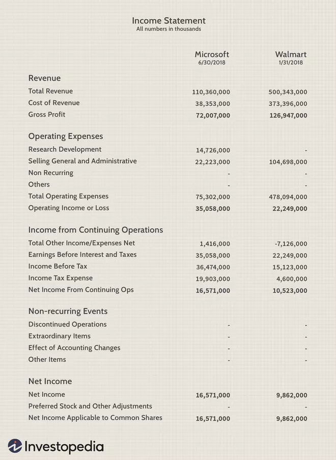
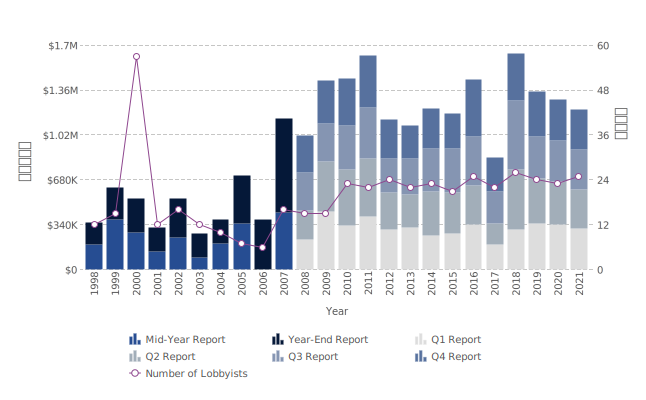

class: center, middle, inverse

```{R, setup, include = F}
# devtools::install_github("dill/emoGG")
library(pacman)
p_load(
  broom, tidyverse,
  ggplot2, ggthemes, ggforce, ggridges,
  latex2exp, viridis, extrafont, gridExtra,
  kableExtra, snakecase, janitor,
  data.table, dplyr, estimatr,
  lubridate, knitr, parallel,
  lfe,dslabs,
  here, magrittr, RcmdrPlugin.KMggplot2
)

options(htmltools.dir.version = FALSE)

# Notes directory
dir_slides <- "~/Users/zhouzhengqing/Desktop/SportsEconAnalysis-master/07_SEA2"
# Define pink color
red_pink <- "#e64173"
turquoise <- "#20B2AA"
orange <- "#FFA500"
red <- "#fb6107"
blue <- "#3b3b9a"
green <- "#8bb174"
grey_light <- "grey70"
grey_mid <- "grey50"
grey_dark <- "grey20"
purple <- "#6A5ACD"
slate <- "#314f4f"
met_slate <- "#272822" # metropolis font color 

# Dark slate grey: #314f4f

# Knitr options
opts_chunk$set(
  comment = "#>",
  fig.align = "center",
  fig.height = 7,
  fig.width = 10.5,
  warning = F,
  message = F
)
opts_chunk$set(dev = "svg")
options(device = function(file, width, height) {
  svg(tempfile(), width = width, height = height)
})
options(crayon.enabled = F)
options(knitr.table.format = "html")
# A blank theme for ggplot
theme_empty <- theme_bw() + theme(
  line = element_blank(),
  rect = element_blank(),
  strip.text = element_blank(),
  axis.text = element_blank(),
  plot.title = element_blank(),
  axis.title = element_blank(),
  plot.margin = structure(c(0, 0, -0.5, -1), unit = "lines", valid.unit = 3L, class = "unit"),
  legend.position = "none"
)
theme_simple <- theme_bw() + theme(
  line = element_blank(),
  panel.grid = element_blank(),
  rect = element_blank(),
  strip.text = element_blank(),
  axis.text.x = element_text(size = 18, family = "STIXGeneral"),
  axis.text.y = element_blank(),
  axis.ticks = element_blank(),
  plot.title = element_blank(),
  axis.title = element_blank(),
  # plot.margin = structure(c(0, 0, -1, -1), unit = "lines", valid.unit = 3L, class = "unit"),
  legend.position = "none"
)
theme_axes_math <- theme_void() + theme(
  text = element_text(family = "MathJax_Math"),
  axis.title = element_text(size = 22),
  axis.title.x = element_text(hjust = .95, margin = margin(0.15, 0, 0, 0, unit = "lines")),
  axis.title.y = element_text(vjust = .95, margin = margin(0, 0.15, 0, 0, unit = "lines")),
  axis.line = element_line(
    color = "grey70",
    size = 0.25,
    arrow = arrow(angle = 30, length = unit(0.15, "inches")
  )),
  plot.margin = structure(c(1, 0, 1, 0), unit = "lines", valid.unit = 3L, class = "unit"),
  legend.position = "none"
)
theme_axes_serif <- theme_void() + theme(
  text = element_text(family = "MathJax_Main"),
  axis.title = element_text(size = 22),
  axis.title.x = element_text(hjust = .95, margin = margin(0.15, 0, 0, 0, unit = "lines")),
  axis.title.y = element_text(vjust = .95, margin = margin(0, 0.15, 0, 0, unit = "lines")),
  axis.line = element_line(
    color = "grey70",
    size = 0.25,
    arrow = arrow(angle = 30, length = unit(0.15, "inches")
  )),
  plot.margin = structure(c(1, 0, 1, 0), unit = "lines", valid.unit = 3L, class = "unit"),
  legend.position = "none"
)
theme_axes <- theme_void() + theme(
  text = element_text(family = "Fira Sans Book"),
  axis.title = element_text(size = 18),
  axis.title.x = element_text(hjust = .95, margin = margin(0.15, 0, 0, 0, unit = "lines")),
  axis.title.y = element_text(vjust = .95, margin = margin(0, 0.15, 0, 0, unit = "lines")),
  axis.line = element_line(
    color = grey_light,
    size = 0.25,
    arrow = arrow(angle = 30, length = unit(0.15, "inches")
  )),
  plot.margin = structure(c(1, 0, 1, 0), unit = "lines", valid.unit = 3L, class = "unit"),
  legend.position = "none"
)
theme_market <- theme_bw() + theme(
  axis.line = element_line(color = met_slate),
  panel.grid = element_blank(),
  rect = element_blank(),
  strip.text = element_blank(),
  text = element_text(family = cnfont, color = met_slate, size = 17),
  axis.title.x = element_text(hjust = 1, size = 17),
  axis.title.y = element_text(hjust = 1, angle = 0, size = 17),
  # axis.text.x = element_text(size = 12),
  # axis.text.y = element_text(size = 12),
  axis.ticks = element_blank()
)
theme_gif <- theme_bw() + theme(
  axis.line = element_line(color = met_slate),
  panel.grid = element_blank(),
  rect = element_blank(),
  text = element_text(family = cnfont, color = met_slate, size = 17),
  axis.text.x = element_text(size = 12),
  axis.text.y = element_text(size = 12),
  axis.ticks = element_blank()
)
theme_goods <- theme_bw() + theme(
  axis.line = element_line(),
  panel.grid = element_blank(),
  rect = element_rect(size = 1),
  strip.text = element_blank(),
  text = element_text(size = 17, family = cnfont), 
  axis.text.x = element_text(size = 17),
  axis.text.y = element_text(size = 17, angle = 90, hjust = 0.5),
  axis.title.x = element_text(color = purple, size = 19),
  axis.title.y = element_text(color = red_pink, size = 19),
  axis.ticks = element_blank(),
  plot.title = element_blank(),
  legend.position = "none"
)
theme_game <- theme_bw() + theme(
  axis.line = element_line(),
  panel.grid = element_blank(),
  rect = element_rect(size = 1),
  strip.text = element_blank(),
  text = element_text(size = 20, family = cnfont), 
  axis.text.x = element_text(size = 20, color = met_slate),
  axis.text.y = element_text(size = 20, angle = 90, color = met_slate, hjust = 0.5),
  axis.title.x = element_text(color = met_slate, size = 20),
  axis.title.y = element_text(color = met_slate, size = 20),
  axis.ticks = element_blank(),
  plot.title = element_blank(),
  legend.position = "none"
)
shift_axis <- function(p, y=0){
  g <- ggplotGrob(p)
  dummy <- data.frame(y=y)
  ax <- g[["grobs"]][g$layout$name == "axis-b"][[1]]
  p + annotation_custom(grid::grobTree(ax, vp = grid::viewport(y=1, height=sum(ax$height))), 
                        ymax=y, ymin=y) +
    geom_hline(aes(yintercept=y), data = dummy, size = 0.5, color = met_slate) +
    theme(axis.text.x = element_blank(), 
          axis.ticks.x = element_blank())
}
wrapper <- function(x, ...) paste(strwrap(x, ...), collapse = "\n")
# functions
demand <- function(x) 10 - x
demand_2 <- function(x) 9 - x
demand_3 <- function(x) 8 - x
demand_inc <- function(x) 11 - x
demand_dec <- function(x) 5 - x
supply <- function(x) 1 + (4/5)*x
step_demand <- tibble(x = c(0, 1, 2, 3, 4, 5, 6, 7, 8), mv = c(8, 7, 6, 5, 4, 3, 2, 1, 0))
step_demand2 <- tibble(x = c(0, 1, 2, 3, 4, 5, 6, 7, 8, 9, 10, 11, 12), mv = c(10, 10, 9, 9, 8, 8, 7, 7, 6, 6, 5, 4, 4))
step_supply <- tibble(x = c(0, 1, 2, 3, 4, 5, 6, 7, 8, 9, 10, 11, 12), mv = c(2, 2, 3, 3, 4, 4, 5, 5, 6, 6, 7, 8, 8))
step_supply_tax <- step_supply %>% 
  mutate(mv = mv + 2)

data <- read_csv("/Users/zhouzhengqing/Desktop/SportsEconAnalysis-master/05_MicroeconBasics2/Activity_Pit_Market/Results.csv") %>% 
  dplyr::filter(!is.na(price))

theme_set(theme_gray(base_size = 20))
# Column names for regression results
reg_columns <- c("Term", "Est.", "S.E.", "t stat.", "p-Value")
# Function for formatting p values
format_pvi <- function(pv) {
  return(ifelse(
    pv < 0.0001,
    "<0.0001",
    round(pv, 4) %>% format(scientific = F)
  ))
}
format_pv <- function(pvs) lapply(X = pvs, FUN = format_pvi) %>% unlist()
# Tidy regression results table
tidy_table <- function(x, terms, highlight_row = 1, highlight_color = "black", highlight_bold = T, digits = c(NA, 3, 3, 2, 5), title = NULL) {
  x %>%
    tidy() %>%
    select(1:5) %>%
    mutate(
      term = terms,
      p.value = p.value %>% format_pv()
    ) %>%
    kable(
      col.names = reg_columns,
      escape = F,
      digits = digits,
      caption = title
    ) %>%
    kable_styling(font_size = 20) %>%
    row_spec(1:nrow(tidy(x)), background = "white") %>%
    row_spec(highlight_row, bold = highlight_bold, color = highlight_color)
}
```

```{css, echo = F, eval = T}
@media print {
  .has-continuation {
    display: block !important;
  }
}
```

# 引言

---

name: schedule

# 课程进度

### 上节课

- 专题三: 职业体育1
    - 垄断

### 今天

- 专题三: 职业体育2
    - 封闭与开放联赛

---
## 相较于完全竞争市场的社会结果
.pull-left[
.center[**完全竞争市场**]
```{r, echo = FALSE, fig.height = 4.75, fig.width = 3.75,  dev = "svg"}
x <- 0:10
demand <- function(x) 10 - x
supply <- function(x) 1 + x

q <- uniroot(function(x) demand(x) - supply(x), range(x))$root
p <- demand(q)

ggplot(data = data.frame(x = 0), mapping = aes(x = x)) +
  scale_x_continuous(limits = c(0, 10.5), expand = c(0, 0), breaks = c(q), labels = c(expression(Q[C]))) +
  scale_y_continuous(limits = c(0, 10.5), expand = c(0, 0), breaks = c(p), labels = c(expression(P[C]))) +
  theme_market +
  labs(x = "Q", y = "P") +
  stat_function(fun = demand, color = red_pink, size = 1) +
  stat_function(fun = supply, color = purple, size = 1) +
  geom_point(x = q, y = p, color = met_slate, size = 2) +
  geom_segment(x = 0, xend = q, y = p, yend = p, color = met_slate, linetype = "dashed", size = 1) +
  geom_segment(x = q, xend = 10.5, y = p, yend = p, color = met_slate, linetype = "dashed", size = 1) +
  geom_segment(x = q, xend = q, y = 0, yend = p, color = met_slate, linetype = "dashed", size = 1) +
  annotate("text", label = "D", x = 10.1, y = 0.65, color = red_pink, family = cnfont, size = 9) +
  annotate("text", label = "S", x = 9.3, y = 9.65, color = purple, family = cnfont, size = 9)
```
]

.pull-right[
.center[**垄断**]
```{r, echo = FALSE, fig.height = 4.75, fig.width = 3.75, dev = "svg"}
x <- 0:10
marginal_cost <- function(x) 1 + x
demand <- function(x) 10 - x
marginal_revenue <- function(x) 10 - 2*x
q <- uniroot(function(x) marginal_revenue(x) - marginal_cost(x), range(x))$root
not_p <- marginal_revenue(q)
p <- demand(q)
q_c <- uniroot(function(x) demand(x) - supply(x), range(x))$root
p_c <- demand(q_c)

ggplot() +
  scale_x_continuous(limits = c(0, 10.5), expand = c(0, 0), breaks = c(q, q_c), labels = c(expression(Q[M]), expression(Q[C]))) +
  scale_y_continuous(limits = c(0, 10.5), expand = c(0, 0), breaks = c(p_c, p), labels = c(expression(P[C]), expression(P[M]))) +
  theme_market +
  labs(x = "Q", y = "P") +
  stat_function( fun = marginal_cost, color = purple, size = 1) +
  annotate("text", label = "MC", x = 9.75, y = 9.65, color = purple, family = cnfont, size = 9) +
  stat_function( fun = demand, color = red_pink, size = 1) +
  stat_function( fun = marginal_revenue, color = green, size = 1) +
  annotate("text", label = "D", x = 10.1, y = 0.65, color = red_pink, family = cnfont, size = 9) +
  annotate("text", label = "MR", x = 5.75, y = 0.65, color = green, family = cnfont, size = 9) +
  geom_point(aes(x = q_c, y = p_c), color = met_slate, size = 2) +
  geom_segment(aes(x = 0, xend = q_c, y = p_c, yend = p_c), color = met_slate, linetype = "dashed", size = 1) +
  geom_segment(aes(x = q_c, xend = q_c, y = 0, yend = p_c), color = met_slate, linetype = "dashed", size = 1) +
  geom_point(aes(x = q, y = p), color = met_slate, size = 2) +
  geom_point(aes(x = q, y = not_p), color = met_slate, size = 2) +
  geom_segment(aes(x = q, xend = q, y = 0, yend = p), color = met_slate, linetype = "dashed", size = 1) +
  geom_segment(aes(x = 0, xend = q, y = p, yend = p), color = met_slate, linetype = "dashed", size = 1)
```
]

---
layout: true
# 门票的价格决定
---
class: title-slide-section,inverse, middle
---
layout: false
## 实际的例子

.more-left[
- 我们先回到门票市场，来看垄断市场下单次比赛的门票价格决定机制

- 作为一个垄断企业，太阳队面临着**一条向下倾斜**的**市场（厂商）需求曲线**。 

- 若是想卖更多的票，就要降低票价。

- 完美价格歧视的厂商，可以根据每个人确定不同的价格 → 需求曲线就是边际收益曲线 → D=MR

- 非完全价格歧视厂商 → 只能提前一个赛季降低门票价格 → 根据MR=MC确定价格

]

.less-right[

]
---
## 实际的例子

.more-left[
去年每张票30$，卖了200万张；今年25$，目标卖300万张。降价策略是否可行必须比较.purple[产出效应]和.pink[价格效应]

1. 门票价格降低势必吸引更多的球迷 → 销售了更多的门票

  .purple.hi[产出效应]=25 &times; (300-200) = 2500

2. 门票价格降低 → 老顾客支出减少

  .pink.hi[价格效应]=(30-25) &times; 200 =1000
  
3. **总收入**  <br> $\quad$ .mono[=] .purple.hi[产出效应] - .pink.hi[价格效应]  <br> $\quad$ .mono[=] 2500-1000 =1500

]

.less-right[
#### .mono[-->] 降价策略可行么？

]
---
## 实际的例子

.more-left[
- 在球场容量以内，多容纳额外观众的边际成本几乎为零。因为为其打扫卫生的成本相对较低。

- 球场容量到达时，边际成本可以看做是无限的，因为不可能为多出的一个球迷多建造球场。

- 门票销售的最大数量不应该超过球场的最大容纳量。

]

.less-right[
#### .mono[-->] 球队边际成本如何？

]

---
## 实际的例子

.more-left[
- 市场势力允许球队比完全竞争市场收取更高的门票价格。

- 该图显示，若一个完全竞争的行业，在市场需求曲线与MC曲线（因为是单厂商供给曲线）相交处运作.super[.pink[†]] 。它销售 $Q_c$ ，收取 $p_c=20$ 美元。

- 球队垄断产量 $Q_m < Q_c$ ，因为MR曲线与横轴(看做是MC的一部分)相交的产量更低；但是门票价格更高 30美元


.footnote[.pink[†]: $\quad$ 回忆下，完全竞争市场的厂商短期供给曲线是MC .mono[>] AVC 的部分，<br> $\quad$ 即允许存在运营亏损。
]


]

.less-right[
#### .mono[-->] 球队边际成本如何？

]

---
## 实际的例子

.more-left[
- 球队根据MC与MR决定门票价格和数量；
- 在球场坐满前，MC几乎零
- 那么球员薪酬对门票价格的影响呢？
  - 赛季内，球员合同视为**固定成本** → 固定成本不随门票销量变化而变化
  - 保罗的合同30.8M$对于太阳队来说是固定成本，无论观赛球迷是100w还是400w，球队都必须支付这么钱。球员工资与厂商固定设备一样，对球队来说是固定的。
  - 考虑了球员成本后，门票价格和数量仍然如此。唯一的区别是，利润比以前低。
  - 那么，为什么一支球队会在签下自由球员后提高票价呢？

]

.less-right[
#### .mono[-->] 球队成本上升的影响？

]
---
## 实际的例子

.more-left[

- 票价上涨是因为对门票需求上升，而不是因为球队面临更高的成本。

- 如果球队觉得新球员让球迷愿意支付比以前更高的价格，那么他们就会提高票价。

- 球队收取更高票价是因为需求曲线（以及边际收入曲线）向外移动(D1到D2)。较高的需求和边际收入曲线导致了比以前更高的价格。

简而言之，球队在签署明星球员时收取高价门票，是因为垄断势力允许他们这么做，而不是因为他们必须这样做。
]
  
  
.less-right[
#### .mono[-->] 球队成本上升的影响？

.caption[.smallest[球星加入导致的需求变化]]

]

---
layout: true
# 职业体育的基本模式
---
class: title-slide-section,inverse, middle
---
layout: false

## 封闭与开放联赛

封闭联赛常见于北美体育联盟；另外，日本职业棒球和澳大利亚橄榄球联盟(AFL)也是

- football 和 rugby 的区别？ 

- 参数球队一般不变，联盟划定垄断行政边界，一般不允许搬迁到其他城市
  
- 通常附属小联盟。附属小联盟与大联盟球队有明确合同关系。小联盟球队不能进入大联盟。两种常见所有权关系
  
    - 大联盟球队拥有小联盟球队的经营权
    - 小联盟球队保持与大联盟球队间合作关系(赞助和业务指导)，但独立经营
      
- 小联盟球员合同通常由大联盟持有，可以在大小联盟间流动

---

## 封闭与开放联赛

开放联赛几乎所有的足球联赛

- 与封闭联赛一样类似的金字塔结构，但**属性完全不同**
  
- 通过升降级完成固定名额"升降级转换"
  
- 没有行政区划带来的市场垄断势力：一座大城市可能多支同级别联赛的球队，如伦敦，大大降低球队的垄断能力
  
- 在赛季结束时对最弱的球队产生非常不同的激励，对球队资金和球员投入行为导致了差异(稍后再讲)
  
    - 封闭联赛中弱队会有"摆烂求好签位"的现象
    - 开放联赛的底部球队"必须赢球避免降级"

---
## 职业球队目标的复杂性：利润最还是胜率？

- 无论开放还是封闭的联赛，每个球队都是一个**经济实体**。

- 虽然隶属于更高范畴的商业品牌(联盟)之中，但产权性质是多为私有的，即便不是私有但可以独立运营 → 依据**收入和成本做出自己的战略决策**。

- 球队间"竞争 .mono[+] 合作" → 由联盟统一制定比赛规则、赛程安排等。根据"结果不确定假设"，还要制定包括收入分享等规则以保证联盟的竞争均衡。

- 对于一般厂商而言，可能目标就是实现利润最大化；但职业球队的目标可能没有那么简单，对于一些老板来说，即使赚得没那么多，赢得一场冠军赛可能更重要。

---

## MLB例子：长期，利润 .mono[>] 胜利；但是短期？

.center[

]

- **长期与短期**目标很可能不一致。长期球队必须保持盈利，但短期可能会追求胜利而非利润。费城人队、洋基队、印第安人队和皇家队在2011年至2016年期间产出、收入和利润变化。

- 2011年，费城费城人队主宰了国家联盟(Nation League，国联)，而纽约扬基队则领导了美国联盟(American League，美联)。


---
## MLB例子：长期，利润 .mono[>] 胜利；但是短期？

.center[

]

- 上座率方面，费城人队拥有MLB的最佳常规赛记录，上座率位居MLB之首，扬基队紧随其后。

- 总收入方面，2011年洋基队总收入超过4.39亿美元无人能及；费城人队也以2.49亿美元位居联盟前列。

---
## MLB例子：长期，利润 .mono[>] 胜利；但是短期？

.center[

]

- 克利夫兰印第安人(已改名卫士)和堪萨斯城皇家队在胜率、上座率和账面收入都无法与费城人和扬基队相比。两队上座率之和都没有达到费城人队或扬基队的水平，而总收入之和没有达到扬基队的水平。

- 但营业收入(益)(Operating Income)<sup>.pink[†]</sup>，这两个弱者看起来更像“恶霸”。
印第安人队以3010万美元(MLB No.1)，皇家队以2850万(No.2)。洋基队22/30； 而费城人队29/30。

---
## MLB例子：长期，利润 .mono[>] 胜利；但是短期？

.center[

]

- 单从会计指标看，后两者是比头部2队有效运作，但更有可能的是，费城人和扬基队赢得了更多的比赛，因为他们花了更多的收入来确保最好的球员。换句话说，在短期内，他们把胜利看得比利润更重要。

.footnote[ .pink[†] Revenue是指一个公司在扣除任何费用之前，因销售其商品或服务而产生的收入总额。Operating Income(营业收益、营业利润)是Revenue减去直接成本和间接成本的利润总额，衡量了一个公司财务健康状况。]

---
## MLB例子：长期，利润 .mono[>] 胜利；但是短期？

- **两个小市场球队的营业利润居然比两个大市场的球队要多**，可以反映出“小市场+利润目标”与“大市场+胜利目标”的区别，也说明球队老板对胜利和利润的关注是不一样的。

- 如果“大市场+胜利偏好”呢？那么单看营业利润就不一定能够显示球队的偏好了。事实上，在英超和其他欧洲足球联赛中，胜利和利润之间的关系更加模糊不清。**经济学家认为至少三个原因开放联赛比封闭联赛的球队更偏好胜利，而非利润**。

1. 许多球队（如皇马是球迷所有制）的球迷比一般的投资者更偏好胜利，而非分红

2. 开放联赛球队以“低投入+高利润”方式在顶级联赛中**持续生存**，在长期意味着降级、失去球迷、声望和收入。为避免降级，必须花费高额代价追求顶级球员。

3. “富豪”老板出于个人声誉、对比赛的热爱和对胜利的承诺，原意“金钱换冠军”, 切尔西前老板阿布、曼城阿布扎比联合集团。这些老板自掏腰包补足球队的为追求胜利带来投入不足。

---

### 利润和胜率：Humphreys(2016)基准模型

.more-left[
假设球队收入和成本均是球队质量的函数。换句话说，实力强的球队会吸引更多的球迷，但要花更多的钱来组建。

$$
\begin{equation}
\pi_{i}=TR\left(w_{i}\right)-TC\left(w_{i}\right)
\end{equation}
$$

进一步对收入函数和成本函数进行假设：
1. 假设总收入随着胜率的增加而增加，但速度是递减的。球队赢得太多或输得太多都是被球迷埋怨，因此这个假设是有道理的。

2. 假设球队以**恒定价格**雇佣更好的球员来"购买胜利"，即 $TC(w_i)=cw_i$。
]


.less-right[

]

---

### 利润和胜率：Humphreys(2016)基准模型

.more-left[

- 利润最大化条件为 $MR=MC$ 

  - 因为 $C(w_i)=cw_i$ 。 $MC$ 是一条平行于X轴的直线，与 $MR$ 相交处，此时胜率为 $w^*_1$ 

- 胜率最大化。球队可以“任性地”购买最顶尖的球员获得胜率最大化，但是这不现实。因此合理假设是只要球队的亏损不超过老板所能容忍的范围，最大限度的提高胜率就是可持续的，可以简单地假设 $(\pi = 0)$

   - 利润非负意味着： $TR = TC$ 或者 $AR = ATC$ 。  $AR$ 和 $ATC$ 曲线在在 $w^*_2$ 处相交。 
   
- 结论：**在其他条件相同的情况下，胜率最大化球队比利润最大化球队更经常获胜（ $w^*_2 > w^*_1$ ），而利润最大化球队获得的利润更高。**
]


.less-right[

]

---
### Kesenne(2007)

.pull-left[

]

.pull-left[
- Kesenne(2007) 将球队目标与劳动力市场结合

- 利润最大化目标，雇用t1天赋。虚线是TC的斜率，代表MC；与TR相切代表MR=MC。

- 球队收入最大目标，雇佣t2天赋，MR=0。

- 胜率最大化目标，雇佣t4天赋。TR=TC保证收支平衡。

- 赢球至上，不在乎赔钱，雇佣t5天赋。

- 完成某利润率目标，雇佣t3。

]
---
### 会计常识：损益表

基本表格3+2：资产负债表、损益表和现金流量表；所有者权益变动表，财务与估值指标表
- 损益表 (Income Statement): 解释企业在某段时间内，财富 (股东权益) 如何因各种经济活动的影响而发生变化。
- **(税后)净利**(Net Income) = 收入 (Revenue) - 费用 (Expenses)。
NI又称"Bottom Line"，底端；R又称作"Top Line"，顶端
    - 营收增加可能来打折或广告，关注营收品质
- **营业毛利**(Gross Income/Profit) = Revenue - 销货成本 (Cost of Goods Sold)
    - COGS销售产品产生直接成本，如卖饮料，搭进去小时工资、纸杯和原物料等
    - 获利能力的基本指标。毛利率=毛利/营业收入。营收高但毛利低，薄利多销。
- **营业利润(益)** (Operating Income) = 营业毛利毛利 - 营业费用
    - 营业费用销售商品或服务有关的费用，也称间接成本，如办公室、人事支出等。理解成是指无论销售量增减与否都会发生的费用。
- **税前及息前净利**(EBIT) = 营业利润 - 营业外支差 - 利息支出 
- **(税后)净利** = EBIT - 所得税，税后净利又称为盈余
- 每股盈余(EPS) = (税后)净利 ÷ 股数

---
.center[

]


---
### 会计常识：损益表（国际）
.pull-left[

]
.pull-right[
- 获利基本指标看（长期）：<br>营业毛利 = 营业收入 – 营业成本

- 本业是否赚钱看（长期）：<br>营业利润 = 营业毛利 – 营业费用

- 本业或业外是否赚钱看：<br>EBIT = 营业利润 - 业外支差 - 利息支出 

- 最终获利状况看：<br>税后净利 = EBIT – 所得税

- 每1股可赚多少钱看：<br>每股盈余(EPS)= 税后净利 ÷ 股数
]
---
### 会计常识：损益表（中国）

.pull-left[

]

.pull-right[
- EBIT（中国）=营业收入-销售费用-管理费用=营业利润（国外）
- 营业利润（中国）=营业利润（国外）+ 营业外净收入

- 安踏体育(02020.HK)得益于DTC转型取得进展，2021年营收、利润恢复快速增长。营收 493.28 亿元/yoy+38.84%/较 2019 年+45.4%、营业利润 109.9 亿元/yoy+20.1%/较 2019 年+26.4%。

- 毛利率=营业毛利/营收：得益于DTC转型+折扣率提升，2021年+7.5pct。公司毛利率自 2012 年（38%）以来逐年提升。
]
---
### 会计常识：损益表（中国）

.pull-left[

]

.pull-right[
- 费用率(看长期)：销售、管理、研发费用率分别为 35.9%、5.92%、2.3%，分别同比
+5.7pct、-0.04pct、-0.2pct。其中DTC转型+冬奥营销导致2021年广告宣传费用率同比+2.4pct至12.4%、员工成本费用率同比+1pct至13.5%。销售费用率历年趋势与毛利率同步，2012年以来从13.6%升至35.9%；2016年以来管理费用率多在5%-6%之间波动、研发费用率在2.3%-2.9%之间波动，变化幅度相对较小。

- 营业利润率：2021 年营业利润率同比-3.5pct 至 22.3%，主因DTC转型渠
道费用+营销支出增多 → 营业利润率下滑较多（-7.3pct）
]

---
### 会计常识：损益表

通常可以发现：

- (营收+营业利润+净利润) .mono[&times;] (同比+年比) → 看收入品质：<br>是起伏不定、还是稳定成长？公司收入是恒常性、持续性，还是专案式收入(例如营建业一个建案)？是来自本业常态收入，还是来自业外一次性收入？

- 长期(销售费用+管理费用+研发费用) → 看营运效率：<br>获利增加时成本费用是否大幅提高？

- 资产负债表 → 成本结构：<br>主要成本受什么影响？是原物料、人力、资本投入、行销？

- 成本品质：<br>是否把钱花在不该花的地方？是否有规划研发支出？是否乱砍成本？高层薪酬是否合理？产业是否需要无止尽的持续投入高额资本支出？是否易受汇率变动影响？
---

.center[

]

---
layout: true
# 职业球队的收入与成本细节
---
class: title-slide-section,inverse, middle
---
layout: false
## 封闭联赛
### 收入是球队赛事面临的需求决定的

收入是其产品需求的函数，总收入=价格 .mono[&times;] 数量。  本节继续**以上座率作为产出**，而非对电视转播或直播的需求。
观众需求由6个基本因素驱动的。第1个要素沿着需求曲线移动（内生变量）；其余5个都是改变需求曲线的位置（外生变量）。

- 商品的价格。对于上座率而言，就是门票价格。

- 替代品的价格（和可用性）。对于NBA球队来说，可能是附近NCAA篮球队。若看NCAA比赛的成本增加，就会增加对NBA比赛的需求，NBA需求曲线右移。

- 互补品的价格（和可用性）。对于观赛，可能是停车价格优惠。随着停车费和特许经营(concessions)增加，对门票的需求就会减少，从而需求曲线向左移动

- 消费者的可支配收入。如果职业体育是正常品，那么收入的增加会导致门票需求的增加，门票的需求曲线右移。

---
## 封闭联赛
### 收入是球队赛事面临的需求决定的


- 市场中消费者（球迷）的数量。市场规模的增加，对门票的需求就会增加，需求曲线会向右移动。

- 品味和偏好(Tastes and Preferences)。如比赛安排在周几、主队实力、客队实力、比赛重要性、球迷的预期（一场激烈的比赛）、**天气**、超级球星、**环境因素如空气污染、温室效应、流行病**。另外，运动普及和流行度（中国冰雪），地区偏好（US足球、CA冰球）等。


---
## 封闭联赛
### 成本是生产技术驱动的（球员天赋）

固定成本和可变成本

- 固定成本：职业球队大部分是固定成本，包括广告费、差旅费、与场地有关的费用以及大部分行政管理费用。

  - 普通厂商而言，劳动力工资视为可变成本
  - 职业球队而言，劳动力工资视为固定成本

.center[
#### 人员类薪酬占50%-75%
]
  
- 可变资本：比赛日工作人员有关的成本，如引座员或食品供应商。

---
### BIG5 基本概况(2016)


- **工资方面**，NFL、NHL和NBA各队相似。在MLB中，没有硬工资帽限制，支出最高的球队的Dodge成本超过了其他项目大部分球队的总收入。

- **联赛间收入分享机制差异巨大 → 不同项目的球队收入差距很大**。有收入分享制度的联赛，小球队可以从总资金池中获取收入。

---
### BIG5 基本概况(2016)


- **大市场 → 高收入**。球队收入以潜在消费者数量为基础，所以大城市球队意味着有更高收入。不仅收入高，大市场球队的胜率也会很好。

- **高收入 → 高利润**。除了MLB道奇队外，基本上符合该逻辑。这也是大多数经济学家同意北美职业体育球队以利润最大化目标的原因。

---
### BIG5 基本概况(2016)


- **消费者品味和偏好很重要**。在北美，MLS显然无法与BIG4媲美；加拿大球迷更喜欢冰球；除了国别的差异，地区间有存在差异，德州人偏爱橄榄球，西雅图人喜好足球；热带地区的冰球项目显然没有蒙特利尔更热闹
- **冠军"长青树"球队经济状况一般很好**。NFL新英格兰爱国者、MLB旧金山巨人都是如此。

---
### BIG5 基本概况(2016)


- **一些联赛显然更有利可图，如NFL**。NFL球队营业收益的中位数为7600万美元，几乎是MLB中位数（约2100万美元）的3倍半。盈利能力最差的NFL球队比NBA、NHL或MLB球队营业收益的中位数还高。
- **个别球队短期会有严重亏损**。其中，道奇队的巨额亏损是所有球队中是独一无二的：2015年的工资总额有史以来第一个超过3亿美元的，其中包括付给一些不在名册的球员约9500万美元（比一些球队的工资总额还多）

---
### 收入6大来源


1. 门票收入 （ticket sales & gate receipt） ： $R_G$ 

2. 国家和地方广播权： $R_B$ 

3. 高级媒体，如流媒体直播： $R_M$ 

4. 许可收入，如官方商品、球队纪念品、涉及商标和知识产权的收入： $R_L$ 

5. 场地和赞助收入，如豪华包厢、特许经营权、命名权： $R_V$ 

6. 转移收入：  $R_T$ 

$$ R =  R_G + R_B + R_M + R_L + R_V + R_T $$
---
### 收入6大来源
#### 1 门票收入 

.more-left[

]

.less-ritgt[
- 门票是重要收入来源。

- MLB球队，常规赛有81/162个主场比赛，产生了最多门票收入。

- MLB波动最大，NFL波动最小。NFL常规赛有8/16个主场，但平均而言比NHL和NBA要高。大多数NFL比赛都能吸引到接近饱和的观众。

]
---
### 收入6大来源
#### 2 转播收入

.center[

]

- **电视转播收入项目差异大**。MLB、NBA和NFL每年有数10亿美元的年收入，MLS只有9000万，相当于一支NBA球队的转播收入。这些收入对联盟的整体繁荣非常好，但也会造成球队间的利润差距的拉大。

- 一支NFL球队比相等城市规模的NHL球队多近2亿美元的收入，其中差别就是在转播收入上。
---
#### 2 转播收入
##### 全国与地方的电视收入分享机制


- **NFL电视合同结构确保所有球队利益均享**。所有NFL比赛都是全国范围播出套餐的一部分。绿湾包装工队是所在城市规模最小之一，比MLB任何球队所在城市都小，但收入与NBA球队相当，也相当于纽约或芝加哥的NFL球队。

- **MLB全国转播收入比不上NFL，地方转播收入是主要来源**。道奇对从全联盟获得5000万，但从地方广播公司获得2.04亿。相比下，小市场球队，像洛基队只有2000万。

- **与NBA一样，NHL球队间收入差距大部分来自地方电视收入的差异**。由于NHL中网络收入部分远远低于其他联赛，地方转播收入造成了更大球队盈利能力差异。每支球队的收入还不到NBA球队的四分之一，大约每年2000万美元。**NHL没有转播收入的分享机制** → 小球队难与大市场球队竞争 → **NHL更依赖门票收入**
---
#### 2 转播收入
##### 应用：收视率与上座率——替代还是互补？

- 有时候，电视(网络)转播是"双刃剑"。

- 对于偏好通过电视或者网络转播看比赛的球迷而言，电视(网络)转播的比赛就是现场观众的替代品  .mono[-->]  门票的需求曲线左移， $R_G$ 减少。

- 对于偏好现场观看的球迷而言，电视转播会激发对比赛的关注度，可能会增加上座率。NFL之所以在美国有持续的上座率，部分因为"全美转播+周日双赛"，使得球迷可以了解其他城市的热门球队。


---
#### 2 转播收入
##### 应用：收视率与上座率——替代还是互补？

-  Babatunde Buraimo(2008) 以英格兰足球二级联赛为对象，调查了球场上座率与电视收视率间的替代程度。


- 若上座率为因变量Y，在控制了包括是否有其他欧冠联赛比赛、主客场球队实力、是否德比以及是否周末比赛等，发现**收视率对上座率有负面作用**。这意味着对去英乙联赛现场看球的球迷而言，消费者实际上是把电视转播与现场看球作为替代对待。


- 若以收视率为因变量Y，两者呈显著**正相关**。作者解释为人们更喜欢看现场坐满了人的比赛，显示出比赛更有观赏性和娱乐性。


---
### 收入6大来源
#### 3 高级媒体

- 由于流媒体平台的兴起，这部分收入变化最快，成为所有大联盟的重要在线业务。

- 超过3/4千禧一代会考虑在线上观看比赛 (Fobes)。

- 案例: BAMTech 是 MLBAM 的重要分支。 
  
  - 占联盟总收入10%
  - 股东：NHL + Disney + MLB
  - 所有球队共享


.hi[进一步思考： ] 高级媒体对传统媒体是替代还是互补?

---
### 收入6大来源
#### 4 许可收入

BIG5中有4个成立单独部门来监督球队向球迷出售官方纪念品：MLB Properties<sup>.pink[†]</sup> ，NBA Properties，NFL Properties，NHL Enterprises

.footnote[ .pink[†] 法：拥有和使用某种东西的合法权利
]

目的：
1. 与联盟层面的转播合同一样：防止球队间竞争 .mono[+] 对上游的制造商和下游的零售商时拥有更大的市场势力
2. 各队分享许可收入，使财务竞争环境更公开、更公平。2015，MLB公布34亿$，所有球队平分。
3. 也有例外：NFL的达拉斯牛仔队就单独与Nike和Adidas签署了协议，后来又与维密和UCLA签署。

---
### 收入6大来源
#### 5 场地和赞助收入

场地收入或来自体育场的非门票收入：包括来自停车场和特许经营（parking and concessions）、豪华套房和其他特殊座位的收入(只有一小部分算作门票收入)


- 案例：场地收入有助于解释为什么达拉斯牛仔队是最有价值的（Forbes）。

  - 实际中，匹兹堡钢人获得了更多超级碗冠军，但NFL的门票和转播收入政策不允许他们将冠军货币化。
  
  - 牛仔队主场AT&T有300个豪华包厢，这些包厢每赛季租金为22.4万至90万美元，部分计入门票收入（共享），部分计入特许经营（自留）
  
  - 这部分收入是球队的“自留地”，少有公开准确的数字以及标准的公式
  
---
### 收入6大来源
#### 5 场地和赞助收入

赞助是某些职业体育的重要收入来源：欧洲足球、PGA和一些个人项目比赛。


- 联盟层面的赞助会平衡球队差异，但球队层面的赞助会加大差距。因为赞助商会青睐大市场。

- NFL的赞助收入领先其他联盟

- 2015年， NFL 12亿 .hi.mono[>] MLB 7.5亿 .hi.mono[>] NBA 7.39亿 .hi.mono[>] NHL 4.47亿

其他还有：场地命名权和球衣前LOGO的赞助

- 雪佛兰对曼联球衣的胸前广告收入为每年8千万美元

---
### 收入6大来源
#### 6 转移收入

BIG5从联盟层面获得了大量的转移收入。其中，**NFL收入分享机制最全面**：

- NFL早期极为不稳定，1920年至1935年间每年都有球队倒闭或者搬迁。NFL制定了慷慨的门票分享政策： $R_{\mathrm{G}}=0.6^{*} R_{\mathrm{G}, \mathrm{H}}+0.4^{*}\left(R_{\mathrm{G}, \mathrm{P}} / 32\right)$ 。主场球队可以获得净门票收入的60%，其余40%进入共同基金。
- **能够解释所有NFL球队的营业利润和市场价值最接近的原因**
- NFL联盟层面盈利最强、最统一的联赛 → Super Bowl
- NFL球队在所有转播 $R_B$ 、高级媒体 $R_M$ 和许可收入 $R_L$  中获得同等份额。
- 只有在 $R_V$ 的豪华包厢、场地命名中才能将收入最高和收入最低的球队分开。

.hi[进一步思考： ] NHL、NBA和MLB的收入分享政策为什么不一样？不同的收入分析政策会怎样影响联盟收益、球队行为？相关研究哪些？

---
### 成本来源

在职业体育中，由于工资帽的规定，所有球队在劳动力和大多数其他成本上基本是固定的，或只在一个狭小范围内可变。

- 只有MLB不直接限制球队工资
  - 如果球队吸引的球迷比预期的少，球队不能减少球员的工资。因此，个人工资和整体工资不会随着门票变化而发生明显变动。
  
- 可变成本有差旅费、广告费、管理费（球队层面和联赛层面）以及场地费
  
  - 场地费用每个球队情况不同。有些球队有拥有自己的球场（每年从政府获取补贴）；而一些球队要租赁场地。

- MLB，NBA和NHL会下拨一些资金给小联盟的球队；这些小联盟球队能够产生一些大联盟球员，每人花费在上百万美元；一些小联盟球队就所归属于大联盟球队

---
### 联赛规模、机会成本与球队迁徙
#### 以合作的方式进入

- 公共选择学派布坎南认为"接纳一个新成员加入，会对原会员带来新成本和新收益"
  
- 封闭联盟主要的两大影响

  - 新球队加入要缴纳"入场费"，因为联盟的共享收入会分给更多成员
  
  - 降低现有成员与所在城市的谈判权（威胁搬迁作为谈判筹码）。

---
### 联赛规模、机会成本与球队迁徙
#### 以合作的方式进入

.more-left[

]

.less-right[
- 联盟决定了球队所能去的城市

- 十个最大的都市区中的每一个都有几家职业特许经营公司

- NY,11 .hi.mono[>] LA,9 .hi.mono[>] CHI,7
- 地理上的行政版图划分是保证球队市场势力的最重要手段
]

---
### 封闭联盟的总结


- 回忆下Neal（1964）主要的观点，即：职业联盟是一种多厂商的垄断，每个厂商在行政区域内是垄断的、可以单独出售的(联盟是可分割的)；但联盟在国家范围内也是联合的、垄断的，毕竟球迷看的每场比赛的兴趣点来自于不确定的比赛结果、球队实力，这些都与球队的联赛排名相关，而联赛排名是联盟内所有球队"集体行动的结果"

- 封闭联盟为了整体发展，协调球队赛程并向广播公司或被许可人收钱。大网络\电视合同是在联盟层面而非个别球队层面谈判的。

- 球队间合作行为表现在：最受欢迎的比赛在全国性电视上播出，防止球队间相互竞争转播权，从而保持高价格。

- 联盟为每支球队划定一个半径，在这个半径内，联盟其他成员不得迁入，保证市场势力。

---
### 封闭联盟的总结
#### 对联盟的约束 ：American Needle 诉 NFL

- 背景

NFLP成立于1963年，专门负责NFL知识产权许可的实体。在此之前，NFL团队分别销售其知识产权。

在1963年至2000年之间，NFLP向多家供应商提供了非排他性许可，以销售和制造带有团队标志的服装。美国针公司是其中的许可持有者之一。2000年12月起，联盟投票授权NFLP授予排他性许可。NFLP向Reebok授予了为期10年的独家许可，以制造和销售所有32队的商标帽服徽章。之后，NFLP拒绝续签American Needle的非排他性许可。

2008年，American Needle开始上诉。前期，都是判NFL胜诉，但American Needle一再上诉。

2009年胜诉的NFL要求最高法院重新考虑它所赢得的裁决。

---
### 封闭联盟的总结
#### 对联盟的约束 ：American Needle 诉 NFL

- 高法的裁决 → NFL败诉：

1) 就反垄断法而言，NFL是一个单一实体吗？

.hi.pink[答案： ] NO .mono[-->] 承认联盟是独立实体，每个球队也都是独立实体。

2) NFL球队与锐步的协议是否受《谢尔曼反垄断法》第1条的约束?当球队拥有并控制着各自标志和商标使用时，即便与NFL的协议不允许这么做，球队可以在产品的许可和销售方面与其他球队竞争么？

.hi.pink[答案： ] YES .mono[-->] 球队与联盟间的联合或共谋仍将视为违反《谢尔曼反垄断法》；但允许球队和联盟在各自市场中垄断地位；实际操作中，允许联盟在转播收入和许可收入以单一实体签署合同

---
### 封闭联盟的总结
#### 对联盟的约束 ：American Needle 诉 NFL

- 经济学家的联合 → 《支持请愿者（petitioner）的经济学家的法庭之友简报》：

1) 有用的看待体育联盟是将其视为**不同实体之间的合资企业(joint venture)**，这些实体某些时候是横向竞争者，但在其他方面则不是。

2) 在**没有竞争对手的领域**，将联盟视为单一实体是无害的，因为他们的合作没有反竞争效果。

3) 在其他情况下，要看是不是存在有**反竞争效果或合谋带来的效率利益增加**。在这些情况下，只有在充分考虑证据后，才能将联盟指定为单一实体 → 没有证据时，就视为合资企业

- 单一实体 .mono[->] 球队间、球队与联盟间的合谋行为是不违反垄断法的

---
.center[


]

---
## 开放联赛

.pull-left[
.center[

]
]

.pull-right[
<br><br>
- 足球是世界经济影响力最广泛的运动

- 英格兰足球具有代表性

- 2016年40亿美元市值以上的非北美市场球队都是足球俱乐部

]

---
## 开放联赛

.center[

]
- 世界各地的职业足球是按等级管理的，层次分明

- 每个分区的球队数量是固定的，通过升级和降级而改变联赛组成

- 在主要国家联赛的排名靠前的球队，会同时参加多项赛事，参加这些赛事会大大提高收入，增加球队的竞争力

- 联赛的收入分享制度会同样会影响最好和最差的球队收入以及他们的决策


---
### 开放联赛像是"贵族战斗"
收入结构与封闭联赛类似，主要是上座率、广播、赞助以及参加欧冠与欧联赛。开放联赛因为赛制要求与封闭联赛大相径庭，不得不在胜率和利润之间做出平衡：

- 升降级 → 球队更加关注成绩，并且进入到顶级赛事(欧冠和欧联杯)的球队能够取得的巨大收入，这就促使联赛的头部球队投入更多财力在保持竞争力上

头部球队的任务：

- 吸引"超级球星" → 他们的加入增加了球队的实力，巩固了胜率，提升了媒体曝光度
 
- 头部球队竞争力提升，确保从顶级赛事中持续赚取高额的奖金

- 头部球队的高回报、高曝光会吸引"超级投资人"，对于他们而言，球队的利润最大化只是目标之一，他们往往不那么投资回报率，促使球队可以放心投入到争夺运动天赋的"战役"中

---
### 开放联赛像是"贵族战斗"

中部球队的任务：

- 更多是中小市场的球队，财力限制了追求运动天赋的能力

- 首要目标是远离降级区，在胜率与利润的目标中更偏向前者

- 中部球队会从其他国家市场（南美或者东欧）发掘或者培养天赋，将一部分天赋出售给头部球队获得收入，保留部分天赋维持胜率

- 一些国家（如法国和德国）球队的财务趋于保守，限制债务水平或者不允许"局外人"做股东，导致非头部球队更加依赖赞助和球员转会


---
### 开放联赛总结

上述情况导致：

- 与北美封闭联赛比，**欧洲足球队的薪资状况使得利润变得不确定**。英超前5名球队的工资总额超过了其余15支球队中14支的总收入（2016）

- 头部球队的门票收入 $R_G$ 是可观的，他们大部分在大市场，拥有高胜率、超级球星和参加重要赛事

- 欧冠和欧联的奖金拉大了头部球队和其他球队的收入差距

有学者把这个过程称为 "良性循环"，但是实质上更像是"贵族战斗"

---
### 开放联赛总结

近年来欧洲各主要联赛已经陆续推出了收入分享制度，以支持小市场球队，尤其是那些降级的球队可能面临着球员工资支付困难的问题。


.hi.pink[进一步思考：]

1. "财政公平法案"的初衷和措施是什么？是否有效促进了公平？是否有效改善小市场球队的财务困难？各国联赛还推出了那些收入分享制度？

2. 在联盟产权结构方面，目前介绍的封闭联赛和开放联赛同属于**特许经营权模式（franchise model）**，而较新的联赛如MLS和WNBA属于另一种**单一实体联盟（single-entity）**。那么在这种产权结构下，各球队的收入成本表现出何种不同于前两种模式的差别？
---
layout: true
# 职业体育的治理：垄断与反垄断
---
class: title-slide-section,inverse, middle
---
layout: false

## 职业体育垄断来源

MLB的国家联盟是美国最古老的职业体育联盟，成立于1876年，被后来联盟一直相仿的最初的2个基本原则是职业联盟垄断势力的最初来源：

1. 成员俱乐部对其主场拥有专属权；

2. 储备系统(reserve system)将球员约束在成员俱乐部，不能随意转会

"领土权"在比赛市场中构成了球队的卖方垄断；储备系统使得球队在劳动力市场中构成买方垄断

回忆下垄断市场的弊病：

---
## 完全竞争  *vs.* 垄断

.pull-left[
.center[**完全竞争市场**]
```{r, echo = FALSE, fig.height = 4.75, fig.width = 3.75,  dev = "svg"}
x <- 0:10
demand <- function(x) 10 - x
supply <- function(x) 1 + x

q <- uniroot(function(x) demand(x) - supply(x), range(x))$root
p <- demand(q)

ggplot(data = data.frame(x = 0), mapping = aes(x = x)) +
  scale_x_continuous(limits = c(0, 10.5), expand = c(0, 0), breaks = c(q), labels = c(expression(Q[C]))) +
  scale_y_continuous(limits = c(0, 10.5), expand = c(0, 0), breaks = c(p), labels = c(expression(P[C]))) +
  theme_market +
  labs(x = "Q", y = "P") +
  stat_function(fun = demand, color = red_pink, size = 1) +
  stat_function(fun = supply, color = purple, size = 1) +
  geom_point(x = q, y = p, color = met_slate, size = 2) +
  geom_segment(x = 0, xend = q, y = p, yend = p, color = met_slate, linetype = "dashed", size = 1) +
  geom_segment(x = q, xend = q, y = 0, yend = p, color = met_slate, linetype = "dashed", size = 1) +
  annotate("text", label = "D", x = 10.1, y = 0.65, color = red_pink, family = cnfont, size = 9) +
  annotate("text", label = "S", x = 9.3, y = 9.65, color = purple, family = cnfont, size = 9)
```
]

---
count: false
## 完全竞争  *vs.* 垄断
.pull-left[
.center[**完全竞争市场**]
```{r, echo = FALSE, fig.height = 4.75, fig.width = 3.75,  dev = "svg"}
x <- 0:10
demand <- function(x) 10 - x
supply <- function(x) 1 + x

q <- uniroot(function(x) demand(x) - supply(x), range(x))$root
p <- demand(q)

ggplot(data = data.frame(x = 0), mapping = aes(x = x)) +
  scale_x_continuous(limits = c(0, 10.5), expand = c(0, 0), breaks = c(q), labels = c(expression(Q[C]))) +
  scale_y_continuous(limits = c(0, 10.5), expand = c(0, 0), breaks = c(p), labels = c(expression(P[C]))) +
  theme_market +
  labs(x = "Q", y = "P") +
  stat_function(fun = demand, color = red_pink, size = 1) +
  stat_function(fun = supply, color = purple, size = 1) +
  geom_point(x = q, y = p, color = met_slate, size = 2) +
  geom_segment(x = 0, xend = q, y = p, yend = p, color = met_slate, linetype = "dashed", size = 1) +
  geom_segment(x = q, xend = 10.5, y = p, yend = p, color = met_slate, linetype = "dashed", size = 1) +
  geom_segment(x = q, xend = q, y = 0, yend = p, color = met_slate, linetype = "dashed", size = 1) +
  annotate("text", label = "D", x = 10.1, y = 0.65, color = red_pink, family = cnfont, size = 9) +
  annotate("text", label = "S", x = 9.3, y = 9.65, color = purple, family = cnfont, size = 9)
```
]

.pull-right[
.center[**垄断**]
```{r, echo = FALSE, fig.height = 4.75, fig.width = 3.75, dev = "svg"}
x <- 0:10
marginal_cost <- function(x) 1 + x
demand <- function(x) 10 - x
marginal_revenue <- function(x) 10 - 2*x
q <- uniroot(function(x) marginal_revenue(x) - marginal_cost(x), range(x))$root
not_p <- marginal_revenue(q)
p <- demand(q)
q_c <- uniroot(function(x) demand(x) - supply(x), range(x))$root
p_c <- demand(q_c)

ggplot() +
  scale_x_continuous(limits = c(0, 10.5), expand = c(0, 0), breaks = c(q, q_c), labels = c(expression(Q[M]), expression(Q[C]))) +
  scale_y_continuous(limits = c(0, 10.5), expand = c(0, 0), breaks = c(p_c, p), labels = c(expression(P[C]), expression(P[M]))) +
  theme_market +
  labs(x = "Q", y = "P") +
  stat_function( fun = marginal_cost, color = purple, size = 1) +
  annotate("text", label = "MC", x = 9.75, y = 9.65, color = purple, family = cnfont, size = 9) +
  stat_function( fun = demand, color = red_pink, size = 1) +
  stat_function( fun = marginal_revenue, color = green, size = 1) +
  annotate("text", label = "D", x = 10.1, y = 0.65, color = red_pink, family = cnfont, size = 9) +
  annotate("text", label = "MR", x = 5.75, y = 0.65, color = green, family = cnfont, size = 9) +
  geom_point(aes(x = q_c, y = p_c), color = met_slate, size = 2) +
  geom_segment(aes(x = 0, xend = q_c, y = p_c, yend = p_c), color = met_slate, linetype = "dashed", size = 1) +
  geom_segment(aes(x = q_c, xend = q_c, y = 0, yend = p_c), color = met_slate, linetype = "dashed", size = 1) +
  geom_point(aes(x = q, y = p), color = met_slate, size = 2) +
  geom_point(aes(x = q, y = not_p), color = met_slate, size = 2) +
  geom_segment(aes(x = q, xend = q, y = 0, yend = p), color = met_slate, linetype = "dashed", size = 1) +
  geom_segment(aes(x = 0, xend = q, y = p, yend = p), color = met_slate, linetype = "dashed", size = 1)
```
]
---
## 社会结果

.more-left[
```{r, echo = FALSE, fig.height = 5, fig.width = 5, dev = "svg"}
x <- 0:10
marginal_cost <- function(x) 1 + x
demand <- function(x) 10 - x
marginal_revenue <- function(x) 10 - 2*x
q <- uniroot(function(x) marginal_revenue(x) - marginal_cost(x), range(x))$root
not_p <- marginal_revenue(q)
p <- demand(q)
q_c <- uniroot(function(x) demand(x) - supply(x), range(x))$root
p_c <- demand(q_c)
w <- seq(0, q, 0.01)
w_2 <- seq(q, q_c, 0.01)

ggplot() +
  scale_x_continuous(limits = c(0, 10.5), expand = c(0, 0), breaks = c(q, q_c), labels = c(expression(Q[M]), expression(Q[C]))) +
  scale_y_continuous(limits = c(0, 10.5), expand = c(0, 0), breaks = c(p_c, p), labels = c(expression(P[C]), expression(P[M]))) +
  theme_market +
  labs(x = "Q", y = "P") +
  stat_function(fun = marginal_cost, color = purple, size = 1) +
  annotate("text", label = "MC", x = 9.75, y = 9.65, color = purple, family = cnfont, size = 9) +
  stat_function(fun = demand, color = red_pink, size = 1) +
  stat_function(fun = marginal_revenue, color = green, size = 1) +
  annotate("text", label = "D", x = 10.1, y = 0.65, color = red_pink, family = cnfont, size = 9) +
  annotate("text", label = "MR", x = 5.75, y = 0.65, color = green, family = cnfont, size = 9) +
  geom_point(aes(x = q_c, y = p_c), color = met_slate, size = 2) +
  geom_segment(aes(x = 0, xend = q_c, y = p_c, yend = p_c), color = met_slate, linetype = "dashed", size = 1) +
  geom_segment(aes(x = q_c, xend = q_c, y = 0, yend = p_c), color = met_slate, linetype = "dashed", size = 1) +
  geom_point(aes(x = q, y = p), color = met_slate, size = 2) +
  geom_point(aes(x = q, y = not_p), color = met_slate, size = 2) +
  geom_segment(aes(x = q, xend = q, y = 0, yend = p), color = met_slate, linetype = "dashed", size = 1) +
  geom_segment(aes(x = 0, xend = q, y = p, yend = p), color = met_slate, linetype = "dashed", size = 1) +
  
  geom_ribbon(aes(x = w, ymin = marginal_cost(w), ymax = p), fill = purple, alpha = 0.2, linetype = "blank") + # PS
  annotate("text", label = "PS", x = q/4, y = p_c - 0.5, color = purple, family = cnfont, size = 5) +
  geom_ribbon(aes(x = w, ymin = p, ymax = demand(w)), fill = red_pink, alpha = 0.2, linetype = "blank") + # CS
  annotate("text", label = "CS", x = q/4, y = p + 0.5, color = red_pink, family = cnfont, size = 5) +
  geom_ribbon(aes(x = w_2, ymin = supply(w_2), ymax = p_c), fill = orange, alpha = 0.2, linetype = "blank") +
  geom_ribbon(aes(x = w_2, ymin = p_c, ymax = demand(w_2)), fill = orange, alpha = 0.2, linetype = "blank") +
  annotate("text", label = "DWL", x = (q + q_c)/2 - 0.18, y = p_c + 0.3, color = orange, family = cnfont, size = 5)
```
]

.less-right[

### 无效率

垄断厂商未能实现市场总盈余的最大化。

- Q.sub[M] .mono[<] Q.sub[C] .mono[==>] <br> .orange[无谓损失 (deadweight loss)].

]

---
## 社会结果

.more-left[
```{r, echo = FALSE, fig.height = 5, fig.width = 5, dev = "svg"}
x <- 0:10
marginal_cost <- function(x) 1 + x
demand <- function(x) 10 - x
marginal_revenue <- function(x) 10 - 2*x
q <- uniroot(function(x) marginal_revenue(x) - marginal_cost(x), range(x))$root
not_p <- marginal_revenue(q)
p <- demand(q)
q_c <- uniroot(function(x) demand(x) - supply(x), range(x))$root
p_c <- demand(q_c)
w <- seq(0, q, 0.01)
w_2 <- seq(q, q_c, 0.01)

ggplot() +
  scale_x_continuous(limits = c(0, 10.5), expand = c(0, 0), breaks = c(q, q_c), labels = c(expression(Q[M]), expression(Q[C]))) +
  scale_y_continuous(limits = c(0, 10.5), expand = c(0, 0), breaks = c(p_c, p), labels = c(expression(P[C]), expression(P[M]))) +
  theme_market +
  labs(x = "Q", y = "P") +
  stat_function(fun = marginal_cost, color = purple, size = 1) +
  annotate("text", label = "MC", x = 9.75, y = 9.65, color = purple, family = cnfont, size = 9) +
  stat_function(fun = demand, color = red_pink, size = 1) +
  stat_function(fun = marginal_revenue, color = green, size = 1) +
  annotate("text", label = "D", x = 10.1, y = 0.65, color = red_pink, family = cnfont, size = 9) +
  annotate("text", label = "MR", x = 5.75, y = 0.65, color = green, family = cnfont, size = 9) +
  geom_point(aes(x = q_c, y = p_c), color = met_slate, size = 2) +
  geom_segment(aes(x = 0, xend = q_c, y = p_c, yend = p_c), color = met_slate, linetype = "dashed", size = 1) +
  geom_segment(aes(x = q_c, xend = q_c, y = 0, yend = p_c), color = met_slate, linetype = "dashed", size = 1) +
  geom_point(aes(x = q, y = p), color = met_slate, size = 2) +
  geom_point(aes(x = q, y = not_p), color = met_slate, size = 2) +
  geom_segment(aes(x = q, xend = q, y = 0, yend = p), color = met_slate, linetype = "dashed", size = 1) +
  geom_segment(aes(x = 0, xend = q, y = p, yend = p), color = met_slate, linetype = "dashed", size = 1) +
  geom_rect(aes(xmin = 0, xmax = q, ymin = p_c, ymax = p), alpha = 0.2, fill = purple) +
  geom_ribbon(aes(x = w_2, ymin = supply(w_2), ymax = p_c), fill = orange, alpha = 0.2, linetype = "blank") +
  geom_ribbon(aes(x = w_2, ymin = p_c, ymax = demand(w_2)), fill = orange, alpha = 0.2, linetype = "blank") +
  annotate("text", label = "DWL", x = (q + q_c)/2 - 0.18, y = p_c + 0.3, color = orange, family = cnfont, size = 5)
```
]

.less-right[

### 无效率

垄断厂商未能实现市场总盈余的最大化。

- Q.sub[M] .mono[<] Q.sub[C] .mono[==>] <br> .orange[无谓损失 (deadweight loss)].

- 紫色部分代表消费者盈余的减少，这意味着消费者支付所获得的东西数量或者选择变少了

]
---
### 对待职业体育垄断的态度

.pull-left[

.center[
<pre>    </pre>
]
]

.pull-right[
- **紫色部分的减少实际中转移到了球队手中，变成了超额利润**。虽然可能会伤害支付这些费用的消费者，但这部分利益会使接受它们的球队的股东、雇员和其他利益相关者受益。由于社会整体福利没有变化，所以从经济效率角度看这部分对社会是**无害的**。

- 垄断的弊端是**DWL**，因为减少社会的整体福利。
]


- 公共选择的经济学家认为，垄断带来的社会成本**超过了**DWL。垄断的球队为获得和保护其垄断势力，会有**寻租行为(rent seeking)** .mono[——] 非生产性支出，增加了DWL。

- 上图显示2021年NFL花了超过120万美元游说国会


---
### Fan Cost Index: 垄断会使门票及周边消费价格提升

- David Berri 和 Anthony Krautmann（2016）等研究发现，若是以球迷成本指数（Fan Cost Index，FCI）来计算门票价格，要远远高出实际门票价格。

- FCI包括四张平均价格的门票，两瓶小啤酒，四瓶小软饮料，四个热狗，停车位和两顶帽子。

- 以2016年为例，NFL的平均票价约为93美元，但FCI高于500美元

- 2021年，NFL平均票价107.5美元，+2.5 pct /较2020年；FCI高达568.18美元，+2.8 pct /较2020年

- 球队牺牲了一些上座率的收入，但它从特许经营中获得的利润足以弥补这一损失。

---
### 开放联赛如何维持垄断？

- 无法限制竞争者进入或退出，没有"领土权"的保护，球队更加关注球迷忠诚度(fans loyalty)。虽然英超球队没有北美职业球队的市场独占性，但由于巨大知名度和球迷忠诚度，同样拥有市场力量。

- 如果球迷没有看到其关注球队的替代品，他们最喜欢的球队就可以提高价格而不失去所有支持。

- 英超的门票价格涨幅表明，开放联赛的球队的市场力量是巨大的：1981年至2016年期间，英超门票价格以3.5倍于通货膨胀率的速度增长，而联赛总人数从1140万上升到1385万。

.hi.pink[深度阅读：]市场垄断势力意味着球队可以根据情况自己决定门票价格，那么实施怎样的定价策略可以使球队的利益最大化？例如：可变和动态门票定价策略；捆绑销售；分段价格。
---
### 为垄断"正名"?!

- 反对垄断 不-容-易！

- 首先，识别垄断不容易。对于拥有"领土权"的球队而言，根据"领土"范围定义"市场势力"太过狭隘 <br> .mono[->]反驳： 他只是在该项目中的这个地区获得了垄断，其他项目的球队依然会进入，必须跟其他项目球队竞争。

- 垄断力来源正当 <br>  .mono[->]反驳：他们的垄断来自于市场自然运作，而非不道德行为或非法行为。他只是善于经营才获得了"top"级别联赛的资格，当经营不利时就会失去当前的市场。他们会声称是**自然垄断**，因为其经营有利，才拥有的规模优势。然而其他球队因为面临更高的启动成本无法进入。


---
### 《谢尔曼反托拉斯法》

- 任何契约、以托拉斯形式或其它形式的联合、共谋，用来限制州际间或与外国之间的贸易或商业，是非法的。任何人签订上述契约或从事上述联合或共谋，是严重犯罪。

    - **第一个条款禁止 "本应相互竞争的独立实体同意不竞争"。它防止企业联合起来形成卡特尔，也就是所谓的信托trust（法案名称）**

- 任何人垄断或企图垄断，或与他人联合、共谋垄断州际间或与外国间的商业和贸易，是严重犯罪。    
    
    - **第二个条款攻击垄断本身，无论它们是如何形成的。它将"公司在某些相关市场上创造、保护或巩固主导地位的行为"列为非法。（通常对体育产业影响不大）**
---
layout: true
# 职业体育的治理：维持竞争均衡
---
class: title-slide-section,inverse, middle
---

- 这一部分已经交给同学们完成

- 在课程的最后，若有时间将以一个数学模型给出理论解读

---
exclude: true

```{R, generate pdfs, include = F, eval = F}

pagedown::chrome_print("07_SEA2.html", output = "07_SEA2.pdf")
```