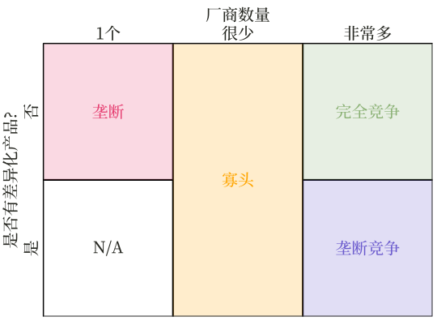

```{R, setup, include = F}
# devtools::install_github("dill/emoGG")
library(pacman)
p_load(
  broom, tidyverse,rmarkdown,
  ggplot2, ggthemes, ggforce, ggridges,
  latex2exp, viridis, extrafont, gridExtra,
  kableExtra, snakecase, janitor,
  data.table, dplyr, estimatr,
  lubridate, knitr, parallel,
  lfe,dslabs,
  here, magrittr)

options(htmltools.dir.version = FALSE)

# Notes directory
dir_slides <- "/Users/zhouzhengqing/Desktop/SportsEconAnalysis/2023spring/Lec04"
# Define pink color
red_pink <- "#e64173"
turquoise <- "#20B2AA"
orange <- "#FFA500"
red <- "#fb6107"
blue <- "#3b3b9a"
green <- "#8bb174"
grey_light <- "grey70"
grey_mid <- "grey50"
grey_dark <- "grey20"
purple <- "#6A5ACD"
slate <- "#314f4f"
met_slate <- "#272822" # metropolis font color 

# Dark slate grey: #314f4f

# Knitr options
opts_chunk$set(
  comment = "#>",
  fig.align = "center",
  fig.height = 7,
  fig.width = 10.5,
  warning = F,
  message = F
)
opts_chunk$set(dev = "svg")
options(device = function(file, width, height) {
  svg(tempfile(), width = width, height = height)
})
options(crayon.enabled = F)
options(knitr.table.format = "html")
# A blank theme for ggplot
theme_empty <- theme_bw() + theme(
  line = element_blank(),
  rect = element_blank(),
  strip.text = element_blank(),
  axis.text = element_blank(),
  plot.title = element_blank(),
  axis.title = element_blank(),
  plot.margin = structure(c(0, 0, -0.5, -1), unit = "lines", valid.unit = 3L, class = "unit"),
  legend.position = "none"
)
theme_simple <- theme_bw() + theme(
  line = element_blank(),
  panel.grid = element_blank(),
  rect = element_blank(),
  strip.text = element_blank(),
  axis.text.x = element_text(size = 18, family = "STIXGeneral"),
  axis.text.y = element_blank(),
  axis.ticks = element_blank(),
  plot.title = element_blank(),
  axis.title = element_blank(),
  # plot.margin = structure(c(0, 0, -1, -1), unit = "lines", valid.unit = 3L, class = "unit"),
  legend.position = "none"
)
theme_axes_math <- theme_void() + theme(
  text = element_text(family = "MathJax_Math"),
  axis.title = element_text(size = 22),
  axis.title.x = element_text(hjust = .95, margin = margin(0.15, 0, 0, 0, unit = "lines")),
  axis.title.y = element_text(vjust = .95, margin = margin(0, 0.15, 0, 0, unit = "lines")),
  axis.line = element_line(
    color = "grey70",
    size = 0.25,
    arrow = arrow(angle = 30, length = unit(0.15, "inches")
  )),
  plot.margin = structure(c(1, 0, 1, 0), unit = "lines", valid.unit = 3L, class = "unit"),
  legend.position = "none"
)
theme_axes_serif <- theme_void() + theme(
  text = element_text(family = "MathJax_Main"),
  axis.title = element_text(size = 22),
  axis.title.x = element_text(hjust = .95, margin = margin(0.15, 0, 0, 0, unit = "lines")),
  axis.title.y = element_text(vjust = .95, margin = margin(0, 0.15, 0, 0, unit = "lines")),
  axis.line = element_line(
    color = "grey70",
    size = 0.25,
    arrow = arrow(angle = 30, length = unit(0.15, "inches")
  )),
  plot.margin = structure(c(1, 0, 1, 0), unit = "lines", valid.unit = 3L, class = "unit"),
  legend.position = "none"
)
theme_axes <- theme_void() + theme(
  text = element_text(family = "Fira Sans Book"),
  axis.title = element_text(size = 18),
  axis.title.x = element_text(hjust = .95, margin = margin(0.15, 0, 0, 0, unit = "lines")),
  axis.title.y = element_text(vjust = .95, margin = margin(0, 0.15, 0, 0, unit = "lines")),
  axis.line = element_line(
    color = grey_light,
    size = 0.25,
    arrow = arrow(angle = 30, length = unit(0.15, "inches")
  )),
  plot.margin = structure(c(1, 0, 1, 0), unit = "lines", valid.unit = 3L, class = "unit"),
  legend.position = "none"
)
theme_market <- theme_bw() + theme(
  axis.line = element_line(color = met_slate),
  panel.grid = element_blank(),
  rect = element_blank(),
  strip.text = element_blank(),
  text = element_text(family = cnfont, color = met_slate, size = 17),
  axis.title.x = element_text(hjust = 1, size = 17),
  axis.title.y = element_text(hjust = 1, angle = 0, size = 17),
  # axis.text.x = element_text(size = 12),
  # axis.text.y = element_text(size = 12),
  axis.ticks = element_blank()
)
theme_gif <- theme_bw() + theme(
  axis.line = element_line(color = met_slate),
  panel.grid = element_blank(),
  rect = element_blank(),
  text = element_text(family = cnfont, color = met_slate, size = 17),
  axis.text.x = element_text(size = 12),
  axis.text.y = element_text(size = 12),
  axis.ticks = element_blank()
)
theme_goods <- theme_bw() + theme(
  axis.line = element_line(),
  panel.grid = element_blank(),
  rect = element_rect(size = 1),
  strip.text = element_blank(),
  text = element_text(size = 17, family = cnfont), 
  axis.text.x = element_text(size = 17),
  axis.text.y = element_text(size = 17, angle = 90, hjust = 0.5),
  axis.title.x = element_text(color = purple, size = 19),
  axis.title.y = element_text(color = red_pink, size = 19),
  axis.ticks = element_blank(),
  plot.title = element_blank(),
  legend.position = "none"
)
theme_game <- theme_bw() + theme(
  axis.line = element_line(),
  panel.grid = element_blank(),
  rect = element_rect(size = 1),
  strip.text = element_blank(),
  text = element_text(size = 20, family = cnfont), 
  axis.text.x = element_text(size = 20, color = met_slate),
  axis.text.y = element_text(size = 20, angle = 90, color = met_slate, hjust = 0.5),
  axis.title.x = element_text(color = met_slate, size = 20),
  axis.title.y = element_text(color = met_slate, size = 20),
  axis.ticks = element_blank(),
  plot.title = element_blank(),
  legend.position = "none"
)
shift_axis <- function(p, y=0){
  g <- ggplotGrob(p)
  dummy <- data.frame(y=y)
  ax <- g[["grobs"]][g$layout$name == "axis-b"][[1]]
  p + annotation_custom(grid::grobTree(ax, vp = grid::viewport(y=1, height=sum(ax$height))), 
                        ymax=y, ymin=y) +
    geom_hline(aes(yintercept=y), data = dummy, size = 0.5, color = met_slate) +
    theme(axis.text.x = element_blank(), 
          axis.ticks.x = element_blank())
}
wrapper <- function(x, ...) paste(strwrap(x, ...), collapse = "\n")
# functions
demand <- function(x) 10 - x
demand_2 <- function(x) 9 - x
demand_3 <- function(x) 8 - x
demand_inc <- function(x) 11 - x
demand_dec <- function(x) 5 - x
supply <- function(x) 1 + (4/5)*x
step_demand <- tibble(x = c(0, 1, 2, 3, 4, 5, 6, 7, 8), mv = c(8, 7, 6, 5, 4, 3, 2, 1, 0))
step_demand2 <- tibble(x = c(0, 1, 2, 3, 4, 5, 6, 7, 8, 9, 10, 11, 12), mv = c(10, 10, 9, 9, 8, 8, 7, 7, 6, 6, 5, 4, 4))
step_supply <- tibble(x = c(0, 1, 2, 3, 4, 5, 6, 7, 8, 9, 10, 11, 12), mv = c(2, 2, 3, 3, 4, 4, 5, 5, 6, 6, 7, 8, 8))
step_supply_tax <- step_supply %>% 
  mutate(mv = mv + 2)

data <- read_csv("/Users/zhouzhengqing/Desktop/SportsEconAnalysis/Activity_Pit_Market/Results.csv") %>% 
  dplyr::filter(!is.na(price))

theme_set(theme_gray(base_size = 20))
# Column names for regression results
reg_columns <- c("Term", "Est.", "S.E.", "t stat.", "p-Value")
# Function for formatting p values
format_pvi <- function(pv) {
  return(ifelse(
    pv < 0.0001,
    "<0.0001",
    round(pv, 4) %>% format(scientific = F)
  ))
}
format_pv <- function(pvs) lapply(X = pvs, FUN = format_pvi) %>% unlist()
# Tidy regression results table
tidy_table <- function(x, terms, highlight_row = 1, highlight_color = "black", highlight_bold = T, digits = c(NA, 3, 3, 2, 5), title = NULL) {
  x %>%
    tidy() %>%
    select(1:5) %>%
    mutate(
      term = terms,
      p.value = p.value %>% format_pv()
    ) %>%
    kable(
      col.names = reg_columns,
      escape = F,
      digits = digits,
      caption = title
    ) %>%
    kable_styling(font_size = 20) %>%
    row_spec(1:nrow(tidy(x)), background = "white") %>%
    row_spec(highlight_row, bold = highlight_bold, color = highlight_color)
}
```
class: center, middle, inverse

# 供给：收入衍生的生产决策


---
layout: false
### 收入线

.less-right[生产者理论主要是指厂商经济行为模型。职业联盟因为是由多个厂商（俱乐部）构成，俱乐部行为决定了联盟结构，因此本讲中会稍作深入讲解。

- 成本线：生产成本、生产技术、厂商决策

- .hi.orange[收入线：市场结构决定了定价能力]

]

.more-left[


]

---
### 什么是市场？以及如何划分？

- 市场是物品买卖双方相互作用并得以决定其交易价格和数量的一种**组织形式或制度**
- 市场可以是有形场所，也可以是一个虚拟平台
- 有多少种交易商品，就有多少个市场

- 划分市场类型的5大要素： 
    - 买卖方数目
    - 产品差异度
    - 行业壁垒性: 厂商进入/退出一个行业的难易程度
    - 价格控制力: 单个厂商对价格的控制程度
    - 信息完备性

---

### 市场结构的分类

.center[

]

---
layout: true
# 职业体育市场
class: title-slide-section,inverse, middle
---
layout: false
### 总体规模

- 在当地经济中的比重相对较小
    - 2017年美国四大体育项目（Big4）的收入总额为320亿$（Forbes），但当年的经济19.45万亿$，占1.64‰。

- 越来越重要?
  - 人口结构与需求
      - 中产阶级人群扩大，更休闲、更高品质的生活
      - 全生命周期，追求更健康
    - 行业特点：辐射范围广 + 曝光度高
    - 国家层面：健康中国 + 体育强国
    
---

### 球队产出

在体育市场，定义和衡量产出是复杂的.

假设单厂商是联盟中的球队，那么衡量球队的产出TP可以如下：

- 上座率(attendance) 或收视率(television viewership)：基于收入，直接与球队收入TR相关

- 参赛数量：基于要素角度，球队投入要素（L或者K）越多，参赛数量就多

- 胜率： 
如果球队收入与球迷支持度连接，那么产出TP以胜率就是合理的，而不是参赛数量 .mono[->] 连接了要素和收入

	- 这里潜在的假设是：**利润来自胜率**

---

## 厂商行为：球队产出

体育产出的衡量问题类似于高等教育的产出问题。

从要素投入角度看，大学可以将产出定义为注册学生的数量。

从收入相关角度看，可将产出定义为学生学习量，因为其与未来收入相关。
 
- 视研究具体问题而定，没有简单的解决办法

- 强行给产出下一个普遍的定义会使问题变得模糊不清

- 遵循一般研究习惯：球队产出定义为**每个赛季的胜率**

---

## 厂商行为：球队生产函数


- 与产品市场相同的是，球队投入品同样包含资本K与劳动力L。
	- 短期，一种生产要素是不变的
	    - 一般假定是资本不变，如球场容量等

	- 劳动力投入在职业球队表现为**球员天赋(talent)**

- **边际产量MP下降**：表现为对天赋的不断投入，并不能获得不断上升的胜率

	- 即便对于超级球星也是如此
	
	- 球星越多，每个球星获得的出手机会越小，对球队胜率贡献度就会越小


---

### 短期：以球星作为投入反映边际产量下降

.pull-left[
.caption[.center[.smallest[NBA勇士11-19赛季胜率]]]
.center[

]

- NBA、足球的胜率与冠军关系不同

  - .hi.slate[NBA: ].purple[常规赛胜率高] .mono[!=] .orange[季后赛总冠军]

  - .hi.slate[足 球: ] .purple[联赛胜率高] .mono[==] .orange[联赛冠军]
]

.pull-right[
- 短期：看常规赛的胜率情况
    
    - 16-17赛季KD到来并未产生显著效果

- 中长期（总冠军与常规赛战绩的权衡取舍）：吸取15-16赛未夺冠的教训，球队会平衡球星健康，适当放弃短期利益

    - 16-17赛季KD延续了勇士的总冠军

- 长期（双产出目标）：16-19赛季常规赛下滑，退出夺冠序列，考虑年龄、伤病和非主力球员的流动
]
---
layout: true
# 职业体育市场结构的垄断属性
---
class: title-slide-section,inverse, middle
---
layout: false
### 垄断形成的市场条件

1. 单一的卖家：市场上只有唯一的一个厂商生产和销售商品
2. 独特的产品：没有功能接近的替代品
3. 进入壁垒高：极为困难，甚至不可能

### 结果

**市场力量：** 垄断者有能力影响市场价格

- 垄断者是**价格制定者**

- 垄断厂商需求曲线：就是**市场需求曲线**

---
layout: false
## 垄断产生的5大原因

1. 控制了生产需要的全部资源或基本资源供给

2. 资本融资困难

3. 经济规模门槛

4. 政府特许授权

5. 专利和版权法保护

---
## 垄断产生的5大原因

### 1.控制了生产需要的全部资源或基本资源供给

**例子**  

- 20世纪初，美国铝业公司（Alcoa）拥有全球90%的铝土矿供应。

- 戴比尔斯（De Beers）公司在2000年代中期之前拥有全球大部分的钻石原料。

- 劳动力市场的垄断：球员工会作为球队劳动力获得的唯一渠道

---
## 垄断产生的5大原因
### 2.资本融资困难

在位垄断者往往规模很大 .mono[-->] 新竞争者需要大量的资金才能有效竞争

- 一般认为与老牌垄断者竞争，赢的机会很低 <br> .mono[-->] 投资方认为有风险，不会轻易发放贷款

**例子：** PC操作系统

- 取代Windows 10作为个人电脑的主要操作系统将需要大量的资金

- 投资方会选择微软而不是你的创业公司来开发下一代大型操作系统

---
## 垄断产生的5大原因
### 3.经济规模门槛

进入某行业前期需要巨大的固定资产，但进入后边际成本较低 <br> .mono[-->] 随着时间的推移，有"大吃小"的趋势。

**例子：** 自然垄断

- 电和水
- 有线互联网和电视
- 铁路
- 大都会区球队所拥有的球场：一些球队为了获得垄断势力，会资助修建球场

---

## 垄断产生的5大原因
### 4.政府特许授权

政府发放许可**要求**建立行业垄断

- 许可证 .mono[=] 进入行业的法律障碍和从事某种职业的资质

**理由：** 追求规模经济或减少竞争带来的负外部性

**例子**

- 垃圾收集
- 出租车牌照
- 医生、律师的从业许可证

---
## 垄断产生的5大原因
### 5.专利和版权法保护

政府允许厂商在某段时间内独家销售某种特定商品或服务的权利

- 独家专权 .mono[-->] 垄断

**权衡取舍：** 牺牲市场机制带来的激励创新

**例子**

- 疫苗
- 书籍和音乐
- 赛事转播权

---

.pink[Q: ]职业体育属于那种？

--

.pink[A: ] 垄断大集合！

--

  - 联盟整体行业垄断：新球队进入面临着其他成员障碍
  
--

  - 联盟整体行业垄断：法律上的反垄断豁免(MLB)

--

  - 单球队垄断：地理区域排他

--

  - 单球队垄断：使用或建造比赛设施需要大量资金

--

  - 单球队垄断：某些球队建立的球迷忠诚，欧洲开放联赛曼联、皇马
  
--

  最终形成：**产品市场垄断 + 劳动力市场买卖双方垄断**

--

  这两次课程：不特别说明，都是垄断产品市场的行为分析；垄断的劳动力市场会单独用两次课程完成。
---

## 垄断市场的厂商分析思路

市场需求曲线 .mono[=] 厂商需求曲线 .mono[->] 总收入TR=P(Q)*Q <br>

.mono[->] AR=P(Q) 就是市场和厂商的需求曲线 .mono[->] MR <br>

.mono[->] 根据MR=MC利润最大化，分析产量和价格的决策过程


- 垄断厂商的供给曲线就是MC

- 对于完全竞争厂商来说，价格是外生变量

- 对于垄断企业来说，价格是**内生变量**，即它可以同时决定价格和产量

- 厂商的利润最大化决策就是市场的价格和产量均衡过程
---
## 垄断市场的厂商需求函数

垄断市场中只有一个厂商，所以市场的需求曲线就是垄断厂商所面临的需求需求，它是一条向右下方倾斜的曲线。**它表示垄断厂商可以用减少销量的办法提高市场价格**，也可以用增加销量的办法来压低市场价格。定义为
$P(Q)=a-b Q$ ,其中 $a>0，b>0$
.pull-left[
.center[**垄断市场厂商需求曲线**]
```{r, echo = FALSE, fig.height = 3.35, fig.width = 3.35, dev = "svg"}
demand <- function(x) 8 - 0.6*x
inv_demand <- function(x) (5/3)*(8 - x)
p_1 <- 7
p_2 <- 6
q_1 <- inv_demand(p_1) 
q_2 <- inv_demand(p_2)
ggplot(data = data.frame(x = 0), mapping = aes(x = x)) +
  scale_x_continuous(limits = c(0, 10.5), expand = c(0, 0), breaks = NULL) +
  scale_y_continuous(limits = c(0, 10.5), expand = c(0, 0), breaks = NULL) +
  theme_market +
  labs(x = "Q", y = "P") +
  stat_function(fun = demand, color = red_pink, size = 1) +
  annotate("text", label = "D", x = 10, y = 2.65, color = red_pink, family = cnfont, size = 9) 
```
]
.pull-right[
.center[**完美竞争市场厂商需求曲线**]
```{r, echo = FALSE, fig.height = 3.35, fig.width = 3.35,  dev = "svg"}
ggplot(data = data.frame(x = 0), mapping = aes(x = x)) +
  scale_x_continuous(limits = c(0, 10.5), expand = c(0, 0), breaks = NULL) +
  scale_y_continuous(limits = c(0, 10.5), expand = c(0, 0), breaks = NULL) +
  theme_market +
  labs(x = "Q", y = "P") +
  geom_hline(yintercept = 5, color = red_pink, size = 1) +
  annotate("text", label = "D", x = 10, y = 5.5, color = red_pink, family = cnfont, size = 9)
```
]

---
## 垄断市场厂商的降价抉择

.more-left[
```{r, echo = FALSE, fig.height = 5, fig.width = 5, dev = "svg"}
demand <- function(x) 10 - x
inv_demand <- function(x) 10 - x
p_1 <- 7
p_2 <- 9
q_1 <- inv_demand(p_1) 
q_2 <- inv_demand(p_2)
ggplot(data = data.frame(x = 0), mapping = aes(x = x)) +
  scale_x_continuous(limits = c(0, 10.5), expand = c(0, 0), breaks = seq(0, 10, 1)) +
  scale_y_continuous(limits = c(0, 10.5), expand = c(0, 0), breaks = seq(0, 10, 1)) +
  theme_market +
  labs(x = "Q", y = "P") +
  # geom_rect(aes(xmin = 0, xmax = q_1, ymin = 0, ymax = p_1), alpha = 0.2, fill = green) +
  geom_rect(aes(xmin = 0, xmax = q_2, ymin = 0, ymax = p_2), alpha = 0.2, fill = green) +
  stat_function(fun = demand, color = red_pink, size = 1) +
  # geom_point(x = q_1, y = p_1, color = met_slate, size = 2) +
  geom_point(x = q_2, y = p_2, color = met_slate, size = 2) +
  # geom_segment(x = 0, xend = q_1, y = p_1, yend = p_1, color = met_slate, linetype = "dashed", size = 1) +
  geom_segment(x = 0, xend = q_2, y = p_2, yend = p_2, color = met_slate, linetype = "dashed", size = 1) +
  # geom_segment(x = q_1, xend = q_1, y = 0, yend = p_1, color = met_slate, linetype = "dashed", size = 1) +
  geom_segment(x = q_2, xend = q_2, y = 0, yend = p_2, color = met_slate, linetype = "dashed", size = 1) +
  annotate("text", label = "D", x = 10, y = 0.65, color = red_pink, family = cnfont, size = 9) 
```
]

.less-right[
- $\pi =TR(P * Q)-TC$ ，但 $P$ 与 $Q$ 相反方向运动，那么乘积如何?

.pink.hi[价格效应：] 随着价格的下降，现有顾客支付的更少，.green[TR]减少。

.purple.hi[产出效应：] 随着价格的下降，客户购买更多商品，.green[TR]增加。

]

---
count: false
## 垄断市场厂商的降价抉择

.more-left[
```{r, echo = FALSE, fig.height = 5, fig.width = 5, dev = "svg"}
demand <- function(x) 10 - x
inv_demand <- function(x) 10 - x
p_1 <- 7
p_2 <- 9
q_1 <- inv_demand(p_1) 
q_2 <- inv_demand(p_2)
ggplot(data = data.frame(x = 0), mapping = aes(x = x)) +
  scale_x_continuous(limits = c(0, 10.5), expand = c(0, 0), breaks = seq(0, 10, 1)) +
  scale_y_continuous(limits = c(0, 10.5), expand = c(0, 0), breaks = seq(0, 10, 1)) +
  theme_market +
  labs(x = "Q", y = "P") +
  geom_rect(aes(xmin = 0, xmax = q_1, ymin = 0, ymax = p_1), alpha = 0.2, fill = green) +
  # geom_rect(aes(xmin = 0, xmax = q_2, ymin = 0, ymax = p_2), alpha = 0.2, fill = green) +
  stat_function(fun = demand, color = red_pink, size = 1) +
  geom_point(x = q_1, y = p_1, color = met_slate, size = 2) +
  geom_point(x = q_2, y = p_2, color = met_slate, size = 2) +
  geom_segment(x = 0, xend = q_1, y = p_1, yend = p_1, color = met_slate, linetype = "dashed", size = 1) +
  geom_segment(x = 0, xend = q_2, y = p_2, yend = p_2, color = met_slate, linetype = "dashed", size = 1) +
  geom_segment(x = q_1, xend = q_1, y = 0, yend = p_1, color = met_slate, linetype = "dashed", size = 1) +
  geom_segment(x = q_2, xend = q_2, y = 0, yend = p_2, color = met_slate, linetype = "dashed", size = 1) +
  annotate("text", label = "D", x = 10, y = 0.65, color = red_pink, family = cnfont, size = 9) 
```
]

.less-right[
- $\pi =TR(P * Q)-TC$ ，但 $P$ 与 $Q$ 相反方向运动，那么乘积如何?

.pink.hi[价格效应：] 随着价格的下降，现有顾客支付的更少，.green[TR]减少。

.purple.hi[产出效应：] 随着价格的下降，客户购买更多商品，.green[TR]增加。

]

---
count: false
## 垄断市场厂商的降价抉择

.more-left[
```{r, echo = FALSE, fig.height = 5, fig.width = 5, dev = "svg"}
demand <- function(x) 10 - x
inv_demand <- function(x) 10 - x
p_1 <- 7
p_2 <- 9
q_1 <- inv_demand(p_1) 
q_2 <- inv_demand(p_2)
ggplot(data = data.frame(x = 0), mapping = aes(x = x)) +
  scale_x_continuous(limits = c(0, 10.5), expand = c(0, 0), breaks = seq(0, 10, 1)) +
  scale_y_continuous(limits = c(0, 10.5), expand = c(0, 0), breaks = seq(0, 10, 1)) +
  theme_market +
  labs(x = "Q", y = "P") +
  geom_rect(aes(xmin = 0, xmax = q_2, ymin = p_1, ymax = p_2), alpha = 0.2, fill = red_pink) +
  geom_rect(aes(xmin = q_1, xmax = q_2, ymin = 0, ymax = p_1), alpha = 0.2, fill = purple) +
  stat_function(fun = demand, color = red_pink, size = 1) +
  geom_point(x = q_1, y = p_1, color = met_slate, size = 2) +
  geom_point(x = q_2, y = p_2, color = met_slate, size = 2) +
  geom_segment(x = 0, xend = q_1, y = p_1, yend = p_1, color = met_slate, linetype = "dashed", size = 1) +
  geom_segment(x = 0, xend = q_2, y = p_2, yend = p_2, color = met_slate, linetype = "dashed", size = 1) +
  geom_segment(x = q_1, xend = q_1, y = 0, yend = p_1, color = met_slate, linetype = "dashed", size = 1) +
  geom_segment(x = q_2, xend = q_2, y = 0, yend = p_2, color = met_slate, linetype = "dashed", size = 1) +
  annotate("text", label = "D", x = 10, y = 0.65, color = red_pink, family = cnfont, size = 9) 
```
]

.less-right[
- $\pi =TR(P * Q)-TC$ ，但 $P$ 与 $Q$ 相反方向运动，那么乘积如何?

.pink.hi[价格效应：] 随着价格的下降，现有顾客支付的更少，.green[TR]减少。

.purple.hi[产出效应：] 随着价格的下降，客户购买更多商品，.green[TR]增加。

.purple[产出效应] <br> $\quad$ .mono[>] .pink[价格效应] .mono[==>] <br> 厂商降价导致 .green[总收入增加]

]

---
## 垄断市场厂商的降价抉择

.more-left[
```{r, echo = FALSE, fig.height = 5, fig.width = 5, dev = "svg"}
demand <- function(x) 10 - x
inv_demand <- function(x) 10 - x
p_1 <- 4
p_2 <- 6
q_1 <- inv_demand(p_1) 
q_2 <- inv_demand(p_2)
ggplot(data = data.frame(x = 0), mapping = aes(x = x)) +
  scale_x_continuous(limits = c(0, 10.5), expand = c(0, 0), breaks = seq(0, 10, 1)) +
  scale_y_continuous(limits = c(0, 10.5), expand = c(0, 0), breaks = seq(0, 10, 1)) +
  theme_market +
  labs(x = "Q", y = "P") +
  # geom_rect(aes(xmin = 0, xmax = q_1, ymin = 0, ymax = p_1), alpha = 0.2, fill = green) +
  geom_rect(aes(xmin = 0, xmax = q_2, ymin = 0, ymax = p_2), alpha = 0.2, fill = green) +
  stat_function(fun = demand, color = red_pink, size = 1) +
  # geom_point(x = q_1, y = p_1, color = met_slate, size = 2) +
  geom_point(x = q_2, y = p_2, color = met_slate, size = 2) +
  # geom_segment(x = 0, xend = q_1, y = p_1, yend = p_1, color = met_slate, linetype = "dashed", size = 1) +
  geom_segment(x = 0, xend = q_2, y = p_2, yend = p_2, color = met_slate, linetype = "dashed", size = 1) +
  # geom_segment(x = q_1, xend = q_1, y = 0, yend = p_1, color = met_slate, linetype = "dashed", size = 1) +
  geom_segment(x = q_2, xend = q_2, y = 0, yend = p_2, color = met_slate, linetype = "dashed", size = 1) +
  annotate("text", label = "D", x = 10, y = 0.65, color = red_pink, family = cnfont, size = 9) 
```
]

.less-right[
- $\pi =TR(P * Q)-TC$ ，但 $P$ 与 $Q$ 相反方向运动，那么乘积如何?

.pink.hi[价格效应：] 随着价格的下降，现有顾客支付的更少，.green[TR]减少。

.purple.hi[产出效应：] 随着价格的下降，客户购买更多商品，.green[TR]增加。

]

---
count: false
## 垄断市场厂商的降价抉择

.more-left[
```{r, echo = FALSE, fig.height = 5, fig.width = 5, dev = "svg"}
demand <- function(x) 10 - x
inv_demand <- function(x) 10 - x
p_1 <- 4
p_2 <- 6
q_1 <- inv_demand(p_1) 
q_2 <- inv_demand(p_2)
ggplot(data = data.frame(x = 0), mapping = aes(x = x)) +
  scale_x_continuous(limits = c(0, 10.5), expand = c(0, 0), breaks = seq(0, 10, 1)) +
  scale_y_continuous(limits = c(0, 10.5), expand = c(0, 0), breaks = seq(0, 10, 1)) +
  theme_market +
  labs(x = "Q", y = "P") +
  geom_rect(aes(xmin = 0, xmax = q_1, ymin = 0, ymax = p_1), alpha = 0.2, fill = green) +
  # geom_rect(aes(xmin = 0, xmax = q_2, ymin = 0, ymax = p_2), alpha = 0.2, fill = green) +
  stat_function(fun = demand, color = red_pink, size = 1) +
  geom_point(x = q_1, y = p_1, color = met_slate, size = 2) +
  geom_point(x = q_2, y = p_2, color = met_slate, size = 2) +
  geom_segment(x = 0, xend = q_1, y = p_1, yend = p_1, color = met_slate, linetype = "dashed", size = 1) +
  geom_segment(x = 0, xend = q_2, y = p_2, yend = p_2, color = met_slate, linetype = "dashed", size = 1) +
  geom_segment(x = q_1, xend = q_1, y = 0, yend = p_1, color = met_slate, linetype = "dashed", size = 1) +
  geom_segment(x = q_2, xend = q_2, y = 0, yend = p_2, color = met_slate, linetype = "dashed", size = 1) +
  annotate("text", label = "D", x = 10, y = 0.65, color = red_pink, family = cnfont, size = 9) 
```
]

.less-right[
- $\pi =TR(P * Q)-TC$ ，但 $P$ 与 $Q$ 相反方向运动，那么乘积如何?

.pink.hi[价格效应：] 随着价格的下降，现有顾客支付的更少，.green[TR]减少。

.purple.hi[产出效应：] 随着价格的下降，客户购买更多商品，.green[TR]增加。

]

---
count: false
## 垄断市场厂商的降价抉择

.more-left[
```{r, echo = FALSE, fig.height = 5, fig.width = 5, dev = "svg"}
demand <- function(x) 10 - x
inv_demand <- function(x) 10 - x
p_1 <- 4
p_2 <- 6
q_1 <- inv_demand(p_1) 
q_2 <- inv_demand(p_2)
ggplot(data = data.frame(x = 0), mapping = aes(x = x)) +
  scale_x_continuous(limits = c(0, 10.5), expand = c(0, 0), breaks = seq(0, 10, 1)) +
  scale_y_continuous(limits = c(0, 10.5), expand = c(0, 0), breaks = seq(0, 10, 1)) +
  theme_market +
  labs(x = "Q", y = "P") +
  geom_rect(aes(xmin = 0, xmax = q_2, ymin = p_1, ymax = p_2), alpha = 0.2, fill = red_pink) +
  geom_rect(aes(xmin = q_1, xmax = q_2, ymin = 0, ymax = p_1), alpha = 0.2, fill = purple) +
  stat_function(fun = demand, color = red_pink, size = 1) +
  geom_point(x = q_1, y = p_1, color = met_slate, size = 2) +
  geom_point(x = q_2, y = p_2, color = met_slate, size = 2) +
  geom_segment(x = 0, xend = q_1, y = p_1, yend = p_1, color = met_slate, linetype = "dashed", size = 1) +
  geom_segment(x = 0, xend = q_2, y = p_2, yend = p_2, color = met_slate, linetype = "dashed", size = 1) +
  geom_segment(x = q_1, xend = q_1, y = 0, yend = p_1, color = met_slate, linetype = "dashed", size = 1) +
  geom_segment(x = q_2, xend = q_2, y = 0, yend = p_2, color = met_slate, linetype = "dashed", size = 1) +
  annotate("text", label = "D", x = 10, y = 0.65, color = red_pink, family = cnfont, size = 9) 
```
]

.less-right[
- $\pi =TR(P * Q)-TC$ ，但 $P$ 与 $Q$ 相反方向运动，那么乘积如何?

.pink.hi[价格效应：] 随着价格的下降，现有顾客支付的更少，.green[TR]减少。

.purple.hi[产出效应：] 随着价格的下降，客户购买更多商品，.green[TR]增加。

.purple[产出效应] <br> $\quad$ .mono[=] .pink[价格效应] .mono[==>] <br> 厂商降价导致 .green[总收入不变]

]

---
## 垄断市场厂商的降价抉择

.more-left[
```{r, echo = FALSE, fig.height = 5, fig.width = 5, dev = "svg"}
demand <- function(x) 10 - x
inv_demand <- function(x) 10 - x
p_1 <- 1
p_2 <- 3
q_1 <- inv_demand(p_1) 
q_2 <- inv_demand(p_2)
ggplot(data = data.frame(x = 0), mapping = aes(x = x)) +
  scale_x_continuous(limits = c(0, 10.5), expand = c(0, 0), breaks = seq(0, 10, 1)) +
  scale_y_continuous(limits = c(0, 10.5), expand = c(0, 0), breaks = seq(0, 10, 1)) +
  theme_market +
  labs(x = "Q", y = "P") +
  # geom_rect(aes(xmin = 0, xmax = q_1, ymin = 0, ymax = p_1), alpha = 0.2, fill = green) +
  geom_rect(aes(xmin = 0, xmax = q_2, ymin = 0, ymax = p_2), alpha = 0.2, fill = green) +
  stat_function(fun = demand, color = red_pink, size = 1) +
  # geom_point(x = q_1, y = p_1, color = met_slate, size = 2) +
  geom_point(x = q_2, y = p_2, color = met_slate, size = 2) +
  # geom_segment(x = 0, xend = q_1, y = p_1, yend = p_1, color = met_slate, linetype = "dashed", size = 1) +
  geom_segment(x = 0, xend = q_2, y = p_2, yend = p_2, color = met_slate, linetype = "dashed", size = 1) +
  # geom_segment(x = q_1, xend = q_1, y = 0, yend = p_1, color = met_slate, linetype = "dashed", size = 1) +
  geom_segment(x = q_2, xend = q_2, y = 0, yend = p_2, color = met_slate, linetype = "dashed", size = 1) +
  annotate("text", label = "D", x = 10, y = 0.65, color = red_pink, family = cnfont, size = 9) 
```
]

.less-right[
- $\pi =TR(P * Q)-TC$ ，但 $P$ 与 $Q$ 相反方向运动，那么乘积如何?

.pink.hi[价格效应：] 随着价格的下降，现有顾客支付的更少，.green[TR]减少。

.purple.hi[产出效应：] 随着价格的下降，客户购买更多商品，.green[TR]增加。

]

---
count: false
## 垄断市场厂商的降价抉择

.more-left[
```{r, echo = FALSE, fig.height = 5, fig.width = 5, dev = "svg"}
demand <- function(x) 10 - x
inv_demand <- function(x) 10 - x
p_1 <- 1
p_2 <- 3
q_1 <- inv_demand(p_1) 
q_2 <- inv_demand(p_2)
ggplot(data = data.frame(x = 0), mapping = aes(x = x)) +
  scale_x_continuous(limits = c(0, 10.5), expand = c(0, 0), breaks = seq(0, 10, 1)) +
  scale_y_continuous(limits = c(0, 10.5), expand = c(0, 0), breaks = seq(0, 10, 1)) +
  theme_market +
  labs(x = "Q", y = "P") +
  geom_rect(aes(xmin = 0, xmax = q_1, ymin = 0, ymax = p_1), alpha = 0.2, fill = green) +
  # geom_rect(aes(xmin = 0, xmax = q_2, ymin = 0, ymax = p_2), alpha = 0.2, fill = green) +
  stat_function(fun = demand, color = red_pink, size = 1) +
  geom_point(x = q_1, y = p_1, color = met_slate, size = 2) +
  geom_point(x = q_2, y = p_2, color = met_slate, size = 2) +
  geom_segment(x = 0, xend = q_1, y = p_1, yend = p_1, color = met_slate, linetype = "dashed", size = 1) +
  geom_segment(x = 0, xend = q_2, y = p_2, yend = p_2, color = met_slate, linetype = "dashed", size = 1) +
  geom_segment(x = q_1, xend = q_1, y = 0, yend = p_1, color = met_slate, linetype = "dashed", size = 1) +
  geom_segment(x = q_2, xend = q_2, y = 0, yend = p_2, color = met_slate, linetype = "dashed", size = 1) +
  annotate("text", label = "D", x = 10, y = 0.65, color = red_pink, family = cnfont, size = 9) 
```
]

.less-right[
- $\pi =TR(P * Q)-TC$ ，但 $P$ 与 $Q$ 相反方向运动，那么乘积如何?

.pink.hi[价格效应：] 随着价格的下降，现有顾客支付的更少，.green[TR]减少。

.purple.hi[产出效应：] 随着价格的下降，客户购买更多商品，.green[TR]增加。

.purple[产出效应] <br> $\quad$ .mono[<] .pink[价格效应] .mono[==>] <br> 厂商降价导致 .green[总收入减少]

]

---
count: false
## 垄断市场厂商的降价抉择

.more-left[
```{r, echo = FALSE, fig.height = 5, fig.width = 5, dev = "svg"}
demand <- function(x) 10 - x
inv_demand <- function(x) 10 - x
p_1 <- 1
p_2 <- 3
q_1 <- inv_demand(p_1) 
q_2 <- inv_demand(p_2)
ggplot(data = data.frame(x = 0), mapping = aes(x = x)) +
  scale_x_continuous(limits = c(0, 10.5), expand = c(0, 0), breaks = seq(0, 10, 1)) +
  scale_y_continuous(limits = c(0, 10.5), expand = c(0, 0), breaks = seq(0, 10, 1)) +
  theme_market +
  labs(x = "Q", y = "P") +
  geom_rect(aes(xmin = 0, xmax = q_2, ymin = p_1, ymax = p_2), alpha = 0.2, fill = red_pink) +
  geom_rect(aes(xmin = q_1, xmax = q_2, ymin = 0, ymax = p_1), alpha = 0.2, fill = purple) +
  stat_function(fun = demand, color = red_pink, size = 1) +
  geom_point(x = q_1, y = p_1, color = met_slate, size = 2) +
  geom_point(x = q_2, y = p_2, color = met_slate, size = 2) +
  geom_segment(x = 0, xend = q_1, y = p_1, yend = p_1, color = met_slate, linetype = "dashed", size = 1) +
  geom_segment(x = 0, xend = q_2, y = p_2, yend = p_2, color = met_slate, linetype = "dashed", size = 1) +
  geom_segment(x = q_1, xend = q_1, y = 0, yend = p_1, color = met_slate, linetype = "dashed", size = 1) +
  geom_segment(x = q_2, xend = q_2, y = 0, yend = p_2, color = met_slate, linetype = "dashed", size = 1) +
  annotate("text", label = "D", x = 10, y = 0.65, color = red_pink, family = cnfont, size = 9) 
```
]

.less-right[
- $\pi =TR(P * Q)-TC$ ，但 $P$ 与 $Q$ 相反方向运动，那么乘积如何?

.pink.hi[价格效应：] 随着价格的下降，现有顾客支付的更少，.green[TR]减少。

.purple.hi[产出效应：] 随着价格的下降，客户购买更多商品，.green[TR]增加。

.purple[产出效应] <br> $\quad$ .mono[<] .pink[价格效应] .mono[==>] <br> 厂商降价导致 .green[总收入减少]

]

---
## 垄断市场厂商的边际收入

.more-left[
```{r, echo = FALSE, fig.height = 5, fig.width = 5, dev = "svg"}
demand <- function(x) 10 - x
inv_demand <- function(x) 10 - x
marginal_revenue <- function(x) 10 - 2*x

ggplot(data = data.frame(x = 0), mapping = aes(x = x)) +
  scale_x_continuous(limits = c(0, 10.5), expand = c(0, 0), breaks = seq(0, 10, 1)) +
  scale_y_continuous(limits = c(0, 10.5), expand = c(0, 0), breaks = seq(0, 10, 1)) +
  theme_market +
  labs(x = "Q", y = "P") +
  stat_function(fun = demand, color = red_pink, size = 1) +
  stat_function(fun = marginal_revenue, color = green, size = 1) +
  annotate("text", label = "D", x = 10, y = 0.65, color = red_pink, family = cnfont, size = 9) +
  annotate("text", label = "MR", x = 5.5, y = 0.65, color = green, family = cnfont, size = 9) 
```
]

.less-right[

- 定义：产出增加一个单位所产生的总收入的变化。

由 $P=a-b Q$ 得总收入：
$T R(Q)=P Q=a Q-b Q^{2}$ 

边际收入为:
$M R(Q)=a-2 b Q$

]

---
## 垄断市场厂商的边际收入

.more-left[
```{r, echo = FALSE, fig.height = 5, fig.width = 5, dev = "svg"}
demand <- function(x) 10 - x
inv_demand <- function(x) 10 - x
marginal_revenue <- function(x) 10 - 2*x

ggplot(data = data.frame(x = 0), mapping = aes(x = x)) +
  scale_x_continuous(limits = c(0, 10.5), expand = c(0, 0), breaks = seq(0, 10, 1)) +
  scale_y_continuous(limits = c(0, 10.5), expand = c(0, 0), breaks = seq(0, 10, 1)) +
  theme_market +
  labs(x = "Q", y = "P") +
  stat_function(fun = demand, color = red_pink, size = 1) +
  stat_function(fun = marginal_revenue, color = green, size = 1) +
  annotate("text", label = "D", x = 10, y = 0.65, color = red_pink, family = cnfont, size = 9) +
  annotate("text", label = "MR", x = 5.5, y = 0.65, color = green, family = cnfont, size = 9) 
```
]

.less-right[

垄断者面临一个向下倾斜的MR曲线。

- MR .mono[>] $0 .mono[-->] 总收入增加

- MR .mono[=] $0 .mono[-->] 总收入最大

- MR .mono[<] $0 .mono[-->] 总收入下降

]

---
## 垄断市场厂商的利润最大化

.more-left[
```{r, echo = FALSE, fig.height = 5, fig.width = 5, dev = "svg"}
x <- seq(0, 8, 0.1)
atc <- function(x) (20 + 12*x - 2*x^2 + (2/3)*x^3)/x
marginal_cost <- function(x) 12 - 4*x + 2*x^2
demand <- function(x) 37 - 5*x
marginal_revenue <- function(x) 37 - 10*x
q <- uniroot(function(x) marginal_revenue(x) - marginal_cost(x), range(x))$root
not_p <- marginal_revenue(q)
p <- demand(q)
cost <- atc(q)
z <- seq(0, q, 0.001)

p_max_1 <- ggplot() +
  scale_x_continuous(limits = c(0, 7.5), expand=c(0,0), breaks = c(q), labels = c(4)) +
  scale_y_continuous(limits = c(0, 37.5), expand=c(0,0), breaks = c(cost, p), labels = c(10, 16)) +
  theme_market +
  labs(x = "Q", y = "￥") +
  stat_function( fun = atc, color = orange, size = 1) +
  annotate("text", label = "ATC", x = 6.5, y = 35, color = orange, family = cnfont, size = 9) +
  stat_function( fun = marginal_cost, color = purple, size = 1) +
  annotate("text", label = "MC", x = 1, y = 8, color = purple, family = cnfont, size = 9)
p_max_1
```
]

.less-right[

.pink[Q: ] 垄断者如何实现利润最大化？（MC跟产品市场是否垄断无关）

]

---
count: false
## 垄断市场厂商的利润最大化

.more-left[
```{r, echo = FALSE, fig.height = 5, fig.width = 5, dev = "svg"}
p_max_1
```
]

.less-right[

.pink[Q: ] 垄断者如何实现利润最大化？（MC跟产品市场是否垄断无关）

.pink[A: ] 2个步骤

- **第1步:** .pink[在 MR .mono[=] MC 处将产量配给到 Q.sub[M].]

]

---
count: false
## 垄断市场厂商的利润最大化

.more-left[
```{r, echo = FALSE, fig.height = 5, fig.width = 5, dev = "svg"}
p_max_1 <- p_max_1 +
  stat_function( fun = demand, color = red_pink, size = 1) +
  stat_function( fun = marginal_revenue, color = green, size = 1) +
  annotate("text", label = "D", x = 6.25, y = 8, color = red_pink, family = cnfont, size = 9) +
  annotate("text", label = "MR", x = 3.5, y = 8, color = green, family = cnfont, size = 9)
p_max_1
```
]

.less-right[

.pink[Q: ] 垄断者如何实现利润最大化？（MC跟产品市场是否垄断无关）

.pink[A: ] 2个步骤

- **第1步:** .pink[在 MR .mono[=] MC 处将产量配给到 Q.sub[M].]

]

---
count: false
## 垄断市场厂商的利润最大化

.more-left[
```{r, echo = FALSE, fig.height = 5, fig.width = 5, dev = "svg"}
p_max_1 <- p_max_1 +
  geom_point(aes(x = q, y = not_p), color = met_slate, size = 2) +
  geom_segment(aes(x = q, xend = q, y = 0, yend = not_p), color = met_slate, linetype = "dashed", size = 1)
p_max_1
```
]

.less-right[

.pink[Q: ] 垄断者如何实现利润最大化？（MC跟产品市场是否垄断无关）

.pink[A: ] 2个步骤

- **第1步:** .pink[在 MR .mono[=] MC 处将产量配给到 Q.sub[M].]

]

---
count: false
## 垄断市场厂商的利润最大化

.more-left[
```{r, echo = FALSE, fig.height = 5, fig.width = 5, dev = "svg"}
p_max_1
```
]

.less-right[

.pink[Q: ] 垄断者如何实现利润最大化？（MC跟产品市场是否垄断无关）

.pink[A: ] 2个步骤

- **第1步:** .pink[在 MR .mono[=] MC 处将产量配给到 Q.sub[M]. ]

- **第2步:** .pink[根据需求决定价格 P.sub[M] .]

]

---
count: false
## 垄断市场厂商的利润最大化

.more-left[
```{r, echo = FALSE, fig.height = 5, fig.width = 5, dev = "svg"}
p_max_1 <- p_max_1 +
  geom_point(aes(x = q, y = p), color = met_slate, size = 2) +
  geom_segment(aes(x = q, xend = q, y = not_p, yend = p), color = met_slate, linetype = "dashed", size = 1)
p_max_1
```
]

.less-right[

.pink[Q: ] 垄断者如何实现利润最大化？（MC跟产品市场是否垄断无关）

.pink[A: ] 2个步骤

- **第1步:** .pink[在 MR .mono[=] MC 处将产量配给到 Q.sub[M]. ]

- **第2步:** .pink[根据需求决定价格 P.sub[M] .]

]

---
count: false
## 垄断市场厂商的利润最大化

.more-left[
```{r, echo = FALSE, fig.height = 5, fig.width = 5, dev = "svg"}
p_max_1 <- p_max_1 +
  geom_segment(aes(x = 0, xend = q, y = p, yend = p), color = met_slate, linetype = "dashed", size = 1)
p_max_1
```
]

.less-right[

.pink[Q: ] 垄断者如何实现利润最大化？（MC跟产品市场是否垄断无关）

.pink[A: ] 2个步骤

- **第1步:** .pink[在 MR .mono[=] MC 处将产量配给到 Q.sub[M]. ]

- **第2步:** .pink[根据需求决定价格 P.sub[M] .]

]

---
count: false
## 垄断市场厂商的利润最大化

.more-left[
```{r, echo = FALSE, fig.height = 5, fig.width = 5, dev = "svg"}
p_max_1
```
]

.less-right[

.pink[Q: ] 垄断者如何实现利润最大化？（MC跟产品市场是否垄断无关）

.pink[A: ] 2个步骤

- **第1步:** .pink[在 MR .mono[=] MC 处将产量配给到 Q.sub[M]. ]

- **第2步:** .pink[根据需求决定价格 P.sub[M] .]

长期利润 .mono[=] (P.sub[M] .mono[-] ATC) &times; Q.sub[M]
]

---
count: false
## 垄断市场厂商的利润最大化

.more-left[
```{r, echo = FALSE, fig.height = 5, fig.width = 5, dev = "svg"}
p_max_1 <- p_max_1 +
  geom_point(aes(x = q, y = cost), color = met_slate, size = 2) +
  geom_segment(aes(x = 0, xend = q, y = cost, yend = cost), color = met_slate, linetype = "dashed", size = 1)
p_max_1
```
]

.less-right[

.pink[Q: ] 垄断者如何实现利润最大化？（MC跟产品市场是否垄断无关）

.pink[A: ] 2个步骤

- **第1步:** .pink[在 MR .mono[=] MC 处将产量配给到 Q.sub[M]. ]

- **第2步:** .pink[根据需求决定价格 P.sub[M] .]

长期利润 .mono[=] (P.sub[M] .mono[-] ATC) &times; Q.sub[M] <br> $\quad$ .mono[=] (￥16 .mono[-] ￥10) &times; 4
]

---
count: false
## 垄断市场厂商的利润最大化

.more-left[
```{r, echo = FALSE, fig.height = 5, fig.width = 5, dev = "svg"}
p_max_1 <- p_max_1 +
  geom_ribbon(aes(x = z, ymin = cost, ymax = p), fill = green, alpha = 0.2, linetype = "blank") +
  annotate("text", label = "利润", x = q/3, y = (p + cost)/2, color = green, family = cnfont, size = 6) 
p_max_1
```
]

.less-right[

.pink[Q: ] 垄断者如何实现利润最大化？（MC跟产品市场是否垄断无关）

.pink[A: ] 2个步骤

- **第1步:** .pink[在 MR .mono[=] MC 处将产量配给到 Q.sub[M]. ]

- **第2步:** .pink[根据需求决定价格 P.sub[M] .]

长期利润 .mono[=] (P.sub[M] .mono[-] ATC) &times; Q.sub[M] <br> $\quad$ .mono[=] (￥16 .mono[-] ￥10) &times; 4 <br> $\quad$ .mono[=] ￥24.
]
---
## 完全竞争  *vs.* 垄断

.pull-left[
.center[**完全竞争市场**]
```{r, echo = FALSE, fig.height = 4.75, fig.width = 3.75,  dev = "svg"}
x <- 0:10
demand <- function(x) 10 - x
supply <- function(x) 1 + x

q <- uniroot(function(x) demand(x) - supply(x), range(x))$root
p <- demand(q)

ggplot(data = data.frame(x = 0), mapping = aes(x = x)) +
  scale_x_continuous(limits = c(0, 10.5), expand = c(0, 0), breaks = c(q), labels = c(expression(Q[C]))) +
  scale_y_continuous(limits = c(0, 10.5), expand = c(0, 0), breaks = c(p), labels = c(expression(P[C]))) +
  theme_market +
  labs(x = "Q", y = "P") +
  stat_function(fun = demand, color = red_pink, size = 1) +
  stat_function(fun = supply, color = purple, size = 1) +
  geom_point(x = q, y = p, color = met_slate, size = 2) +
  geom_segment(x = 0, xend = q, y = p, yend = p, color = met_slate, linetype = "dashed", size = 1) +
  geom_segment(x = q, xend = q, y = 0, yend = p, color = met_slate, linetype = "dashed", size = 1) +
  annotate("text", label = "D", x = 10.1, y = 0.65, color = red_pink, family = cnfont, size = 9) +
  annotate("text", label = "S", x = 9.3, y = 9.65, color = purple, family = cnfont, size = 9)
```
]

---
count: false
## 完全竞争  *vs.* 垄断
.pull-left[
.center[**完全竞争市场**]
```{r, echo = FALSE, fig.height = 4.75, fig.width = 3.75,  dev = "svg"}
x <- 0:10
demand <- function(x) 10 - x
supply <- function(x) 1 + x

q <- uniroot(function(x) demand(x) - supply(x), range(x))$root
p <- demand(q)

ggplot(data = data.frame(x = 0), mapping = aes(x = x)) +
  scale_x_continuous(limits = c(0, 10.5), expand = c(0, 0), breaks = c(q), labels = c(expression(Q[C]))) +
  scale_y_continuous(limits = c(0, 10.5), expand = c(0, 0), breaks = c(p), labels = c(expression(P[C]))) +
  theme_market +
  labs(x = "Q", y = "P") +
  stat_function(fun = demand, color = red_pink, size = 1) +
  stat_function(fun = supply, color = purple, size = 1) +
  geom_point(x = q, y = p, color = met_slate, size = 2) +
  geom_segment(x = 0, xend = q, y = p, yend = p, color = met_slate, linetype = "dashed", size = 1) +
  geom_segment(x = q, xend = 10.5, y = p, yend = p, color = met_slate, linetype = "dashed", size = 1) +
  geom_segment(x = q, xend = q, y = 0, yend = p, color = met_slate, linetype = "dashed", size = 1) +
  annotate("text", label = "D", x = 10.1, y = 0.65, color = red_pink, family = cnfont, size = 9) +
  annotate("text", label = "S", x = 9.3, y = 9.65, color = purple, family = cnfont, size = 9)
```
]

.pull-right[
.center[**垄断**]
```{r, echo = FALSE, fig.height = 4.75, fig.width = 3.75, dev = "svg"}
x <- 0:10
marginal_cost <- function(x) 1 + x
demand <- function(x) 10 - x
marginal_revenue <- function(x) 10 - 2*x
q <- uniroot(function(x) marginal_revenue(x) - marginal_cost(x), range(x))$root
not_p <- marginal_revenue(q)
p <- demand(q)
q_c <- uniroot(function(x) demand(x) - supply(x), range(x))$root
p_c <- demand(q_c)

ggplot() +
  scale_x_continuous(limits = c(0, 10.5), expand = c(0, 0), breaks = c(q, q_c), labels = c(expression(Q[M]), expression(Q[C]))) +
  scale_y_continuous(limits = c(0, 10.5), expand = c(0, 0), breaks = c(p_c, p), labels = c(expression(P[C]), expression(P[M]))) +
  theme_market +
  labs(x = "Q", y = "P") +
  stat_function( fun = marginal_cost, color = purple, size = 1) +
  annotate("text", label = "MC", x = 9.75, y = 9.65, color = purple, family = cnfont, size = 9) +
  stat_function( fun = demand, color = red_pink, size = 1) +
  stat_function( fun = marginal_revenue, color = green, size = 1) +
  annotate("text", label = "D", x = 10.1, y = 0.65, color = red_pink, family = cnfont, size = 9) +
  annotate("text", label = "MR", x = 5.75, y = 0.65, color = green, family = cnfont, size = 9) +
  geom_point(aes(x = q_c, y = p_c), color = met_slate, size = 2) +
  geom_segment(aes(x = 0, xend = q_c, y = p_c, yend = p_c), color = met_slate, linetype = "dashed", size = 1) +
  geom_segment(aes(x = q_c, xend = q_c, y = 0, yend = p_c), color = met_slate, linetype = "dashed", size = 1) +
  geom_point(aes(x = q, y = p), color = met_slate, size = 2) +
  geom_point(aes(x = q, y = not_p), color = met_slate, size = 2) +
  geom_segment(aes(x = q, xend = q, y = 0, yend = p), color = met_slate, linetype = "dashed", size = 1) +
  geom_segment(aes(x = 0, xend = q, y = p, yend = p), color = met_slate, linetype = "dashed", size = 1)
```
]

---
## 相较于完全竞争市场的社会结果

.more-left[
```{r, echo = FALSE, fig.height = 5, fig.width = 5, dev = "svg"}
x <- 0:10
marginal_cost <- function(x) 1 + x
demand <- function(x) 10 - x
marginal_revenue <- function(x) 10 - 2*x
q <- uniroot(function(x) marginal_revenue(x) - marginal_cost(x), range(x))$root
not_p <- marginal_revenue(q)
p <- demand(q)
q_c <- uniroot(function(x) demand(x) - supply(x), range(x))$root
p_c <- demand(q_c)
w <- seq(0, q, 0.01)
w_2 <- seq(q, q_c, 0.01)

ggplot() +
  scale_x_continuous(limits = c(0, 10.5), expand = c(0, 0), breaks = c(q, q_c), labels = c(expression(Q[M]), expression(Q[C]))) +
  scale_y_continuous(limits = c(0, 10.5), expand = c(0, 0), breaks = c(p_c, p), labels = c(expression(P[C]), expression(P[M]))) +
  theme_market +
  labs(x = "Q", y = "P") +
  stat_function(fun = marginal_cost, color = purple, size = 1) +
  annotate("text", label = "MC", x = 9.75, y = 9.65, color = purple, family = cnfont, size = 9) +
  stat_function(fun = demand, color = red_pink, size = 1) +
  stat_function(fun = marginal_revenue, color = green, size = 1) +
  annotate("text", label = "D", x = 10.1, y = 0.65, color = red_pink, family = cnfont, size = 9) +
  annotate("text", label = "MR", x = 5.75, y = 0.65, color = green, family = cnfont, size = 9) +
  geom_point(aes(x = q_c, y = p_c), color = met_slate, size = 2) +
  geom_segment(aes(x = 0, xend = q_c, y = p_c, yend = p_c), color = met_slate, linetype = "dashed", size = 1) +
  geom_segment(aes(x = q_c, xend = q_c, y = 0, yend = p_c), color = met_slate, linetype = "dashed", size = 1) +
  geom_point(aes(x = q, y = p), color = met_slate, size = 2) +
  geom_point(aes(x = q, y = not_p), color = met_slate, size = 2) +
  geom_segment(aes(x = q, xend = q, y = 0, yend = p), color = met_slate, linetype = "dashed", size = 1) +
  geom_segment(aes(x = 0, xend = q, y = p, yend = p), color = met_slate, linetype = "dashed", size = 1) +
  
  geom_ribbon(aes(x = w, ymin = marginal_cost(w), ymax = p), fill = purple, alpha = 0.2, linetype = "blank") + # PS
  annotate("text", label = "PS", x = q/4, y = p_c - 0.5, color = purple, family = cnfont, size = 5) +
  geom_ribbon(aes(x = w, ymin = p, ymax = demand(w)), fill = red_pink, alpha = 0.2, linetype = "blank") + # CS
  annotate("text", label = "CS", x = q/4, y = p + 0.5, color = red_pink, family = cnfont, size = 5) +
  geom_ribbon(aes(x = w_2, ymin = supply(w_2), ymax = p_c), fill = orange, alpha = 0.2, linetype = "blank") +
  geom_ribbon(aes(x = w_2, ymin = p_c, ymax = demand(w_2)), fill = orange, alpha = 0.2, linetype = "blank") +
  annotate("text", label = "DWL", x = (q + q_c)/2 - 0.18, y = p_c + 0.3, color = orange, family = cnfont, size = 5)
```
]

.less-right[

### 无效率

垄断厂商未能实现市场总盈余的最大化

- Q.sub[M] .mono[<] Q.sub[C] .mono[==>] <br> .orange[无谓损失 (deadweight loss)]

]

---
## 相较于完全竞争市场的社会结果

.more-left[
```{r, echo = FALSE, fig.height = 5, fig.width = 5, dev = "svg"}
x <- 0:10
marginal_cost <- function(x) 1 + x
demand <- function(x) 10 - x
marginal_revenue <- function(x) 10 - 2*x
q <- uniroot(function(x) marginal_revenue(x) - marginal_cost(x), range(x))$root
not_p <- marginal_revenue(q)
p <- demand(q)
q_c <- uniroot(function(x) demand(x) - supply(x), range(x))$root
p_c <- demand(q_c)
w <- seq(0, q, 0.01)
w_2 <- seq(q, q_c, 0.01)

ggplot() +
  scale_x_continuous(limits = c(0, 10.5), expand = c(0, 0), breaks = c(q, q_c), labels = c(expression(Q[M]), expression(Q[C]))) +
  scale_y_continuous(limits = c(0, 10.5), expand = c(0, 0), breaks = c(p_c, p), labels = c(expression(P[C]), expression(P[M]))) +
  theme_market +
  labs(x = "Q", y = "P") +
  stat_function(fun = marginal_cost, color = purple, size = 1) +
  annotate("text", label = "MC", x = 9.75, y = 9.65, color = purple, family = cnfont, size = 9) +
  stat_function(fun = demand, color = red_pink, size = 1) +
  stat_function(fun = marginal_revenue, color = green, size = 1) +
  annotate("text", label = "D", x = 10.1, y = 0.65, color = red_pink, family = cnfont, size = 9) +
  annotate("text", label = "MR", x = 5.75, y = 0.65, color = green, family = cnfont, size = 9) +
  geom_point(aes(x = q_c, y = p_c), color = met_slate, size = 2) +
  geom_segment(aes(x = 0, xend = q_c, y = p_c, yend = p_c), color = met_slate, linetype = "dashed", size = 1) +
  geom_segment(aes(x = q_c, xend = q_c, y = 0, yend = p_c), color = met_slate, linetype = "dashed", size = 1) +
  geom_point(aes(x = q, y = p), color = met_slate, size = 2) +
  geom_point(aes(x = q, y = not_p), color = met_slate, size = 2) +
  geom_segment(aes(x = q, xend = q, y = 0, yend = p), color = met_slate, linetype = "dashed", size = 1) +
  geom_segment(aes(x = 0, xend = q, y = p, yend = p), color = met_slate, linetype = "dashed", size = 1) +
  geom_rect(aes(xmin = 0, xmax = q, ymin = p_c, ymax = p), alpha = 0.2, fill = purple) +
  geom_ribbon(aes(x = w_2, ymin = supply(w_2), ymax = p_c), fill = orange, alpha = 0.2, linetype = "blank") +
  geom_ribbon(aes(x = w_2, ymin = p_c, ymax = demand(w_2)), fill = orange, alpha = 0.2, linetype = "blank") +
  annotate("text", label = "DWL", x = (q + q_c)/2 - 0.18, y = p_c + 0.3, color = orange, family = cnfont, size = 5)
```
]

.less-right[

### 无效率

垄断厂商未能实现市场总盈余的最大化。

- Q.sub[M] .mono[<] Q.sub[C] .mono[==>] <br> .orange[无谓损失 (deadweight loss)].

垄断厂商.purple[减少了]消费者盈余.

]


---
## 相较于完全竞争市场的社会结果

### 消费者可选择的变少了

垄断者没有激励去竞争客户

- **结果:** 产品线更少 .mono[+] 产品质量较低

- **例子:** 奥运产品特许经营

--

### 寻租

垄断者可以利用政治手段阻止竞争者进入或确保新的垄断。

- 虽然这也是一种竞争形式，但不是好的那种。

---
## 如何解决垄断带来弊端?

1. 反垄断法

    - 例如，打破垄断，阻止兼并等

2. 管制

    - 例如限价

3. 用劳工组织对抗劳动力市场的买方垄断？
    
    - 产量低，意味着对劳动力需求更低；对劳动者权益保护差

4. 加快新技术对旧技术的替代

    - 例如，MAC崛起减少了Microsoft的市场份额
---
layout: true
# 对垄断的“批判”
---
class: title-slide-section,inverse, middle
---
layout: false
### 市场失灵是“批判”的靶心

寻租问题只是垄断的后果之一，是公平角度。经济学家最初的出发点是基于效率。
垄断造成的**无谓损失**就是效率损失的表现之一。

除了**垄断**造成**市场失灵**以外：
- 外部性
- 公共品 → 产权不清晰
- 信息不对称（市场势力）
- 生产要素的不流动（市场势力）
- 收入不平等（市场势力）

---
### 导致市场失灵的原因不仅有垄断


- 公共品。那些不能排他性消费的产品，如洁净的空气和路灯。由于私人无法收入，因此不能由市场有效的投资和生产。解决：政府购买私企服务来解决或减轻

- 外部性。指一方行动对他人的影响，如污染是对别人的负的外部性，而知识则是对他人正的外部性；由于外部性影响的不是自己，故施加外部性的一方就不会主动增加（正的）或控制（负的）外部性。在交易费用不大时可由当事人自愿协商，合约解决（科斯定理）。

- 信息不对称。参与交易各方所拥有、可影响交易的信息不同，买卖双方中一方拥有比另一方有更多信息。不对称信息可能导致逆向选择，或是形成经济租，引发寻租行为，导致信息较缺乏的那一方受损。

  - .purple[卖方] .mono[>] .pink[买方]，二手车; .pink[买方] .mono[>] .purple[卖方]，医疗保险、小额贷款

  - 解决：讯息揭露、认证制度、信誉与评价制度、提供商品的保固维修、售后服务、制订规范等。

---
## 多说两句

新自由主义经济学反对的不是垄断，而是市场失灵。

新自由主义经济学（主流经济学） .mono[=>] 市场好

- 优越性之一，是“激励相容”，即通过市场竞争迫使自利性主体通过利他实现利己；

- 优越性之二，是“有效信息与协调”，即通过价格机制对市场中无数分散的信息进行集成，指引无数分散主体自发决策以达至有效的资源配置；

- 优越性之三，是推动技术进步，即企业家内在的利润追求和外在的市场竞争压力驱使企业进行创新，使市场经济充满发展潜力。

---
## 完全竞争  *vs.* 垄断

.pull-left[
### .purple[完全竞争市场]

1. .purple[许多]厂商

2. .purple[没有]厂商能够赚取.purple[长期**经济利润**].

3. 每个厂商都是.purple.hi[价格接受者] <br> .mono[-->] 没有市场势力!

4. 每个厂商都生产.purple[有效率的]产量 <br> .mono[-->] P .mono[=] MC 时
]

--

.pull-right[
### .pink[垄断市场]

1. .pink[唯一]厂商.

2. 垄断厂商能够赚取.pink[长期**经济利润**].

3. 垄断厂商.purple.hi[价格制定者] <br> .mono[-->] 显著的市场势力!

4. 垄断厂商生产.pink[无效率的]产量 <br> .mono[-->]  P .mono[>] MC
]

---
## 继续深入职业体育的垄断与其他特性

- 《the Peculiar Economics of Sports》（Neale，1964）认为职业体育是"对体育管理自负盈亏的多工厂垄断厂商"(multi-plant monopolies being singly responsible for the administration of sports )。

- 单球队不能决定自己的产出（以w或wp）。球队的产出 $Q_i$ 水平取决于联盟接纳了多少支球队 $N$，也取决于联盟规定球队在赛季中相互比赛的次数 。

- 联盟出现垄断的核心原因是"路易斯-施梅林的悖论"（视频）。如果路易斯没有竞争对手，他“将没有人可打，因此也就没有收入”。

- Neale认为“职业球队的收入最大化需要密切竞争”，这是因为“如果观众能够预测比赛的结果，那么对比赛的需求就会减少。”

---
## 继续深入职业体育的垄断属性

- 谁来维持竞争均衡？ .mono[->] 必须由联盟组织

- 早期联盟组织面临生存危机：球员不稳定和球队财务能力不足

- 当经济学家研究职业体育时：几乎所有第一级别球队都是垄断组织成员
  
    - 联盟严格限制球队对球员的竞争：理由是，球队间需要平衡，这是留住球迷的必要条件
    
    - 新自由主义席卷西方政府，反垄断成为主流

.mono[----] Roger Noll, "Sports Economics at Fifty" ,2006

.center[
#### 职业联盟发展史是就是反对垄断和垄断合理的论证史
]

---

exclude: true

```{R, generate pdfs, include = F, eval = F}

pagedown::chrome_print("Lec04.html", output = "Lec04.pdf")

```


