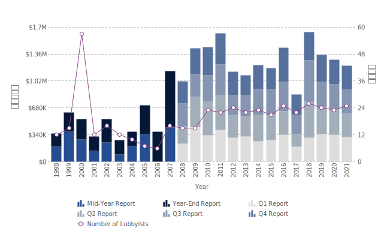

```{R, setup, include = F}
# devtools::install_github("dill/emoGG")
library(pacman)
p_load(
  broom, tidyverse,rmarkdown,
  ggplot2, ggthemes, ggforce, ggridges,
  latex2exp, viridis, extrafont, gridExtra,
  kableExtra, snakecase, janitor,
  data.table, dplyr, estimatr,
  lubridate, knitr, parallel,
  lfe,dslabs,
  here, magrittr,readxl, gapminder, Ecdat, wooldridge)

options(htmltools.dir.version = FALSE)

# Notes directory
dir_slides <- "/Users/zhouzhengqing/Desktop/SportsEconAnalysis/2024spring/Lec04/"
# Define pink color
red_pink <- "#e64173"
turquoise <- "#20B2AA"
orange <- "#FFA500"
red <- "#fb6107"
blue <- "#3b3b9a"
green <- "#8bb174"
grey_light <- "grey70"
grey_mid <- "grey50"
grey_dark <- "grey20"
purple <- "#6A5ACD"
slate <- "#314f4f"
met_slate <- "#272822" 

# Dark slate grey: #314f4f

# Knitr options
opts_chunk$set(
  comment = "#>",
  fig.align = "center",
  fig.height = 7,
  fig.width = 10.5,
  #dpi = 300,
  #cache = T,
  warning = F,
  message = F
)  
opts_chunk$set(dev = "svg")
options(device = function(file, width, height) {
  svg(tempfile(), width = width, height = height)
})
options(crayon.enabled = F)
options(knitr.table.format = "html")
# A blank theme for ggplot
theme_empty <- theme_bw() + theme(
  line = element_blank(),
  rect = element_blank(),
  strip.text = element_blank(),
  axis.text = element_blank(),
  plot.title = element_blank(),
  axis.title = element_blank(),
  plot.margin = structure(c(0, 0, -0.5, -1), unit = "lines", valid.unit = 3L, class = "unit"),
  legend.position = "none"
)
theme_simple <- theme_bw() + theme(
  axis.line = element_line(color = met_slate),
  panel.grid = element_blank(),
  rect = element_blank(),
  strip.text = element_blank(),
  text = element_text(family = "Fira Sans", color = met_slate, size = 17),
  # axis.text.x = element_text(size = 12),
  # axis.text.y = element_text(size = 12),
  axis.ticks = element_blank()
)
theme_axes_math <- theme_void() + theme(
  text = element_text(family = "MathJax_Math"),
  axis.title = element_text(size = 22),
  axis.title.x = element_text(hjust = .95, margin = margin(0.15, 0, 0, 0, unit = "lines")),
  axis.title.y = element_text(vjust = .95, margin = margin(0, 0.15, 0, 0, unit = "lines")),
  axis.line = element_line(
    color = "grey70",
    size = 0.25,
    arrow = arrow(angle = 30, length = unit(0.15, "inches")
  )),
  plot.margin = structure(c(1, 0, 1, 0), unit = "lines", valid.unit = 3L, class = "unit"),
  legend.position = "none"
)
theme_axes_serif <- theme_void() + theme(
  text = element_text(family = "MathJax_Main"),
  axis.title = element_text(size = 22),
  axis.title.x = element_text(hjust = .95, margin = margin(0.15, 0, 0, 0, unit = "lines")),
  axis.title.y = element_text(vjust = .95, margin = margin(0, 0.15, 0, 0, unit = "lines")),
  axis.line = element_line(
    color = "grey70",
    size = 0.25,
    arrow = arrow(angle = 30, length = unit(0.15, "inches")
  )),
  plot.margin = structure(c(1, 0, 1, 0), unit = "lines", valid.unit = 3L, class = "unit"),
  legend.position = "none"
)
theme_axes <- theme_void() + theme(
  text = element_text(family = "Fira Sans Book"),
  axis.title = element_text(size = 18),
  axis.title.x = element_text(hjust = .95, margin = margin(0.15, 0, 0, 0, unit = "lines")),
  axis.title.y = element_text(vjust = .95, margin = margin(0, 0.15, 0, 0, unit = "lines")),
  axis.line = element_line(
    color = grey_light,
    size = 0.25,
    arrow = arrow(angle = 30, length = unit(0.15, "inches")
  )),
  plot.margin = structure(c(1, 0, 1, 0), unit = "lines", valid.unit = 3L, class = "unit"),
  legend.position = "none"
)
theme_market <- theme_bw() + theme(
  axis.line = element_line(color = met_slate),
  panel.grid = element_blank(),
  rect = element_blank(),
  strip.text = element_blank(),
  text = element_text(family = cnfont, color = met_slate, size = 17),
  axis.title.x = element_text(hjust = 1, size = 17),
  axis.title.y = element_text(hjust = 1, angle = 0, size = 17),
  axis.ticks = element_blank()
)
theme_gif <- theme_bw() + theme(
  axis.line = element_line(color = met_slate),
  panel.grid = element_blank(),
  rect = element_blank(),
  text = element_text(family = cnfont, color = met_slate, size = 17),
  axis.text.x = element_text(size = 12),
  axis.text.y = element_text(size = 12),
  axis.ticks = element_blank()
)
theme_goods <- theme_bw() + theme(
  axis.line = element_line(),
  panel.grid = element_blank(),
  rect = element_rect(size = 1),
  strip.text = element_blank(),
  text = element_text(size = 17, family = cnfont), 
  axis.text.x = element_text(size = 17),
  axis.text.y = element_text(size = 17, angle = 90, hjust = 0.5),
  axis.title.x = element_text(color = purple, size = 19),
  axis.title.y = element_text(color = red_pink, size = 19),
  axis.ticks = element_blank(),
  plot.title = element_blank(),
  legend.position = "none"
)
theme_game <- theme_bw() + theme(
  axis.line = element_line(),
  panel.grid = element_blank(),
  rect = element_rect(size = 1),
  strip.text = element_blank(),
  text = element_text(size = 20, family = cnfont), 
  axis.text.x = element_text(size = 20, color = met_slate),
  axis.text.y = element_text(size = 20, angle = 90, color = met_slate, hjust = 0.5),
  axis.title.x = element_text(color = met_slate, size = 20),
  axis.title.y = element_text(color = met_slate, size = 20),
  axis.ticks = element_blank(),
  plot.title = element_blank(),
  legend.position = "none"
)
shift_axis <- function(p, y=0){
  g <- ggplotGrob(p)
  dummy <- data.frame(y=y)
  ax <- g[["grobs"]][g$layout$name == "axis-b"][[1]]
  p + annotation_custom(grid::grobTree(ax, vp = grid::viewport(y=1, height=sum(ax$height))), 
                        ymax=y, ymin=y) +
    geom_hline(aes(yintercept=y), data = dummy, size = 0.5, color = met_slate) +
    theme(axis.text.x = element_blank(), 
          axis.ticks.x = element_blank())
}
wrapper <- function(x, ...) paste(strwrap(x, ...), collapse = "\n")
# functions

demand <- function(x) 10 - x
demand_2 <- function(x) 9 - x
demand_3 <- function(x) 8 - x
demand_inc <- function(x) 11 - x
demand_dec <- function(x) 5 - x
supply <- function(x) 1 + (4/5)*x
step_demand <- tibble(x = c(0, 1, 2, 3, 4, 5, 6, 7, 8), mv = c(8, 7, 6, 5, 4, 3, 2, 1, 0))
step_demand2 <- tibble(x = c(0, 1, 2, 3, 4, 5, 6, 7, 8, 9, 10, 11, 12), mv = c(10, 10, 9, 9, 8, 8, 7, 7, 6, 6, 5, 4, 4))
step_supply <- tibble(x = c(0, 1, 2, 3, 4, 5, 6, 7, 8, 9, 10, 11, 12), mv = c(2, 2, 3, 3, 4, 4, 5, 5, 6, 6, 7, 8, 8))
step_supply_tax <- step_supply %>% 
  mutate(mv = mv + 2)

data <- read_csv("/Users/zhouzhengqing/Desktop/SportsEconAnalysis/Activity_Pit_Market/Results.csv") %>% 
  dplyr::filter(!is.na(price))

theme_set(theme_gray(base_size = 20))
# Column names for regression results
reg_columns <- c("Term", "Est.", "S.E.", "t stat.", "p-Value")
# Function for formatting p values
format_pvi <- function(pv) {
  return(ifelse(
    pv < 0.0001,
    "<0.0001",
    round(pv, 4) %>% format(scientific = F)
  ))
}
format_pv <- function(pvs) lapply(X = pvs, FUN = format_pvi) %>% unlist()
# Tidy regression results table
tidy_table <- function(x, terms, highlight_row = 1, highlight_color = "black", highlight_bold = T, digits = c(NA, 3, 3, 2, 5), title = NULL) {
  x %>%
    tidy() %>%
    select(1:5) %>%
    mutate(
      term = terms,
      p.value = p.value %>% format_pv()
    ) %>%
    kable(
      col.names = reg_columns,
      escape = F,
      digits = digits,
      caption = title
    ) %>%
    kable_styling(font_size = 20) %>%
    row_spec(1:nrow(tidy(x)), background = "white") %>%
    row_spec(highlight_row, bold = highlight_bold, color = highlight_color)
}

xaringanExtra::use_tile_view()
xaringanExtra::use_scribble()
xaringanExtra::use_animate_css()
xaringanExtra::use_fit_screen()
xaringanExtra::use_clipboard()


```
class: title-slide-section

### 体育市场为什么需要垄断？垄断对社会有好处么？

- 神经科学家：只要一提到**垄断**，大脑深处就会产生负面的联想，只有“死亡”和“谋杀”这类词才能与之相提并论
- 把垄断 → 独占，独买
- 广义上，把垄断看做卖方没有提供近似替代品的商品或服务的行业结构


---

class: title-slide-section,inverse, middle

# 垄断是商业价值的保证
---

.center[

]

???
如果说过去25年间最赚钱的行业，职业体育联盟这个古老的行业可以说占有一席之地。

为什么？最重要的是它垄断的特点。

---
### 职业体育联盟垄断来源

MLB(棒球)国家联盟是美国最古老的职业体育联盟，成立于1876年，被后来联盟一直相仿的最初的2个基本原则是职业联盟垄断势力的最初来源：

1. 领地权  →  区域门票市场的定价权；

2. 储备系统(reserve system)：球员合约到期后不能随意转会 → 劳动力市场中对劳动要素的完全定价权

为什么立法给与棒球反垄断豁免权?

---
### 领地权

.left[
.left[NBA]

]

.right[
.left[NHL]


]

---
### 领地权 → 独占与独买

在领地范围内：

简单的情况下，我们暂且先考虑只有一家的球队的**独占（monopoly）**  和 **独买monopsony**

- 这里的独占有时**并非简单指一家**厂商，若是厂商对产品的**定价权**有相当的支配能力，那么就符合独占厂商。eg：小岛麦当劳

---
class: title-slide-section,inverse, middle

# 独占厂商决策过程及其福利结果

---
### 独占厂商的需求函数

- 独占厂商的市场需求曲线并非水平，而是**整个市场**的需求曲线
- $x=p_{x}(x), x^{\prime}(p_x) < 0$ 和
$p_x=p_x(x),{p_{x}}^{\prime}<0$ 前者代表需求函数（自变量是门票销售量或比赛数量），后者代表反需求函数（自变量是第X场比赛的价格）
- 球队总收益为 $TR(x)=p_{x}x$ → $MR=\frac{dTR}{dx}=p_{x}+x \frac{dp_{x}}{dx}$ 
- 厂商依据MR=MC决策， $p_{x}+x \frac{dp_{x}}{dx}=MC$
- AR为 $p_{x}(x)$ → **就是市场(厂商)需求曲线**
- 那么MR该如何描述？假设需求函数为线性 $P_x=a-bx$ → $TR(x)=P_x \times x = a x-b x^2$ → $MR=a-2bx$ 

---
### 独占厂商的需求函数

独占厂商的需求曲线表示：**厂商可以用提高销量的办法提高市场价格，也可以用增加销量的办法来压低市场价格**
.pull-left[
.center[**独占厂商需求曲线**]
```{r, echo = FALSE, fig.height = 3.35, fig.width = 3.35, dev = "svg"}
demand <- function(x) 8 - 0.6*x
inv_demand <- function(x) (5/3)*(8 - x)
p_1 <- 7
p_2 <- 6
q_1 <- inv_demand(p_1) 
q_2 <- inv_demand(p_2)
ggplot(data = data.frame(x = 0), mapping = aes(x = x)) +
  scale_x_continuous(limits = c(0, 10.5), expand = c(0, 0), breaks = NULL) +
  scale_y_continuous(limits = c(0, 10.5), expand = c(0, 0), breaks = NULL) +
  theme_market +
  labs(x = "x", y = "$") +
  stat_function(fun = demand, color = red_pink, size = 1) +
  annotate("text", label = "D=AR", x = 8, y = 4.65, color = red_pink, family = cnfont, size =6) 
```
]
.pull-right[
.center[**完美竞争市场厂商需求曲线**]
```{r, echo = FALSE, fig.height = 3.35, fig.width = 3.35,  dev = "svg"}
ggplot(data = data.frame(x = 0), mapping = aes(x = x)) +
  scale_x_continuous(limits = c(0, 10.5), expand = c(0, 0), breaks = NULL) +
  scale_y_continuous(limits = c(0, 10.5), expand = c(0, 0), breaks = NULL) +
  theme_market +
  labs(x = "x", y = "$") +
  geom_hline(yintercept = 5, color = red_pink, size = 1) +
  annotate("text", label = "D=AR=MR", x = 8, y = 5.5, color = red_pink, family = cnfont, size = 6)
```
]

---
### 独占厂商根据MR=MC确定产量

.more-left[
```{r, echo = FALSE, fig.height = 5, fig.width = 5, dev = "svg"}
demand <- function(x) 10 - x
inv_demand <- function(x) 10 - x
marginal_revenue <- function(x) 10 - 2*x

ggplot(data = data.frame(x = 0), mapping = aes(x = x)) +
  scale_x_continuous(limits = c(0, 10.5), expand = c(0, 0), breaks = seq(0, 10, 1)) +
  scale_y_continuous(limits = c(0, 10.5), expand = c(0, 0), breaks = seq(0, 10, 1)) +
  theme_market +
  labs(x = "x", y = "$") +
  stat_function(fun = demand, color = red_pink, size = 1) +
  stat_function(fun = marginal_revenue, color = green, size = 1) +
  annotate("text", label = "D=AR", x = 8, y = 3.65, color = red_pink, family = cnfont, size = 9) +
  annotate("text", label = "MR", x = 5.5, y = 0.65, color = green, family = cnfont, size = 9) 
```
]

.less-right[
$MR=\frac{dTR}{dx}=p_{x}+x \frac{dp_{x}}{dx}$

当 $p_x=a-bx$ 时， $TR(x)=ax-bx^2$ → $MR=a-2bx$

根据两种效应的比较得知，独占厂商的MR可以为正也可以为负
]

---
### 独占厂商根据MR=MC确定产量

.more-left[
```{r, echo = FALSE, fig.height = 5, fig.width = 5, dev = "svg"}
x <- seq(0, 8, 0.1)
atc <- function(x) (20 + 12*x - 2*x^2 + (2/3)*x^3)/x
marginal_cost <- function(x) 12 - 4*x + 2*x^2
demand <- function(x) 37 - 5*x
marginal_revenue <- function(x) 37 - 10*x
q <- uniroot(function(x) marginal_revenue(x) - marginal_cost(x), range(x))$root
not_p <- marginal_revenue(q)
p <- demand(q)
cost <- atc(q)
z <- seq(0, q, 0.001)

p_max_1 <- ggplot() +
  scale_x_continuous(limits = c(0, 7.5), expand=c(0,0), breaks = c(q), labels = c(4)) +
  scale_y_continuous(limits = c(0, 37.5), expand=c(0,0), breaks = c(cost, p), labels = c(10, 16)) +
  theme_market +
  labs(x = "Q", y = "$") +
  stat_function( fun = atc, color = orange, size = 1) +
  annotate("text", label = "ATC", x = 6.5, y = 35, color = orange, family = cnfont, size = 9) +
  stat_function( fun = marginal_cost, color = purple, size = 1) +
  annotate("text", label = "MC", x = 1, y = 8, color = purple, family = cnfont, size = 9)
p_max_1
```
]

.less-right[

独占厂商如何实现利润最大化？（思考：为什么MC是这个形状）

]

---
count: false
### 独占厂商根据MR=MC确定产量

.more-left[
```{r, echo = FALSE, fig.height = 5, fig.width = 5, dev = "svg"}
p_max_1
```
]

.less-right[

独占厂商如何实现利润最大化？（思考：为什么MC是这个形状）

.pink[A: ] 2个步骤

- **第1步:** .pink[在 MR .mono[=] MC 处将产量配给到 Q.sub[M].]

]

---
count: false
### 独占厂商根据MR=MC确定产量

.more-left[
```{r, echo = FALSE, fig.height = 5, fig.width = 5, dev = "svg"}
p_max_1 <- p_max_1 +
  stat_function( fun = demand, color = red_pink, size = 1) +
  stat_function( fun = marginal_revenue, color = green, size = 1) +
  annotate("text", label = "D=AR", x = 6, y = 9.65, color = red_pink, family = cnfont, size = 7) +
  annotate("text", label = "MR", x = 3.5, y = 8, color = green, family = cnfont, size = 9)
p_max_1
```
]

.less-right[

独占厂商如何实现利润最大化？（思考：为什么MC是这个形状）

.pink[A: ] 2个步骤

- **第1步:** .pink[在 MR .mono[=] MC 处将产量配给到 Q.sub[M].]

]

---
count: false
### 独占厂商根据MR=MC确定产量

.more-left[
```{r, echo = FALSE, fig.height = 5, fig.width = 5, dev = "svg"}
p_max_1 <- p_max_1 +
  geom_point(aes(x = q, y = not_p), color = met_slate, size = 2) +
  geom_segment(aes(x = q, xend = q, y = 0, yend = not_p), color = met_slate, linetype = "dashed", size = 1)
p_max_1
```
]

.less-right[

独占厂商如何实现利润最大化？（思考：为什么MC是这个形状）

.pink[A: ] 2个步骤

- **第1步:** .pink[在 MR .mono[=] MC 处将产量配给到 Q.sub[M].]

]

---
count: false
### 独占厂商根据MR=MC确定产量

.more-left[
```{r, echo = FALSE, fig.height = 5, fig.width = 5, dev = "svg"}
p_max_1
```
]

.less-right[

独占厂商如何实现利润最大化？（思考：为什么MC是这个形状）

.pink[A: ] 2个步骤

- **第1步:** .pink[在 MR .mono[=] MC 处将产量配给到 Q.sub[M]. ]

- **第2步:** .pink[根据需求决定价格 P.sub[M] .]

]

---
count: false
### 独占厂商根据MR=MC确定产量

.more-left[
```{r, echo = FALSE, fig.height = 5, fig.width = 5, dev = "svg"}
p_max_1 <- p_max_1 +
  geom_point(aes(x = q, y = p), color = met_slate, size = 2) +
  geom_segment(aes(x = q, xend = q, y = not_p, yend = p), color = met_slate, linetype = "dashed", size = 1)
p_max_1
```
]

.less-right[

独占厂商如何实现利润最大化？（思考：为什么MC是这个形状）

.pink[A: ] 2个步骤

- **第1步:** .pink[在 MR .mono[=] MC 处将产量配给到 Q.sub[M]. ]

- **第2步:** .pink[根据需求决定价格 P.sub[M] .]

]

---
count: false
### 独占厂商根据MR=MC确定产量

.more-left[
```{r, echo = FALSE, fig.height = 5, fig.width = 5, dev = "svg"}
p_max_1 <- p_max_1 +
  geom_segment(aes(x = 0, xend = q, y = p, yend = p), color = met_slate, linetype = "dashed", size = 1)
p_max_1
```
]

.less-right[

独占厂商如何实现利润最大化？（思考：为什么MC是这个形状）

.pink[A: ] 2个步骤

- **第1步:** .pink[在 MR .mono[=] MC 处将产量配给到 Q.sub[M]. ]

- **第2步:** .pink[根据需求决定价格 P.sub[M] .]

]

---
count: false
### 独占厂商根据MR=MC确定产量

.more-left[
```{r, echo = FALSE, fig.height = 5, fig.width = 5, dev = "svg"}
p_max_1
```
]

.less-right[

独占厂商如何实现利润最大化？（思考：为什么MC是这个形状）

.pink[A: ] 2个步骤

- **第1步:** .pink[在 MR .mono[=] MC 处将产量配给到 Q.sub[M]. ]

- **第2步:** .pink[根据需求决定价格 P.sub[M] .]

利润 .mono[=] (P.sub[M] .mono[-] ATC) &times; Q.sub[M]
]

---
count: false
### 独占厂商根据MR=MC确定产量

.more-left[
```{r, echo = FALSE, fig.height = 5, fig.width = 5, dev = "svg"}
p_max_1 <- p_max_1 +
  geom_point(aes(x = q, y = cost), color = met_slate, size = 2) +
  geom_segment(aes(x = 0, xend = q, y = cost, yend = cost), color = met_slate, linetype = "dashed", size = 1)
p_max_1
```
]

.less-right[

独占厂商如何实现利润最大化？（思考：为什么MC是这个形状）

.pink[A: ] 2个步骤

- **第1步:** .pink[在 MR .mono[=] MC 处将产量配给到 Q.sub[M]. ]

- **第2步:** .pink[根据需求决定价格 P.sub[M] .]

利润 .mono[=] (P.sub[M] .mono[-] ATC) &times; Q.sub[M] <br>  .mono[=] ($16 .mono[-] $10) &times; 4
]

---
count: false
### 独占厂商根据MR=MC确定产量

.more-left[
```{r, echo = FALSE, fig.height = 5, fig.width = 5, dev = "svg"}
p_max_1 <- p_max_1 +
  geom_ribbon(aes(x = z, ymin = cost, ymax = p), fill = green, alpha = 0.2, linetype = "blank") +
  annotate("text", label = "利润", x = q/3, y = (p + cost)/2, color = green, family = cnfont, size = 6) 
p_max_1
```
]

.less-right[

独占厂商如何实现利润最大化？（思考：为什么MC是这个形状）

.pink[A: ] 2个步骤

- **第1步:** .pink[在 MR .mono[=] MC 处将产量配给到 Q.sub[M]. ]

- **第2步:** .pink[根据需求决定价格 P.sub[M] .]

利润 .mono[=] (P.sub[M] .mono[-] ATC) &times; Q.sub[M] <br>  .mono[=] ($16 .mono[-] $10) &times; 4 <br>  .mono[=] $24.
]

---
### 独占厂商没有供给曲线

- 对于完全竞争厂商来说，价格是外生变量。但对于独占厂商来
说，价格是**内生变量**。在决定价格的同时，也决定了产量 <br>→ 故在 P—Q平面上仅有一个点，所以独占厂商不存在供给曲线


---
### 完全竞争与独占的比较

.pull-left[
.center[**完全竞争市场**]
```{r, echo = FALSE, fig.height = 4.75, fig.width = 3.75,  dev = "svg"}
x <- 0:10
demand <- function(x) 10 - x
supply <- function(x) 1 + x

q <- uniroot(function(x) demand(x) - supply(x), range(x))$root
p <- demand(q)

ggplot(data = data.frame(x = 0), mapping = aes(x = x)) +
  scale_x_continuous(limits = c(0, 10.5), expand = c(0, 0), breaks = c(q), labels = c(expression(Q[C]))) +
  scale_y_continuous(limits = c(0, 10.5), expand = c(0, 0), breaks = c(p), labels = c(expression(P[C]))) +
  theme_market +
  labs(x = "x", y = "$") +
  stat_function(fun = demand, color = red_pink, size = 1) +
  stat_function(fun = supply, color = purple, size = 1) +
  geom_point(x = q, y = p, color = met_slate, size = 2) +
  geom_segment(x = 0, xend = q, y = p, yend = p, color = met_slate, linetype = "dashed", size = 1) +
  geom_segment(x = q, xend = q, y = 0, yend = p, color = met_slate, linetype = "dashed", size = 1) +
  annotate("text", label = "D", x = 10.1, y = 0.65, color = red_pink, family = cnfont, size = 9) +
  annotate("text", label = "S", x = 9.3, y = 9.65, color = purple, family = cnfont, size = 9)
```
]

---
count: false
### 完全竞争与独占的比较
.pull-left[
.center[**完全竞争市场**]
```{r, echo = FALSE, fig.height = 4.75, fig.width = 3.75,  dev = "svg"}
x <- 0:10
demand <- function(x) 10 - x
supply <- function(x) 1 + x

q <- uniroot(function(x) demand(x) - supply(x), range(x))$root
p <- demand(q)

ggplot(data = data.frame(x = 0), mapping = aes(x = x)) +
  scale_x_continuous(limits = c(0, 10.5), expand = c(0, 0), breaks = c(q), labels = c(expression(Q[C]))) +
  scale_y_continuous(limits = c(0, 10.5), expand = c(0, 0), breaks = c(p), labels = c(expression(P[C]))) +
  theme_market +
  labs(x = "x", y = "$") +
  stat_function(fun = demand, color = red_pink, size = 1) +
  stat_function(fun = supply, color = purple, size = 1) +
  geom_point(x = q, y = p, color = met_slate, size = 2) +
  geom_segment(x = 0, xend = q, y = p, yend = p, color = met_slate, linetype = "dashed", size = 1) +
  geom_segment(x = q, xend = 10.5, y = p, yend = p, color = met_slate, linetype = "dashed", size = 1) +
  geom_segment(x = q, xend = q, y = 0, yend = p, color = met_slate, linetype = "dashed", size = 1) +
  annotate("text", label = "D", x = 10.1, y = 0.65, color = red_pink, family = cnfont, size = 9) +
  annotate("text", label = "S", x = 9.3, y = 9.65, color = purple, family = cnfont, size = 9)
```
]

.pull-right[
.center[**独占**]
```{r, echo = FALSE, fig.height = 4.75, fig.width = 3.75, dev = "svg"}
x <- 0:10
marginal_cost <- function(x) 1 + x
demand <- function(x) 10 - x
marginal_revenue <- function(x) 10 - 2*x
q <- uniroot(function(x) marginal_revenue(x) - marginal_cost(x), range(x))$root
not_p <- marginal_revenue(q)
p <- demand(q)
q_c <- uniroot(function(x) demand(x) - supply(x), range(x))$root
p_c <- demand(q_c)

ggplot() +
  scale_x_continuous(limits = c(0, 10.5), expand = c(0, 0), breaks = c(q, q_c), labels = c(expression(Q[M]), expression(Q[C]))) +
  scale_y_continuous(limits = c(0, 10.5), expand = c(0, 0), breaks = c(p_c, p), labels = c(expression(P[C]), expression(P[M]))) +
  theme_market +
  labs(x = "x", y = "$") +
  stat_function( fun = marginal_cost, color = purple, size = 1) +
  annotate("text", label = "MC", x = 9.75, y = 9.65, color = purple, family = cnfont, size = 9) +
  stat_function( fun = demand, color = red_pink, size = 1) +
  stat_function( fun = marginal_revenue, color = green, size = 1) +
  annotate("text", label = "D", x = 10.1, y = 0.65, color = red_pink, family = cnfont, size = 9) +
  annotate("text", label = "MR", x = 5.75, y = 0.65, color = green, family = cnfont, size = 9) +
  geom_point(aes(x = q_c, y = p_c), color = met_slate, size = 2) +
  geom_segment(aes(x = 0, xend = q_c, y = p_c, yend = p_c), color = met_slate, linetype = "dashed", size = 1) +
  geom_segment(aes(x = q_c, xend = q_c, y = 0, yend = p_c), color = met_slate, linetype = "dashed", size = 1) +
  geom_point(aes(x = q, y = p), color = met_slate, size = 2) +
  geom_point(aes(x = q, y = not_p), color = met_slate, size = 2) +
  geom_segment(aes(x = q, xend = q, y = 0, yend = p), color = met_slate, linetype = "dashed", size = 1) +
  geom_segment(aes(x = 0, xend = q, y = p, yend = p), color = met_slate, linetype = "dashed", size = 1)
```
]

---
### 完全竞争与独占的比较

.pull-left[
#### .purple[完全竞争市场]

1. .purple.hi[许多]厂商

2. .purple.hi[没有]厂商能够赚取.purple.hi[长期**经济利润**].

3. 每个厂商都是.purple.hi[价格接受者] <br> .mono[-->] 没有市场势力!

4. 每个厂商都生产.purple.hi[有效率的]产量 <br> .mono[-->] P .mono[=] MC 时
]

--

.pull-right[
#### .pink[独占]

1. .pink.hi[唯一]厂商.

2. 独占厂商能够赚取.pink.hi[长期**经济利润**].

3. 独占厂商.pink.hi[价格制定者] <br> .mono[-->] 显著的市场势力!

4. 独占厂商生产.pink.hi[无效率的]产量 <br> .mono[-->]  P .mono[>] MC
]


---
class: title-slide-section,inverse, middle
# 独占的福利损失

---
### 独占和福利结果

.more-left[
```{r, echo = FALSE, fig.height = 5, fig.width = 5, dev = "svg"}
x <- 0:10
marginal_cost <- function(x) 1 + x
demand <- function(x) 10 - x
marginal_revenue <- function(x) 10 - 2*x
q <- uniroot(function(x) marginal_revenue(x) - marginal_cost(x), range(x))$root
not_p <- marginal_revenue(q)
p <- demand(q)
q_c <- uniroot(function(x) demand(x) - supply(x), range(x))$root
p_c <- demand(q_c)
w <- seq(0, q, 0.01)
w_2 <- seq(q, q_c, 0.01)

ggplot() +
  scale_x_continuous(limits = c(0, 10.5), expand = c(0, 0), breaks = c(q, q_c), labels = c(expression(Q[M]), expression(Q[C]))) +
  scale_y_continuous(limits = c(0, 10.5), expand = c(0, 0), breaks = c(p_c, p), labels = c(expression(P[C]), expression(P[M]))) +
  theme_market +
  labs(x = "x", y = "$") +
  stat_function(fun = marginal_cost, color = purple, size = 1) +
  annotate("text", label = "MC", x = 9.75, y = 9.65, color = purple, family = cnfont, size = 9) +
  stat_function(fun = demand, color = red_pink, size = 1) +
  stat_function(fun = marginal_revenue, color = green, size = 1) +
  annotate("text", label = "D", x = 10.1, y = 0.65, color = red_pink, family = cnfont, size = 9) +
  annotate("text", label = "MR", x = 5.75, y = 0.65, color = green, family = cnfont, size = 9) +
  geom_point(aes(x = q_c, y = p_c), color = met_slate, size = 2) +
  geom_segment(aes(x = 0, xend = q_c, y = p_c, yend = p_c), color = met_slate, linetype = "dashed", size = 1) +
  geom_segment(aes(x = q_c, xend = q_c, y = 0, yend = p_c), color = met_slate, linetype = "dashed", size = 1) +
  geom_point(aes(x = q, y = p), color = met_slate, size = 2) +
  geom_point(aes(x = q, y = not_p), color = met_slate, size = 2) +
  geom_segment(aes(x = q, xend = q, y = 0, yend = p), color = met_slate, linetype = "dashed", size = 1) +
  geom_segment(aes(x = 0, xend = q, y = p, yend = p), color = met_slate, linetype = "dashed", size = 1) +
  
  geom_ribbon(aes(x = w, ymin = marginal_cost(w), ymax = p), fill = purple, alpha = 0.2, linetype = "blank") + # PS
  annotate("text", label = "PS", x = q/4, y = p_c - 0.5, color = purple, family = cnfont, size = 5) +
  geom_ribbon(aes(x = w, ymin = p, ymax = demand(w)), fill = red_pink, alpha = 0.2, linetype = "blank") + # CS
  annotate("text", label = "CS", x = q/4, y = p + 0.5, color = red_pink, family = cnfont, size = 5) +
  geom_ribbon(aes(x = w_2, ymin = supply(w_2), ymax = p_c), fill = orange, alpha = 0.2, linetype = "blank") +
  geom_ribbon(aes(x = w_2, ymin = p_c, ymax = demand(w_2)), fill = orange, alpha = 0.2, linetype = "blank") +
  annotate("text", label = "DWL", x = (q + q_c)/2 - 0.18, y = p_c + 0.3, color = orange, family = cnfont, size = 5)
```
]

.less-right[

### 无效率

独占厂商未能实现市场总盈余的最大化

- Q.sub[M] .mono[<] Q.sub[C] .mono[==>]  .orange[无谓损失 (deadweight loss)]

]

---
### 独占和福利结果

.more-left[
```{r, echo = FALSE, fig.height = 5, fig.width = 5, dev = "svg"}
x <- 0:10
marginal_cost <- function(x) 1 + x
demand <- function(x) 10 - x
marginal_revenue <- function(x) 10 - 2*x
q <- uniroot(function(x) marginal_revenue(x) - marginal_cost(x), range(x))$root
not_p <- marginal_revenue(q)
p <- demand(q)
q_c <- uniroot(function(x) demand(x) - supply(x), range(x))$root
p_c <- demand(q_c)
w <- seq(0, q, 0.01)
w_2 <- seq(q, q_c, 0.01)

ggplot() +
  scale_x_continuous(limits = c(0, 10.5), expand = c(0, 0), breaks = c(q, q_c), labels = c(expression(Q[M]), expression(Q[C]))) +
  scale_y_continuous(limits = c(0, 10.5), expand = c(0, 0), breaks = c(p_c, p), labels = c(expression(P[C]), expression(P[M]))) +
  theme_market +
  labs(x = "x", y = "$") +
  stat_function(fun = marginal_cost, color = purple, size = 1) +
  annotate("text", label = "MC", x = 9.75, y = 9.65, color = purple, family = cnfont, size = 9) +
  stat_function(fun = demand, color = red_pink, size = 1) +
  stat_function(fun = marginal_revenue, color = green, size = 1) +
  annotate("text", label = "D", x = 10.1, y = 0.65, color = red_pink, family = cnfont, size = 9) +
  annotate("text", label = "MR", x = 5.75, y = 0.65, color = green, family = cnfont, size = 9) +
  geom_point(aes(x = q_c, y = p_c), color = met_slate, size = 2) +
  geom_segment(aes(x = 0, xend = q_c, y = p_c, yend = p_c), color = met_slate, linetype = "dashed", size = 1) +
  geom_segment(aes(x = q_c, xend = q_c, y = 0, yend = p_c), color = met_slate, linetype = "dashed", size = 1) +
  geom_point(aes(x = q, y = p), color = met_slate, size = 2) +
  geom_point(aes(x = q, y = not_p), color = met_slate, size = 2) +
  geom_segment(aes(x = q, xend = q, y = 0, yend = p), color = met_slate, linetype = "dashed", size = 1) +
  geom_segment(aes(x = 0, xend = q, y = p, yend = p), color = met_slate, linetype = "dashed", size = 1) +
  geom_rect(aes(xmin = 0, xmax = q, ymin = p_c, ymax = p), alpha = 0.2, fill = purple) +
  geom_ribbon(aes(x = w_2, ymin = supply(w_2), ymax = p_c), fill = orange, alpha = 0.2, linetype = "blank") +
  geom_ribbon(aes(x = w_2, ymin = p_c, ymax = demand(w_2)), fill = orange, alpha = 0.2, linetype = "blank") +
  annotate("text", label = "DWL", x = (q + q_c)/2 - 0.18, y = p_c + 0.3, color = orange, family = cnfont, size = 5)
```
]

.less-right[

### 无效率

独占厂商未能实现市场总盈余的最大化

- Q.sub[M] .mono[<] Q.sub[C] .mono[==>]  .orange[无谓损失 (deadweight loss)]

独占厂商.purple[减少了]消费者的盈余

]

???

那么这部分在现实中代表什么呢?

- **如果紫色部分从消费者手中转移到球队，就变成了超额利润**。虽然可能会伤害支付这些费用的消费者，但这部分利益会使接受它们的球队的股东、雇员和其他利益相关者受益。由于社会整体福利没有变化，所以从经济效率角度看这部分对社会是**无害的**。

- 独占的弊端是**额外损失或叫无谓损失**，因为减少社会的整体福利。

???

那么这部分在现实中代表什么呢?

- **如果紫色部分从消费者手中转移到球队，就变成了超额利润**。虽然可能会伤害支付这些费用的消费者，但这部分利益会使接受它们的球队的股东、雇员和其他利益相关者受益。由于社会整体福利没有变化，所以从经济效率角度看这部分对社会是**无害的**

- 垄断的弊端是**额外损失或叫无谓损失**，因为减少社会的整体福利


---
### 独占和福利结果

#### 消费者可选择的变少了

垄断者没有激励去竞争客户

- **结果:** 产品线更少 .mono[+] 产品质量较低

- **例子:** 奥运产品特许经营


---
### 更大的损害
#### 寻租 rent seeking

- 经济学家William J. Baumol 1982年提出了一个经济概念：直接非生产性逐利活动（Directly Unproductive Profit-seeking activities，DUP）
- 指的是那些无助于提高生产力或经济增长，但为了增加利润而进行的经济活动
- DUP活动常见包括了**寻租、游说以及其他合法或非法的尝试**，普遍存在于受到**政府干预**的市场中(价格管制或进口限额)
- DUP表明虽然一些经济活动可能会产生经济效益，但对整体经济可能是浪费或是有害 → 真正的损失可能是**大于**无谓损失的

---
.center[

]

???

.tiny[
上图显示2021年NFL花了超过120万美元游说国会
]


---
### 联盟的规模控制

.center[


]

.tiny[
- 联盟决定了球队所能去城市
- 联盟会严格限制球队数量
  - 新球队加入要缴纳"入场费"，因为联盟的共享收入会分给更多成员
  - 降低现有成员与所在城市的谈判权（威胁搬迁作为谈判筹码）。
- 十个最大的都市区中的每一个都有几家职业特许经营公司
- NY,11 .hi.mono[>] LA,9 .hi.mono[>] CHI,7

]


---
### 讨论1: 联盟为什么会限制规模?

.center[

]


---
### 进入壁垒 entry barrier 产生市场势力 market power

- 进入壁垒是组织潜在的竞争对手进入市场的障碍，通常会产生两种类型的市场势力：**法定市场势力**和**自然市场势力**

#### 法定市场势力legal market power：当企业不是通过自身而是通过政府设置的进入壁垒而获得市场势力时，就拥有了法定市场势力

1. 专利 patent（针对想法和发明）和版权copyright（针对表达方式）  → 独角兽企业
  - 专利授予企业独家生产和销售商品或服务的权利
  - 版权是政府授予文学或艺术作品创作者的专有权 → >10年
  - **权衡取舍** 短期牺牲福利 v.s. 竞标激励（**赢家通吃**）
  - 如赛事转播权、疫苗等
2. 政府特许授权
  - 政府发放许可**寻求**行业垄断；**理由是** 追求规模经济或减少竞争带来的负外部性
  - 如联盟进入、烟草公司等

---
### 进入壁垒 entry barrier 产生市场势力 market power
#### 自然市场势力nature market power：当企业通过自身创造的进入壁垒而获得市场势力，主要两个来源：
1. **控制关键资源**key resources
  - 技术\核心区位\资本
  - 个人专长personal expertise：如NCAA，几乎是最重要的球员晋升职业通道
  - 吸引最大数量的消费者：当商品的价值随着越来越多的消费者使用它而增加时，就出出现**网络外部性**network externalities

2. **规模经济** economies of scale
  - 自然垄断nature monopoly：前期建设需要巨大的固定成本，一旦进入后边际成本较低 →
随着时间推移与使用者增加，成本分摊给更多的用户 → 经济意义上出现了对于相关产出区间内具有规模经济 → 
"旧吃新"的趋势：如早期大都会区的私人球场 → 运营成本开支

---
### 网络外部性与规模经济的差别

- 前者是源于消费者规模致的消费者效用增加

- 后者在于平均成本随着用户规模或者产出数量递增而减少

- 如平台公司、操作系统和通讯网路等行业具有双重性

---
### 练习(10')：术语解释

- Licensing 
- Franchising
- Exclusive right
.hi[https://www.wallstreetmojo.com/licensing-vs-franchising/
]

问题：三者之间的区别是什么?

---
###  讨论2：球队在版图内是独占，那么联盟是什么?

--

- Neal(1964)：职业联盟是一种**多工厂独占**（multiplant monopolist）
  - 每个球队在行政区域内是独占的，可以单独出售的门票(联盟是可分割的)
  - 整个联盟在国家范围内是**联合独占**的
- 问题是每个球队(子工厂)生产技术不完全相同，那么联盟的边际成本该如何确定？
- 假设 $x_1,x_2$ 分别是第1家和第2家球队的比赛数量，联盟一共要完成100单位比赛
- 联盟面临的总体需求函数不变→边际收益确定
- 初始时 $x_1=50,x_2=50,x=x_1+x_2=100$ ，但此时 $MC_1=8>MC_2=3$ ，那么联盟**集体决策可**以让第1家球队减少1单位产生进而节省8元成本，而增加第2家球队增加1单位产出只需投入3元，因此只要将x产量由第1家转移到第2家生产就可以节省5元成本，而保持总产量不变
- 下一阶段 $x_1=49,x_2=51,x=x_1+x_2=100$ ，倘若此时 $MC_1>MC_2$ 时，仍可以采取之前生产配给方式以维持总产量
- 一直到 $MR=MC_1=MC_2$

---
### 多工厂的职业联盟


---

class: title-slide-section,inverse, middle

# 应用：为什么真实票价没有那么高?

---
### 如何测量市场独占程度：勒纳指数 Lerner index

- 1934年经济学家勒纳就出了一个衡量厂商在市场上独占力的指数
-  $MR(x)= p_x (1-\frac{1}{\varepsilon_d})$ 和 **MR=MC**
<br>→ $L=\frac{p_x-MC}{p_x}=\frac{1}{\varepsilon_d}$
- 将勒纳指数改写，就是独占厂商定价遵循的**逆弹性价格法则**(Inverse Elasticity Pricing Rule , IEPR)：<br> $p_x=\frac{M C(x)}{1-\frac{1}{\varepsilon_d}}$ 


---
### 异象：球队门票市场的需求价格单位弹性

.center[

]

.tiny[
- 当球队收取100元的价格时，它会产生等于面积 BCG 的无谓损失。消费者剩余从竞争定价下的 ACE 下降到 ABF
- MC在哪里？
- 回忆**独占厂商在富有弹性的需求曲线出生产**。当MC=0时，也有MR=0，这意味着需求弹性必然为1，因此**B点处于单位需求弹性位置**
]

---
### 经验证据：门票的非弹性需求


???
尽管人们普遍批评职业球队收费过高，但体育经济学家经常发现，球迷支付的价格要低于能使球队利润最大化的价格。

事实上，从文献中可以看出，体育赛事的票价经常在需求的无弹性范围内定价


---
### 体育经济学家的解释

- 原因1：球队依然是利润最大化目标，只是不仅仅依靠门票收入，而是可以在多种收入选择下进行选择（El-Hodir and Quirk,1974; Heilmann and Wendling,1976）;Zimbalist(1992)认为门票收入可能与特许权收益(concession revenues)

- 原因2：球迷是忠诚的，因此有成瘾或者习惯性(addictive or habitual)消费，在一个**动态模型**中，在长期利润最大化目标下，短期球队可以将MR设置在MC以下(Ahn and Lee, 2003)

- 原因3：球队是**体育人(sportsman)**，因此不是利润最大化而是效用(utility)最大化(DeGennaro, 2003; Ferguson, Stewart, Jones, & Dressay, 1991; Sloane, 1971) → 问题是效用是难以进行实证检验的

---
### 是否有其他的解释：一种潜在的可能是通过周边商品变向抬高票价(建模)

- Berri 和 Krautmann(2016)发现，若是以球迷成本指数（Fan Cost Index，FCI）来计算门票价格，要高出实际门票价格
- FCI计算的是一家4口所持有的平均门票价格，再家两杯啤酒，四瓶软饮料，四个热狗，停车位和两顶帽子
- 作者以2004年MLB为例，联盟的平均FCI为155.52美元，而平均票价为19.82美元。因此，边际特许权收益为：19.82美元乘以4（=79.28美元），再从155.52美元中减去（=76.24美元）；然后再除以4（=19.06美元）来计算
- 以2016年为例，NFL的平均票价约为93美元，但FCI高于500美元
- 2021年，NFL平均票价107.5美元，+2.5 pct /较2020年；FCI高达568.18美元，+2.8 pct /较2020年
- 球队牺牲了一些上座率的收入，但它从特许经营中获得的利润足以弥补这一损失
---

-  $TR=R^{Gates}(x)+R^{Concessions}(x)+R^{Revenue\_ Sharing}+R^{Broadcast}$ ; $T C=m+c \cdot x$
-  $x=a-bp_x$
-  $R^{Gates}=[\frac{a}{b} x-\frac{1}{b} x^2]$ → $MR^{Gates}=[\frac{a}{b}-\frac{2}{b} x]$
-  $R^{Concessions}=g \cdot x$ → ${MR}^{Concessions}={g}$ 
-  $MR^{Gates}+M R^{Concessions}=MC$
- 假如没有特许权销售时, $MR^{Gates}=[\frac{a}{b}-\frac{2}{b} x]=MC=c$  →  $\begin{aligned} x^{Gates} & =[\frac{a}{2}-\frac{b c}{2}] \\ p_x^{Gates} & =[\frac{a}{2 b}+\frac{c}{2}]\end{aligned}$
- 假如考虑特许权销售后,
$MR^{Concessions}=(c-g)$  →  $\begin{aligned} & x^*=[\frac{a}{2}-\frac{b c}{2}]+\frac{b g}{2}=x^{Gates}+\frac{b g}{2} \\ & p_x^*=[\frac{a}{2 b}+\frac{c}{2}]-\frac{g}{2}=p_x^{Gates}-\frac{g}{2}\end{aligned}$ 
- 箭头左边强调了作者的观点。如果c<g，那么门票价格在MR<0时决定，因此会观察到无弹性的票价。如果c=0，同样MR是负数，得到了利润最大模型的变体。<br>**意味着收入最大化的所有者会将票价设定在需求的无弹性范围内(而不是单位弹性)**

---


???
.tiny[
- 作者估计了1992年至2004年BIG 4的 $\widehat {MR}^{Concessions}= \hat g$ 以及 $p_x^* = p_x^{Gates} - g/2$
- 发现是MLB的实际票价 $p_x^*$ 只有其他三项运动的三分之一左右
-  $\hat g$ 平均在17(MLB) ，而NFL在21左右。假设得到的是准确的 $p_x^*$ ，就可以估计出 $\frac{p_x^{Gates}}{p_x^*}$  
- 在MLB中 $p_x^{Gates}$ 比 $p_x^{*}$ 多 57% ，其他运动实际多25%
- 当然，如果没有关于需求和成本函数的更多信息，就不可能说这意味着在 $p_x^**$ 的需求是有弹性的还是无弹性的。然而，考虑到这种程度的差异，无弹性的票价不应该是那么令人惊讶
]


---
### 案例：R&D 与 世博会 

**Tradeoff:** Market power *vs.* innovation.一方面，垄断导致无谓损失而无法实现社会剩余最大化；另一方面，如果不给创新者保护，社会就不会从新产品和服务中受益，因为利润可能无法刺激创新 → 究竟应该有多少创新实在专利和版权保护的激励下产生的？
- 1851 年世博会吸引了 600w 名游客，有来自 40 个国家的 1.7w 名发明家。如果看完每一件展品，需走仅 30 公里
- 当时各国的专利法差别很大，当时**发明家在本国以外的地区为发明申请专利非常困难** → 指南手册中的信息就成为检验专利法对于创新是否有必要的完美工具
- 结果：那些缺少严格专利法的国家的发明家，会集中在**科学仪器和食品加工**等难以复制的发明上，因为可以轻易隐藏生产技术，保住发明秘密；相比之下，来自拥有强大专利保护国家的发明家为***制造机器和其他机械**提供创新，部分因为这些创新容易模仿（双向）
- 启发：**为不易保密的创新提供专利**（生物制药、运动仿生等）；长远看，**过度保护可能会阻碍创新**。为什么？
- 新的证据显示：企业面临的竞争水平与企业所产生的创新数量的关系表明，创新并不是由完全竞争企业或垄断企业所驱动，那些介于两者之间的企业推动技术表现最佳


