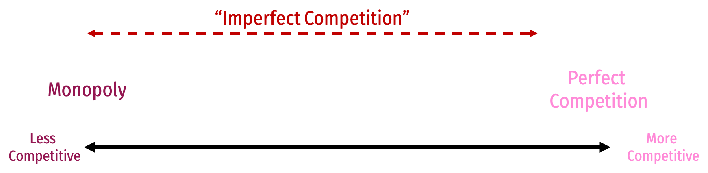

```{R, setup, include = F}
# devtools::install_github("dill/emoGG")
library(pacman)
p_load(
  broom, tidyverse,rmarkdown,
  ggplot2, ggthemes, ggforce, ggridges,
  latex2exp, viridis, extrafont, gridExtra,
  kableExtra, snakecase, janitor,
  data.table, dplyr, estimatr,
  lubridate, knitr, parallel,
  lfe,dslabs,
  here, magrittr,readxl, gapminder, Ecdat, wooldridge)

options(htmltools.dir.version = FALSE)

# Notes directory
dir_slides <- "/Users/zhouzhengqing/Desktop/SportsEconAnalysis/2024spring/Lec05/"
# Define pink color
red_pink <- "#e64173"
turquoise <- "#20B2AA"
orange <- "#FFA500"
red <- "#fb6107"
blue <- "#3b3b9a"
green <- "#8bb174"
grey_light <- "grey70"
grey_mid <- "grey50"
grey_dark <- "grey20"
purple <- "#6A5ACD"
slate <- "#314f4f"
met_slate <- "#272822" 

# Dark slate grey: #314f4f

# Knitr options
opts_chunk$set(
  comment = "#>",
  fig.align = "center",
  fig.height = 7,
  fig.width = 10.5,
  #dpi = 300,
  #cache = T,
  warning = F,
  message = F
)  
opts_chunk$set(dev = "svg")
options(device = function(file, width, height) {
  svg(tempfile(), width = width, height = height)
})
options(crayon.enabled = F)
options(knitr.table.format = "html")
# A blank theme for ggplot
theme_empty <- theme_bw() + theme(
  line = element_blank(),
  rect = element_blank(),
  strip.text = element_blank(),
  axis.text = element_blank(),
  plot.title = element_blank(),
  axis.title = element_blank(),
  plot.margin = structure(c(0, 0, -0.5, -1), unit = "lines", valid.unit = 3L, class = "unit"),
  legend.position = "none"
)
theme_simple <- theme_bw() + theme(
  axis.line = element_line(color = met_slate),
  panel.grid = element_blank(),
  rect = element_blank(),
  strip.text = element_blank(),
  text = element_text(family = "Fira Sans", color = met_slate, size = 17),
  # axis.text.x = element_text(size = 12),
  # axis.text.y = element_text(size = 12),
  axis.ticks = element_blank()
)
theme_axes_math <- theme_void() + theme(
  text = element_text(family = "MathJax_Math"),
  axis.title = element_text(size = 22),
  axis.title.x = element_text(hjust = .95, margin = margin(0.15, 0, 0, 0, unit = "lines")),
  axis.title.y = element_text(vjust = .95, margin = margin(0, 0.15, 0, 0, unit = "lines")),
  axis.line = element_line(
    color = "grey70",
    size = 0.25,
    arrow = arrow(angle = 30, length = unit(0.15, "inches")
  )),
  plot.margin = structure(c(1, 0, 1, 0), unit = "lines", valid.unit = 3L, class = "unit"),
  legend.position = "none"
)
theme_axes_serif <- theme_void() + theme(
  text = element_text(family = "MathJax_Main"),
  axis.title = element_text(size = 22),
  axis.title.x = element_text(hjust = .95, margin = margin(0.15, 0, 0, 0, unit = "lines")),
  axis.title.y = element_text(vjust = .95, margin = margin(0, 0.15, 0, 0, unit = "lines")),
  axis.line = element_line(
    color = "grey70",
    size = 0.25,
    arrow = arrow(angle = 30, length = unit(0.15, "inches")
  )),
  plot.margin = structure(c(1, 0, 1, 0), unit = "lines", valid.unit = 3L, class = "unit"),
  legend.position = "none"
)
theme_axes <- theme_void() + theme(
  text = element_text(family = "Fira Sans Book"),
  axis.title = element_text(size = 18),
  axis.title.x = element_text(hjust = .95, margin = margin(0.15, 0, 0, 0, unit = "lines")),
  axis.title.y = element_text(vjust = .95, margin = margin(0, 0.15, 0, 0, unit = "lines")),
  axis.line = element_line(
    color = grey_light,
    size = 0.25,
    arrow = arrow(angle = 30, length = unit(0.15, "inches")
  )),
  plot.margin = structure(c(1, 0, 1, 0), unit = "lines", valid.unit = 3L, class = "unit"),
  legend.position = "none"
)
theme_market <- theme_bw() + theme(
  axis.line = element_line(color = met_slate),
  panel.grid = element_blank(),
  rect = element_blank(),
  strip.text = element_blank(),
  text = element_text(family = cnfont, color = met_slate, size = 17),
  axis.title.x = element_text(hjust = 1, size = 17),
  axis.title.y = element_text(hjust = 1, angle = 0, size = 17),
  axis.ticks = element_blank()
)
theme_gif <- theme_bw() + theme(
  axis.line = element_line(color = met_slate),
  panel.grid = element_blank(),
  rect = element_blank(),
  text = element_text(family = cnfont, color = met_slate, size = 17),
  axis.text.x = element_text(size = 12),
  axis.text.y = element_text(size = 12),
  axis.ticks = element_blank()
)
theme_goods <- theme_bw() + theme(
  axis.line = element_line(),
  panel.grid = element_blank(),
  rect = element_rect(size = 1),
  strip.text = element_blank(),
  text = element_text(size = 17, family = cnfont), 
  axis.text.x = element_text(size = 17),
  axis.text.y = element_text(size = 17, angle = 90, hjust = 0.5),
  axis.title.x = element_text(color = purple, size = 19),
  axis.title.y = element_text(color = red_pink, size = 19),
  axis.ticks = element_blank(),
  plot.title = element_blank(),
  legend.position = "none"
)
theme_game <- theme_bw() + theme(
  axis.line = element_line(),
  panel.grid = element_blank(),
  rect = element_rect(size = 1),
  strip.text = element_blank(),
  text = element_text(size = 20, family = cnfont), 
  axis.text.x = element_text(size = 20, color = met_slate),
  axis.text.y = element_text(size = 20, angle = 90, color = met_slate, hjust = 0.5),
  axis.title.x = element_text(color = met_slate, size = 20),
  axis.title.y = element_text(color = met_slate, size = 20),
  axis.ticks = element_blank(),
  plot.title = element_blank(),
  legend.position = "none"
)
shift_axis <- function(p, y=0){
  g <- ggplotGrob(p)
  dummy <- data.frame(y=y)
  ax <- g[["grobs"]][g$layout$name == "axis-b"][[1]]
  p + annotation_custom(grid::grobTree(ax, vp = grid::viewport(y=1, height=sum(ax$height))), 
                        ymax=y, ymin=y) +
    geom_hline(aes(yintercept=y), data = dummy, size = 0.5, color = met_slate) +
    theme(axis.text.x = element_blank(), 
          axis.ticks.x = element_blank())
}
wrapper <- function(x, ...) paste(strwrap(x, ...), collapse = "\n")
# functions

demand <- function(x) 10 - x
demand_2 <- function(x) 9 - x
demand_3 <- function(x) 8 - x
demand_inc <- function(x) 11 - x
demand_dec <- function(x) 5 - x
supply <- function(x) 1 + (4/5)*x
step_demand <- tibble(x = c(0, 1, 2, 3, 4, 5, 6, 7, 8), mv = c(8, 7, 6, 5, 4, 3, 2, 1, 0))
step_demand2 <- tibble(x = c(0, 1, 2, 3, 4, 5, 6, 7, 8, 9, 10, 11, 12), mv = c(10, 10, 9, 9, 8, 8, 7, 7, 6, 6, 5, 4, 4))
step_supply <- tibble(x = c(0, 1, 2, 3, 4, 5, 6, 7, 8, 9, 10, 11, 12), mv = c(2, 2, 3, 3, 4, 4, 5, 5, 6, 6, 7, 8, 8))
step_supply_tax <- step_supply %>% 
  mutate(mv = mv + 2)

data <- read_csv("/Users/zhouzhengqing/Desktop/SportsEconAnalysis/Activity_Pit_Market/Results.csv") %>% 
  dplyr::filter(!is.na(price))

theme_set(theme_gray(base_size = 20))
# Column names for regression results
reg_columns <- c("Term", "Est.", "S.E.", "t stat.", "p-Value")
# Function for formatting p values
format_pvi <- function(pv) {
  return(ifelse(
    pv < 0.0001,
    "<0.0001",
    round(pv, 4) %>% format(scientific = F)
  ))
}
format_pv <- function(pvs) lapply(X = pvs, FUN = format_pvi) %>% unlist()
# Tidy regression results table
tidy_table <- function(x, terms, highlight_row = 1, highlight_color = "black", highlight_bold = T, digits = c(NA, 3, 3, 2, 5), title = NULL) {
  x %>%
    tidy() %>%
    select(1:5) %>%
    mutate(
      term = terms,
      p.value = p.value %>% format_pv()
    ) %>%
    kable(
      col.names = reg_columns,
      escape = F,
      digits = digits,
      caption = title
    ) %>%
    kable_styling(font_size = 20) %>%
    row_spec(1:nrow(tidy(x)), background = "white") %>%
    row_spec(highlight_row, bold = highlight_bold, color = highlight_color)
}

xaringanExtra::use_tile_view()
xaringanExtra::use_scribble()
xaringanExtra::use_animate_css()
xaringanExtra::use_fit_screen()
xaringanExtra::use_clipboard()

```
class: title-slide-section,inverse, middle

# 引言
---
### 课程进度
- 对独占的管制
- 联盟中的球队状况

---
class: title-slide-section,inverse, middle

# 反垄断的著名案件

---
### 例子：American Needle, Inc. v. National Football League （2010）

- 背景：2000年之前，NFL的各个球队各自授权其标志和知识产权的使用。但在2000年，NFLP（NFL的知识产权许可公司）与Reebok签订了一份为期10年的**独家许可**协议，允许Reebok独家制造和销售所有NFL球队的标志帽子和服装。这导致了NFLP拒绝续签与American Needle等其他公司的**非排他性**许可协议

- American Needle（原告）认为 NFL（被告）违反了美国反垄断法，因为它限制了市场竞争。初期的判决偏向于NFL，认为NFL作为**一个单一实体**不受反垄断法的约束。但American Needle不断上诉，并最终将案件推至美国最高法院

- 2009年，美国最高法院同意审理此案（原告改为 NFL）。这个案件被广泛关注，因为它对美国体育联盟的商业模式有潜在的重大影响。如果最高法院裁定NFL的行为违反了反垄断法，这可能意味着体育联盟在商业活动中不能再被视为**单一实体**，也意味着几乎限制进入等措施都可能被视为垄断行为

- 最高法院**最终**裁定NFL是**不享受反垄断法豁免**的**单一实体**，即NFL联盟及其球队之间的合作行为在特定情况下可能违反反垄断法


---
### 例子：American Needle, Inc. v. National Football League （2010）

.center[
```{R echo=FALSE}
library(htmltools)
library(shiny)

tags$video(
  tags$source(src ="./video/AN-NFL.mp4", type = "video/mp4"),
  type = "video/mp4",
  width = "840",
  height = "460",
  controls = TRUE
)
```
]

《谢尔曼反垄断法》第一条：凡以托拉斯形式订立契约(contracts)、实行合并(combination)或合谋(conspiracy)限制贸易的行为，均属违法

---
### 例子：American Needle, Inc. v. National Football League （2010）

- 高法裁决的意义：

1) 从享受反垄断法豁免角度看，NFL是单一实体吗？

.hi.pink[答案： ] **不是** .mono[-->] 反垄断法管制的对象是实体单位 .mono[-->] 该结果意味联盟行为必须符合**联合决策**原则，因此属于反垄断法重点监控范围

2) 单个球队是否会受反垄断法保护?

.hi.pink[答案： ] **是** .mono[-->] 面对联盟，球队是弱者。在 **特许经营权模式**下，各球队有商标使用权，在与联盟有利益冲突时，单个球队有诉讼权 .mono[-->] 当联盟对商标使用权等存在**共谋**行为，并且威胁到单个球队利益时，联盟必须谨慎处理与球队的商业关系
- 在实际中，联盟在转播收入和许可收入方面，常以**单一实体**角色与其他经济主体签署合同

---
### 例子：《法庭之友简报》中经济学家对职业联盟反垄断的态度

- **体育联盟作为合营企业**：经济学家认为体育联盟应该被视为不同经济单位间的**合营企业（joint venture）**。在这种观点下，体育联盟的各个球队虽然在某些方面（比如球员交易、观众的争夺等）相互竞争，但在其他方面（如电视转播权、商业合作等）它们则合作。这种既竞争又合作的关系是体育联盟特有的**经济特性**

- **是否存在竞争对手来判定事实的单一实体**：在**没有竞争对手**的特定领域中，将整个联盟视为单一实体可能是**无害**的
<br> → 如果一个体育联盟在其特定的领域内没有直接竞争对手（例如某个特定类型的专业体育市场），那么联盟内部的协作，即使达到了共谋的程度，也可能不会对市场福利造成损害

- **反竞争效果与受制于反垄断法**：如果体育联盟行为**存在反竞争**，或者它们的合谋导致**利益不合理**增加，那么这些行为就应该受到反垄断法的制约
<br> → 这表明，即使体育联盟在某些情况下可以被视为单一实体，它们的行为仍然需要符合反垄断法的要求，尤其是当它们的行为可能损害市场竞争和消费者利益时

---
.center[


]

---
### 术语解读(10')

- 在北美体育市场中，“单一实体联盟”（Single-Entity）和“特许经营权模式”（Franchise Model）是两种不同的运作模式。它们在所有权、运营、管理和组织结构上有着显著的区别

#### **单一实体联盟（Single-Entity）**

- 在这种模式下，整个联盟作为一个单一的实体拥有所有的球队。这意味着球队不是独立拥有和运营的，而是由联盟统一管理 <br>→ 
在 MLS 和 WNBA 中，联盟拥有所有球队和球员合同，虽然每个球队有其“运营商”负责日常运营，但他们受到联盟的严格控制
<br>→ **集中控制**：决策权和财务控制集中在联盟层面，保证了整体策略的统一性
<br>→ **限制了球队间财务竞争**：由于球队是联盟的一部分，因此它们之间在财务和合同方面的竞争有限
<br>→ **劳资关系管理**：由于所有球员合同都是和联盟签订，因此劳资关系的管理和谈判更为集中

---
### 术语解读(10')

#### **特许经营权模式（Franchise Model）**

- 在特许经营权模式下，各个球队通常是由独立的所有者拥有和运营的，他们在联盟的框架下拥有特定的运营权
→ NFL、NBA、MLB
- **独立运营**：每个球队通常由独立的所有者拥有，他们在联盟的规则和政策下独立运营自己的球队。
- **财务竞争和自由度更高**：球队之间在财务和运营上存在更多竞争和自由度。
- **球队间竞争更为激烈**：由于每个球队都试图在体育和商业上取得成功，因此竞争通常更为激烈。

---
### 享受反垄断豁免的 MLB

- 历史根源：MLB的反垄断豁免源于1922年的《联邦棒球俱乐部诉国家棒球联盟案》（Federal Baseball Club v. National League）。在这一案件中，美国最高法院裁定职业棒球不属于州际商业范畴，因此不受联邦反垄断法（如谢尔曼法案）的约束。这导致：

- MLB俱乐部拥有更大经营自由度；但NBA和NFL在球员工资、队伍搬迁、电视转播权等方面受到反垄断法强监管

- 尽管MLB享有反垄断豁免，但这并不意味着它在所有商业实践中都免受监管。反垄断法依然可以适用于其某些活动，尤其是当涉及到可能损害公共利益的行为时
<br> → 著名的Flood v. Kuhn

---
### 例子：Flood v. Kuhn, 407 U.S. 258, 1972

- 1972年，美国最高法再次审视MLB 的反垄断豁免地位。该案件影响深远：
    - **维持棒球豁免地位**：此案再次确认了职业棒球相对于反垄断法的豁免状态，尽管有关其合理性的争论一直存在。
    - **触发改革和争议**：尽管最高法院的裁决支持了MLB的立场，但此案引发了广泛的争议，尤其是对职业体育中储备系统的批评。它促成了劳资关系的重大改革，包括最终导致了自由球员制度的出现

#### 案件背景
- **原告**：Curt Flood，圣路易斯红雀队的前棒球运动员
- **被告**：Bowie Kuhn，当时的美国职业棒球大联盟（MLB）委员长
- **主要争议**：Flood反对MLB的储备条款（Reserve Clause）。该条款允许职业体育联盟中的球队在球员合同期满后，无需球员同意，单方面续约该球员或者将其交易到其他球队

---
### 例子：Flood v. Kuhn, 407 U.S. 258, 1972

#### 联邦法院体系Federal Court System的判决过程

- **地区法院District Courts和上诉法院Circuit Courts of Appeals**：初始阶段，地区法院和上诉法院都支持了被告Kuhn的立场，认为根据既定先例，MLB可以豁免于州和联邦反垄断法
- **最高法院裁决Supreme Court**：即便承认棒球的储备系统可能是对贸易的不合理限制，最高法院维持了MLB的反垄断豁免地位。法院认为，即便棒球商业本质改变，但应由**国会**而非法院来决定是否修改这一法律地位

.left[
.center[]
 ]

.right[
.center[ ]]

---
### 例子：Flood v. Kuhn, 407 U.S. 258, 1972

.center[
```{R echo=FALSE}
library(htmltools)
library(shiny)

tags$video(
  tags$source(src ="./video/RR.mp4", type = "video/mp4"),
  type = "video/mp4",
  width = "840",
  height = "460",
  controls = TRUE
)
```
]

---
### NFL适应反垄断法规的调整（历史上为什么会出台更多与球队相关的措施）

1. **收入共享（Revenue Share）**：NFL实施了广泛的收入共享政策，其中包括电视转播权的收入  <br> → 防止联盟内部的少数球队独大
<br>→ 有助于维持联盟整体竞争平衡，留住球迷（盈利目的，而非反垄断）

2. **劳资协议（Collective Bargaining Agreement）**：NFL定期与球员工会（NFLPA）的代表协商集体谈判协议，这有助于平衡球员与球队之间的利益，并确保劳资关系的公平性 
<br>→ 防止球队和联盟对球员独大

3. **球队搬迁和扩张的规制**：NFL在球队的搬迁和联盟扩张方面实施了严格的规定，以防止个别球队为了市场主导地位而作出的搬迁决定
<br> → 防止球队对州政府一家独大
<br> → 防止对其他球队商业“入侵”，改变商业版图格局（盈利目的，而非反垄断）

---
### NBA适应反垄断法规的调整（历史上为什么会出台更多与球员相关的措施）

1. **工资帽（Salary Cap）**：NBA实施了工资帽制度，限制球队对球员工资总额的支出，以保持联盟内部的竞争平衡 → 防止联盟内部的少数球队独大
2. **奢侈税（Luxury Tax）**：NBA的奢侈税制度旨在遏制大市场球队因经济实力雄厚而形成的不公平竞争，通过对超出工资帽的支出征税 → 
防止少数球队独大 + 鼓励“弱者逆袭”
3. **球员自由（Free Agent）**：NBA允许球员在合同到期后自由选择新球队，这提高了球员的流动性，增加了竞争

### 与MLB的比较
- **反垄断法的适用性**：与享有反垄断豁免的MLB相比，NFL和NBA在组织政策和运营模式上需要更加注意遵守反垄断法
- **收入共享与竞争平衡**：虽然MLB也有一定程度的收入共享，但NFL和NBA在保持竞争平衡方面做得更加彻底，部分原因是为了符合反垄断法的要求。
- **劳资关系**：NFL和NBA的劳资关系通常更加紧张，部分原因是它们必须在不享有反垄断豁免的框架内进行谈判

---
class: title-slide-section,inverse, middle

# 反垄断措施及其经济原理
---
### 反垄断措施

1. **反托拉斯法**(antitrust law) → 打破已有的垄断、阻止**合并** blocking mergers等
2. **等待技术革新** → 移动支付降低了传统银行的份额
3. **政府接管垄断**。对于**自然垄断**（如公用事业）而言，这种方法可能是有效的，因为前期投入巨大，必须政府主导。但长期而言，缺乏竞争和激励，垄断可能会出现效率问题，且存在政治干预垄断运营的风险
4. **价格管制** price controls：强制性低价（按照边际成本法则），理想情况下会导致资源的有效分配，因为价格反映了生产额外一个单位的实际成本。这种策略是**模仿竞争市场**，然而如果边际成本低于总平均成本时，可能对垄断者造成损失并且从长远来看是不可持续的
  - 补贴：垄断者提供补贴，以补偿的方式激励效率或设备维护与更新 → 虽然保持低价，但它在民主制度下会受到挑战（视为使用公共资金支持私人利益）。此外，补贴实质上是对市场信号扭曲，长期而言可能导致效率

---
### 监管合并mergers需要对市场势力的识别

- **评估简单底线：市场大小对合并评估的影响**：
   - 较大的市场 → 合并有利于竞争。在这种情况下，消费者可能有众多替代供应商，合并后的实体将面临显著的竞争压力 → 电动车市场
   - 较小的市场 → 合并会引发监管。由于替代供应商较少且市场范围有限，合并可能获得相当大的市场力量，导致潜在的负面结果，如价格上升或质量下降
- **产品市场定义**：
  - 如果监管企业产品存在很多替代品，通常产品市场种类够大，那么合并可能不会带来竞争性下降 
  - 如果替代品有限或不存在，通常产品市场较小，那么合并可能会显著减少竞争 → 趋向垄断特征
- **地理市场定义**：商品或服务的市场是本地的、区域性的、国家级的还是国际性的
  - 市场覆盖地理范围广泛（如国家市场），通常合并对竞争影响较小，因为消费者有更多选择
  - 如果市场是本地或区域性的，合并可能会显著降低该地区竞争


---
### 监管合并mergers需要对市场势力的识别

.more-left[
```{r, echo = FALSE, fig.height = 5, fig.width = 5, dev = "svg"}
x <- 0:10
marginal_cost <- function(x) 3 + x
demand <- function(x) 10 - x
marginal_revenue <- function(x) 10 - 2*x
q <- uniroot(function(x) marginal_revenue(x) - marginal_cost(x), range(x))$root
not_p <- marginal_revenue(q)
p <- demand(q)
q_c <- uniroot(function(x) demand(x) - marginal_cost(x), range(x))$root
p_c <- demand(q_c)
w <- seq(0, q, 0.01)
w_2 <- seq(q, q_c, 0.01)

ggplot() +
  scale_x_continuous(limits = c(0, 10.5), expand = c(0, 0), breaks = c(q, q_c), labels = c(expression(Q[M]), expression(Q[C]))) +
  scale_y_continuous(limits = c(0, 10.5), expand = c(0, 0), breaks = c(p_c, p), labels = c(expression(P[C]), expression(P[M]))) +
  theme_market +
  labs(x = "Q", y = "P") +
  stat_function( fun = marginal_cost, color = purple, size = 1) +
  annotate("text", label = expression(MC[1]), x = 7.75, y = 9.65, color = purple, family = "Fira Sans", size = 9) +
  stat_function( fun = demand, color = red_pink, size = 1) +
  stat_function( fun = marginal_revenue, color = green, size = 1) +
  annotate("text", label = "D", x = 10.1, y = 0.65, color = red_pink, family = "Fira Sans", size = 9) +
  annotate("text", label = "MR", x = 5.75, y = 0.65, color = green, family = "Fira Sans", size = 9) +
  geom_point(aes(x = q_c, y = p_c), color = met_slate, size = 2) +
  geom_segment(aes(x = 0, xend = q_c, y = p_c, yend = p_c), color = met_slate, linetype = "dashed", size = 1) +
  geom_segment(aes(x = q_c, xend = q_c, y = 0, yend = p_c), color = met_slate, linetype = "dashed", size = 1) +
  geom_point(aes(x = q, y = p), color = met_slate, size = 2) +
  geom_segment(aes(x = q, xend = q, y = 0, yend = p), color = met_slate, linetype = "dashed", size = 1) +
  geom_segment(aes(x = 0, xend = q, y = p, yend = p), color = met_slate, linetype = "dashed", size = 1) +
  geom_ribbon(aes(x = w_2, ymin = marginal_cost(w_2), ymax = p_c), fill = orange, alpha = 0.2, linetype = "blank") +
  geom_ribbon(aes(x = w_2, ymin = p_c, ymax = demand(w_2)), fill = orange, alpha = 0.2, linetype = "blank")
```
]

.less-right[

- 其他条件相同的情况下，行业整合会产生.orange[无谓损失]
]

---
count: false
### 监管合并mergers需要对市场势力的识别

.more-left[
.center[
```{r, echo = FALSE, fig.height = 5, fig.width = 5, dev = "svg"}
x <- 0:10
marginal_cost <- function(x) 3 + x
demand <- function(x) 10 - x
marginal_revenue <- function(x) 10 - 2*x
q <- uniroot(function(x) marginal_revenue(x) - marginal_cost(x), range(x))$root
not_p <- marginal_revenue(q)
p <- demand(q)
q_c <- uniroot(function(x) demand(x) - marginal_cost(x), range(x))$root
p_c <- demand(q_c)

marginal_cost_2 <- function(x) 0.25*x
q_2 <- uniroot(function(x) marginal_revenue(x) - marginal_cost_2(x), range(x))$root
p_2 <- demand(q_2)
q_c2 <- uniroot(function(x) demand(x) - marginal_cost_2(x), range(x))$root
p_c2 <- demand(q_c2)
w <- seq(0, q_c, 0.01)
w_2 <- seq(q_2, q_c2, 0.01)

ggplot() +
  scale_x_continuous(limits = c(0, 10.5), expand = c(0, 0), breaks = c(q_2, q_c), labels = c(expression(Q[M]), expression(Q[C]))) +
  scale_y_continuous(limits = c(0, 10.5), expand = c(0, 0), breaks = c(p_c, p_2), labels = c(expression(P[C]), expression(P[M]))) +
  theme_market +
  labs(x = "Q", y = "P") +
  stat_function(fun = marginal_cost, color = purple, size = 1, alpha = 0.5) +
  annotate("text", label = expression(MC[1]), x = 7.75, y = 9.65, color = purple, family = cnfont, size = 9, alpha = 0.5) +
  stat_function(fun = marginal_cost_2, color = purple, size = 1) +
  annotate("text", label = expression(MC[2]), x = 9.75, y = 3.15, color = purple, family = cnfont, size = 9) +
  stat_function(fun = demand, color = red_pink, size = 1) +
  stat_function(fun = marginal_revenue, color = green, size = 1) +
  annotate("text", label = "D", x = 10.1, y = 0.65, color = red_pink, family = cnfont, size = 9) +
  annotate("text", label = "MR", x = 5.75, y = 0.65, color = green, family = cnfont, size = 9) +
  geom_point(aes(x = q_c, y = p_c), color = met_slate, size = 2) +
  geom_segment(aes(x = 0, xend = q_c, y = p_c, yend = p_c), color = met_slate, linetype = "dashed", size = 1) +
  geom_segment(aes(x = q_c, xend = q_c, y = 0, yend = p_c), color = met_slate, linetype = "dashed", size = 1) +
  
  # geom_point(aes(x = q, y = p), color = met_slate, size = 2, alpha = 0.5) +
  # geom_segment(aes(x = q, xend = q, y = 0, yend = p), color = met_slate, linetype = "dashed", size = 1, alpha = 0.5) +
  # geom_segment(aes(x = 0, xend = q, y = p, yend = p), color = met_slate, linetype = "dashed", size = 1, alpha = 0.5) +
  
  geom_point(aes(x = q_2, y = p_2), color = met_slate, size = 2) +
  geom_segment(aes(x = q_2, xend = q_2, y = 0, yend = p_2), color = met_slate, linetype = "dashed", size = 1) +
  geom_segment(aes(x = 0, xend = q_2, y = p_2, yend = p_2), color = met_slate, linetype = "dashed", size = 1) +
  geom_ribbon(aes(x = w, ymin = p_c, ymax = demand(w)), fill = red_pink, alpha = 0.2, linetype = "blank") +
  geom_ribbon(aes(x = w_2, ymin = marginal_cost_2(w_2), ymax = p_c2), fill = orange, alpha = 0.2, linetype = "blank") +
  geom_ribbon(aes(x = w_2, ymin = p_c2, ymax = demand(w_2)), fill = orange, alpha = 0.2, linetype = "blank")
```
]
]

.less-right[

- 其他条件相同的情况下，行业整合会产生.orange[无谓损失]
- 假如行业整合后降低了边际成本
- 相对于初始状态，可能.pink[增加]了消费者剩余
]

---
count: false
### 监管合并mergers需要对市场势力的识别

.more-left[
```{r, echo = FALSE, fig.height = 5, fig.width = 5, dev = "svg"}
x <- 0:10
marginal_cost <- function(x) 3 + x
demand <- function(x) 10 - x
marginal_revenue <- function(x) 10 - 2*x
q <- uniroot(function(x) marginal_revenue(x) - marginal_cost(x), range(x))$root
not_p <- marginal_revenue(q)
p <- demand(q)
q_c <- uniroot(function(x) demand(x) - marginal_cost(x), range(x))$root
p_c <- demand(q_c)

marginal_cost_2 <- function(x) 0.25*x
q_2 <- uniroot(function(x) marginal_revenue(x) - marginal_cost_2(x), range(x))$root
p_2 <- demand(q_2)
q_c2 <- uniroot(function(x) demand(x) - marginal_cost_2(x), range(x))$root
p_c2 <- demand(q_c2)
w <- seq(0, q_2, 0.01)
w_2 <- seq(q_2, q_c2, 0.01)

ggplot() +
  scale_x_continuous(limits = c(0, 10.5), expand = c(0, 0), breaks = c(q_2, q_c), labels = c(expression(Q[M]), expression(Q[C]))) +
  scale_y_continuous(limits = c(0, 10.5), expand = c(0, 0), breaks = c(p_c, p_2), labels = c(expression(P[C]), expression(P[M]))) +
  theme_market +
  labs(x = "Q", y = "P") +
  stat_function( fun = marginal_cost, color = purple, size = 1, alpha = 0.5) +
  annotate("text", label = expression(MC[1]), x = 7.75, y = 9.65, color = purple, family = cnfont, size = 9, alpha = 0.5) +
  stat_function( fun = marginal_cost_2, color = purple, size = 1) +
  annotate("text", label = expression(MC[2]), x = 9.75, y = 3.15, color = purple, family = cnfont, size = 9) +
  stat_function( fun = demand, color = red_pink, size = 1) +
  stat_function( fun = marginal_revenue, color = green, size = 1) +
  annotate("text", label = "D", x = 10.1, y = 0.65, color = red_pink, family = cnfont, size = 9) +
  annotate("text", label = "MR", x = 5.75, y = 0.65, color = green, family = cnfont, size = 9) +
  geom_point(aes(x = q_c, y = p_c), color = met_slate, size = 2) +
  geom_segment(aes(x = 0, xend = q_c, y = p_c, yend = p_c), color = met_slate, linetype = "dashed", size = 1) +
  geom_segment(aes(x = q_c, xend = q_c, y = 0, yend = p_c), color = met_slate, linetype = "dashed", size = 1) +
  
  # geom_point(aes(x = q, y = p), color = met_slate, size = 2, alpha = 0.5) +
  # geom_segment(aes(x = q, xend = q, y = 0, yend = p), color = met_slate, linetype = "dashed", size = 1, alpha = 0.5) +
  # geom_segment(aes(x = 0, xend = q, y = p, yend = p), color = met_slate, linetype = "dashed", size = 1, alpha = 0.5) +
  
  geom_point(aes(x = q_2, y = p_2), color = met_slate, size = 2) +
  geom_segment(aes(x = q_2, xend = q_2, y = 0, yend = p_2), color = met_slate, linetype = "dashed", size = 1) +
  geom_segment(aes(x = 0, xend = q_2, y = p_2, yend = p_2), color = met_slate, linetype = "dashed", size = 1) +
  geom_ribbon(aes(x = w, ymin = p_2, ymax = demand(w)), fill = red_pink, alpha = 0.2, linetype = "blank") +
  geom_ribbon(aes(x = w_2, ymin = marginal_cost_2(w_2), ymax = p_c2), fill = orange, alpha = 0.2, linetype = "blank") +
  geom_ribbon(aes(x = w_2, ymin = p_c2, ymax = demand(w_2)), fill = orange, alpha = 0.2, linetype = "blank")
```
]

.less-right[

- 其他条件相同的情况下，行业整合会产生.orange[无谓损失]
- 假如行业整合后降低了边际成本
- 相对于初始状态，可能.pink[增加]了消费者剩余
- 企业合并或者行业整合后，产品价格一定会增加么？
]

---
### 价格管制

- 超额利润来源于：**生产太少，定价太高**

- 期望能够有一种定价机制能够模拟完全竞争市场

- 使得价格逼近边际成本


---
### 价格管制

.more-left[
```{r, echo = FALSE, fig.height = 5, fig.width = 5, dev = "svg"}
x <- 0:10
marginal_cost <- function(x) 2 + 1.25*x
demand <- function(x) 10 - x
marginal_revenue <- function(x) 10 - 2*x
q <- uniroot(function(x) marginal_revenue(x) - marginal_cost(x), range(x))$root
not_p <- marginal_revenue(q)
p <- demand(q)
q_c <- uniroot(function(x) demand(x) - marginal_cost(x), range(x))$root
p_c <- demand(q_c)
w <- seq(0, q, 0.01)
w_2 <- seq(q, q_c, 0.01)

ggplot() +
  scale_x_continuous(limits = c(0, 10.5), expand = c(0, 0), breaks = c(q, q_c), labels = c(expression(Q[M]), expression(Q[C]))) +
  scale_y_continuous(limits = c(0, 10.5), expand = c(0, 0), breaks = c(p_c, p), labels = c(expression(P[C]), expression(P[M]))) +
  theme_market +
  labs(x = "Q", y = "P") +
  stat_function( fun = marginal_cost, color = purple, size = 1) +
  annotate("text", label = "MC", x = 7.25, y = 9.65, color = purple, family = cnfont, size = 9) +
  stat_function( fun = demand, color = red_pink, size = 1) +
  stat_function( fun = marginal_revenue, color = green, size = 1) +
  annotate("text", label = "D", x = 10.1, y = 0.65, color = red_pink, family = cnfont, size = 9) +
  annotate("text", label = "MR", x = 5.75, y = 0.65, color = green, family = cnfont, size = 9) +
  geom_point(aes(x = q_c, y = p_c), color = met_slate, size = 2) +
  geom_segment(aes(x = 0, xend = q_c, y = p_c, yend = p_c), color = met_slate, linetype = "dashed", size = 1) +
  geom_segment(aes(x = q_c, xend = q_c, y = 0, yend = p_c), color = met_slate, linetype = "dashed", size = 1) +
  geom_point(aes(x = q, y = p), color = met_slate, size = 2) +
  geom_point(aes(x = q, y = not_p), color = met_slate, size = 2) +
  geom_segment(aes(x = q, xend = q, y = 0, yend = p), color = met_slate, linetype = "dashed", size = 1) +
  geom_segment(aes(x = 0, xend = q, y = p, yend = p), color = met_slate, linetype = "dashed", size = 1) +
  
  geom_ribbon(aes(x = w, ymin = marginal_cost(w), ymax = p), fill = purple, alpha = 0.2, linetype = "blank") + # PS
  geom_ribbon(aes(x = w, ymin = p, ymax = demand(w)), fill = red_pink, alpha = 0.2, linetype = "blank") + # CS
  geom_ribbon(aes(x = w_2, ymin = marginal_cost(w_2), ymax = p_c), fill = orange, alpha = 0.2, linetype = "blank") +
  geom_ribbon(aes(x = w_2, ymin = p_c, ymax = demand(w_2)), fill = orange, alpha = 0.2, linetype = "blank") +
  annotate("text", label = "PS", x = q/4, y = p_c - 0.5, color = purple, family = cnfont, size = 5) +
  annotate("text", label = "CS", x = q/4, y = p + 0.5, color = red_pink, family = cnfont, size = 5) 
```
]

.less-right[

- **问**：在竞争价格上设置价格上限能消除.orang[无谓损失]？

]

---
count: false
### 价格管制

.more-left[
```{r, echo = FALSE, fig.height = 5, fig.width = 5, dev = "svg"}
x <- 0:10
marginal_cost <- function(x) 2 + 1.25*x
demand <- function(x) 10 - x
marginal_revenue <- function(x) 10 - 2*x
q <- uniroot(function(x) marginal_revenue(x) - marginal_cost(x), range(x))$root
not_p <- marginal_revenue(q)
p <- demand(q)
q_c <- uniroot(function(x) demand(x) - marginal_cost(x), range(x))$root
p_c <- demand(q_c)
w <- seq(0, q, 0.01)
w_2 <- seq(q, q_c, 0.01)

ggplot() +
  scale_x_continuous(limits = c(0, 10.5), expand = c(0, 0), breaks = c(q, q_c), labels = c(expression(Q[M]), expression(Q[C]))) +
  scale_y_continuous(limits = c(0, 10.5), expand = c(0, 0), breaks = c(p_c, p), labels = c(expression(P[C]), expression(P[M]))) +
  theme_market +
  labs(x = "Q", y = "P") +
  stat_function( fun = marginal_cost, color = purple, size = 1) +
  annotate("text", label = "MC", x = 7.25, y = 9.65, color = purple, family = cnfont, size = 9) +
  stat_function( fun = demand, color = red_pink, size = 1) +
  stat_function( fun = marginal_revenue, color = green, size = 1) +
  annotate("text", label = "D", x = 10.1, y = 0.65, color = red_pink, family = cnfont, size = 9) +
  annotate("text", label = "MR", x = 5.75, y = 0.65, color = green, family = cnfont, size = 9) +
  geom_point(aes(x = q_c, y = p_c), color = met_slate, size = 2) +
  geom_segment(aes(x = 0, xend = q_c, y = p_c, yend = p_c), color = met_slate, linetype = "dashed", size = 1) +
  geom_segment(aes(x = q_c, xend = q_c, y = 0, yend = p_c), color = met_slate, linetype = "dashed", size = 1) +
  geom_point(aes(x = q, y = p), color = met_slate, size = 2) +
  geom_point(aes(x = q, y = not_p), color = met_slate, size = 2) +
  geom_segment(aes(x = q, xend = q, y = 0, yend = p), color = met_slate, linetype = "dashed", size = 1) +
  geom_segment(aes(x = 0, xend = q, y = p, yend = p), color = met_slate, linetype = "dashed", size = 1)
```
]

.less-right[

- **问**：在竞争价格上设置价格上限能消除.orang[无谓损失]？

]

---
count: false
### 价格管制

.more-left[
```{r, echo = FALSE, fig.height = 5, fig.width = 5, dev = "svg"}
x <- 0:10
marginal_cost <- function(x) 2 + 1.25*x
demand <- function(x) 10 - x
marginal_revenue <- function(x) 10 - 2*x
q <- uniroot(function(x) marginal_revenue(x) - marginal_cost(x), range(x))$root
not_p <- marginal_revenue(q)
p <- demand(q)
q_c <- uniroot(function(x) demand(x) - marginal_cost(x), range(x))$root
p_c <- demand(q_c)
w <- seq(0, q, 0.01)
w_2 <- seq(q, q_c, 0.01)

ggplot() +
  scale_x_continuous(limits = c(0, 10.5), expand = c(0, 0), breaks = c(q, q_c), labels = c(expression(Q[M]), expression(Q[C]))) +
  scale_y_continuous(limits = c(0, 10.5), expand = c(0, 0), breaks = c(p_c, p), labels = c(expression(P[C]), expression(P[M]))) +
  theme_market +
  labs(x = "Q", y = "P") +
  stat_function( fun = marginal_cost, color = purple, size = 1) +
  annotate("text", label = "MC", x = 7.25, y = 9.65, color = purple, family = cnfont, size = 9) +
  stat_function( fun = demand, color = red_pink, size = 1) +
  stat_function( fun = marginal_revenue, color = green, size = 1) +
  annotate("text", label = "D", x = 10.1, y = 0.65, color = red_pink, family = cnfont, size = 9) +
  annotate("text", label = "MR", x = 5.75, y = 0.65, color = green, family = cnfont, size = 9) +
  geom_point(aes(x = q_c, y = p_c), color = met_slate, size = 2) +
  geom_segment(aes(x = q_c, xend = q_c, y = 0, yend = p_c), color = met_slate, linetype = "dashed", size = 1) +
  geom_point(aes(x = q, y = p), color = met_slate, size = 2) +
  geom_point(aes(x = q, y = not_p), color = met_slate, size = 2) +
  geom_segment(aes(x = q, xend = q, y = 0, yend = p), color = met_slate, linetype = "dashed", size = 1) +
  geom_segment(aes(x = 0, xend = q, y = p, yend = p), color = met_slate, linetype = "dashed", size = 1) +
  geom_hline(yintercept = p_c, color = met_slate, size = 1) +
  annotate("text", label = "Price Ceiling", x = 9, y = p_c - 0.3, color = met_slate, family = cnfont, size = 5)
```
]

.less-right[

- **问**：在竞争价格上设置价格上限能消除.orang[无谓损失]？

]

---
count: false
### 价格管制

.more-left[
```{r, echo = FALSE, fig.height = 5, fig.width = 5, dev = "svg"}
x <- 0:10
marginal_cost <- function(x) 2 + 1.25*x
demand <- function(x) 10 - x
marginal_revenue <- function(x) 10 - 2*x
q <- uniroot(function(x) marginal_revenue(x) - marginal_cost(x), range(x))$root
not_p <- marginal_revenue(q)
p <- demand(q)
q_c <- uniroot(function(x) demand(x) - marginal_cost(x), range(x))$root
p_c <- demand(q_c)
w <- seq(0, q, 0.01)
w_2 <- seq(q, q_c, 0.01)
z <- seq(q_c, 10, 0.01)
not_p2 <- marginal_revenue(q_c)

ggplot() +
  scale_x_continuous(limits = c(0, 10.5), expand = c(0, 0), breaks = c(q_c), labels = c(expression(Q[C]==Q[M]))) +
  scale_y_continuous(limits = c(0, 10.5), expand = c(0, 0), breaks = c(p_c), labels = c(expression(P[M]))) +
  theme_market +
  labs(x = "Q", y = "P") +
  stat_function( fun = marginal_cost, color = purple, size = 1) +
  annotate("text", label = "MC", x = 7.25, y = 9.65, color = purple, family = cnfont, size = 9) +
  stat_function( fun = demand, color = red_pink, size = 1) +
  stat_function( fun = marginal_revenue, color = green, size = 1, alpha = 0.5) +
  stat_function( xlim = c(q_c, 10.5), fun = marginal_revenue, color = green, size = 1) +
  geom_segment(aes(x = 0, y = p_c, xend = q_c, yend = p_c), color = green, size = 1.5) +
  geom_segment(aes(x = q_c, y = p_c, xend = q_c, yend = not_p2), color = green, size = 1) +
  annotate("text", label = "D", x = 10.1, y = 0.65, color = red_pink, family = cnfont, size = 9) +
  annotate("text", label = "MR", x = 5.75, y = 0.65, color = green, family = cnfont, size = 9) +
  geom_point(aes(x = q_c, y = p_c), color = met_slate, size = 2) +
  geom_segment(aes(x = q_c, xend = q_c, y = 0, yend = p_c), color = met_slate, linetype = "dashed", size = 1) +
  
  geom_point(aes(x = q, y = p), color = met_slate, size = 2, alpha = 0.5) +
  geom_point(aes(x = q, y = not_p), color = met_slate, size = 2, alpha = 0.5) +
  geom_segment(aes(x = q, xend = q, y = 0, yend = p), color = met_slate, linetype = "dashed", size = 1, alpha = 0.5) +
  geom_segment(aes(x = 0, xend = q, y = p, yend = p), color = met_slate, linetype = "dashed", size = 1, alpha = 0.5) +
  
  geom_hline(yintercept = p_c, color = met_slate, size = 1) +
  annotate("text", label = "Price Ceiling", x = 9, y = p_c - 0.3, color = met_slate, family = cnfont, size = 5)
```
]

.less-right[

- **问**：在竞争价格上设置价格上限能消除.orang[无谓损失]？

]

---
count: false
### 价格管制

.more-left[
```{r, echo = FALSE, fig.height = 5, fig.width = 5, dev = "svg"}
x <- 0:10
marginal_cost <- function(x) 2 + 1.25*x
demand <- function(x) 10 - x
marginal_revenue <- function(x) 10 - 2*x
q <- uniroot(function(x) marginal_revenue(x) - marginal_cost(x), range(x))$root
not_p <- marginal_revenue(q)
p <- demand(q)
q_c <- uniroot(function(x) demand(x) - marginal_cost(x), range(x))$root
p_c <- demand(q_c)
w <- seq(0, q, 0.01)
w_2 <- seq(q, q_c, 0.01)
z <- seq(q_c, 10, 0.01)
not_p2 <- marginal_revenue(q_c)

ggplot() +
  scale_x_continuous(limits = c(0, 10.5), expand = c(0, 0), breaks = c(q_c), labels = c(expression(Q[C]==Q[M]))) +
  scale_y_continuous(limits = c(0, 10.5), expand = c(0, 0), breaks = c(p_c), labels = c(expression(P[M]))) +
  theme_market +
  labs(x = "Q", y = "P") +
  stat_function( fun = marginal_cost, color = purple, size = 1) +
  annotate("text", label = "MC", x = 7.25, y = 9.65, color = purple, family = cnfont, size = 9) +
  stat_function( fun = demand, color = red_pink, size = 1) +
  stat_function( xlim = c(q_c, 10.5), fun = marginal_revenue, color = green, size = 1) +
  geom_segment(aes(x = 0, y = p_c, xend = q_c, yend = p_c), color = green, size = 1.5) +
  geom_segment(aes(x = q_c, y = p_c, xend = q_c, yend = not_p2), color = green, size = 1) +
  annotate("text", label = "D", x = 10.1, y = 0.65, color = red_pink, family = cnfont, size = 9) +
  annotate("text", label = "MR", x = 5.75, y = 0.65, color = green, family = cnfont, size = 9) +
  geom_point(aes(x = q_c, y = p_c), color = met_slate, size = 2) +
  geom_segment(aes(x = q_c, xend = q_c, y = 0, yend = p_c), color = met_slate, linetype = "dashed", size = 1) +
  geom_hline(yintercept = p_c, color = met_slate, size = 1) +
  annotate("text", label = "Price Ceiling", x = 9, y = p_c - 0.3, color = met_slate, family = cnfont, size = 5)
```
]

.less-right[

- **问**：在竞争价格上设置价格上限能消除.orang[无谓损失]？

]

---
count: false
### 价格管制

.more-left[
```{r, echo = FALSE, fig.height = 5, fig.width = 5, dev = "svg"}
x <- 0:10
marginal_cost <- function(x) 2 + 1.25*x
demand <- function(x) 10 - x
marginal_revenue <- function(x) 10 - 2*x
q <- uniroot(function(x) marginal_revenue(x) - marginal_cost(x), range(x))$root
not_p <- marginal_revenue(q)
p <- demand(q)
q_c <- uniroot(function(x) demand(x) - marginal_cost(x), range(x))$root
p_c <- demand(q_c)
w <- seq(0, q, 0.01)
w_2 <- seq(0, q_c, 0.01)
z <- seq(q_c, 10, 0.01)
not_p2 <- marginal_revenue(q_c)

ggplot() +
  scale_x_continuous(limits = c(0, 10.5), expand = c(0, 0), breaks = c(q_c), labels = c(expression(Q[C]==Q[M]))) +
  scale_y_continuous(limits = c(0, 10.5), expand = c(0, 0), breaks = c(p_c), labels = c(expression(P[M]))) +
  theme_market +
  labs(x = "Q", y = "P") +
  stat_function( fun = marginal_cost, color = purple, size = 1) +
  annotate("text", label = "MC", x = 7.25, y = 9.65, color = purple, family = cnfont, size = 9) +
  stat_function( fun = demand, color = red_pink, size = 1) +
  stat_function( xlim = c(q_c, 10.5), fun = marginal_revenue, color = green, size = 1) +
  geom_segment(aes(x = 0, y = p_c, xend = q_c, yend = p_c), color = green, size = 1.5) +
  geom_segment(aes(x = q_c, y = p_c, xend = q_c, yend = not_p2), color = green, size = 1) +
  annotate("text", label = "D", x = 10.1, y = 0.65, color = red_pink, family = cnfont, size = 9) +
  annotate("text", label = "MR", x = 5.75, y = 0.65, color = green, family = cnfont, size = 9) +
  geom_point(aes(x = q_c, y = p_c), color = met_slate, size = 2) +
  geom_segment(aes(x = q_c, xend = q_c, y = 0, yend = p_c), color = met_slate, linetype = "dashed", size = 1) +
  geom_hline(yintercept = p_c, color = met_slate, size = 1) +
  annotate("text", label = "Price Ceiling", x = 9, y = p_c - 0.3, color = met_slate, family = cnfont, size = 5) +
  geom_ribbon(aes(x = w_2, ymin = marginal_cost(w_2), ymax = p_c), fill = purple, alpha = 0.2, linetype = "blank") + # PS
  geom_ribbon(aes(x = w_2, ymin = p_c, ymax = demand(w_2)), fill = red_pink, alpha = 0.2, linetype = "blank") +
  annotate("text", label = "PS", x = q/3, y = p_c - 1, color = purple, family = cnfont, size = 5) +
  annotate("text", label = "CS", x = q/3, y = p_c + 1, color = red_pink, family = cnfont, size = 5)
```
]

.less-right[

- **问**：在竞争价格上设置价格上限能消除.orang[无谓损失]？

- **答**： .pink[Yes!]
]

---
### 税收通常不是出于反垄断考虑

问：税收能否消除垄断的 .orange[无谓损失]？.super[.pink[<span>&#8224;</span>]]。

.footnote[.pink[<span>&#8224;</span>]：假设没有负外部性]

.more-left[
```{r, echo = FALSE, fig.height = 5, fig.width = 5, dev = "svg"}
x <- 0:10
marginal_cost <- function(x) 1 + x
demand <- function(x) 10 - x
marginal_revenue <- function(x) 10 - 2*x
q <- uniroot(function(x) marginal_revenue(x) - marginal_cost(x), range(x))$root
not_p <- marginal_revenue(q)
p <- demand(q)
q_c <- uniroot(function(x) demand(x) - marginal_cost(x), range(x))$root
p_c <- demand(q_c)
w <- seq(0, q, 0.01)
w_2 <- seq(q, q_c, 0.01)

ggplot() +
  scale_x_continuous(limits = c(0, 10.5), expand = c(0, 0), breaks = c(q, q_c), labels = c(expression(Q[M]), expression(Q[C]))) +
  scale_y_continuous(limits = c(0, 10.5), expand = c(0, 0), breaks = c(p_c, p), labels = c(expression(P[C]), expression(P[M]))) +
  theme_market +
  labs(x = "Q", y = "P") +
  stat_function( fun = marginal_cost, color = purple, size = 1) +
  annotate("text", label = expression(MC), x = 9.75, y = 9.65, color = purple, family = cnfont, size = 9) +
  stat_function( fun = demand, color = red_pink, size = 1) +
  stat_function( fun = marginal_revenue, color = green, size = 1) +
  annotate("text", label = "D", x = 10.1, y = 0.65, color = red_pink, family = cnfont, size = 9) +
  annotate("text", label = "MR", x = 5.75, y = 0.65, color = green, family = cnfont, size = 9) +
  geom_point(aes(x = q_c, y = p_c), color = met_slate, size = 2) +
  geom_segment(aes(x = 0, xend = q_c, y = p_c, yend = p_c), color = met_slate, linetype = "dashed", size = 1) +
  geom_segment(aes(x = q_c, xend = q_c, y = 0, yend = p_c), color = met_slate, linetype = "dashed", size = 1) +
  geom_point(aes(x = q, y = p), color = met_slate, size = 2) +
  geom_point(aes(x = q, y = not_p), color = met_slate, size = 2) +
  geom_segment(aes(x = q, xend = q, y = 0, yend = p), color = met_slate, linetype = "dashed", size = 1) +
  geom_segment(aes(x = 0, xend = q, y = p, yend = p), color = met_slate, linetype = "dashed", size = 1) +
  geom_ribbon(aes(x = w_2, ymin = marginal_cost(w_2), ymax = p_c), fill = orange, alpha = 0.2, linetype = "blank") +
  geom_ribbon(aes(x = w_2, ymin = p_c, ymax = demand(w_2)), fill = orange, alpha = 0.2, linetype = "blank") 
```
]

.less-right[

> **A.** Yes.

> **B.** No.

> **C.** 视情况而定

]

---
count: false
### 税收通常不是出于反垄断考虑

问：税收能否消除垄断的 .orange[无谓损失]？.super[.pink[<span>&#8224;</span>]]。

.footnote[.pink[<span>&#8224;</span>]: 假设没有负外部性]

.more-left[
```{r, echo = FALSE, fig.height = 5, fig.width = 5, dev = "svg"}
x <- 0:10
marginal_cost <- function(x) 1 + x
demand <- function(x) 10 - x
marginal_revenue <- function(x) 10 - 2*x
q <- uniroot(function(x) marginal_revenue(x) - marginal_cost(x), range(x))$root
not_p <- marginal_revenue(q)
p <- demand(q)
q_c <- uniroot(function(x) demand(x) - marginal_cost(x), range(x))$root
p_c <- demand(q_c)

marginal_cost_2 <- function(x) 4 + x
q_2 <- uniroot(function(x) marginal_revenue(x) - marginal_cost_2(x), range(x))$root
not_p_2 <- marginal_revenue(q_2)
p_2 <- demand(q_2)
w_2 <- seq(q_2, q_c, 0.01)

ggplot() +
  scale_x_continuous(limits = c(0, 10.5), expand = c(0, 0), breaks = c(q_2, q_c), labels = c(expression(Q[M]), expression(Q[C]))) +
  scale_y_continuous(limits = c(0, 10.5), expand = c(0, 0), breaks = c(p_c, p_2), labels = c(expression(P[C]), expression(P[M]))) +
  theme_market +
  labs(x = "Q", y = "P") +
  stat_function( fun = marginal_cost, color = purple, size = 1, alpha = 0.5) +
  annotate("text", label = expression(MC), x = 9.75, y = 9.65, color = purple, family = cnfont, size = 9, alpha = 0.5) +
  
  stat_function( fun = marginal_cost_2, color = purple, size = 1) +
  annotate("text", label = expression(MC[Tax]), x = 7.1, y = 9.65, color = purple, family = cnfont, size = 9) +
  
  stat_function( fun = demand, color = red_pink, size = 1) +
  stat_function( fun = marginal_revenue, color = green, size = 1) +
  annotate("text", label = "D", x = 10.1, y = 0.65, color = red_pink, family = cnfont, size = 9) +
  annotate("text", label = "MR", x = 5.75, y = 0.65, color = green, family = cnfont, size = 9) +
  geom_point(aes(x = q_c, y = p_c), color = met_slate, size = 2) +
  geom_segment(aes(x = 0, xend = q_c, y = p_c, yend = p_c), color = met_slate, linetype = "dashed", size = 1) +
  geom_segment(aes(x = q_c, xend = q_c, y = 0, yend = p_c), color = met_slate, linetype = "dashed", size = 1) +
  
  geom_point(aes(x = q, y = p), color = met_slate, size = 2, alpha = 0.5) +
  geom_point(aes(x = q, y = not_p), color = met_slate, size = 2, alpha = 0.5) +
  geom_segment(aes(x = q, xend = q, y = 0, yend = p), color = met_slate, linetype = "dashed", size = 1, alpha = 0.5) +
  geom_segment(aes(x = 0, xend = q, y = p, yend = p), color = met_slate, linetype = "dashed", size = 1, alpha = 0.5) +
  
  geom_point(aes(x = q_2, y = p_2), color = met_slate, size = 2) +
  geom_point(aes(x = q_2, y = not_p_2), color = met_slate, size = 2) +
  geom_segment(aes(x = q_2, xend = q_2, y = 0, yend = p_2), color = met_slate, linetype = "dashed", size = 1) +
  geom_segment(aes(x = 0, xend = q_2, y = p_2, yend = p_2), color = met_slate, linetype = "dashed", size = 1) +
  
  geom_ribbon(aes(x = w_2, ymin = marginal_cost(w_2), ymax = p_c), fill = orange, alpha = 0.2, linetype = "blank") +
  geom_ribbon(aes(x = w_2, ymin = p_c, ymax = demand(w_2)), fill = orange, alpha = 0.2, linetype = "blank") 
```
]

.less-right[

> **A.** Yes.

> .pink[**B.** No.]

> **C.** 视情况而定

]

---
### 边际成本定价法的尴尬处境

- **困难1**：估计市场需求函数和厂商的边际成本没那么容易。MC依赖对市场中唯一一家厂商提供的生产成本资料。厂商知道提供生产资料就意味着会被价格管制；另外，厂商可能会进行寻租

- **困难2**：在面临**自然独占**时候，边际成本定价法会发生问题。为此我们正式说明下什么是**自然独占**
  - 在相关产出范围内，一家厂商单独生产该产业全部产品的成本较几家厂商共同生产来更低的现象
  - 在图形上反映为AC递减的状态（只是充分条件） ←  AC递减与厂商生产技术具有**规模经济**相关，或者反应出**成本结构中包含大量固定成本，并且边际成本非常小**
  

---
### 自然独占行业的特点

.center[

]
-  $TC(x_1)+TC(x_2)>TC(x),其中x_1+x_2=x$ →  $\frac{x_1}{x} \frac{T C(x_1)}{x_1}+\frac{x_2}{x} \frac{T C(x_2)}{x_2}>\frac{T C(x)}{x}$  →  $\lambda_1 A C(x_1)+\lambda_2 A C(x_2)>A C(x)$ ，其中 $\lambda_i=x_i / x$ 代表 $x_i$ 产业所占比重

---
### 自然独占

- **自然独占**通常是前期固定资本投入足够大的行业，如通讯、电力、有限电视、交通运输等，这也是为什么这些行业是政府强管制对象或者有政府直接经营

.center[]


- 回顾一下：规模经济指当公司生产的数量（产量）增加时，每件产品制造成本会下降的现象，通常因为生产更多产品固定成本分摊到每件产品上比例减少


.footnote[.pink[1].最小有效规模（MES）指企业在保持成本效益的同时可以达到的最小生产规模]


---
### 自然独占

- 一座位于荒岛的高楼大厦，内有1000家公司，四周既无其他建筑也无任何电信设施
  - 固定成本：为这座大厦铺设光纤网络需要花费10万元美元
  - 边际成本：为每家公司接入网络的额外成本几乎为零
- 如果这项铺设工作由10家供应商共同完成，且每家供应商各自铺设线路，每家只能服务最多100家公司：
  - 这样一来，平均到每家公司，网络成本约为1000美元
- 但如果这项服务由一家供应商独家完成，服务全部1000家公司：
  - 那么，平均每家公司的成本就降到了100美元。
- 因此，为了防止在这种特殊情况下出现资源的浪费和不必要的重复建设，政府可能会选择授予一家公司独家特许权，确保只有一家垄断者在这一区域提供服务。这种做法旨在避免“浪费性竞争”，从而实现资源的高效利用
  - 提供者成为**公共运营商**common carrier：独占厂商必须向所有人提供普遍服务
  - 根据**回报率管制**Rate of return regulation：政府和垄断者就价格达成协议，确保“投资的适度回报”
      - 提高供给量，降低售价 → 允许有限度的**差别定价**

---
### 自然独占行业的规制

.more-left[
```{r, echo = FALSE, fig.height = 5, fig.width = 5, dev = "svg"}
x <- seq(0, 8, 0.1)
atc <- function(x) (20 + 12*x)/x
marginal_cost <- function(x) 12
demand <- function(x) 37 - 5*x
marginal_revenue <- function(x) 37 - 10*x
q <- uniroot(function(x) marginal_revenue(x) - marginal_cost(x), range(x))$root
not_p <- marginal_revenue(q)
p <- demand(q)
cost <- atc(q)
z <- seq(0, q, 0.001)

ggplot() +
  scale_x_continuous(limits = c(0, 7.5), expand=c(0,0), breaks = c(q), labels = c(expression(Q[M]))) +
  scale_y_continuous(limits = c(0, 37.5), expand=c(0,0), breaks = c(cost, p), labels = c(expression(ATC[M]), expression(P[M]))) +
  theme_market +
  labs(x = "Q", y = "$") +
  stat_function( fun = atc, color = orange, size = 1) +
  annotate("text", label = "ATC", x = 6.5, y = 17, color = orange, family = cnfont, size = 9) +
  stat_function( fun = marginal_cost, color = purple, size = 1) +
  annotate("text", label = "MC", x = 7, y = 10.5, color = purple, family = cnfont, size = 9) +
  
  stat_function( fun = demand, color = red_pink, size = 1) +
  stat_function( fun = marginal_revenue, color = green, size = 1) +
  annotate("text", label = "D", x = 7.1, y = 4, color = red_pink, family = cnfont, size = 9) +
  annotate("text", label = "MR", x = 3.9, y = 4.5, color = green, family = cnfont, size = 9) +
  geom_point(aes(x = q, y = not_p), color = met_slate, size = 2) +
  geom_segment(aes(x = q, xend = q, y = 0, yend = not_p), color = met_slate, linetype = "dashed", size = 1) +
  geom_ribbon(aes(x = z, ymin = cost, ymax = p), fill = green, alpha = 0.2, linetype = "blank") +
  annotate("text", label = "Profit", x = q/3, y = (p + cost)/2, color = green, family = cnfont, size = 6) +
  geom_point(aes(x = q, y = p), color = met_slate, size = 2) +
  geom_point(aes(x = q, y = cost), color = met_slate, size = 2) +
  geom_segment(aes(x = q, xend = q, y = not_p, yend = p), color = met_slate, linetype = "dashed", size = 1) +
  geom_segment(aes(x = 0, xend = q, y = p, yend = p), color = met_slate, linetype = "dashed", size = 1) +
  geom_segment(aes(x = 0, xend = q, y = cost, yend = cost), color = met_slate, linetype = "dashed", size = 1)
```
]

.less-right[
### 价格上限 price ceiling  
- 大部分自然垄断在边际成本定价下是不赚钱的

]

---
count: false
### 自然独占行业的规制

.more-left[
```{r, echo = FALSE, fig.height = 5, fig.width = 5, dev = "svg"}
x <- seq(0, 8, 0.1)
atc <- function(x) (20 + 12*x)/x
marginal_cost <- function(x) 12
demand <- function(x) 37 - 5*x
marginal_revenue <- function(x) 37 - 10*x
q <- uniroot(function(x) marginal_revenue(x) - marginal_cost(x), range(x))$root
not_p <- marginal_revenue(q)
p <- demand(q)
cost <- atc(q)
z <- seq(0, q, 0.001)
q_c <- uniroot(function(x) demand(x) - marginal_cost(x), range(x))$root
p_c <- demand(q_c)
cost_2 <- atc(q_c)
z_2 <- seq(0, q_c, 0.001)


ggplot() +
  scale_x_continuous(limits = c(0, 7.5), expand=c(0,0), breaks = c(q, q_c), labels = c(expression(Q[M]), expression(Q[R]))) +
  scale_y_continuous(limits = c(0, 37.5), expand=c(0,0), breaks = c(p_c, cost_2, cost, p), labels = c(expression(P[R]), expression(ATC[R]), expression(ATC[M]), expression(P[M]))) +
  theme_market +
  labs(x = "Q", y = "$") +
  stat_function( fun = atc, color = orange, size = 1) +
  annotate("text", label = "ATC", x = 6.5, y = 17, color = orange, family = cnfont, size = 9) +
  stat_function( fun = marginal_cost, color = purple, size = 1) +
  annotate("text", label = "MC", x = 7, y = 10.5, color = purple, family = cnfont, size = 9) +
  
  stat_function( fun = demand, color = red_pink, size = 1) +
  stat_function( fun = marginal_revenue, color = green, size = 1) +
  annotate("text", label = "D", x = 7.1, y = 4, color = red_pink, family = cnfont, size = 9) +
  annotate("text", label = "MR", x = 3.9, y = 4.5, color = green, family = cnfont, size = 9) +
  geom_point(aes(x = q, y = not_p), color = met_slate, size = 2) +
  geom_segment(aes(x = q, xend = q, y = 0, yend = not_p), color = met_slate, linetype = "dashed", size = 1) +
  geom_ribbon(aes(x = z_2, ymin = p_c, ymax = cost_2), fill = red_pink, alpha = 0.2, linetype = "blank") +
  annotate("text", label = "Profit", x = q/3, y = (p + cost)/2, color = green, family = cnfont, size = 6) +
  geom_ribbon(aes(x = z, ymin = cost, ymax = p), fill = green, alpha = 0.2, linetype = "blank") +
  annotate("text", label = "Loss", x = q/3, y = (p_c + cost_2)/2, color = red_pink, family = cnfont, size = 6) +
  geom_point(aes(x = q, y = p), color = met_slate, size = 2) +
  geom_point(aes(x = q, y = cost), color = met_slate, size = 2) +
  geom_segment(aes(x = q, xend = q, y = not_p, yend = p), color = met_slate, linetype = "dashed", size = 1) +
  geom_segment(aes(x = 0, xend = q, y = p, yend = p), color = met_slate, linetype = "dashed", size = 1) +
  geom_segment(aes(x = 0, xend = q, y = cost, yend = cost), color = met_slate, linetype = "dashed", size = 1) +
  geom_point(aes(x = q_c, y = p_c), color = met_slate, size = 2) +
  geom_point(aes(x = q_c, y = cost_2), color = met_slate, size = 2) +
  geom_segment(aes(x = q_c, xend = q_c, y = 0, yend = cost_2), color = met_slate, linetype = "dashed", size = 1) +
  geom_segment(aes(x = 0, xend = q_c, y = cost_2, yend = cost_2), color = met_slate, linetype = "dashed", size = 1)
```
]

.less-right[
### 价格上限 price ceiling  
- 大部分自然垄断在边际成本定价下是不赚钱的

- 损失 <br> .mono[-->] 垄断厂商退出 <br> .mono[-->] 市场不在存在 <br> .mono[-->] 比规制前更少的总剩余！
]
---
### 面临的难题

- 在定价策略中，不论是选择以边际成本还是平均成本为依据，正确估计成本和需求的函数是至关重要的。但实践中，准确做到这一点非常难
- 即便成功估计出成本和需求，通过边际成本定价法结合政府补贴的方式进行价格设定，这个过程同样充满挑战：
  - 对于给予独占企业补贴的做法，公众和政策制定者经常持怀疑态度
  - 政府的**过度保护**（“父爱主义”）可能会导致独占企业的生产效率低下，形成一种负面的循环，即保护措施导致效率降低，而低效率又进一步加剧了对保护的需求

---
### 为体育领域中的垄断“合法性”正名

- 在场馆运营和赛事组织这样的领域，通过定价来界定是否存在垄断是非常复杂的
- 许多赛事组织者并不视自己为垄断者，他们认为自己仅仅是比竞争对手更早进入市场、运营更加高效，这就导致了新竞争者难以进入该领域
- 当市场本质上倾向于自然垄断时，市场结构会自然发展为单一企业独占
- 虽然增加新的竞争者有可能增加市场竞争，但这也可能会破坏赛事的稳定性，影响行业达到规模经济的能力

- 因此，与其采取将企业拆分的方式，不如政府应当给予一定的保护，并制定合理的定价规范，以确保行业健康发展

---
class: title-slide-section,inverse, middle

# 现实中需要具备反垄断“嗅觉”

---
### 不完全竞争Imperfect Competition与市场势力测度 

.center[

]

---
### 不完全竞争Imperfect Competition与市场势力测度 

.center[

]

---
### 不完全竞争Imperfect Competition与市场势力测度 

.center[

]

---
### 不完全竞争Imperfect Competition与市场势力测度

.center[

]


---
### 斯密对于垄断的观点


.left-column[
.center[

.smallest[
Adam Smith

1723-1790
]
]
]

.right-column[


> 同行很会少聚在一起，即便是为高兴和娱乐，但谈话最终会以一场针对公众的阴谋或某种提高价格的手段结束。实际上，要通过任何法律来阻止这样的会面是不可能的，这些法律既无法执行，也与自由和正义不符。但是，尽管法律不能阻止同行偶尔聚在一起，它也不应该做任何促进这种聚会的事情；更不用说使它们成为必要了。” (Book I, Chapter X Part II).

.source[Smith, Adam. (1776).*An Enquiry into the Nature and Causes of the Wealth of Nations*
]
]
---
### 斯密对于垄断的观点


.left-column[
.center[

.smallest[
Adam Smith

1723-1790
]
]
]

.right-column[

> 有人声称[monopolies]对于更好地管理贸易是必不可少的，但这种说法并没有任何事实依据。[producer]受到的真正有效的约束，并不是来自于他们的[monopoly]地位，而是来自于他们的客户。正是对失去生意的担忧，抑制了[producer]的欺诈行为并改正了他们的疏忽。[monopoly]必然会削弱这种来自市场的自然约束力。 (Book I, Chapter X Part II).

.source[Smith, Adam. (1776).*An Enquiry into the Nature and Causes of the Wealth of Nations*
]
]

---
### 行业规章是“双刃剑”：哪里有Regulation，哪里就有黑暗面


.left-column[
.center[

.smallest[
George Stigler

1911-1991

Economics Nobel 1982
]
]
]

.right-column[

> 通常来说，行业本身会影响和形成相关的规则与规章，这些规章主要是为了满足行业自身的利益而设计和实施的 (p.3).

.source[Stigler, George J, (1971), "The Theory of Economic Regulation," *Bell Journal of Economics and Management Science* 3:3-21
]
]

---
class: title-slide-section,inverse, middle
# 衡量市场势力
---

### 衡量市场势力

.pull-left[
.center[

]
]

.pull-right[

- .purple[市场势力]是企业提高 $p>MC$ 的能力 

- 对市场集中度的测量
  - I： 集中度比率 
  - II：赫芬达尔-希尔斯曼指数 

- 对加价的测量 
  - Lerner Index 及其扩展
]

---
### 衡量市场势力

.pull-left[
.center[

]
]

.pull-right[

- 现实世界的市场处于我们对.purple[完全竞争]和.purple[独占]之间
  - 操作过程中，我们要构建一个能够反映.hi[市场集中度]指标，帮助衡量市场接近哪个极端
- 几个原则：
  - 易于比较
  - 有助于市场监管
  - 该指标通常 $\in [0,1]$ 
      - 0 $\implies$ 完全竞争
      - 1 $\implies$ 独占

]

---
### 市场集中度的测量

.pull-left[
.center[

]
]

.pull-right[
.smaller[

- 良好的市场集中度衡量通常要满足**一个原则、两个动态条件**：

- **一个原则**：.hi-purple[销售转移原则Principle of Transfer of Sales]: 从小公司向大公司的销售转移应该会**增加**集中度

- **两个动态条件**
  1. .hi-purple[进入条件Entry condition]: **小公司**的**进入**（退出）（保持现有公司相对份额不变）应该**降低**（增加）集中度
  2. .hi-purple[合并条件Merger condition]: 两个以上的**规模**公司的合并应该**增加**集中度

- 销售转移 + 最小公司退出（每个都提高了集中度）
]
]

---
### 市场集中度的测量I：行业集中率 Concentration Ratio

.pull-left[
.center[

]
]

.pull-right[

- .hi-purple[行业集中率 (CR)] 是市场份额最大 $n$ 家大公司加总

$$CR_n = \sum_{i=1}^n s_i$$
  - 其中 $s_i=\frac{q_i}{Q}$ 代表该公司在整个行业销售额中所占的比例

- 常见的行业集中率: 
  - $CR_4$
  - $CR_8$
]

---
### 例子：电影行业集中率

| 排名 | 工厂 | 发行片数 | 售票数量 | 销售额 | 份额 | 
|----|----------|----------|---------|-------|------:|
| 1  | Walt Disney | 13 | 410,812,035 | $3,742,497,656 | 0.3315 |
| 2  | Warner Bros. | 43 	| 172,395,261 | $1,570,520,862 | 0.1391 |
| 3  | Sony Pictures | 24 | 150,913,744	| $1,374,824,330 |	0.1218 |
| 4  | Universal | 26 | 143,128,035 | $1,303,896,396 | 0.1155 |
| 5  | Lionsgate | 21 | 87,579,701 | $797,851,162 | 0.0707 |
| 6  | Paramount | 11 | 61,899,898 | $563,908,126 | 0.0499 |
| 7  | 20thC. Fox | 13 | 54,024,024 | $492,158,921 | 0.0436 |

[Source](https://www.the-numbers.com/market/2019/distributors)

---
### 例子：电影行业集中率

.pull-left[

| 排名 | 工厂 | 市场份额 | 
|----|----------|------:|
| 1  | Walt Disney | 0.3315 |
| 2  | Warner Bros. | 0.1391 |
| 3  | Sony Pictures | 0.1218 |
| 4  | Universal | 0.1155 |
| 5  | Lionsgate | 0.0707 |
| 6  | Paramount | 0.0499 |
| 7  | 20thC. Fox | 0.0436 |

[Source](https://www.the-numbers.com/market/2019/distributors)

]

.pull-right[
$$CR_2 = \sum^2_{i=1} =0.4706$$

$$CR_3 = \sum^3_{i=1} = 0.5924$$

$$CR_4 = \sum^4_{i=1} = 0.7079$$

$$CR_7 = \sum^7_{i=1} = 0.8721$$
]

---

### 例子：电影行业集中率

.pull-left[
.center[

]
]

.pull-right[
.smaller[

行业集中率指标的问题：

- $n$ 的数量会任意选取 (2? 4? 8?)

- 不遵循销售原则的转移
  - 假如公司1上涨0.20，而公司3和4各下跌0.10 → 不会改变 $CR_4$!

- 没有按照规模加权

]
]

---

### 例子：电影行业集中率

.pull-left[
.hi-green[Example]: 以A行业为例

| Firm | Market Share |
|------|-------------:|
| 1 | 0.60 |
| 2 | 0.10 | 
| 3 | 0.05 |
| 4 | 0.05 |
| 5 | 0.05 |

$$CR_4 = 0.80$$
]


.pull-left[
.hi-green[Example]: 以B行业为例

| Firm | Market Share |
|------|-------------:|
| 1 | 0.20 |
| 2 | 0.20 | 
| 3 | 0.20 |
| 4 | 0.20 |
| 5 | 0.20 |

$$CR_4 = 0.80$$
]


---
### 市场集中度的测量II：HHI

.pull-left[
.center[

]
]

.pull-right[
.smaller[
- .hi-purple[赫芬达尔-希尔斯曼指数(HHI)]: 衡量一个行业中所有公司市场份额**平方和**的指标

$$HHI=\sum^n_{i=1} s_i^2$$
  - 其中 $s_i=\frac{q_i}{Q}$

- 为什么要加平方?
<br> → 给予市场份额更大的公司更多的权重（与CR不同）
]
]

---
### 市场集中度的测量II：HHI

.pull-left[
.center[

]
]

.pull-right[
.smaller[
$HHI \in[0,1]$

- 独占市场:  $HHI = 1$

- 完全竞争市场: $HHI = \frac{1}{n} \rightarrow 0$ 
  - $n$ 家公司的市场份额相等
]
]

---

### 市场集中度的测量II：HHI

.pull-left[
.smaller[
.hi-green[Example]: 以A行业为例

| Firm | Market Share |
|------|-------------:|
| 1 | 0.60 |
| 2 | 0.10 | 
| 3 | 0.05 |
| 4 | 0.05 |
| 5 | 0.05 |

$$CR_4 = 0.80$$

$$\begin{align*}HHI &= 0.60^2+0.10^2+0.05^2+0.05^2+0.05^2\\
&= 0.385\\ \end{align*}$$

]
]

.pull-right[
.smaller[
.hi-green[Example]: 以B行业为例

| Firm | Market Share |
|------|-------------:|
| 1 | 0.20 |
| 2 | 0.20 | 
| 3 | 0.20 |
| 4 | 0.20 |
| 5 | 0.20 |

$$CR_4 = 0.80$$

$$\begin{align*}
HHI &= 0.20^2+0.20^2+0.20^2+0.20^2+0.20^2 \\
 &= 0.20 = 1/5 \\ \end{align*}$$

]
]


---

### 市场集中度的测量II：HHI

.pull-left[
.center[

]
]

.pull-right[
.smaller[
- .hi-purple[等值数量Equivalent number] $n^*$, 在假设一个市场中，有多少个同等规模的公司会产生与观察到的HHI相同的结果
<br> → 更为直观的计算 HHI 

$$n^* = \frac{1}{HHI}$$

- $HHI=0.2 \implies \frac{1}{HHI} = 5$ 同等规模公司

- $HHI=0.8 \implies \frac{1}{HHI} = 1.25$ 同等规模公司

]]

---

### 市场集中度的测量II：HHI

.pull-left[
.center[

]
]

.pull-right[
.smaller[
- 另一种更为直观的表达：
$$HHI \text{ (百分比)} = 10,000 \sum^n_{i=1} s_i^2$$

- HHI通常由美国反垄断当局以百分比形式进行测量
  - 市场份额以*百分比*而非*小数*表示

- $HHI \in [0, 10,000]$
  - 独占行业: HHI = 10,000,  1 家公司拥有 100%市场份额 $\implies 100^2 = 10,000)$

]
]

---

### 市场集中度的测量II：HHI

.pull-left[
.smaller[
.hi-green[Example]: 以A行业为例

|  公司 |市场份额|
|------|-------------:|
| 1 | 60% |
| 2 | 10% | 
| 3 | 5% |
| 4 | 5% |
| 5 | 5% |

$$\begin{align*}
HHI &= 60^2+10^2+5^2+5^2+5^2\\
&= 3,775\\ \end{align*}$$

]
]

.pull-right[
.smaller[
.hi-green[Example]: 以B行业为例

|  公司 |市场份额|
|------|-------------:|
| 1 | 20% |
| 2 | 20% | 
| 3 | 20% |
| 4 | 20% |
| 5 | 20% |

$$\begin{align*}
HHI &= 20^2+20^2+20^2+20^2+20^2 \\
&= 2,000 \bigg(=\frac{10,000}{5} \bigg) \\ \end{align*}$$

]
]

---

### 市场集中度的测量II：HHI

.pull-left[
.center[

]
]

.pull-right[
.smaller[
- 为什么 HHI 可以衡量合并后的市场集中度？
- 如果两家公司的市场份额分别是 $s_1$ 和 $s_2$, 通个合并后, HHI 增加了  $(s_1+s_2)^2-s_1^2-s_2^2=2s_1s_2$
]
]

---

### 市场集中度的测量II：HHI

.pull-left[
.smaller[
公司 1 与公司 2 合并前

|  公司 |市场份额|
|------|-------------:|
| 1 | 60% |
| 2 | 10% | 
| 3 | 5% |
| 4 | 5% |
| 5 | 5% |

$$HHI_{pre} = 3,775$$
]
]

.pull-right[
.smaller[
公司 1 与公司 2 合并后

|  公司 |市场份额|
|------|-------------:|
| 1 | 70% |
| 2 | 5% |
| 3 | 5% |
| 4 | 5% |

$$HHI_{post} = 4,975$$
]
]

$$\Delta HHI = 1,200 = (2 \times 60 \times 10)$$

---

### 美国司法部关于 HHI 的认识

.left-column[
.center[


]
]

.right-column[
.smallest[
> 
- 当 $HHI$ 值在 0 到 1500 之间时，市场竞争激烈；
- 当 $HHI$ 值在 1500 到 2500 之间时，市场处于中度集中状态；
- 当 $HHI$ 值在 2500 到 10000 之间时，市场高度集中。

>在**高度集中**的市场中，任何导致 HHI 值增加超过 200 的企业合并活动通常会触发反垄断审查

> 这种做法依据的是美国司法部和联邦贸易委员会（FTC）共同发布的《横向合并指南（Horizontal Merger Guidelines）》，该指南旨在评估合并对市场竞争的影响，确保市场健康运作，避免形成垄断局面
]
]

.source[Department of Justice.(2017). [*HHI*](https://www.justice.gov/atr/herfindahl-hirschman-index)]

---
### 市场集中度的测量II：HHI


  - 优势：计算简单，并且所需数据量很少
  - 缺点：过于简单，无法考虑各种复杂情况 → 产品细分或地理因素
      - **产品细分**。一家公司在**某个细分子市场**拥有80%市场份额，该公司几乎构成了垄断，尽管在更广泛的市场中，HHI显示出高度竞争
      - **地理分布**。如果公司在全国范围内分布不均，每个公司可能在其特定的地理区域内占据主导地位，尽管从全国范围来看，市场份额分布可能看起来相当平均，但在区域内是垄断的


---
### 测量加价程度：Lerner指数

.left-column[
.center[
 
.smallest[
Abba P. Lerner

1903-1982
]
]
]

.right-column[
> - $MR(x)= p_x (1-\frac{1}{\varepsilon_d})$ 和 **MR=MC**
<br>→ $L=\frac{p_x-MC}{p_x}=\frac{1}{\varepsilon_d}$
- 将Lerner指数改写，就是独占厂商定价遵循的**逆弹性价格法则**(Inverse Elasticity Pricing Rule , IEPR)：<br> $p_x=\frac{M C(x)}{1-\frac{1}{\varepsilon_d}}$ 

]

.source[Lerner,Abba.(1934).The Concept of Monopoly and the Measurement of Monopoly Power]


---
### 测量加价程度：Lerner指数

.center[

.hi-purple[一种商品的价格弹性越高（低），市场力量就越小（大）]: $L=\frac{p_x-MC}{p_x}=\frac{1}{\varepsilon_d}$

]
.pull-left[

.center[
.small[
在 p* 需求更缺乏弹性
]
]

]

.pull-right[

.center[
.small[
在 p* 需求更富有弹性
]
]


]

---
### 测量价格加成：Lerner指数

.pull-left[
.center[

]
]

.pull-right[
.smaller[
- .hi-purple[Lerner Index] 衡量企业通过提高其产品价格超出生产该产品的边际成本（MC(q)）的百分比，以此反映企业的市场势力
- 简而言之，Lerner指数显示了企业能够在多大程度上通过提价来增加利润，从而间接衡量了其在市场上的影响力

$$L=\frac{p_x-MC}{p_x}=\frac{1}{\varepsilon_d}$$

- 其中 ${p_x}$ 代表产品的市场价格， $MC$  是该产品的边际成本， ${\varepsilon_d}$ 是需求的价格弹性
- 零售价格中有 $L \times 100\%$ 的部分是超出生产成本的加价比例
  - $L=0 \implies$ 完美竞争( $P=MC$ )
  - $L\rightarrow 1 \implies$ 更多市场势力
]
]

---
### 测量价格加成：Lerner指数的扩展

.pull-left[
.center[

]
]

.pull-right[
.smaller[
$$L=\frac{p_x-MC}{p_x}=\frac{1}{\varepsilon_d}$$
- 这个简单的公式只适用于独占市场，即 $(n=1)$ !
- 考虑具有相同成本 $MC_i$ 的 $n$ 家公司之间依据别人的产量进行竞争（Cournot竞争），Lerner指数实际上变为：

$$L = \frac{p_x-MC_i}{p_x} = -\frac{s_i}{\varepsilon_d}$$ 
其中 $s_i=\frac{q_i}{Q}$ ，垄断是 $s_i=\frac{q_i}{Q}=1$ 的特殊情况！

- 另外，由于 $s_i=\frac{1}{n}$ , 则有

$$L = \frac{p_x-MC_i}{p_x} = -\frac{1}{n\varepsilon_d}$$ 
]
]

---
### 测量价格加成：Lerner指数的扩展

.pull-left[
.center[

]
]

.pull-right[
.smallest[
$$L = \frac{p_x-MC_i}{p_x} = -\frac{s_i}{\varepsilon_d} = -\frac{1}{n\varepsilon_d}$$

- .hi-purple[市场力量与需求价格弹性成反比]
  - 如果需求价格弹性( $\varepsilon_d$ )↑，消费者对价格变化更加敏感，这限制了公司提高价格的能力，因为即使是小幅度的价格增加也可能导致需求量显著下降 → 加价幅度（ $p_x - MC$ )↓
  - 相反，如果弹性小（需求无弹性），消费者对价格变化不太敏感，允许公司在不太担心失去客户的情况下提高价格。结果，这些公司可以要求更大的加价幅度
- .hi-purple[市场力量与竞争者数量成反比]
  - 随着市场中的竞争者数量（ $n$ ）↑，每个公司的市场份额 $s_i$ 通常会↓。更多的公司通常意味着更多竞争，这倾向于降低价格并减少个别公司的市场力量
]
]

---

### 测量价格加成：Lerner指数的扩展

.pull-left[
.center[

]
]

.pull-right[

$$\sum^n_{i=1} s_i\frac{p_x-MC_i}{p_x} = -\frac{\sum^n_{i=1}s_i^2}{\varepsilon_d} = -\frac{HHI}{\varepsilon_d}$$

- 对所有厂商的加价按照其所占的市场份额加权相加
- 相当于HHI除以价格弹性
→ 更为精确
]

???
假想市场背景

假设有一个简化的电力市场，这个市场只有三家电力供应公司：A、B和C。市场份额分布如下：

    公司A：40%市场份额
    公司B：35%市场份额
    公司C：25%市场份额

首先，我们计算市场的HHI值，然后假设我们已知这个市场的价格弹性。
HHI的计算

HHI是通过对所有公司市场份额的平方和进行计算得出的。所以，对于这个市场：

$$HHI=(40^2)+(35^2)+(25^2)=1600+1225+625=3450$$

HHI值为3450，这表明市场具有中等到高度的集中度。
假设价格弹性

假设，根据市场调查，这个电力市场的价格弹性是-0.5。这表明消费者对价格变化相对不敏感，价格上涨1%会导致需求量下降0.5%。
定价权力的衡量

现在，我们使用HHI值除以价格弹性的绝对值来衡量市场上厂商的定价权力：

定价权力指标=HHI∣价格弹性∣=34500.5=6900定价权力指标=∣价格弹性∣HHI​=0.53450​=6900
结果解释

这个比率，6900，在理论上表示这个市场中的公司拥有较高的定价权力。高HHI值表明市场集中度高，而较低的价格弹性绝对值（表示为需求对价格变化的不敏感性）意味着消费者对价格增加的反应较小。这两个因素结合起来，使得市场上的厂商能够在一定程度上提高价格而不会造成需求量的大幅度下降，从而可能增加了市场滥用定价权力的风险。


---
### 现实估计

.center[

]

---

class: inverse, middle
# 市场集中度指标的局限性

---
### 反垄断中的市场定义

.left-column[
.center[
 
]
]
.right-column[

> - “假设垄断者测试”（Hypothetical Monopolist Test，HMT）是反垄断法中用于定义市场范围的一种重要方法，特别是在评估企业合并对市场竞争的潜在影响时
- 这个测试的核心逻辑是尝试确定在一个特定的产品组合和地理区域内，是否存在一家垄断者能够**利润性**地实施**小但显著且非暂时的价格提升**（SSNIP），通常是5%到10%的价格提升，持续一年。如果这样的价格提升可能成功，不会因消费者**转向**其他产品而失败，则这个产品组合和地理区域被认为是一个反垄断相关市场

]

.source[Department of Justice, 2010, [*Horizontal Merger Guidlines*](https://www.justice.gov/atr/horizontal-merger-guidelines-08192010)]
---
### 市场定义与市场集中度指标的局限性

- 市场集中度的衡量结果极大地依赖于对行业或市场的定义

- 现实中：
  - .hi-purple[产品维度Product dimension]:考虑到哪些产品被消费者认为是可以互相替代的？这一点关键地影响着我们如何界定市场范围
  - .hi-purple[地理维度Geographic dimension]: 那些生产相似产品的企业分布在哪些地区？这涉及到从供应侧识别潜在的替代品

---
### 市场定义与市场集中度指标的局限性

- 现实中产品的差异化 → 大多不完美的替代品，使得衡量市场集中度更加复杂
- 如果进入到反垄断诉讼程序中，司法机构将**所有**具有**显著**.hi-purple[需求交叉价格弹性]的产品都会被纳入考虑范围
  - 这是因为，大部分.hi-purple[需求价格弹性]的主要决定因素是.hi-purple[替代品的可用性]！
  - 更多的替代品 $\rightarrow$ 更高的弹性 $\rightarrow$ 较少的市场势力
- 所以识别市场势力，最终取决于**主观**上对.hi-blue[消费者需求] 的认识 

---
### 行业分类体系对反垄断的参考价值有限

.pull-left[
.center[

]
]

.pull-right[
.smaller[
- 使用.hi-purple[北美产业分类体系（NAICS)]进行市场分析时,确实提供了一种系统化的方法来分类和编码不同的行业，便于统计和经济研究
- 但是，当涉及到具体的市场集中度分析和反垄断审查时，单纯依赖NAICS的行业分类可能不足以准确反映市场的实际竞争状况。NAICS分类的局限性
  - 忽视了产品替代性：NAICS分类更多侧重于生产活动和行业属性，而非产品或服务之间的替代性。这可能导致某些实际上具有强替代关系的产品被归入不同的行业类别，或者将实际上并不直接竞争的产品划为同一类别
  - 市场界定的宽泛性：NAICS的分类可能过于宽泛，不能精确映射到特定的经济市场上，特别是对于那些跨行业或快速发展的市场

]
]

---
class: title-slide-section,inverse, middle

# 如何看待球队的决策<br>（类比独占厂商）

---
### 影响球队收入的自变量有哪些？


- **上座率**(attendance) 或**收视率**(television viewership)：衡量门票收入或转播收入最直接的变量

- **参赛数量**(game played)：当考虑到与成本投入时，参赛数量成为成本与收入的共同变量 

- **胜利或者胜率**（wins or winning percentage)： 作为比较联盟间差异的共同变量，胜率或胜利是影响收入共同变量
 .mono[->] 是要素投入的结果变量，是收入的原因变量

---
### 球队的生产理论

- 球队投入品同样包含资本K与劳动力L
	
	- 短期，一般假定是资本不变，如拥有的场地设施、超级球星数量等
	- 可变要素：**运动天赋(talent)**  → 为什么不是球员数量？

- 超级球星的经验法则，类比**diminishing of returns**
  - 不断投入球星，并不能获得持续上升的胜率
	  - 球星越多，每个球星获得的出手机会越小，对球队胜率贡献度就会越小

---

### 例子：Golden Warrior

.pull-left[
.caption[.center[.smallest[NBA勇士11-19赛季胜率]]]
.center[

]

- NBA、足球的胜率与冠军关系不同

  - .hi.slate[NBA: ].purple[常规赛胜率高] .mono[!=] .orange[季后赛总冠军]

  - .hi.slate[足 球: ] .purple[联赛胜率高] .mono[==] .orange[联赛冠军]
]

.pull-right[
- 短期：看常规赛的胜率情况
    
    - 16-17赛季KD到来并未产生显著效果

- 中长期（总冠军与常规赛战绩的权衡取舍）：吸取15-16赛未夺冠的教训，球队会平衡球星健康，适当放弃短期利益

    - 16-17赛季KD延续了勇士的总冠军

- 长期（双产出目标）：16-19赛季常规赛下滑，退出夺冠序列，考虑年龄、伤病和非主力球员的流动
]


---
class: title-slide-section,inverse, middle
# 因联赛而异的球队目标

---
### 封闭与开放联赛的比较

#### 封闭联赛
  - 北美地区
  - 参赛球队一般不变
  - 划定行政边界
  - 一般不允许搬迁到其他城市
  - 附属小联盟。小联盟与大联盟球队有明确合同关系：小联盟球队不能进入大联盟。
  - 小联盟球员合同通常由大联盟持有，可以联盟间流动
  - 两种常见球队所有权关系
      - 大联盟球队拥有小联盟球队的经营权
      - 小联盟球队保持与大联盟球队间合作关系(赞助和业务指导)，但独立经营
  - 强大的球员工会

???

另外，日本职业棒球和澳大利亚橄榄球联盟(AFL)也是封闭的，

---
### 封闭与开放联赛的比较
#### 开放联赛
- 所有的足球联赛 + 升降级
- 没有行政区划垄断势力。考虑到球迷忠诚和消费的**习惯性**，球队仍有定价能力
- 比赛激励机制不同
    - 封闭联赛中会有"摆烂"的现象
    - 开放联赛底部球队"竞争激烈"，但强弱队的财力差距巨大
    
#### .hi.pink[相同点]
- 市场势力
- 金字塔结构
- 限制规模：球队数量、球员数量
- 竞争关系 + 合作关系

---
### 球队目标：利润最大化 v.s. 胜利最大
#### 应用：理解MLB的财务

.center[

]

- 2011-2016赛季的4支球队的出席人数、胜率、收益和营业收入(利润)的情况

???

.tiny[
- 费城费城人为了主宰国家联盟(Nation League，国联)，而纽约扬基队为能领导美国联盟(American League，美联)，投入了大量的资金留住明星球员。

- 结果，他们确实胜率最高，到场人数也最多，导致收入最多，但是利润却不如克利夫兰印第安人(已改名卫士)和堪萨斯城皇家队。

- 后面的两个队伍是出了名的弱队。

- Revenue是指一个公司在扣除任何费用之前，因销售其商品或服务而产生的收益总额。Operating Income(营业收益、营业利润)是Revenue减去直接成本和间接成本的利润总额，衡量了一个公司财务健康状况。

]

---
### 球队目标：利润最大化 v.s. 胜利最大
#### 应用：理解NBA的财务

- 小牛和猛龙，赢球未必盈利


---
### 封闭与开放联赛

- 封闭联赛：“胜利+赔钱” 与 “输球+赚钱”

- 封闭联赛：**“小市场+好利润”**与**“大市场+多胜利”**

- 开放联赛：.bb[想盈利，先胜利]

--

至少4个原因：

1. 竞争球迷或者球迷所有
2. 生存
3. 老板偏好。追求胜利、追求荣耀、追求曝光
4. 赞助机制

???

.tiny[
- **两个小市场球队的营业利润居然比两个大市场的球队要多**，反映出在封闭联赛中的特点，就是 利润与胜率的相机抉择

- 优先是胜利偏好

- 许多球队（如皇马是球迷所有制）的球迷比一般的投资者更偏好胜利，而非分红

- 以“低投入+高利润”方式在顶级联赛中**生存**，是有很有风险的。在长期意味着降级、失去球迷、声望和收入。为避免降级，必须花费高额代价追求顶级球员。

- “富豪”老板出于个人声誉、对比赛的热爱和对胜利的承诺，原意“金钱换冠军”, 切尔西前老板阿布、曼城阿布扎比联合集团。这些老板自掏腰包补足球队的为追求胜利带来投入不足。获得冠军同样能够带来金钱
]

---
### 开放联赛

.pull-left[
.center[

]
]

.pull-right[
<br><br>
- 足球是世界经济影响力最广泛的运动

- 英格兰足球具有代表性

- 2016年40亿美元市值以上的非北美市场球队都是足球俱乐部

]

---
### 开放联赛

.center[

]

- 等级管理的，层次分明，底层开放

- 各分区的球队数量固定的，通过升级和降级打通联赛

- 每一层联赛会建立收入分享制度

---
### 开放联赛的球队策略


- 升降级 → 球队更加关注成绩，并且进入到顶级赛事(欧冠和欧联杯)的球队能够取得的巨大收入，这就促使联赛的头部球队投入更多财力在保持竞争力上

头部球队：

- 吸引"超级球星" → 他们的加入增加了球队的实力，巩固了胜率，提升了媒体曝光度
 
- 头部球队竞争力提升，确保从顶级赛事中持续赚取高额的奖金

- 头部球队的高回报、高曝光会吸引"超级投资人"，对于他们而言，球队的利润最大化只是目标之一，他们往往不那么投资回报率，促使球队可以放心投入到争夺运动天赋的"战役"中

---
### 开放联赛的球队策略

中部球队：

- 多是中小市场，财力限制了追求运动天赋的能力

- 目标是远离降级区，在胜率与利润的目标中更偏向前者

- 中部球队会从次级别联赛（南美或者东欧）发掘天赋，将一部分天赋出售给头部球队获得收入

---
### 球队模型的刻画

.more-left[
- [Humphreys(2016)](https://www.amazon.com/Economics-Professional-Sports-Brad-Humphreys/dp/0615909353/ref=sr_1_9?keywords=humphrey+professional&qid=1636481997&qsid=138-2661657-8740424&s=books&sr=1-9&sres=B01MT3NC2R%2C0972416137%2C1571109986%2C0325078181%2CB08CMYCHS5%2C0321349628%2C1625312040%2C1534787151%2C0615909353%2CB07J2CGBPV%2C0871271583%2C1556202466%2C1935099752%2CB002LCR0MQ%2C191109520X%2C0943451590&srpt=ABIS_BOOK) 球队收益和成本均是球队质量的函数。换句话说，实力强的球队会吸引更多的球迷，但要花更多的钱来组建。

$$
\begin{equation}
\pi_{i}=TR(w_{i})-TC(w_{i})
\end{equation}
$$

进一步对收入函数和成本函数进行假设：
1. 假设总收益随着胜率的增加而增加，但速度是递减的，不是单调的。因为球队赢得太多或输得太多都是被球迷埋怨。

2. 假设球员边际成本为常数，即 $TC(w_i)=cw_i$。

→ $MC$ 是一条平行于X轴的直线


]


.less-right[

]

???

- wi代表是胜率，是球队球员天赋的函数


---
### 用模型刻画

.more-left[
#### 利润最大化目标

- 利润最大化条件为 $MR=MC$ 

- $MC$ 与 $MR$ 相交处，此时胜率为 $w^*_1$ 

#### 胜率最大化目标

- 只要不赔钱就全买好球员
- $(\pi = 0)$ → $TR = TC$ 或 $AR = ATC$ 。 $AR$ 和 $ATC$ 曲线在在 $w^*_2$ 处相交。

- 结论：**在其他条件相同的情况下，胜率最大化球队比利润最大化球队更经常获胜（ $w^*_2 > w^*_1$ ），而利润最大化球队获得的利润更高。**
]


.less-right[

]

---
### Kesenne(2007)

.pull-left[

]

.pull-left[
- 将球队目标与劳动力市场，所横坐标为t

- 利润最大化目标。虚线是成本函数的一阶导数，代表MC；与TR相切代表MR=MC；雇用t1天赋。

- 胜率最大化目标。雇佣t4天赋。TR=TC保证收支平衡。

- 收益最大化目标。雇佣t2天赋，MR=0。

- 赢球至上目标。不在乎赔钱，雇佣t5天赋。

- 完成某利润率目标.雇佣t3。

]

---
#### 纪念Stefan Kesenne

.left-column[
.center[

.smallest[
Stefan Kesenne

1950-2021

]
]
]

.right-column[

> “Stefan Kesenne是安特卫普大学经济学教授并与KU Leuven体育政策与身体活动小组合作研究。他在体育经济学界广为人知，更受到广泛尊重。在职业联赛设计、竞争平衡和收入分享等方面做了深入研究。2000年，“职业团队运动中的收入分享和竞争平衡”出现在Journal of Sports Economics的第一期中，与Simon Rottenberg、Robert Barro 和Rodney Fort等专家并列。除了学术成就外，他还深受体育经济学家社区喜爱。ESEA会议上多次见到他”

.source[Peeters, T. (2021). Remembering Stefan Kesenne (1950–2021). *Journal of Sports Economics*, 22(7), 739-743
]
]

---
#### 纪念John Vrooman


.left-column[
.center[

.smallest[
John Vrooman

1947-2020

]
]
]

.right-column[

> “John Vrooman是范德堡大学名誉教授和世界知名的体育经济学先驱。他发表了关于大学联赛和职业体育、场馆融资和特许经营估值的研究成果。他的研究已被引用超过1000次，并且他在北美和国外几乎所有主要新闻出版物中都被引用过。他还是一位前D1级别的大学运动员”

.source[Vrooman, J. (2021). Vanderbilt Sports Economics. 
]
]


---

class: title-slide-section,inverse, middle
# 收益与成本的差异<br>（封闭）


---

### 收益是球队赛事面临的需求决定的

- 观众需求由6个基本因素驱动的。第1个要素影响需求量；其余5个影响需求。

- 门票价格。

- 替代品的价格。NBA与NCAA。

- 互补品的价格。比如停车的价格。

- 消费者可支配收入。

- 市场中潜在消费者的数量。市场规模的增加，对门票的需求就会增加，需求曲线会向右移动。

- 品味和偏好(Tastes and Preferences)。


???
.tiny[
- 总收入=价格 .mono[&times;] 产品数量，其中产品数量以**到场观众**衡量。

- 替代品的价格。对于NBA球队来说，可能是附近NCAA篮球队。若看NCAA比赛的成本增加，就会增加对NBA比赛的需求，NBA需求曲线右移。NBA关键场次是要错开NCAA的分区决赛的。

- 互补品的价格。比如停车的价格。随着停车费和特许经营(concessions)价格增加，门票的需求会减少，需求曲线向左移动

- 消费者可支配收入。通常收入的增加会导致门票需求的增加，门票的需求曲线右移。

- 市场中潜在消费者的数量。市场规模的增加，对门票的需求就会增加，需求曲线会向右移动。所以球队所在的市场若大，占有优势。

- 如比赛安排在周几、主队实力、客队实力、比赛重要性、球迷的预期（一场激烈的比赛）、**天气**、超级球星、**环境因素如空气污染、温室效应、流行病**。另外，运动普及和流行度（中国冰雪），地区偏好（US足球、CA冰球）等。

]


---

### 球队成本

- 固定成本：职业球队大部分是固定成本，包括广告费、差旅费、与场地有关的费用以及大部分行政管理费用。

  - 普通厂商而言，劳动力工资视为可变成本
  
  - **职业球队而言，球星的工资视为固定成本**

.center[
#### 人员类薪酬通常占50%-75%
]
  
- 可变资本：非球星、比赛日工作人员有关的成本，如引座员或食品供应商。

---
### 例子：BIG5基本概况(2016)


.tiny[
- **大市场 → 高收入**。不仅收入高，大市场球队的胜率也会很好。
- **高收入 → 高利润**。除了MLB道奇队外，基本上符合该逻辑。这也是大多数经济学家同意北美职业体育联盟球队以利润最大化目标的原因。
- **工资规模**差别很大
- **联赛间收入分享机制差异巨大 → 不同项目的球队收入差距很大**

]

???
.tiny[
- **工资规模**差别很大。NFL、NHL和NBA各队相似。在MLB中，没有硬工资帽限制，支出最高的球队的Dodge成本超过了其他项目大部分球队的总收入。
- **联赛间收入分享机制差异巨大 → 不同项目的球队收入差距很大**。通常有收入分享制度的联赛，小球队可以从总资金池中获取收入，球队间的差距没有没有那么大。
]

---
### BIG5 基本概况(2016)


.tiny[
- **消费者品味和偏好很重要**。
- **冠军"长青树"球队经济状况一般很好**。NFL新英格兰爱国者、MLB旧金山巨人都是如此。
- **一些联赛显然更有利可图，如NFL**。NFL球队营业收益的中位数为7600万美元，几乎是MLB中位数（约2100万美元）的3倍半。盈利能力最差的NFL球队比NBA、NHL或MLB球队营业收益的中位数还高。
- **个别球队短期会有严重亏损**。其中，道奇队的巨额亏损是所有球队中是独一无二的：2015年的工资总额有史以来第一个超过3亿美元的，其中包括付给一些不在名册的球员约9500万美元（比一些球队的工资总额还多）
]

???
.tiny[
- **消费者品味和偏好很重要**。在北美，足球显然无法跟其他项目媲美。加拿大球迷更喜欢冰球；德州人地处温暖地带，会偏爱橄榄球，西海岸的西雅图人喜好足球。
- **冠军"长青树"球队经济状况一般很好**。NFL新英格兰爱国者、MLB旧金山巨人都是如此。
- **NFL更有利可图**。NFL球队营业收益的中位数为7600万美元，几乎是MLB中位数（约2100万美元）的3倍半。盈利能力最差的NFL球队比NBA、NHL或MLB球队营业收益的中位数还高。
- **个别球队短期会有严重亏损**。其中，道奇队的巨额亏损是所有球队中是独一无二的：2015年的工资总额有史以来第一个超过3亿美元的，其中包括付给一些不在名册的球员约9500万美元（比一些球队的工资总额还多）
]

---
### 收入6大来源


1. 门票收入(ticket sales & gate receipt) $R_G$ 

2. 传统播权权，电视电台转播 $R_B$ 

3. 高级媒体,如流媒体直播 $R_M$ 

4. 许可收入,如官方商品、球队纪念品、涉及商标和知识产权的收入： $R_L$ 

5. 场地和赞助收入,如豪华包厢、特许经营权、命名权： $R_V$ 

6. 联盟转移收入 $R_T$ 

$$ R =  R_G + R_B + R_M + R_L + R_V + R_T $$

---
### 收入6大来源
#### 1 门票收入 

.more-left[

]

.less-ritgt[
- 门票是最重要的收入来源之一

- **MLB球队因为赛事多、主场多，产生了最多门票收入。**常规赛有81/162个主场比赛。但MLB波动最大。为什么？
- NFL因为比赛少，所以收入也很多？而且NFL波动最小。为什么？
]

???
NFL常规赛有8/16个主场，但平均而言比NHL和NBA要高。大多数NFL比赛都能吸引到接近饱和的观众。


---
#### 2 转播收入与收入分享

.center[

]

- **全国性电视转播收入差异大**
- .bb[MLS < NHL < MLB < NBA < NFL]
- 前三名每年都是10亿美元以上的年度联盟总收入(15亿/year - 68.5亿/year)

???

联盟整体收入负面的影响是如何分蛋糕？分不好就会造成球队财力失衡。
所以收入分享机制非常重要。

---

##### 分享机制


- **NFL电视合同结构确保所有球队利益均享**

- **MLB全国转播收入比不上NFL，地方转播收入是主要来源**

- **NBA收入差距大部分来自地方电视收入的差异**

- **NHL就没有收入分享机制** → **更依赖门票收入**

???

.tiny[
- **NFL电视合同结构确保所有球队利益均享**。NFL的转播收入是全国转播的，所以采取的利益均享。因此一支非常有名的绿湾包装工队Green Bay Packers虽然在威斯康星州的格林贝，非常小，但是财力跟纽约的NFL队相当。而且成绩非常好。

- **MLB全国转播收入比不上NFL，地方转播收入是主要来源**。像洛杉矶道奇从全联盟获得5000万，但从地方广播公司获得2.04亿。相比下，小市场球队，像洛基队的地方台收入只有2000万。

- **NBA收入差距大部分来自地方电视收入的差异**。NBA是因为场次主场场次非常多，所以地方收入多，会拉大球队间财力差距。

- **NHL没有转播收入的分享机制** → 小球队难与大市场球队竞争 

]

---
#### 3 高级媒体

- 由于流媒体平台的兴起，这部分**收入变化最快**，成为所有大联盟的重要在线业务。

- 超过3/4千禧一代会考虑在线上观看比赛 (Fobes)。

- 案例: BAMTech 是 MLBAM 的重要分支。 
  
  - 占联盟总收入10%
  - 股东：NHL + Disney + MLB
  - 所有球队共享

---
### 成本控制

工资帽的规定使得所有球队在球员薪资部分基本是固定而且是均衡的，只在一个狭小范围内可变。只有**MLB没有工资帽，通过奢侈税**限制球队恶意竞争球星。

- 可变成本: 有差旅费、广告费、管理费（球队层面和联赛层面）以及场地费
  
  - 场地费用每个球队情况不同。有些球队有拥有自己的球场（每年从政府获取补贴）；而一些球队要租赁场地。

- MLB，NBA和NHL会下拨一些资金给小联盟的球队；这些小联盟球队能够产生一些大联盟球员，每人花费在上百万美元；一些小联盟球队就所归属于大联盟球队

???

NBA是软帽（允许特例情况下签订球员超过工资帽，缴纳奢侈税。但奢侈税也设置上限），NFL和NHL则是硬帽


---
### 练习：从数字中能解读什么?(10')


.tiny[
.center[

薪资收入比
]
]

???

.tiny[
- 头部球队的门票收入一般是客观的。是可观的，他们大部分在大市场，拥有高胜率、超级球星和参加重要赛事。欧冠和欧联的奖金拉大了头部球队和其他球队的收入差距。
- 导致球队一旦降级就很可能遭遇

- 富勒姆这一次拼命想留在顶级联赛，上个赛季他们在英超联赛中的工资账单高达他们收入的 98%。 在过去的几年里，埃弗顿在他们的足球问题上投入了大量资金，他们的工资/收入数字反映出这笔支出与他们在球场上未能取得的成功有多么不成比例。

- **薪资不均衡**。英超前5名球队的工资总额超过了其余15支球队中14支的总收入

]

---
### 练习：认识 Teams Logo

.center[

]

---
### 练习：认识 Teams Logo
.center[

]

---
### 练习：认识 Teams Logo

.center[

]
---
### 练习：认识 Teams Logo

.center[

]


