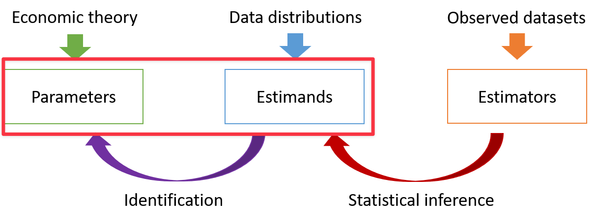
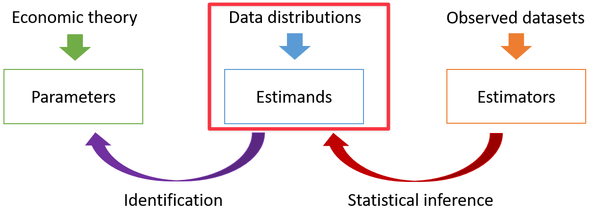
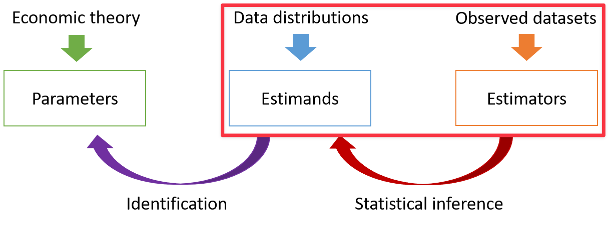
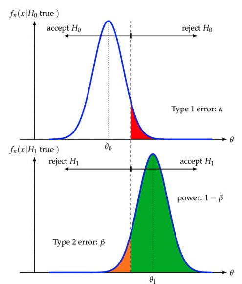
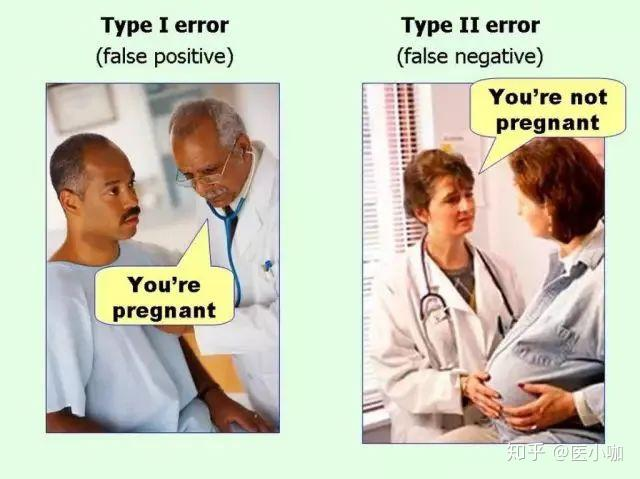
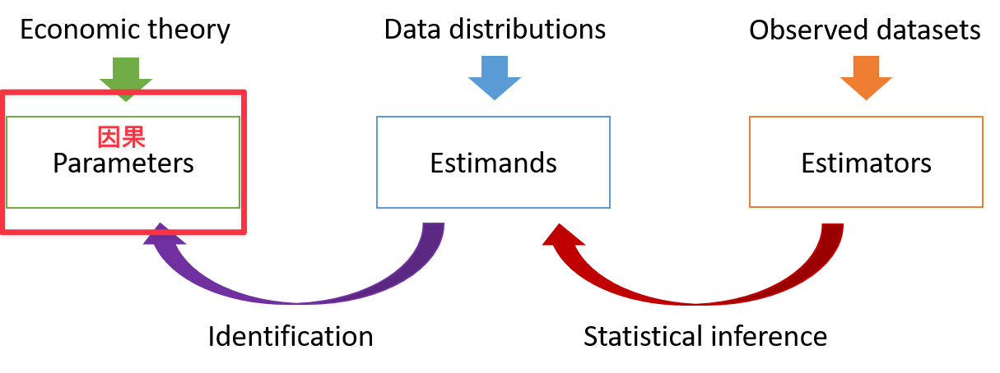
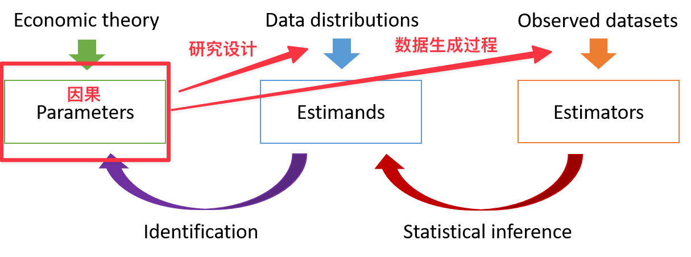
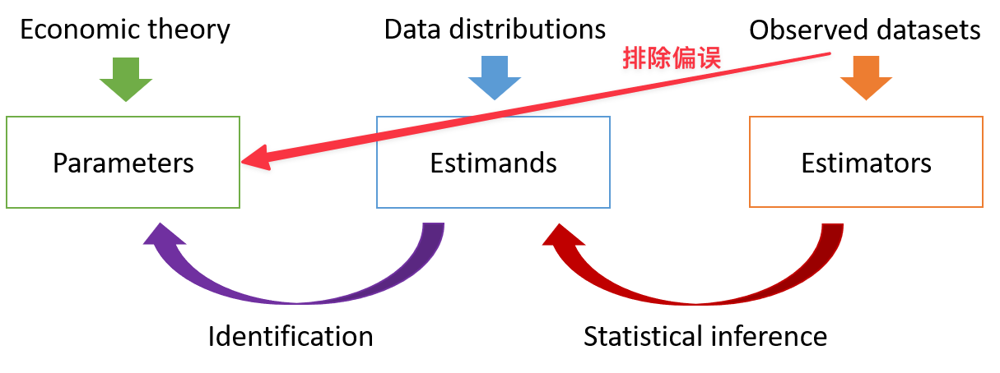

```{R, setup, include = F}
# devtools::install_github("dill/emoGG")
library(pacman)
p_load(
  broom, tidyverse,rmarkdown,
  ggplot2, ggthemes, ggforce, ggridges,
  latex2exp, viridis, extrafont, gridExtra,
  kableExtra, snakecase, janitor,
  data.table, dplyr, estimatr,
  lubridate, knitr, parallel,
  lfe,dslabs,
  here, magrittr,pammtools)

options(htmltools.dir.version = FALSE)

# Notes directory
dir_slides <- "/Users/zhouzhengqing/Desktop/SportsEconAnalysis/2024spring/Lec09"
# Define pink color
red_pink <- "#e64173"
turquoise <- "#20B2AA"
orange <- "#FFA500"
red <- "#fb6107"
blue <- "#3b3b9a"
green <- "#8bb174"
grey_light <- "grey70"
grey_mid <- "grey50"
grey_dark <- "grey20"
purple <- "#6A5ACD"
slate <- "#314f4f"
met_slate <- "#272822" # metropolis font color 

# Dark slate grey: #314f4f

# Knitr options
opts_chunk$set(
  comment = "#>",
  fig.align = "center",
  fig.height = 7,
  fig.width = 10.5,
  warning = F,
  message = F
)
opts_chunk$set(dev = "svg")
options(device = function(file, width, height) {
  svg(tempfile(), width = width, height = height)
})
options(crayon.enabled = F)
options(knitr.table.format = "html")
# A blank theme for ggplot
theme_empty <- theme_bw() + theme(
  line = element_blank(),
  rect = element_blank(),
  strip.text = element_blank(),
  axis.text = element_blank(),
  plot.title = element_blank(),
  axis.title = element_blank(),
  plot.margin = structure(c(0, 0, -0.5, -1), unit = "lines", valid.unit = 3L, class = "unit"),
  legend.position = "none"
)
theme_simple <- theme_bw() + theme(
  line = element_blank(),
  panel.grid = element_blank(),
  rect = element_blank(),
  strip.text = element_blank(),
  axis.text.x = element_text(size = 18, family = "STIXGeneral"),
  axis.text.y = element_blank(),
  axis.ticks = element_blank(),
  plot.title = element_blank(),
  axis.title = element_blank(),
  # plot.margin = structure(c(0, 0, -1, -1), unit = "lines", valid.unit = 3L, class = "unit"),
  legend.position = "none"
)
theme_axes_math <- theme_void() + theme(
  text = element_text(family = "MathJax_Math"),
  axis.title = element_text(size = 22),
  axis.title.x = element_text(hjust = .95, margin = margin(0.15, 0, 0, 0, unit = "lines")),
  axis.title.y = element_text(vjust = .95, margin = margin(0, 0.15, 0, 0, unit = "lines")),
  axis.line = element_line(
    color = "grey70",
    size = 0.25,
    arrow = arrow(angle = 30, length = unit(0.15, "inches")
  )),
  plot.margin = structure(c(1, 0, 1, 0), unit = "lines", valid.unit = 3L, class = "unit"),
  legend.position = "none"
)
theme_axes_serif <- theme_void() + theme(
  text = element_text(family = "MathJax_Main"),
  axis.title = element_text(size = 22),
  axis.title.x = element_text(hjust = .95, margin = margin(0.15, 0, 0, 0, unit = "lines")),
  axis.title.y = element_text(vjust = .95, margin = margin(0, 0.15, 0, 0, unit = "lines")),
  axis.line = element_line(
    color = "grey70",
    size = 0.25,
    arrow = arrow(angle = 30, length = unit(0.15, "inches")
  )),
  plot.margin = structure(c(1, 0, 1, 0), unit = "lines", valid.unit = 3L, class = "unit"),
  legend.position = "none"
)
theme_axes <- theme_void() + theme(
  text = element_text(family = "Fira Sans Book"),
  axis.title = element_text(size = 18),
  axis.title.x = element_text(hjust = .95, margin = margin(0.15, 0, 0, 0, unit = "lines")),
  axis.title.y = element_text(vjust = .95, margin = margin(0, 0.15, 0, 0, unit = "lines")),
  axis.line = element_line(
    color = grey_light,
    size = 0.25,
    arrow = arrow(angle = 30, length = unit(0.15, "inches")
  )),
  plot.margin = structure(c(1, 0, 1, 0), unit = "lines", valid.unit = 3L, class = "unit"),
  legend.position = "none"
)
theme_market <- theme_bw() + theme(
  axis.line = element_line(color = met_slate),
  panel.grid = element_blank(),
  rect = element_blank(),
  strip.text = element_blank(),
  text = element_text(family = cnfont, color = met_slate, size = 17),
  axis.title.x = element_text(hjust = 1, size = 17),
  axis.title.y = element_text(hjust = 1, angle = 0, size = 17),
  # axis.text.x = element_text(size = 12),
  # axis.text.y = element_text(size = 12),
  axis.ticks = element_blank()
)
theme_gif <- theme_bw() + theme(
  axis.line = element_line(color = met_slate),
  panel.grid = element_blank(),
  rect = element_blank(),
  text = element_text(family = cnfont, color = met_slate, size = 17),
  axis.text.x = element_text(size = 12),
  axis.text.y = element_text(size = 12),
  axis.ticks = element_blank()
)

theme_goods <- theme_bw() + theme(
  axis.line = element_line(),
  panel.grid = element_blank(),
  rect = element_rect(size = 1),
  strip.text = element_blank(),
  text = element_text(size = 17, family = cnfont), 
  axis.text.x = element_text(size = 17),
  axis.text.y = element_text(size = 17, angle = 90, hjust = 0.5),
  axis.title.x = element_text(color = purple, size = 19),
  axis.title.y = element_text(color = red_pink, size = 19),
  axis.ticks = element_blank(),
  plot.title = element_blank(),
  legend.position = "none"
)
theme_game <- theme_bw() + theme(
  axis.line = element_line(),
  panel.grid = element_blank(),
  rect = element_rect(size = 1),
  strip.text = element_blank(),
  text = element_text(size = 20, family = cnfont), 
  axis.text.x = element_text(size = 20, color = met_slate),
  axis.text.y = element_text(size = 20, angle = 90, color = met_slate, hjust = 0.5),
  axis.title.x = element_text(color = met_slate, size = 20),
  axis.title.y = element_text(color = met_slate, size = 20),
  axis.ticks = element_blank(),
  plot.title = element_blank(),
  legend.position = "none"
)
shift_axis <- function(p, y=0){
  g <- ggplotGrob(p)
  dummy <- data.frame(y=y)
  ax <- g[["grobs"]][g$layout$name == "axis-b"][[1]]
  p + annotation_custom(grid::grobTree(ax, vp = grid::viewport(y=1, height=sum(ax$height))), 
                        ymax=y, ymin=y) +
    geom_hline(aes(yintercept=y), data = dummy, size = 0.5, color = met_slate) +
    theme(axis.text.x = element_blank(), 
          axis.ticks.x = element_blank())
}
wrapper <- function(x, ...) paste(strwrap(x, ...), collapse = "\n")
# functions
demand <- function(x) 10 - x
demand_2 <- function(x) 9 - x
demand_3 <- function(x) 8 - x
demand_inc <- function(x) 11 - x
demand_dec <- function(x) 5 - x
supply <- function(x) 1 + (4/5)*x
step_demand <- tibble(x = c(0, 1, 2, 3, 4, 5, 6, 7, 8), mv = c(8, 7, 6, 5, 4, 3, 2, 1, 0))
step_demand2 <- tibble(x = c(0, 1, 2, 3, 4, 5, 6, 7, 8, 9, 10, 11, 12), mv = c(10, 10, 9, 9, 8, 8, 7, 7, 6, 6, 5, 4, 4))
step_supply <- tibble(x = c(0, 1, 2, 3, 4, 5, 6, 7, 8, 9, 10, 11, 12), mv = c(2, 2, 3, 3, 4, 4, 5, 5, 6, 6, 7, 8, 8))
step_supply_tax <- step_supply %>% 
  mutate(mv = mv + 2)

# data <- read_csv("/Users/zhouzhengqing/Desktop/SportsEconAnalysis/Activity_Pit_Market/Results.csv") %>% 
#   dplyr::filter(!is.na(price))

theme_set(theme_gray(base_size = 20))
# Column names for regression results
reg_columns <- c("Term", "Est.", "S.E.", "t stat.", "p-Value")
# Function for formatting p values
format_pvi <- function(pv) {
  return(ifelse(
    pv < 0.0001,
    "<0.0001",
    round(pv, 4) %>% format(scientific = F)
  ))
}
format_pv <- function(pvs) lapply(X = pvs, FUN = format_pvi) %>% unlist()
# Tidy regression results table
tidy_table <- function(x, terms, highlight_row = 1, highlight_color = "black", highlight_bold = T, digits = c(NA, 3, 3, 2, 5), title = NULL) {
  x %>%
    tidy() %>%
    select(1:5) %>%
    mutate(
      term = terms,
      p.value = p.value %>% format_pv()
    ) %>%
    kable(
      col.names = reg_columns,
      escape = F,
      digits = digits,
      caption = title
    ) %>%
    kable_styling(font_size = 20) %>%
    row_spec(1:nrow(tidy(x)), background = "white") %>%
    row_spec(highlight_row, bold = highlight_bold, color = highlight_color)
}
```
class: title-slide-section,center, middle, inverse

# 大纲

---
### 大纲

- Level 1
  - 一个例子
- Level 2
  - 基本概念
- Level 3
  - 具体实战

---
### 什么是计量经济学

- Econometrics
- 计量经济学只是统计学的经济学版本吗？

  - 经济学理论 .mono[+] 统计学技巧 .mono[=] 计量经济学
  - 使用统计学的技巧（工具包），并将其应用于与经济学中的问题和现象有关的问题。

- 相关性足够有趣，为什么更偏好因果？
  - 预知某项干预/政策对感兴趣变量的影响结果 → 预判问题
  - 资源是有限的，而干预措施是要花钱的 → 更为精确

---
### 例子：球队胜率与上座率

假设联盟总裁想知道哪些因素能提升比赛上座率最重要

- 一个方法是用平均观众人数反映上座率现实情况，但是它无法反映变量间的关系

- **理论或者常识**告诉我们球队获胜越多，观众就越多。把上座率ATT作为因变量，因为它是我们的**目标变量**，理论上我们认为它取决于胜率。而WPCT作自变量，是我们可以**操纵变量**。
- 将理论**简化为模型** $ATT=f(WPCT)$ 
- 可以**假设** $\frac{\partial ATT}{\partial WPCT} \gt 0$ 以与**理论描述一致**
- 经过样本，**检验**上述观点的最直接方式是**散点图**。但这样无法精确计算胜率从0.5提高到0.51时，上座率会增加多少。因为提高胜率通常意味着要花钱买球员
- 为了与样本结合，最简单的方法是将理论模型改写为**可回归的线性表达式**  $ATT_i= \beta + \tau \times WPCT_i + \varepsilon_i$
  - $i$ 代表每支球队 

---
### 例子：球队胜率与上座率

- 接下来要选择一种**回归方法**，这里采取最广泛使用的**一般最小二乘OLS**对线性表达式进行**拟合**
- 通过限定一些**回归假设**，我们就可以得到**估计值** $\hat\tau$ ，然而我们感兴趣的是**真实值** $\tau$ , 前者是否真的代表后者? → identification

--

  - 举个例子：进校门人脸识别，闸机中有图片库和模型，用抽样照片去跟库里的匹配。两者匹配好肯定是根据某些算法进行的，当误差缩小到一定范围之后，闸门就会开放。现场照片就是 $\hat\tau$ ，而照片库里的我们就是 $\tau$ ，这个**过程**就是**识别** 
  - 上面的例子中，至少有个库。但理论中的参数 $\tau$ 往往不知道(或存在但观察不到)，只能经过**理论建构、稳健性检验、排除竞争性理论**等方式**推断**(猜) → 识别过程无标准
- 得到的估计值 $\hat\tau$ 至少存在两方面意义，统计学(理论)意义和经济学(现实)意义
  - 统计学意义（statistical significance），需要**统计推断**
  - 经济学意义（economic significance，要看**效应值**与**经济学解释**
- 若 $\tau$ 具有**因果性**，上述过程是**因果推断**

---
### 例子：球队胜率与上座率

.center[ ATT =-2.4536+65.23 * WPCT ]
- 告诉我们WPCT每增加一个单位(+0.001)，就会增加65.23个球迷到场。当把平均值WPCT=0.500代入等式，得到 30.163 或30163 球迷，这是当年的平均上座率
- $R^2=0.311$ 反映**拟合度**(代表胜率能够解释31.1%的上座率变化)，t统计值代表显著性( $H_0 = 0,H_1 \ne 0$  )
- 但是其余的 68.9% 呢? 说明还有其他很多因素会影响，基于以上结论的决策并没有足够说服力
  - 市场规模是一个**干扰因素**。纽约有8500万人，辛辛那提只有30万人 → **控制**
  - 联赛差异（分区）是另一个干扰因素。AL和NL是存在差异的 → **控制**
  - 最关键的，因为这两个因素很有可能会影响球队胜率，若是忽略它们会导致**遗漏变量偏差**，产生所谓的**内生性**问题，导致我们用 $\hat\tau$ 代表 $\tau$ 是**偏误**的
- 我们将可回归的线性表达式改为 $ATT_i=\boldsymbol{X} \beta + \tau \times WPCT_i + \varepsilon_i$
  - 市场规模与联赛差异进入了 $\boldsymbol{X}\beta$

---
### 例子：球队胜率与上座率

.center[ATT=-.421+1.174POP-2.014 LEAGUE + 59.31*WPCT
]

- 练习：系数如何解释？具有如何意义？Dummy(AL=1) vs Continuous
- 讨论：59.31是否具有**因果性**?
- 59.310；17.939；3.31；1.96；0.003；0.005


---
class: title-slide-section,inverse,middle
# 如何去找“真相”

---
class: center,middle

按照既有的逻辑(理论、科学论证或者推断)，减少犯错的可能性

---
### 理论、总体分布与样本

<br>


- 样本(estmators) .mono[-->] 事实(=estmands?) .mono[-->] 因果模型(=parameter?) .mono[-->] Knowledge
- 2.2 → 2.21 → .bb[2.21] → 2.21!!!   

---
class: title-slide-section, middle, inverse
# 从事实到因果模型：避免遗漏变量偏误与控制变量滥用
---

### 理论、总体分布与样本

<br>




---

增加控制变量确实可以提高回归模型，让系数趋向于“因果”，但也不控制变量越多越好。为了说明这个道理，引入**遗漏变量偏误**的概念

.hi-pink[例子：教育回报率]
---
### 遗漏变量偏误公式

- 我们使用遗漏变量偏误公式(Omitted Variable Bias Formula)描述 .hi-slate[当回归包含不同的控制变量时，回归结果之间存在的关系。] 它提供了**长回归方程**和**短回归方程**估计系数之间的联系。
- 将所有控制变量简化为**家庭背景、智力和动机**所组成的控制变量集合，标为 $\left( {A}_i \right)$ 并记为“能力”。在控制了能力后，对工资关于教育水平进行回归的方程就可以写成：

$$
\begin{align}
  {Y}_{i} &= \alpha + \tau {s}_i + {A}_{i}'\gamma + e_i \tag{1}
\end{align}
$$
- 其中, $\alpha, \tau, \gamma$ 是总体回归系数（没有跟样本结合）, $e_{i}$ 是回归残差。给定 $A_{i}$, 如果CIA成立（ $e_i$ 与其他回归元不再相关 ）, 那么系数 $\tau$ 具有因果性。但在实际中, 能力是很难度量的。那么, 假如回归方程（1）遗漏了“能力"，此时回归方程变为：
$$
\begin{align}
  {Y}_{i} &= \alpha + \beta {s}_i + v_i \tag{2}
\end{align}
$$

---
### 遗漏变量偏误公式

我们将方程 (2) 称为**短回归方程**, (1) 称为**长回归方程**。
那么**遗漏变量偏误公式 (Omitted Variable Bias Formula)**为：

$$
\begin{align}
  \hat \beta_{ols} =\dfrac{\mathop{{Cov}} \left( {Y}_{i},\, {s}_i \right)}{\mathop{{Var}} \left( {s}_i \right)} = \tau + \gamma' \delta_{As}
\end{align}
$$
其中, $\delta_{As}$ 是对 $A_{i}$ 关于 $s_{i}$ 回归得到的系数。

该公式表明：**短回归系数**等于**长回归系数**加上**bias**，等于**遗漏变量效应**乘以**遗漏变量对自变量的回归系数**。

因此，满足以下两个条件，那么长、短回归方程对教育回报率的估计将一样:
 (.hi-slate[a]) 受教育程度与能力大小无关 $\left( \delta_{As} = 0 \right)$ **或者** (.hi-slate[b]) 在控制受教育程度后，能力大小与工资多少无关 $\left( \gamma = 0 \right)$.
 
---
### 例子(MHE)

```{r, table_321, echo = F}
coef_v <- c("0.132", "0.131", "0.114", "0.087", "0.066")
se_v <- c(rep("0.007", 3), "0.009", "0.010") %>% paste0("(", ., ")")
control_v <- c(
  "None", "Age Dum.", "2 + Add'l",
  "3 + AFQT", "4 + Occupation"
)
names_v <- 1:5
tab_mat <- matrix(c(coef_v, se_v, control_v), nrow = 3, byrow = T)[,1:4]
row.names(tab_mat) <- c("教育程度", "", "控制变量")
tab321 <- kable(
  x = tab_mat,
  col.names = names_v[1:4],
  caption = "表 3.2.1  教育回报率(MHE)",
  align = "c"
) %>%
column_spec(1, bold = T, italic = F)
# Print the table
tab321
```

- 在这里，我们有四种增加控制变量的方式，关于工资对上学年限的回归（来自NLSY，美国青年纵向调查）
---
### 例子(MHE)

```{r, table_321_1, echo = F}
tab321 %>% column_spec(2, color = red_pink)
```

.hi[第1列] 没有控制变量 意味着每额外获得1年教育，工资有13.2%的增长。
---
### 例子(MHE)

```{r, table_321_2, echo = F}
tab321 %>% column_spec(3, color = red_pink)
```

.hi[第2列] 控制年龄，意味着每额外获得1年教育，工资有13.1%的增长. 
---
### 例子(MHE)

```{r, table_321_3, echo = F}
tab321 %>% column_spec(4, color = red_pink)
```

.hi[第3列] ，第2列控制变量再加上父母教育和自身人口学特征， 意味着每额外获得1年教育，工资有11.4%的增长。
---
### 例子(MHE)

```{r, table_321_4, echo = F}
tab321 %>% column_spec(5, color = red_pink)
```

- .hi[第4列] (第3列又控制 AFQT.super[.pink[†]] 分数) 意味着每额外获得1年教育，工资有8.7%的增长。 

.footnote[.pink[†] *AFQT* is *Armed Forces Qualification Test，武装部队资格测验*, 反映能力]
---
### 例子(MHE)

```{r, table_321_5, echo = F}
tab321 %>%
  column_spec(5, color = red_pink) %>%
  column_spec(2, color = purple)
```

- 可以看到，随着控制变量的增加，从.hi-purple[第1列]到.hi[第4列]教育回报率估计值下降了4.5个百分点（系数下降34%）。

$$
\begin{align}
  \color{#6A5ACD}{\dfrac{\mathop{{Cov}} \left( {Y}_{i},\, {s}_i \right)}{\mathop{{Var}} \left( {s}_i \right)}} = \color{#e64173}{\tau} + \color{#20B2AA}{\gamma'} \color{#FFA500}{\delta_{As}}
\end{align}
$$

- .hi[讨论] 为什么？

---
### 遗漏变量偏误公式

- 关注最想要的
OVB公式的使用**并不**要求每一个回归模型都能正确识别因果关系。该公式比较了.hi-purple[短模型]中的回归系数和.hi-pink[长模型]中同一变量的回归系数。.super[.pink[†]]

- **条件独立假设**的重要性

$$
\begin{align}
  \color{#6A5ACD}{\dfrac{\mathop{{Cov}} \left( {Y}_{i},\, {x}_i \right)}{\mathop{{Var}} \left( {x}_i \right)}} = \color{#e64173}{\tau} + \color{#20B2AA}{\gamma'} \color{#FFA500}{\delta_{Omitted-x_i}}
\end{align}
$$

- 可信的条件独立假设? → 随机分配

### 坏的控制变量

- 好的控制变量是发生在干预变量.super[.pink[†]]之前或取值不受自变量影响

- 仍以教育收益率为例，个人职业和就业行业就不是好的控制变量。

- 为什么？

???
- 因为个人职业及就业行业往往是教育完成之后个人选择的结果，也就是说，这些变量发生在教育之后，可能受到教育的影响。
- 事实上，教育对职业选择有重要影响，职业和行业往往存在着密切的联系

---
### 例子(MHE)

```{r, table_bad_control, echo = F}
coef_v <- c("0.132", "0.131", "0.114", "0.087", "0.066")
se_v <- c(rep("0.007", 3), "0.009", "0.010") %>% paste0("(", ., ")")
control_v <- c(
  "None", "Age Dum.", "2 + Add'l",
  "3 + AFQT", "4 + Occupation"
)
names_v <- 1:5
tab_mat <- matrix(c(coef_v, se_v, control_v), nrow = 3, byrow = T)
row.names(tab_mat) <- c("教育程度", "", "控制变量")
kable(
  x = tab_mat,
  col.names = names_v,
  caption = "表 3.2.1  教育回报率(MHE)",
  align = "c"
) %>%
column_spec(1, bold = T, italic = F) %>%
column_spec(6, color = red_pink)
```

- .hi[第5列]，再控制职业。我们如何解释新的结果？
--

<br><br>
其实：我们很难解释是何种原因导致了这种下降。

教育水平的系数变小可能仅仅是**选择偏误**的一种表现。因此最好还是用不由教育水平决定的那些变量作为控制变量。

---
### 如何加入控制变量

- 有些控制变量是不合格的，将其加入回归固然可以改变回归系数，但实际上却不该将其加人。**不合格的控制变量**会有严重的问题（比如某些药会导致高血压）。

- **时间原则**是普遍被接受的，也就是**考虑控制变量被决定的时间**。一般来说在自变量被记录之前就决定的变量大部分是好控制。
- 但是某些情况下，要考虑到**人的预期**。比如重大赛事前会超前部署
---
class: title-slide-section,inverse, middle
# 从事实到因果模型：避免内生性问题

---

- 给定一个多元线性回归模型
$$
\begin{equation}
Y=\alpha+\beta_{1} X_{1}+\beta_{2} X_{2}+\cdots+\beta_{{k}} X_{k}+ e
\end{equation}
$$

- 如果干扰项和自变量是相关的, 即

$$
\begin{equation}
{E}\left(e \mid X_{1}, X_{2}, \cdots, X_{k}\right) \neq 0
\end{equation}
$$

- 那么可以说这个线性模型存在内生性问题。
  - 无法识别自变量的因果关系系数的情形（常见于经济类文章）
  - 若无法将内生性控制在可信服的水平下，那么回归结果基本是无效的

---

### 来源一: 遗漏变量
考虑模型: $INC=\alpha+\beta_{1} E D U+\beta_{2} I Q+e$

其中: ${E}(e \mid EDU, I Q)=0, \operatorname{Cov}(E D U, I Q) \neq 0$

若遗漏了自变量 $IQ$, 即使用 $INC=\alpha+\beta_{1} EDU+v$ 进行回归, 则

${E}(v \mid E D U)={E}\left(\beta_{2} I Q+e \mid E D U\right)=\beta_{2} {E}(I Q \mid E D U) \neq 0$

---

### 来源二: 测量误差
(1) 自变量存在测量误差

考虑模型:

$$y_{i}=\beta_{0}+\beta_{1} x_{1 i}+u_{i}$$

- 满足扰动项 $u_i$ 与自变量均值独立，且与自变量X 的测量误差也独立，且测量误差的均值为零会怎样。考虑含有测量误差的自变量观测值

$$x_{1 i}^{o b s}=x_{1 i}+v_{i}$$
- 那么我们估计的方程实际上是
$$y_{i}=\beta_{0}+\beta_{1} x_{1 i}^{o b s}+e_{i}$$
其中 $e_{i}=\left(u_{i}-\beta_{1} v_{i}\right)$

---
### 来源二: 测量误差

- 虽然干扰项 ${e}$ 中的 ${u}$ 和 $v$ 是相互独立的, 但是里面含了系数 $\beta_{1}$ 。这时, 对于 $\beta_{1}$ 的 OLS 估计为

$$\begin{aligned}
plim \hat{\beta}_{1}^{O L S} &=\beta_{1}+plim \frac{\sum_{i} \tilde{x}_{1 i}^{o b s} e_{i}}{\sum_{i}\left(\tilde{x}_{1 i}^{o b s}\right)^{2}} \\
&=\beta_{1}+\frac{-\beta_{1} \sigma_{v}^{2}}{\sigma_{\tilde{x}_{1}}^{2}+\sigma_{v}^{2}} \\
&=\beta_{1}\left(\frac{\sigma_{x_{1}}^{2}}{\sigma_{x_{1}}^{2}+\sigma_{v}^{2}}\right)
\end{aligned}$$

- 自变量存在测量误差时, **会有内生性问题**
- 自变量存在测量误差时, **系数估计值在绝对值上都会减小**（经济意义不足）, 该偏误叫**衰减偏误**(attenuation bias)，但**不会改变系数估计值符号**
- 偏离程度和 $\sigma_{x}^{2} / \sigma_{v}^{2}$ **信噪比**有关

???
probability limit，概率极限

---

### 来源二: 测量误差
(2) 因变量存在测量误差
.tiny[
$$
\begin{equation}
Y^{*}=\beta_{0}+\beta_{1} X^{*}+e, \quad {E}\left(e \mid X^{*}\right)=0
\end{equation}
$$
当因变量 $Y^{*}$ 存在测量误差，即 $Y=Y^{*}+u$ ，同时
$$
\begin{equation}
\operatorname{Cov} \left(u, X^{*}\right)=0, \quad
\operatorname{Cov} \left(u, Y^{*}\right)=0, \quad
{E} \left(u \mid X^{*}\right)=0
\end{equation}
$$
此时模型变成
$$
\begin{gathered}
Y=\beta_{0}+\beta_{1} X^{*}+e+u=\beta_{0}+\beta_{1} X^{*}+v \\
v=e+u
\end{gathered}
$$

$$
\begin{aligned}
&\operatorname{Cov}\left(X^{*}, v\right) \\
&=\operatorname{Cov}\left(X^{*}, e+u\right) \\
&=0
\end{aligned}
$$
]

- 当因变量存在测量误差时, **不会造成内生性问题**
- 干扰项(噪音)变大，导致**回归结果显著性下降**(现实中必须要排除掉的不显著原因，但系数估计是一致的)


---

### 来源三: 互为因果

若因变量与自变量互为因果关系，即任何一方都可以作对方的自变量。

$$
\begin{align}
&Y_{1}=\beta_{1} X_{1}+\phi_{1} Y_{2}+e_{1}  \tag{1} \\
&Y_{2}=\beta_{2} X_{2}+\phi_{2} Y_{1}+e_{2}  \tag{2}
\end{align}
$$

$$
\begin{gathered}
{E}\left(e_{i} \mid X_{1}, X_{2}\right)=0 ; \quad i=1,2 \quad ;
\operatorname{Cov}\left(e_{1}, e_{2}\right)=0
\end{gathered}
$$
- 将式（2）代入式（1）中,可以得到
$$
\begin{align}
Y_{1}=\frac{\beta_{1}}{1-\phi_{1} \phi_{2}} X_{1}+\frac{\beta_{2} \phi_{1}}{1-\phi_{1} \phi_{2}} X_{2}+\frac{e_{1}}{1-\phi_{1} \phi_{2}}+\frac{e_{2} \phi_{1}}{1-\phi_{1} \phi_{2}} \tag{3}
\end{align}
$$
---

### 来源三: 互为因果

- 由式（3）
$$
\begin{align}
&\operatorname{Cov}\left(Y_{1}, e_{2}\right) \\
&=\operatorname{Cov}\left(\frac{\beta_{1}}{1-\phi_{1} \phi_{2}} X_{1}+\frac{\beta_{2} \phi_{1}}{1-\phi_{1} \phi_{2}} X_{2}+\frac{e_{1}}{1-\phi_{1} \phi_{2}}+\frac{e_{2} \phi_{1}}{1-\phi_{1} \phi_{2}}, e_{2}\right) \\
&=\operatorname{Cov}\left(\frac{e_{2} \phi_{1}}{1-\phi_{1} \phi_{2}}, e_{2}\right) \\
&=\frac{\phi_{1}}{1-\phi_{1} \phi_{2}} \operatorname{Var}\left(e_{2}\right) \neq 0
\end{align}
$$

- 所以模型 (2) 存在内生性问题（对简化式2进行回归）, 模型 (1) 同理可证

---
class: title-slide-section,inverse, middle
# 事实是建立在总体意义上的模型

---

### 理论、总体分布与样本

<br>



---
- 模型代表什么?

--

  - 总体意义上的抽象关系

### 条件分布 (Conditional Distribution)
- 刻画变量间关系
  - 观察**条件期望**是最直接、简单办法
- 最感兴趣的 $Y$ 与 $X$ 是随机变量
    - $Y$ 是因变量（因变量|因变量|被解释变量）; $X$ 是自变量（自变量|干预变量|解释变量）. 
    - 是随机变量就会有概率分布，而最常见的是**正态分布**

---
### 例子：想知道工资与性别的关系

- 工资对数的条件均值可以写成如下形式：

$$ E[ log(wage) \mid gender = man ] = 3.05 $$

$$ E[ log(wage) \mid gender = woman ] = 2.81 $$
若是我们还好奇在种族与工资的关系，还可以增加新的条件、
$$ E[\log (wage ) \mid gender =\operatorname{man}, race = white]=3.07 $$
$$ E [\log ( wage ) \mid gender = woman, race = black ]=2.73 $$

---
### 通过条件密度函数获得条件期望值
- 离散形式： $$P(y|x)=\frac{P(y,x)}{P(x)}$$ 其中 $P(x)=\sum_{i=1}^{N}P(y_{i},x)$ ，条件密度相当于联合密度 $f(y, x)$ 在保持x不变情况下的随机化“切片”
- **概率迭代法则**
$$P(y)=\sum_{i=1}^{N}P(y|x_{i})P(x_{i})$$   
- **方差加法法则**
$$Var(Y)=E[V(Y|X)]+V[E(Y|X)]$$

---
### 通过条件密度函数获得条件期望值

 **为什么**用联合概率分布函数和联合密度函数也可以捕捉两个变量的关系? 
 
--

.middle[
.center[

]
]


---
class: title-slide-section,inverse,middle
# 事实是良好且能够被认知的

---
### 条件期望函数及其误差项的优良性质

- **性质1** (期望迭代法则,law of iterated expectation)
$$
E[E[Y \mid X]]=E[Y]
$$

 $E[Y|X]$ 的期望值是 $[Y]$ 的无条件期望值。
 <br/><br/>
例如：

---
- **性质1**推论
$$E\left[E[Y|X_{1},X_{2}]|X_{1}\right]=E[Y|X_{1}]$$
    - 内部期望值以X1和X2同时为条件,外部期望值只以X1为条件。迭代后的期望值可以得到简单的答案E[Y|X1],即只以X1为条件的期望值。《E》表述为"较小的信息集获胜" → 以小谋大
<br/><br/>
例：


---
- **性质2** (线性) $$E[a(X)Y+b(X)|X]=a(X)E[Y|X]+b(X)$$ 对于函数 $a(\cdot)$ and $b(\cdot)$. 
 <br/><br/>
 <br/><br/>

- **性质3**（独立意味着均值独立）
 <br/><br/>
若 $X$ 与 $Y$ 独立, 则 $E[Y|X]=E[Y]$

---
- **性质3**的证明 (以离散变量为例): 
$$
\begin{eqnarray}
E[Y|X]&=&\sum_{i=1}^{N}y_{i}P(Y=y_{i}|X) \\
	  &=&\sum_{i=1}^{N}y_{i}\frac{P(Y=y_{i},X)}{P(X)} \\
	  &=&\sum_{i=1}^{N}y_{i}\frac{P(Y=y_{i})\times P(X)}{P(X)} 
	  &=&E[Y].
\end{eqnarray}
$$
用到了 $P(Y=y,X=x)=P(X=x)P(Y=y)$ .

---
    
- **性质4** （均值独立意味着不相干）
<br/>
若 $E[Y|X]=E[Y]$, 则 $Cov(X,Y)=0$.
    -  $E[Y|X]=E[Y]$ is 均值独立(**mean independence**)
    - 记住: 均值独立意味着不相干，反过来不一定成立.

- **性质5** （条件期望值是最小均值平方误差）
<br/>
假设对于任意函数 $g$ 有 $E[Y^{2}]<\infty$ 并 $E[g(X)]<\infty$ , 那么 $$E[(Y-\mu(X))^{2}]\leq E[(Y-g(X))^{2}]$$ 
其中 $\mu(X)=E[Y|X]$
<br/>
解读:
    - 假设使用某种函数形式 $g$ 和数据 $X$ 来解释 $Y$
    -  那么 $g$ 的最小均方误（ **the mean squared error** ）就是条件期望。


---

- **性质5**的证明:
$$
\begin{eqnarray}
E[(Y-g(X))^{2}]	&=&E[\left\{ \left(Y-\mu(X)\right)+\left(\mu(X)-g(X)\right)\right\} ^{2}]\\
	&=&E\left[\left(Y-\mu(X)\right)^{2}\right]+E\left[\left(\mu(X)-g(X)\right)^{2}\right]\\
	&+& 2E\left[\left(Y-\mu(X)\right)\left(\mu(X)-g(X)\right)\right].
\end{eqnarray}
$$
使用期望迭代法则
$$
\begin{eqnarray}
E\left[\left(Y-\mu(X)\right)\left(\mu(X)-g(X)\right)\right]	&=&E\left\{E\left[\left(Y-\mu(X)\right)\left(\mu(X)-g(X)\right)|X\right]\right\} \\
	&=&E\left\{ \left(\mu(X)-g(X)\right)\left(E[Y|X]-\mu(X)\right)\right\} \\
	&=&0
\end{eqnarray}
$$
所以，
$$
E[(Y-g(X))^{2}]=E\left[\left(Y-\mu(X)\right)^{2}\right]+E\left[\left(\mu(X)-g(X)\right)^{2}\right]
$$ 
上式取最小值，当且仅当 $g(X)=\mu(X)$.

---
### 条件期望函数及其误差项的优良性质

.pull-left[
- Conditional Expectation Function Error （CEFE）
$$ e = Y - E(Y|X) = Y - m(x) $$
    - $X$ 是随机变量， $E(Y|X)$ 也是随机变量
    - $e$ 是误差项，也是随机变量，具有概率分布
]

.pull-right[
- CEFE优良性质

    1. $E(e|X)=0$
    1. $E(e)=0$
    1. 对于随机变量 $X$ 任意函数形式 $h(x)$ , $E(h(X)·e)=0$ → 通常利用该性质进行线性变换

]

---
### CEF与可回归的模型间的关系


step1: 定义条件期望函数 $m(x) = E(Y|X)$

step2: 定义条件期望函数的误差项 $e = Y - m(x)$

推导出：$$Y = m(x) + e$$

因此模型类别由 $m(x)$ 形式决定：如截距模型，线性模型，Logit模型等

---
### CEF是从样本到总体的桥梁 

- 期望本身是总体概念（价值观）
- 实际中，我们是基于样本信息推断总体信息，例如用样本均值推断总体期望
- 将CEF写作基于样本的CEF:
$E[Y_i \mid {X}_{i}]$ 

从图形上看CEF...

---
class: clear, center, middle

条件分布 ${Y}_{i}$,  对于8, ..., 22不同教育年限的 ${X}_{i}=x$.

```{R, data_cef, echo = F, cache = T}
# Set seed
set.seed(12345)
# Sample size
n <- 1e4
# Generate extra disturbances
u <- sample(-2:2, size = 22, replace = T) * 1e3
# Generate data
cef_df <- tibble(
  x = sample(x = seq(8, 22, 1), size = n, replace = T),
  y = 15000 + 3000 * x  + 1e3 * (x %% 3) + 500 * (x %% 2) + rnorm(n, sd = 1e4) + u[x]
) %>% mutate(x = round(x)) %>%
dplyr::filter(y > 0)
# Means
means_df <- cef_df %>% group_by(x) %>% summarize(y = mean(y))
# The CEF in ggplot
gg_cef <- ggplot(data = cef_df, aes(x = y, y = x %>% as.factor())) +
  geom_density_ridges_gradient(
    aes(fill = ..x..),
    rel_min_height = 0.003,
    color = "white",
    scale = 2.5,
    size = 0.3
  ) +
  scale_x_continuous(
    "Annual income",
    labels = scales::dollar
  ) +
  ylab("Years of education") +
  scale_fill_viridis(option = "magma") +
  theme_pander(base_family = "Fira Sans Book", base_size = 7) +
  theme(
    legend.position = "none"
  ) +
  coord_flip()
```

```{R, fig_cef_dist, echo = F, cache = T}
gg_cef
```
---
class: clear, middle, center
条件期望函数 $\mathop{E}\left[ {Y}_{i}\mid {X}_{i} \right]$ 其实是这些条件分布的均值

```{R, fig_cef, echo = F, cache = T}
gg_cef +
  geom_path(
    data = means_df,
    aes(x = y, y = x %>% as.factor(), group = 1),
    color = "white",
    alpha = 0.85
  ) +
  geom_point(
    data = means_df,
    aes(x = y, y = x %>% as.factor()),
    color = "white",
    shape = 16,
    size = 3.5
  )
```

---
class: clear, middle, center

若只关注条件期望函数 $\mathop{E}\left[ {Y}_{i}\mid {X}_{i} \right]$...

```{R, fig_cef_only, echo = F, cache = T}
ggplot(data = cef_df, aes(x = y, y = x %>% as.factor())) +
  geom_density_ridges(
    rel_min_height = 0.003,
    color = "grey85",
    fill = NA,
    scale = 2.5,
    size = 0.3
  ) +
  scale_x_continuous(
    "Annual income",
    labels = scales::dollar
  ) +
  ylab("Years of education") +
  scale_fill_viridis(option = "magma") +
  theme_pander(base_family = "Fira Sans Book", base_size = 10) +
  theme(
    legend.position = "none"
  ) +
  geom_path(
    data = means_df,
    aes(x = y, y = x %>% as.factor(), group = 1),
    color = "grey20",
    alpha = 0.85
  ) +
  geom_point(
    data = means_df,
    aes(x = y, y = x %>% as.factor()),
    color = "grey20",
    shape = 16,
    size = 3.5
  ) +
  coord_flip()
```
---
## 实际数据（MHE）

.middle[
.center[

]
]


---
###  CEF的性质1

.hi.pink[分解结构清楚:] CEF将观测的因变量分解成两部分

$$
\begin{align}
  {Y}_{i} = \color{#e64173}{\mathop{E}\left[ {Y}_{i}\mid {X}_{i} \right]} + \color{#6A5ACD}{e_i}
\end{align}
$$

1. 被 $\color{#e64173}{{X}_{i}}$ 解释的部分(_i.e._, CEF $\color{#e64173}{\mathop{E}\left[ {Y}_{i} \mid {X}_{i} \right]}$)
<br>
1. 具有特殊性质的干扰项<sup>.pink[†]</sup>
<br><br> i.  $\color{#6A5ACD}{e_i}$ 均值独立于  ${X}_{i}$, _i.e._, $\mathop{E}\left[ \color{#6A5ACD}{e_i} \mid {X}_{i} \right] = 0$
<br> ii.  $\color{#6A5ACD}{e_i}$ 与 ${X}_{i}$的任何函数不相干


.footnote[.pink[†] 回忆之前的例子]

---
###  CEF的性质2
.hi.pink[ANOVA 定理:]

无条件方差与条件方差的关系：可将因变量 $Y_i$ 方差分解为两部分

$$
\begin{align}
  \mathop{{Var}} \left( {Y}_{i} \right) =  \mathop{E}\left[ \mathop{{Var}} \left( {Y}_{i} \mid {X}_{i} \right) \right]+ \mathop{{Var}} \left( \color{#e64173}{\mathop{E}\left[ {Y}_{i} \mid {X}_{i} \right]} \right) 
\end{align}
$$
 
1. 组内方差(的均值)(within group variance)。每个"等级"内Y的分布的方差的期望值(均值)。

2. 组间方差(across group variance)。条件期望值在"等级"间的分布的方差

解释为：因变量的变动 = CEF的方差(CEF可以解释) .mono[+] 干扰项的方差(CEF无法解释)

---
###  CEF的性质3

.hi.pink[良好预测:]  $\mathop{m}\left( {X}_{i} \right)$ 为 ${X}_{i}$ 任意形式函数, CEF是最小均方误差（**性质5**）
$$
\begin{align}
  \color{#e64173}{\mathop{E}\left[ {Y}_{i} \mid {X}_{i} \right]} = \underset{\mathop{m}\left( {X}_{i} \right)}{{arg min}}\enspace \mathop{E}\left[ \left( {Y}_{i} - \mathop{m}\left( {X}_{i} \right) \right)^2 \right]
\end{align}
$$
CEF是给定 ${X}_{i}$ 能够预测 ${Y}_{i}$ 最好预测方式.


 $m$ 可以是任意形式函数（包含非线性），但更偏好**线性投影函数（LPF）**(也叫总体回归模型)

---
### 练习：手算条件期望 → 从数据出发

[CEF基于数据出发，对于理解变量间至关重要](https://pkuzzq-image.oss-cn-beijing.aliyuncs.com/uPic/yh7RUZ.png)

研究问题 ${E}\left[ {工资}_i \mid {运动技能}_i \right]$ :

- step 1：选取 $Y$ 与 $X$ (从研究问题出发)

- step 2：在总体中重复抽样，获得样本

- step 3：对 $X$ "切片" ，获得 $Y \mid X=x$ 的 条件密度和条件分布 

- step 4：制作联合密度表格  $P(Y=y , X=x)$

- step 5：计算边缘密度 $P(X=x)$

- step 6：制作条件密度表格 $P(Y \mid X=x) = \frac{P(Y=y , X=x)} {P(X=x)}$

- step 7：计算条件期望 $E(Y \mid X=x)$ 

---
### 经验研究为什么从LPF而不是CEF开始？

- 简洁且经济含义明确：线性CEF也是常见的线性回归模型(linear regression model)。其中一个原因是 $m(x1,x2)$ 完整线性CEF为 $m\left(x_{1}, x_{2}\right)=x_{1} \beta_{1}+x_{2} \beta_{2}+x_{1}^{2} \beta_{3}+x_{2}^{2} \beta_{4}+x_{1} x_{2} \beta_{5}+\beta_{6}$  

CEF是具有好的预测性质，那么什么是“好”的**准则**？

定义**损失函数(loss function)**,  表达为常用的二次型形式：

$$ L(Y, g(x))=(Y-g(x))^{2} $$
其中 $L(·)$ 是r.v.，取期望得**均值平方误差（mean squared error，MSE）**，简称**均方误**
$$ R(Y, g(x)) = E[L(Y, g(x))] = E[(Y-g(x))^{2}] $$

---
### 经验研究为什么从LPF而不是CEF开始？

- LPF是MSE最小的线性函数:

$$
\begin{align}
  \beta = \underset{b}{{arg min}}\thinspace \mathop{E}\left[ \left( {Y}_{i} - {X}_{i}'b \right)^2 \right]
\end{align}
$$

- 依据一阶条件: $\mathop{E}\left[ {X}_{i} \left( {Y}_{i} - {X}_{i}'b \right) \right] = 0$得到 $b$ 的最优解 $\beta = \mathop{E}\left[ {X}_{i} {X}_{i}' \right]^{-1} \mathop{E}\left[ {X}_{i} {Y}_{i} \right]$
- $X_{i}^{\prime} \beta$ 是 $Y_i$ 在 $X_i$ 上的最优线性投影（best linear projection, BLP）, 向量 $\beta$ 是线性投影系数（linear projection coefficient） 
- 根据一阶条件重新构建 $E\left[X_{i}\left(Y_{i}-X_{i}^{\prime} \beta\right)\right]=0$ , 也就是说 $Y$ 的线性投影函数误差(linear projection function error,LPFE )
$e_i = Y_i - X_{i}^{\prime} \beta$ 与 $X_i$ 不相关, 也就是说LPF具有
$E(X_i e_i) = 0$ (矩阵形式为 $E[Xe]=0$ )
的性质.

- .hi.pink[思考：]与CEFE的性质比较

---
### 经验研究为什么从LPF而不是CEF开始？

- LPF是MMSE，CEF也是MMSE。继续使用最小化MSE**准则**：
$$
\begin{align}
  \beta = \underset{b}{{arg min}}\thinspace \mathop{E}\left[ \left( m({X_i})-{X_i}^{\prime} b \right)^2 \right]
\end{align}
$$

- 回归与条件期望函数定理（ Regression-CEF Theorem）
- 结论：
  - **LPF同样是CEF的MMSE和BLP**
  - 通常而言，CEF不一定是线性的；但CEF若是线性的, 那么LPF就是CEF

---
class: clear, middle, center
**CEF**

```{R, fig_reg_cef, echo = F, cache = T}
# Estimate the relationship
cef_lm <- lm(y ~ x, data = cef_df)
# Find the regression points
lm_df <- tibble(
  x = 8:22,
  y = predict(object = cef_lm, newdata = data.frame(x = 8:22))
)
# Create the figs
gg_cef <- ggplot(data = cef_df, aes(x = y, y = x %>% as.factor())) +
  geom_density_ridges(
    rel_min_height = 0.003,
    color = "grey85",
    fill = NA,
    scale = 2.5,
    size = 0.3
  ) +
  scale_x_continuous(
    "Annual income",
    labels = scales::dollar
  ) +
  ylab("Years of education") +
  scale_fill_viridis(option = "magma") +
  theme_pander(base_family = "Fira Sans Book", base_size = 18) +
  theme(
    legend.position = "none"
  ) +
  geom_path(
    data = means_df,
    aes(x = y, y = x %>% as.factor(), group = 1),
    color = "grey20",
    alpha = 0.85
  ) +
  geom_point(
    data = means_df,
    aes(x = y, y = x %>% as.factor()),
    color = "grey20",
    shape = 16,
    size = 3.5
  ) +
  coord_flip()
# Plot it
gg_cef
```
---
class: clear, center, middle

**LPF**去估计**CEF**

```{R, fig_reg_cef2, echo = F, cache = T}
# figs
gg_cef +
  geom_path(
    data = lm_df,
    aes(x = y, y = x %>% as.factor(), group = 1),
    color = purple,
    alpha = 0.66,
    size = 1.5
  )
```
---

### 实际数据

.middle[
.center[

]
]

---
### 推断因果是基于CEF而不是LPF


- 若CEF是相关关系的 .mono[-->] LPF是相关的

- 若CEF是因果关系 .mono[-->] LPF是因果的

- 问题是：怎样获得一个因果的 CEF ？(客观)

  .mono[-->]  必须依赖于理论认知(主观) 


---
### 推断因果是基于CEF而不是LPF，但经验研究更多从LPF出发

- .hi-pink.bb[实际上]的做法是使用 LPF 进行建模(to see is to believe)

- 由于只有 **线性CEF .mono[=] LPF**，即使使用了**模型设定**正确的LPF，      
一部分信息**先天地**进入到了干扰项 $e$ ，所以**必须**假定 **干扰项条件均值独立于自变量** ，即  $E(e \mid X) = E(e)=c$ ，才保证LPF的估计系数距离线性CEF的真实值不远

- 即便统计推断可靠，但线性CEF出现概率仍旧很小，这就凸显了**识别过程的重要性**

---
class: title-slide-section,inverse, middle
# 从样本到事实：原材料的重要性

---

### 理论、总体分布与样本

<br>



---
### 为什么需要统计推断?

- **.qa[之前]** 重点从**事实到模型**，关注了CEF与LPF，它都是**总体意义**的

- 现在回到**样本**：看着样本，想着总体， 通过统计推断的方式进行

- 将LPF设定为: $Y=X^{\prime} \boldsymbol{\beta}+ e, \quad {E}(e \mid X)=0$ 

- 展开: $Y=\alpha+\beta_{1} X_{1}+\cdots+\beta_{k} X_{k}+e$
$$
{E}(Y \mid X)=X^{\prime} \boldsymbol{\beta}
$$
- 利用**最小二乘法**求解系数 $\hat{\boldsymbol{\beta}}_{ols}$ ，就是最小化 $Y$ 与线性投影预测值  $\hat{Y} = \boldsymbol{X}^{\prime} \boldsymbol{b}$ 的残差 $\varepsilon = Y - \hat{Y}$ 的MSE
$$
\hat{\boldsymbol{\beta}}_{ols}=\underset{b}{\operatorname{argmin}} {E}\left[\left(Y-\boldsymbol{X}^{\prime} \boldsymbol{b}\right)^{2}\right]
$$
---
### 为什么需要统计推断?


- 由一阶条件可得：
$${E}\left[\boldsymbol{X}\left(Y-\boldsymbol{X}^{\prime} \hat{\boldsymbol{\beta}_{}}\right)\right]=0$$
- 此条件同等与:
$$
{E}\left[\boldsymbol{X}\left(Y-\boldsymbol{X}^{\prime} \hat{\boldsymbol{\beta}}\right)\right]={E}[\boldsymbol{X} {\varepsilon}]=0
$$

- 为什么不是e?

- 由此可见, 最小二乘的本质就是通过样本求解系数 $\hat{\boldsymbol{\beta}}_{ols}$ 
$$
\hat{\boldsymbol{\beta}}_{ols}={E}\left[\boldsymbol{X} \boldsymbol{X}^{\prime}\right]^{-1} {E}[\boldsymbol{X} Y]
$$
---
### 为什么需要统计推断?

- 将LPF代入上式:
$$
\begin{aligned}
&\hat{\boldsymbol{\beta}}_{ols}={E}\left[\boldsymbol{X} \boldsymbol{X}^{\prime}\right]^{-1} {E}[\boldsymbol{X} Y]={E}\left[\boldsymbol{X} \boldsymbol{X}^{\prime}\right]^{-1} {E}\left[\boldsymbol{X}\left(\boldsymbol{X}^{\prime} \boldsymbol{\beta}+e \right)\right] \\
&=\boldsymbol{\beta}+{E}\left[\boldsymbol{X} \boldsymbol{X}^{\prime}\right]^{-1} {E}[\boldsymbol{X} e]
\end{aligned}
$$
其中**由于假设**： ${E}(e \mid X)=0$
- 故 ${E}[\boldsymbol{X} e]={E}_{\boldsymbol{X}}[{E}(\boldsymbol{X} e \mid \boldsymbol{X})]={E}_{\boldsymbol{X}}[\boldsymbol{X} {E}(e \mid \boldsymbol{X})]=\mathbf{0}$
- 故 $\hat{\boldsymbol{\beta}}_{ols}=\boldsymbol{\beta}$
以上讨论说明：<br> 最小二乘法估计系数 $\hat{\boldsymbol{\beta}}_{ols}$ 就是**LPF**系数，同样也是**线性CEF** ${E}(Y \mid X)=$ $\boldsymbol{X}^{\prime} \boldsymbol{\beta}$ 的系数 $\boldsymbol{\beta}$ 

- .bb[样本 到 事实 的前提]
  - 假设 线性CEF  → 允许LPF代表事实(CEF)
  - 假设 ${E}(e \mid X)=0$ → 对LPF使用OLS估计值可以得到总体真实值

---
### 为什么需要统计推断?

- **干扰项** $e$ 包含了除X外的其他影响Y的因素, 与X是否相关无法检验 <br>→ 只能通过**理论和经验判断**
- **残差项** $\varepsilon$ 是**估计方法**计算出来的， 总会与X正交
$$
{E}\left[\boldsymbol{X}\left(Y-\boldsymbol{X}^{\prime} \hat{\boldsymbol{\beta}}\right)\right]={E}[\boldsymbol{X} {\varepsilon}]=0
$$
  - 最小二乘法只是估计方法的一种.super[.pink[†]]，常见的估计方法还有矩方法、最大似然估计等 

- **总体**
$\hat{\boldsymbol{\beta}}_{ols}={E}\left[\boldsymbol{X} \boldsymbol{X}^{\prime}\right]^{-1} {E}[\boldsymbol{X} Y]$ 
- **样本** $\hat{\boldsymbol{\beta}}_{ols}=\left(\sum_{i} X_{i} X_{i}^{\prime}\right)^{-1}\left(\sum_{i} X_{i} Y_{i}\right)$
 
.footnote[.pink[†]
矩方法(method-of-moments) 。根据大数定律和中心极限定理使用样本矩 $\dfrac{1}{n}\sum_i {X}_{i} {X}_{i}'$ 估计总体矩 $\mathop{E}\left[{X}_{i} {X}_{i}' \right]$. 还可以使用其他估计方法, _e.g._ ${Y}_{i}$ 给定 ${X}_{i}$ 去最小化 ${Y}_{i}$ 的MSE.
]

---
### 统计推断依赖的大样本性质
 
- **总体估计值 $\hat{\beta}$ 是随机变量，因此具有分布(均值和方差)**
- **样本量**：在n>200，样本估计值 $\hat{\beta}$ 是总体估计值(真实值)的 ${\beta}$ 的一致估计( $\operatorname{plim} \hat{\beta}=\beta$)
  - 现代微观实证建立在大样本假定下，避免了传统的强假设(正态分布、自变量非随机、线性 CEF、同方差) 
- 关注**异方差** ← 社科研究的常态
 - **影响显著性**。如果异方差问题严重，使标准误上升30% (极少情况会减少)
 - **修复异方差**。使用异方差一致性标准误差或稳健标准误差，STATA中在回归后加上vce(robust)，或增加**聚类**
 - **模型设定错误也会产生异方差**。若CEF是非线性，而使用LPF产生异方差
.tiny[
$\mathop{E}\left[ \left( {Y}_{i} - {X}_{i}'\beta \right)^2 \mid {X}_{i} \right] = \mathop{E} \left[ \bigg( \big\{ {Y}_{i} - \mathop{E}\left[ {Y}_{i} \mid {X}_{i} \right] \big\} + \big\{ \mathop{E}\left[ {Y}_{i} \mid {X}_{i} \right] - {X}_{i}'\beta \big\} \bigg)^2 \Bigg| {X}_{i} \right] = \mathop{{Var}} \left( {Y}_{i} \mid {X}_{i} \right) + \left( \mathop{E}\left[ {Y}_{i} \mid {X}_{i} \right] - {X}_{i}'\beta \right)^2$

即使 $\mathop{{Var}} \left( {Y}_{i} \mid {X}_{i} \right)$ 是常数， 第二项导致异方差
]

---
### 统计推断依赖的大样本性质

- 标准差(SD)是总体估计值(是随机变量)分布(未知但存在)的标准差；标准误(SE，报告)是样本估计值的均值的分布

- 使用**样本估计值(也是随机变量)**的分布均值来推断总体估计值 <br> →
样本估计值的宽，导致抽样的误差就越大

  - **增加的统计的power**，>80%

  - 统计软件中会报告SE

---
class:center,middle

.pull-left[
.tiny[Type I error (significance level，P-value)、 statistical power(sensitivity)、expected effect size、sample size]]


.pull-right[]

---

### Type I/II error

.center[
```{R echo=FALSE}
library(htmltools)
library(shiny)

tags$video(
  tags$source(src ="./video/error.mp4", type = "video/mp4"),
  type = "video/mp4",
  width = "840",
  height = "460",
  controls = TRUE
)
```
]

---
class: title-slide-section,inverse,middle
# 潜在结果框架下的因果模型   

---
### 理论、总体分布与样本

<br>


---

### 个体处置效应

-   $Y_{i}$: 对个体的 $i$ **观察结果**, 每个个体都有2个**潜在结果**
-   $D_{i}$: 二元 **干预状态** 

1. $\color{#e64173}{{Y}_{i}(1)}$ .pink[若] $\color{#e64173}{{D}_i = 1}$
<br> 表示： $\color{#e64173}{i}$  .pink[ 干预后的结果]


2. $\color{#6A5ACD}{{Y}_{i}(0)}$ .purple[若] $\color{#6A5ACD}{{D}_i = 0}$
<br> 表示： $\color{#6A5ACD}{i}$  .purple[没有被干预的结果]


两者之差就是 .hi-orange[个体处置效应], 
$$
\begin{align}
  \color{#FFA500}{\tau_i} = \color{#e64173}{{Y}_{i}(1)} - \color{#6A5ACD}{{Y}_{i}(0)}
\end{align}
$$

- 个体处置效应存在异质性

---

### 因果推断的根本难点在于反事实无法观测

.hi-slate[问题是] 无法直接计算: $\color{#FFA500}{\tau_i} = \color{#e64173}{{Y}_{i}(1)} - \color{#6A5ACD}{{Y}_{i}(0)}$

- 数据上只能同时观察每个个体的 $(Y_{i},D_{i})$ 

- 永远无法**同时**观 ${Y}_{i}(0)$ 和 ${Y}_{i}(1)$, 必须借助**反事实（conterfactual）**概念


.mono[-->] **两个潜在结果只能观测其一**，这就是Holland(1986)提出的**因果推断的根本难点**

---
### 系数的重新命名

-   **个体处置效应：** $\color{#FFA500}{\tau_i} = \color{#e64173}{{Y}_{i}(1)} - \color{#6A5ACD}{{Y}_{i}(0)}$ 
    -   关键点: **因人而异**
    -   由于潜在结果根本矛盾而永远无法获得
    
    
-   作为替代转向**总体平均处置效应 (Average Treatment Effect)**： 用于描述处置效应的平均效果
    - $ATE=E[{Y}_{i}(1)-{Y}_{i}(0)]$ ，ATE只是这些异质性干预的平均值。
-   干预组平均处置效应(最关注的效应，是干预行为的直接后果): 
    - $ATT=E[{Y}_{i}(1)-{Y}_{i}(0)|D_{i}=1]$
-   控制组平均处置效应:  
    - $ATU=E[{Y}_{i}(1)-{Y}_{i}(0)|D_{i}=0]$
-   协变量条件平均处置效应:  
    - $ATE(x)=E[{Y}_{i}(1)-{Y}_{i}(0)|D_{i}=1,X_{i}=x]$
    
---
### ATE与ATT、ATU的关系

-   总体平均处置效应 (ATE)
$$
\begin{aligned}
A T E &=E\left[Y_{i}(1)-Y_{i}(0)\right] \\
&=E\left[Y_{i}(1)\right]-E\left[Y_{i}(0)\right] \\
&=\omega \times A T T+(1-\omega) \times A T U
\end{aligned}
$$
- ATE是ATT和ATU的加权平均

---
### 观察结果

- 个体根据是否接受了干预而表现出来的潜在结果
- 可表示为潜在结果和干预状态的函数
 $Y_{i}=Y_{i}(0)+\left[Y_{i}(1)-Y_{i}(0)\right] \times D_{i}$
- $D_{i}=0$ 表示个体 $i$ 没有接受干预, $Y_{i}=Y_{i}(0)$ 
- $D_{i}=1$ 表示接受了干预, $Y_{i}=Y_{i}(1)$ 

---

### 所谓的“朴素”估计量

.hi-slate[问题] 既然 ATE、ATT和ATU均无法获得

<br>.hi-slate[简单方案]:

直接比较 .pink[干预组] $\left( \color{#e64173}{{Y}_{i}(1)\mid \color{#e64173}{{D}_{i}=1}} \right)$ 和 .purple[控制组] 均值, 即: $\left( \color{#6A5ACD}{{Y}_{i}(0)\mid \color{#6A5ACD}{{D}_{i}=0}} \right)$.

$$
\begin{align}
  \mathop{E}\left[ {Y}_{i} \mid \color{#e64173}{{D}_{i}=1} \right] - \mathop{E}\left[ {Y}_{i}\mid \color{#6A5ACD}{{D}_{i}=0} \right]
\end{align}
$$

---
### 3种“朴素”估计偏误形式

$\mathop{E}\left[ {Y}_{i} \mid \color{#e64173}{{D}_{i}=1} \right] - \mathop{E}\left[ {Y}_{i}\mid \color{#6A5ACD}{{D}_{i}=0} \right]$
<br>  $= \underbrace{\mathop{E}\left[ \color{#e64173}{{Y}_{i}(1)}\mid \color{#e64173}{{D}_{i}=1} \right] - \mathop{E}\left[ \color{#6A5ACD}{{Y}_{i}(0)}\mid \color{#e64173}{{D}_{i}=1} \right]}_{ATT\ 😀} + \underbrace{\mathop{E}\left[ \color{#6A5ACD}{{Y}_{i}(0)}\mid \color{#e64173}{{D}_{i}=1} \right] - \mathop{E}\left[ \color{#6A5ACD}{{Y}_{i}(0)}\mid \color{#6A5ACD}{{D}_{i}=0} \right]}_{ATT估计偏差\ 😞}$
<br>  $= \underbrace{\mathop{E}\left[ \color{#e64173}{{Y}_{i}(1)}\mid \color{#6A5ACD}{{D}_{i}=0} \right] - \mathop{E}\left[ \color{#6A5ACD}{{Y}_{i}(0)}\mid \color{#6A5ACD}{{D}_{i}=0} \right]}_{ATU\ 😀} + \underbrace{\mathop{E}\left[ \color{#e64173}{{Y}_{i}(1)}\mid \color{#e64173}{{D}_{i}=1} \right] - \mathop{E}\left[ \color{#e64173}{{Y}_{i}(1)}\mid \color{#6A5ACD}{{D}_{i}=0} \right]}_{ATU估计偏差\ 😞}$
<br>  $=  {\underbrace{\omega \times(\mathop{E}\left[ \color{#e64173}{{Y}_{i}(1)}\mid \color{#e64173}{{D}_{i}=1} \right]-\mathop{E}\left[ \color{#6A5ACD}{{Y}_{i}(0)}\mid \color{#e64173}{{D}_{i}=1} \right]) + (1-\omega) \times(\mathop{E}\left[ \color{#e64173}{{Y}_{i}(1)}\mid \color{#6A5ACD}{{D}_{i}=0} \right]-\mathop{E}\left[ \color{#6A5ACD}{{Y}_{i}(0)}\mid \color{#6A5ACD}{{D}_{i}=0} \right])}_{ATE\ 😀}}$ 
<br>  $+  {\underbrace{\omega \times(\mathop{E}\left[ \color{#6A5ACD}{{Y}_{i}(0)}\mid \color{#e64173}{{D}_{i}=1} \right]-\mathop{E}\left[ \color{#6A5ACD}{{Y}_{i}(0)}\mid \color{#6A5ACD}{{D}_{i}=0} \right])+(1-\omega) \times(\mathop{E}\left[ \color{#e64173}{{Y}_{i}(1)}\mid \color{#e64173}{{D}_{i}=1} \right]-\mathop{E}\left[ \color{#e64173}{{Y}_{i}(1)}\mid \color{#6A5ACD}{{D}_{i}=0} \right])}_{ATE估计偏差\ 😀}}$

---
### 选择偏误 selection bias

- ATE估计偏差 $= \omega \times$ ATT估计偏差 $+ (1-\omega)$ ATU估计偏差 

    - 造成ATE 估计偏差的原因包含造成 ATT 和 ATU  估计偏差的原因
    
- 造成“朴素”估计量估计处置效应产生偏差的原因：

  1. **非随机因素**导致接受干预
  2. 若这个非随机因素是**个体的自我选择**，其造成的估计偏误就是**选择偏误**（selection bias）
  3. 目标，使得选择偏误 → 0
  
---
### 例子： 吃药对健康的影响


- “上帝”视角
- 阴影部分为可观测到的结果，而下划线部分为无法观测到的**反事实结果**

---
### 例子： 吃药对健康的影响

- 干预组：  $T1=\mathop{E}\left[ \color{#e64173}{{Y}_{i}(1)}\mid \color{#e64173}{{D}_{i}=1} \right]; \quad T0=\mathop{E}\left[ \color{#6A5ACD}{{Y}_{i}(0)}\mid \color{#e64173}{{D}_{i}=1} \right]（反事实）$ 
  
- 控制组：  $C0=\mathop{E}\left[ \color{#6A5ACD}{{Y}_{i}(0)}\mid \color{#6A5ACD}{{D}_{i}=0} \right]; \quad C1=\mathop{E}\left[ \color{#e64173}{{Y}_{i}(1)}\mid \color{#6A5ACD}{{D}_{i}=0} \right]（反事实）$ 


---
### 例子： 吃药对健康的影响

若知道所有个体的潜在结果, 就可以得到准确的平均处置效应
- ATT $($接受干预的个体的平均处置效应 $)=T 1-T 0=3.3$
- ATU $($未接受干预的个体的平均处置效应 $)=C 1-C 0=3$
- ATE $($ 总体平均处置效应 $)=\omega \times A T T+(1-\omega) \times A T U$ $=3.18$


但在实际情况中, 无法观测到反事实结果
- 存在偏误的“朴素” 估计量 $=T 1-C 0=2.8$
- 存在偏误的ATT $=T 0-C 0=-0.5$
- 存在偏误的ATU $=T 1-C 1=-0.2$
- 存在偏误的ATE $=\omega \times(T 0-C 0)+(1-\omega) \times(T 1-C 1)=-0.38$ 

- 三组有不同程度的偏差
---

<br><br><br><br><br><br><br>
.hi-pink[问题：]既然由于反事实的根本问题存在，通常使用"朴素"估计量又会存在选择偏误，那么如何通过观测数据识别处置效应?

.hi-pink[回答：] 通过研究设计

---
### 理论、总体分布与样本

<br>


---

### 研究设计：随机实验

- 理解一：潜在结果独立性假设（independence assumption）

 $$\left\{{Y}_{{i}}(1), Y_{i}(0)\right\} \perp D_{i}$$

- 理解二：**可观测特征、不可观测特征和处置效应**完全独立于是否接受干预，也就是说那些干扰因素在随机分配后都要被控制
  
  - 若潜在结果可以表示为可观测特征 $X_{i}$ 、不可观测特征 $e_{i}$ 和处置效应 $\tau_{i}$ 的函数
$$
\begin{aligned}
&Y_{i}(0)=a+b X_{i}+{e}_{{i}}, D_{i}=0 \\
&Y_{i}(1)=a+\tau_{i}+b X_{i}+{e}_{{i}}, D_{i}=1 \\
&\left(X_{i}, e_{i}, \tau_{i}\right) \perp D_{i}
\end{aligned}
$$
  - 通俗理解: 将总体随机分为干预组和控制组, 个体的特征在总体、干预组、控制组均一致

---
### 研究设计：随机实验

- 问题是：班级人数对学生成绩的影响？
.pull-left[

]

.pull-right[

- 总体随机抽取各1000人
- 可观测特征：性别、年龄、教育程度
- 不可观测特征：个性、学习动力
- 处置效应：在两组分布没有差异
]
---
### 潜在结果独立假设包含的两个“独立”(1)

- 独立性的第1个维度: 未受干预个体的潜在结果独立于干预变量
 $$\left\{Y_{i}(0)\right\} \perp D_{i}$$

    - 意味着, 它的均值也和 $D_{i}$ 不相关

 $$\mathop{E}\left[ \color{#6A5ACD}{{Y}_{i}(0)}\mid \color{#6A5ACD}{{D}_{i}=0} \right]=\mathop{E}\left[ \color{#6A5ACD}{{Y}_{i}(0)}\mid \color{#e64173}{{D}_{i}=1} \right]$$

    - 化简为: ${E}\left[Y_{i}(0) \mid {D}_{i}\right]={E}\left[Y_{i}(0)\right]$
    
    - 该条件就意味着， ${T} 0={C} 0$ 

- 通俗理解: 可以用控制组的观测结果 $C0$ 来衡量不可观测的反事实结果 ${T}0$, 此时干预组的平均处置效应ATT无偏
$$T 1-C 0=\underbrace{({T} 1-{T} 0)}_{\text {ATT }}+\underbrace{({T} 0-{C} 0)}_{\text {ATT的偏差 }=0}=A T T$$

---
### 潜在结果独立假设包含的两个“独立”(2)
- 独立性的第2个维度: 接受干预个体的潜在结果独立于干预变量
 $$\left\{Y_{i}(1)\right\} \perp D_{i}$$

    - 意味着, 它的均值也和 $D_{i}$ 不相关

 $$\mathop{E}\left[ \color{#e64173}{{Y}_{i}(1)}\mid \color{#e64173}{{D}_{i}=1} \right]=\mathop{E}\left[ \color{#e64173}{{Y}_{i}(1)}\mid \color{#6A5ACD}{{D}_{i}=0} \right]$$

    - 同理: ${E}\left[Y_{i}(1) \mid {D}_{i}\right]={E}\left[Y_{i}(1)\right]$
    
    - 该条件就意味着， ${C} 1={T} 1$ 

- 通俗理解: 可以用干预组的观测结果 $T1$ 来衡量不可观测的反事实结果 ${C}1$, 此时控制组的平均处置效应ATU无偏
$$T 1-C 0=\underbrace{({C} 1-{C} 0)}_{\text {ATU }}+\underbrace{({T} 1-{C} 1)}_{\text {ATU的偏差 }=0}=A T T$$

---
### 研究设计：类似RCT的回归

<br><br><br><br>
- RCT实验昂贵
- 以人为实验对象会受伦理审查委员会严格审查
- 那么当不是RCT时，是否也可以使用"朴素"估计量呢？

--

- .hi-pink[回答：] 可以，但需要施加**额外假设**。只要潜在结果的差异是由是否接受干预和**可观测的**个体特征造成时，就可以通过**控制可观测的个体特征**来消除选择偏差

---
### 研究设计：CMI假设下，控制可观测特征 + 回归 → 消除选择偏误

- 药物与健康的例子
    - 服药个体普遍年龄偏大，且年龄大的个体普遍的潜在健康状况差 → 年龄因素与健康Y负相关
    - 对干预组和控制组的年龄进行分类，相同年龄段来比较用药前后的健康状况的差异（同年龄段内，干预组和控制组可以看成随机分配，满足潜在结果独立性假设）
.center[

]
- $ATT(30)=ATU(30)=ATE(30)=T1(30) - C0(30)$ 
- $ATT(40)=ATU(40)=ATE(40)=T1(40) - C0(40)$ 
- $ATT=P(30 | D = 1 ) × ATT(30) + P (40 | D = 1) × ATT(40)$ 

---
### 研究设计：CMI假设下，控制可观测特征 + 回归 → 消除选择偏误

- 给定可观测特征条件 $X_{i}=x$ 的干预组和控制组
$$
\begin{aligned}
&A T T(x)=T 1(x)-C 0(x) \\
&A T T=\sum_{x} P(x \mid D=1) \times {ATT}(x)
\end{aligned}
$$

- 有 $A T E={E}_{x}[{ATE}(X)]=\sum_{x} P(x) \times ATE(x)$

该假设称为: **条件均值独立假设(CMI)**
${E}\left[Y_{i}(0) \mid D_{i}=1, X_{i}=x\right]={E}\left[Y_{i}(0) \mid D_{i}=0, X_{i}=x\right]={E}\left[Y_{i}(0)=x\right]$
${E}\left[Y_{i}(1) \mid D_{i}=1, X_{i}=x\right]={E}\left[Y_{i}(1) \mid D_{i}=0, X_{i}=x\right]={E}\left[Y_{i}(0)=x\right]$

- 满足CMI最直接的方式是条件随机分配, 如给定30岁群体, 从中随机抽取 一些人服药、一些人不服药
- CMI只能估计该条件下ATE, 更强的假设是**条件独立假设（CIA）**

---
### 若我们关心总体：从CMI到条件独立假设 CIA

.note[定义]:

-  在 ${X}_{i}$ 的条件下,潜在结果 $\left(\color{#6A5ACD}{{Y}_{i}(0)},\, \color{#6A5ACD}{{Y}_{i}(1)} \right)$ 与干预变量 $\color{#e64173}{{D}_{i}}$ 独立(选择偏误消失), 数学形式为:

$$
\begin{align}
  \def\ci{\perp\mkern-10mu\perp}
  \left\{ \color{#6A5ACD}{{Y}_{i}(0)},\,\color{#6A5ACD}{{Y}_{i}(1)} \right\} \ci  \color{#e64173}{{D}_{i}} | {X}_{i}
\end{align}
$$
 <br>
- 选择偏误 $= \mathop{E}\left[ \color{#6A5ACD}{{Y}_{i}(0)} \mid {X}_{i},\, \color{#e64173}{{D}_{i}= 1} \right] - \mathop{E}\left[ \color{#6A5ACD}{{Y}_{i}(0)} \mid {X}_{i},\, \color{#e64173}{{D}_{i}= 0} \right]$
<br>.white[选择偏误] $= \mathop{E}\left[ \color{#6A5ACD}{{Y}_{i}(0)} \mid {X}_{i} \right] - \mathop{E}\left[ \color{#6A5ACD}{{Y}_{i}(0)} \mid {X}_{i} \right]$
<br>.white[选择偏误] $= 0$

???
前面假设我们只能获得ATT，但是想要ATE或者ATU呢？

---
### 若我们关心总体：从CMI到条件独立假设 CIA

- CIA的意思是：控制协变量 ${X}_{i}$ 后, 干预措施就像  .hi-slate[随机分配一样]

- 将之前的"朴素"估计量写为在控制 ${X}_{i}$ 的条件下

$$
\begin{align}
  &\mathop{E}\left[ \color{#6A5ACD}{{Y}_{i}} \mid {X}_{i},\, \color{#e64173}{{D}_{i}=1} \right] - \mathop{E}\left[ \color{#6A5ACD}{{Y}_{i}} \mid {X}_{i},\, \color{#e64173}{{D}_{i}=0} \right] \\[0.5em]
  &= \mathop{E}\left[ \color{#6A5ACD}{{Y}_{i}(1)} \mid {X}_{i} \right] - \mathop{E}\left[ \color{#6A5ACD}{{Y}_{i}(0)} \mid {X}_{i} \right] \\[0.5em]
  &= \mathop{E}\left[ \color{#6A5ACD}{{Y}_{i}(1)} - \color{#6A5ACD}{{Y}_{i}(0)} \mid {X}_{i} \right]
\end{align}
$$

---
### 若我们关心剂量多少而不是是否干预：扩展的CIA

.pink.hi[继续考虑：教育回报率的例子]

- 现在，将CIA拓展到**多值**干预变量的情况，如.pink[接受教育年限] $\left( \color{#e64173}{s_i} \right)$ 取值为整数 t $\in\left\{ 0,\,1,\,\ldots,\, T \right\}$。由于受教育水平和收入之间的因果关系可能因人而异，所以我们用个体的收入函数：
$$
\begin{align}
  \color{#6A5ACD}{{Y}_{si}} \equiv \mathop{f_i}(\color{#e64173}{s})
\end{align}
$$
- $\color{#6A5ACD}{{Y}_{i}(1)}$ 为个体 $i$ 是否接受教育的潜在收入 → $\color{#6A5ACD}{{Y}_{si}}$ 是个体 $i$ 接受 $s$ 年教育后的潜在收入，函数 $\mathop{f_i}(\color{#e64173}{s})$ 告诉我们：即使个体 $i$ 接受 $s$ 的潜在收入是因人而异的（符合理论）
→  $\mathop{f_i}(\color{#e64173}{s})$ 回答了“如果……，就会……”这样的一个因果性问题

- 模型建构具有一般性，因为两个人即使接受相同的教育年限，但潜在的收入也可能是不同的

---
### 若我们关心剂量多少而不是是否干预：扩展的CIA

- 将 CIA 扩展到多值干预变量 
- CIA表示在给定控制变量集合 $X_i$的条件下，潜在结果 $\color{#6A5ACD}{{Y}_{si}}$ 和 $\color{#e64173}{s_i}$ 是相互独立的，在更一般的条件下，CIA变为∶
.center[
$\color{#6A5ACD}{{Y}_{si}} \ci \color{#e64173}{s_i} \mid {X}_{i}\enspace$ 对于 $\color{#e64173}{s}$ 的每个取值
]
- 给定 $X_i$  ，多接受一年教育带来的平均处置效应就是 $\mathop{E}\left[ \mathop{f_i}(\color{#e64173}{s}) - \mathop{f_i}(\color{#e64173}{s-1}) \mid {X}_{i} \right]$ ，多接受四年教育带来的平均处置效应就是 $\mathop{E}\left[ \mathop{f_i}(\color{#e64173}{s}) - \mathop{f_i}(\color{#e64173}{s-4}) \mid {X}_{i} \right]$ 
- 数据只能告诉我们 $\color{#6A5ACD}{{Y}_{i}} = f_i(\color{#e64173}{s_i})$ ，也就是当 $\color{#e64173}{s}=\color{#e64173}{s_i}$ 取定每个人接受的教育年限时的 $f_i(\color{#e64173}{s_{i}})$ 

- 在CIA"护身符"下，给定 $X_i$ ，不同教育水平下平均收入的差异就可解释为教育的处置效应。因此多接受1年教育的处置效应可以写为:
$$
\begin{align}
  \mathop{E}\left[ \color{#6A5ACD}{{Y}_{i}} \mid {X}_{i},\, \color{#e64173}{s_i = s} \right] - \mathop{E}\left[ \color{#6A5ACD}{{Y}_{i}} \mid {X}_{i},\, \color{#e64173}{s_i = s-1} \right]=
  \mathop{E}\left[ \mathop{f_i}(\color{#e64173}{s}) - \mathop{f_i}(\color{#e64173}{s-1}) \mid {X}_{i} \right]
\end{align}
$$
  - 对任何的 $s$ 的取值都成立 → 该假设可能**很强**，因为多接受小学1年和大学1年很可能不同
  
---
### 若我们关心剂量多少而不是是否干预：扩展的CIA

在CIA下，给定 ${X}_{i}$, 潜在结果 $\color{#6A5ACD}{{Y}_{si}}$ 和每个人的干预剂量多少 $\color{#e64173}{s_i}$ 是独立的:

$$
\begin{align}
\def\ci{\perp\mkern-10mu\perp}
  &\mathop{E}\left[ \color{#6A5ACD}{{Y}_{i}} \mid {X}_{i},\, \color{#e64173}{s_i = s} \right] - \mathop{E}\left[ \color{#6A5ACD}{{Y}_{i}} \mid {X}_{i},\, \color{#e64173}{s_i = s-1} \right] \\[0.5em]
  &=\mathop{E}\left[ \color{#6A5ACD}{f_{i}(s_{i})} \mid {X}_{i},\, \color{#e64173}{s_i = s} \right] - \mathop{E}\left[ \color{#6A5ACD}{f_{i}(s_{i})} \mid {X}_{i},\, \color{#e64173}{s_i = s-1} \right] \\[0.5em] 
  &=\mathop{E}\left[ \color{#6A5ACD}{f_{i}(s)} \mid {X}_{i},\, \color{#e64173}{s_i = s} \right] - \mathop{E}\left[ \color{#6A5ACD}{f_{i}(s-1)} \mid {X}_{i},\, \color{#e64173}{s_i = s-1} \right] \\[0.5em]
  &=\mathop{E}\left[ \color{#6A5ACD}{{Y}_{si}} \mid {X}_{i},\, \color{#e64173}{s_i = s} \right] - \mathop{E}\left[ \color{#6A5ACD}{{Y}_{(s-1)i}} \mid {X}_{i},\, \color{#e64173}{s_i = s-1} \right] \\[0.5em]
  {CIA:} f_{i}(s) \ci s_{i} \mid X_{i} \\[0.5em] 
  &=\mathop{E}\left[ \color{#6A5ACD}{{Y}_{si}} \mid {X}_{i} \right] - \mathop{E}\left[ \color{#6A5ACD}{{Y}_{(s-1)i}} \mid {X}_{i} \right] \\[0.5em]
  &=\mathop{E}\left[ \color{#6A5ACD}{{Y}_{si}} - \color{#6A5ACD}{{Y}_{(s-1)i}} \mid {X}_{i} \right] \\[0.5em]
  &=\mathop{E}\left[ \mathop{f_i}(\color{#e64173}{s}) - \mathop{f_i}(\color{#e64173}{s-1}) \mid {X}_{i} \right]
\end{align}
$$

- CIA下 → 控制条件后，相差1年教育的人的收入均值的差异就可以解释为**多接受1年教育的平均处置效果**

---
### 若我们关心剂量多少而不是是否干预：扩展的CIA

.hi-pink[例子] 可以比较教育水平为11年和12年的个体间平均收入的差别，以此来了解高中毕业带来的平均处置效应
.big-left[
$\mathop{E}\left[ \color{#6A5ACD}{{Y}_{i}} \mid {X}_{i},\, \color{#e64173}{s_i = 12} \right] -   \mathop{E}\left[ \color{#6A5ACD}{{Y}_{i}} \mid {X}_{i},\, \color{#e64173}{s_i = 11} \right]$
]
.big-left[
$=\mathop{E}\left[ f_i(\color{#e64173}{12}) \mid {X}_{i},\, \color{#e64173}{s_i = 12} \right] -   \mathop{E}\left[ f_i(\color{#e64173}{11}) \mid {X}_{i},\, \color{#e64173}{s_i = 11} \right]$
]
.big-left[
$=\mathop{E}\left[ f_i(\color{#e64173}{12}) \mid {X}_{i},\, \color{#e64173}{s_i = 12} \right] -   \mathop{E}\left[ f_i(\color{#e64173}{11}) \mid {X}_{i},\, \color{#e64173}{s_i = 12} \right]$  .grey-light[(CIA)]
]
.big-left[
$=\mathop{E}\left[ f_i(\color{#e64173}{12}) - f_i(\color{#e64173}{11}) \mid {X}_{i},\, \color{#e64173}{s_i = 12} \right]$
]
.big-left[
$=$ .hi[给定] $X_{i}$ .hi[下] , .hi[已高中毕业学生]因高中毕业带来的平均处置效应 
]
.big-left[
$=\mathop{E}\left[ f_i(\color{#e64173}{12}) - f_i(\color{#e64173}{11}) \mid {X}_{i} \right]$ .grey-light[(再次CIA)]
]
.big-left[
$=$ .hi[给定] $X_{i}$ .hi[下] , 高中是否毕业（为条件）的平均处置效应
]

---
### 若我们关心剂量多少而不是是否干预：扩展的CIA（从多条件到无条件）

- 目前为止，对 $X_i$ 可取的每一个值都构造了一个处置效果 $ATE_{X_i=x}$ 。这样做的结果是协变量 $X_i$ 有多少个条件取值就可能会存在多少处置效果

- 就刚才例子，如果CIA假设满足，我们可以计算任意条件(组合)下的教育年限为12和11的人的平均收入的差来得到该条件下的处置效应。例如 $X_i$ 包含的变量为（Sex，Age）。那么，Sex=1表示女性，Age的取值范围从20-60。在上面的条件下，一个因果关系可以表示为：

- $E[f_i(\color{#e64173}{12})-f_i(\color{#e64173}{11}) \mid$ Sex $=1$, Age $=20至30]$ 表示20至30岁的女性，高中毕业比高中肄业的平均教育回报水平。
- $E[f_i(\color{#e64173}{12})-f_i(\color{#e64173}{11}) \mid$ Sex $=0$, Age $=65岁以上]$ 表示65岁以上的男性，高中毕业比高中肄业的平均教育回报水平
- 能否获得高中毕业比高中肄业的平均教育回报水平呢？

---

### 若我们关心剂量多少而不是是否干预：扩展的CIA（从多条件到无条件）

.pink.hi[问题] 那么.hi-pink[无条件]高中毕业相对于高中肄业的平均处置效应是什么?

.pink.hi[回答] 利用迭代期望定理对不同的因果效果进行综合。首先, 回忆下刚证明的...

$$
\begin{align}
  \mathop{E}\left[ \color{#6A5ACD}{{Y}_{i}} \mid {X}_{i},\, \color{#e64173}{s_i = 12} \right] -  \mathop{E}\left[ \color{#6A5ACD}{{Y}_{i}} \mid {X}_{i},\, \color{#e64173}{s_i = 11} \right] = \mathop{E}\left[ f_i(\color{#e64173}{12}) - f_i(\color{#e64173}{11}) \mid {X}_{i} \right]
\end{align}
$$

现在取两边的期望值并应用迭代期望法则(LIE)

.big-left[
$E_X\!\bigg(\mathop{E}\left[ \color{#6A5ACD}{{Y}_{i}} \mid {X}_{i},\, \color{#e64173}{s_i = 12} \right] -  \mathop{E}\left[ \color{#6A5ACD}{{Y}_{i}} \mid {X}_{i},\, \color{#e64173}{s_i = 11} \right] \bigg)$
]
.big-left[
$=E_X\! \bigg( \mathop{E}\left[ f_i(\color{#e64173}{12}) - f_i(\color{#e64173}{11}) \mid {X}_{i}\right] \bigg)$
]
.big-left[
$=\mathop{E}\left[ f_i(\color{#e64173}{12}) - f_i(\color{#e64173}{11}) \right]$ .grey-light[(迭代期望)]
]
---
### 理论、总体分布与样本

<br>


---
### 基于RCT理念的LPF得到因果效应还需要CIA 

- RCT的研究设计 → LPF（总体）→ 能够得到因果效应么？→ CIA
- 别忽略**线性CEF**的假设！
- **LPF模型设置的假设**：线性、**同质的**的LPF可以刻画**线性CEF**：
$$
\begin{align}
  f_i(\color{#e64173}{s}) = \alpha + \tau \color{#e64173}{s} + \eta_i \tag{A}
\end{align}
$$
  - 为什么 $(\text{A})$ 式是LPF？ → 个体 $i$ 在 $\color{#e64173}{s}$ 的任意取值下潜在收入， 而不是依据 $\color{#e64173}{s_i}$ 观测值，所以省略了 $\color{#e64173}{s}$ 的下标 $i$ 
  - $(\text{A})$ 假设在 $f_i(\color{#e64173}{s})$ 中唯一因人而异的部分是干扰项 $\eta_{i}$ 的无条件均值为 0 (回想CEF) 用以捕捉决定潜在收入水平 $f_i(\color{#e64173}{s})$ 的其他不可观测因素。将观察到的 $\color{#e64173}{s_i}$ 和观察值 $\color{#6A5ACD}{{Y}_{i}}$  代入模型，就得到了**可回归的模型**:

$$
\begin{align}
  \color{#6A5ACD}{{Y}_{i}} = \alpha + \tau \color{#e64173}{s_i} + \eta_i \tag{B}
\end{align}
$$
-  $(\text{A})$ 式中 $\tau$ 是**真实处置效应**，而 $(\text{B})$ 式$\tau$ 的 **样本估计值** $\hat \tau$ 通常会因为 $s_i$ 的**样本选择问题**产生偏误
- 文章的**研究设计**中说明如何能得到真实处置效应(内生性问题必须说明)

---
### 基于RCT理念的LPF得到因果效应还需要CIA 

- CIA下，意味着加入多个**可观察**的协变量 $X_{i}$ ， 能够排除潜在的**干扰因素**
- 将潜在收入 $f_i(\color{#e64173}{s})$ 的干扰项结构化为**可观察因素** $X_{i}$ (因人而异)和**残差项** $v_{i}$ 的线性函数：

$$
\begin{align}
  \eta_i = {X}_{i}'\beta + \nu_i \tag{C}
\end{align}
$$

-  $\beta$ 是 $\eta_i$ 对 ${X}_{i}$ 回归的**总体系数向量**(意味着可以通过最小二乘估计获得正确的系数估计)，所以有：

1.  $\mathop{E}\left[ \eta_i \mid {X}_{i} \right] = {X}_{i}'\beta$ 
1. 残差项 $v_{i}$ 与 $X_{i}$ 不相关

---
### 基于RCT理念的LPF得到因果效应还需要CIA 

根据CIA可以得到：

.big-left[
$\mathop{E}\left[ f_i(\color{#e64173}{s}) \mid {X}_{i},\, \color{#e64173}{s_i} \right]$
]
.big-left[
$=\mathop{E}\left[ f_i(\color{#e64173}{s}) \mid {X}_{i} \right]$ .grey-light[(根据CIA)]
]
.big-left[
$=\mathop{E}\left[ \alpha + \tau \color{#e64173}{s_i} + \eta_i \mid {X}_{i} \right]$ .grey-light[(代入B式)]
]
.big-left[
$=\alpha + \tau \color{#e64173}{s_i} + \mathop{E}\left[ \eta_i \mid {X}_{i} \right]$
]
.big-left[
$=\alpha + \tau \color{#e64173}{s_i} + {X}_{i}'\beta$ .grey-light[(最小二乘回归方程)]
]

- .hi-pink[回忆] 这里再次使用到，若 $f_i(\color{#e64173}{s})$ 所代表的CEF是线性的(倒数第2行)，则意味着"**正确地模型设定为LPF**.super[.pink[†]]" 可以正确代表线性CEF


.footnote[
.pink[†] 这里"正确"是指若控制了 ${X}_{i}$ 就像RCT一样。
]

---
### 基于RCT理念的LPF得到因果效应还需要CIA 

所以把**可回归的模型**形式设定如下： 
$$
\begin{align}
  {Y}_{i} = \alpha + \tau \color{#e64173}{s_i} + {X}_{i}'\beta + \nu_i
\end{align}
$$

- 通过假设，限制扰动项 $\nu_i$ 来估计**真正的因果效应** $\tau$
1. $\color{#e64173}{s_i}$ (根据 CIA)
2. ${X}_{i}$ (根据定义 $\beta$ 是 $\eta$ 对 ${X}_{i}$ 回归的总体系数向量)

---
class: title-slide-section,inverse, middle
# 从样本出发寻找“真相”

---

### 理论、总体分布与样本

<br>



---
### 理解"朴素"估计值与LPF.super[ols]的关系

.hi-pink[回忆："朴素"估计量是干预组与控制组的观测结果均值之差] $E[Y_{i}|D_{i}=1]-E[Y_{i}|D_{i}=0]$

当干预变量为二值时，可以证明回归系数 $\hat\tau_{{OLS}}$ 等于处理组与控制组样本均值之差(by Mixtape)。在样本视角下：
$$\hat\tau_{{OLS}} = \frac{1}{N_{T}} \sum_{i=1}^{n}\left(y_{i} \mid d_{i}=1\right)-\frac{1}{N_{C}} \sum_{i=1}^{n}\left(y_{i} \mid d_{i}=0\right) = \bar{Y}_{T}-\bar{Y}_{C}$$
在大样本下:
$$\hat\tau_{{OLS}} = \bar{Y}_{T}-\bar{Y}_{C} \stackrel{p}{\longrightarrow} E\left[Y_{i} \mid D_{i}=1\right]-E\left[Y_{i} \mid D_{i}=0\right]=\tau_{{OLS}}$$
- 综上, $\hat\tau_{{OLS}} = \bar{Y}_{T}-\bar{Y}_{C} \stackrel{p}{\longrightarrow}\tau_{{OLS}} = “朴素”估计量$  

.bb["朴素"估计量 .mono[=] ATE + 选择偏误 +异质性干预偏误]
 <br> <p>&nbsp;&nbsp;&nbsp;&nbsp;&nbsp;&nbsp;
↑ 基于SUTVA假设可以使第三项为0</p>

---

### "朴素"估计值 + 控制变量 + CIA .mono[->] 因果效应

现在我们已经知道在：
${E}\left[Y_{i}(0) \mid D_{i}=1\right] \neq {E}\left[Y_{i}(0) \mid D_{i}=0\right]$ 时, 无法识别处置效应。

假如造成差异的原因: 个体未干预时的潜在结果 $Y_i(0)$  是可观测特征和不可观测特征的线性函数
$$Y_{i}(0)=\alpha+\beta X_{i}+e_{i}$$ 
代入方程:  ${Y}_{{i}}=\underbrace{{E}\left[{Y}_{{i}}(0)\right]}_{a}+\underbrace{\left[Y_{i}(1)-Y_{i}(0)\right] \times {D}_{i}}_{\tau}+\underbrace{Y_{i}(0)-{E}\left[Y_{i}(0)\right]}_{u_{i}}$

得: $Y_{i}=\alpha+\tau D_{i}+\beta X_{i}+e_{i}$  （观测结果、干预状态、可观测特征、不可观测特征的关系）

将 $Y_{i}$ 对 $D_{i} 、 X_{i}$ 归回: ${E}\left({Y}_{{i}} \mid {D}_{{i}}, {X}_{{i}}\right)=\alpha+\ D_{i}+\beta X_{i}+{E}\left[e_{i} \mid {D}_{{i}}, {X}_{{i}}\right]$

---
### "朴素"估计值+控制变量+假设 .mono[->] LPF.super[ols] .mono[->] 有因果理论支撑的线性CEF

- 与CIA思路一样，若要使得条件期望函数的 $D_i$ 的系数等于 $\tau$ ,需要以观测结果、干预状态、可观测特征为基础的LPF的干扰项 $e_i$ 的条件均值独立于干预变量：

  $E[e_i \mid D_i,X_i] = E[e_i \mid X_i]$ 

- 可证明：**(建立在LPF.super[ols]基础上的)干扰项条件均值独立于干预变量**和 **平均未干预潜在结果条件独立**（ $E\left[Y_{i}(0) \mid D_{i}=1\right] = E\left[Y_{i}(0) \mid D_{i}=0\right]$  ）是等价的

- 这个条件使得LPF.super[ols]可以通过加入控制变量X 来达到估计处置变量D的真实因果效应系数 $\tau$ 的目的

- **CMI** 与 **CIA** 是直接建立在 **潜在结果**上的；**干扰项条件均值独立于干预变量** 和 **平均潜在结果条件独立** 是建立在**平均潜在结果**基础上（是在CEF-LPF 框架下能够识别处置效应的关键条件）

---
### SUTVA 

- 在之前的例子中，都是假设个体处置效应是相同的，即 $\tau_i= \tau$
- **稳定个体干预值假设（The Stable Unit Treatment Value Assumption， SUTVA）**:简单说，每个个体的潜在结果不依赖于其他个体的干预状态。有两层含义：1. 不同个体的潜在结果之间不会有交互影响。2. 干预水平对所有个体都是相同的
- 第1个含义：它排除了**外部性**或**整体均衡效应**
    - 例：研究班级规模对个体学习效果的影响，同学之间往往存在外部性，如果班级里好学生多，相互讨论、相互促进，产生正外部性，从而提高了整体学习效率
    - 例：如果劳动力培训项目规模很大，改变整改市场技能结构，使得技能劳动力供给很多，则接受培训的个体干预效果就不显著。
- 第2层含义：处置效应对所有个体相同
    - 例如：教育对个人收入影响。要求纳入的教育程度要求教育质量相同

---

class: title-slide-section,inverse, middle
## 从总体理解，从样本着手：偏误类型与解决办法

---
### 有向无环图

.pull-left[
- 干扰项**条件均值独立于**(CMI)自变量
- .hi.pink[教育回报率]
- LPF设定为： $INC = \alpha + \beta_1 EDU + \beta_2 IQ + e$ 


]

.pull-right[
- **有向无环图**(directed acyclic graph)
- 实心-可观测；空心-不可观测；单向箭头-因果关系；无法递归
- EDU .mono[->] INC 直接因果路径
- EDU .mono[<-] IQ .mono[->] INC 混淆路径1
- EDU .mono[<-] e  .mono[->] INC 混淆路径2
- 右图：干扰项条件均值独立于自变量
- 左图：即便控制了IQ无效
]

---
### 偏回归系数

- 对于LPF： $INC = \alpha + \beta_1 EDU + \beta_2 IQ + e$  
- 两边取条件期望, 得到对应的线性CEF:
$$
\begin{aligned}
&{E}(I N C \mid E D U, I Q) \\
&=\alpha+\beta_{1} E D U+\beta_{2} I Q+{E}(e \mid E D U, I Q) \\
&=\alpha+\beta_{1} E D U+\beta_{2} I Q
\end{aligned}
$$
- 将线性CEF对EDU求偏导：**偏回归系数**
$$
\frac{d {E}(INC \mid EDU, IQ)}{d EDU}=\beta_{1}
$$

$\beta_{1}$ 表示在IQ固定不变，INC 的期望值（均值）随 EDU 如何变化


---
### 有向无环图表达偏误类型

  - 因果路径
  - 混淆路径: A .mono[<-] B .mono[->] C , B是A和C的混淆变量；混淆变量会产生相关关系 → 必须控制 
  - 对撞路径: A .mono[->] B .mono[<-] C , B是A和C的对撞变量；对撞变量不会产生相关性，但若错误地控制了就会产生相关关系

- 估计X与Y的因果关系的本质是找到二者间所有的因果路径，同时排除二者间所有非因果关系路径

---
### 混淆偏误（好的控制）

- 混淆偏误是指在X和Y之间存在未截断的混淆路径，造成X和Y的相关性不仅包含因果关系，还包含非因果关系

- 截断混淆路径是通过给定混淆变量（conditional on confounding variable）为条件，从而排除混淆变量的干扰。给定混淆变量可以简单的理解为固定混淆变量的值。在关系图中，我们加个方框表示这个变量是给定的

- 当混淆变量给定时，X和Y的相关性就与混淆变量无关，二者相关性就是因果关系

.center[

]

---
### 过度控制偏误

- 过度控制偏误是指控制了因果路径上的变量造成的偏误

- 在研究中我们要避免控制受X影响并会影响Y的中介变量，否则会造成过度控制偏差
<br><br><br>
.center[

.center[.cap[图：过度控制偏差]]
]

- 控制了生活规律，就截断了一条因果路径，估计得到的只是锻炼对健康的直接因果关系，相当于**低估**真实值

---
### 对撞偏误

- 对撞偏误可以理解为当给定两个变量的共同结果（对撞变量） 时（或者对撞变量的延伸因变量），两个变量间会产生一个衍生路径。 衍生路径会造成两个原本不相关的变量变为相关，或造成两个原本相关 的变量的相关性发生改变。
<br><br><br>
.center[
.center[.cap[图：对撞偏误]]
]
---
### 对撞偏误

.center[

]
.center[

]

---
### 偏误的解决办法

- 文献寻找偏误潜在来源 .mono[<=>] 建立有向无环图 .mono[<=>] 寻找对应解决办法 .mono[<=>] 深挖**数据生成过程**

.pull-left[
- .hi-pink[教育回报率的例子] 

- 假设最初只是通过建立如下LPF.super[0]来估计处置效应
$$I N C_{i t}=\alpha+\beta_{1} E D U_{i t}+\varepsilon_{i t}$$

- 当可观测变量（性别、年龄）和不可观测变量，同时进入扰动项 $\varepsilon_{i t}$ ，导致 $\varepsilon_{i t}$ , 所以无法识别因果影响系数 $\beta$ 。
$$\varepsilon_{i t}=\beta_{2} A G E_{i t}+\beta_{3} G E N D E R_{i}+e_{i t}$$
]

.pull-right[
.center[]
.center[.cap[图：LPF等价于在DAC中忽略了年龄和性别]]
]

---
### 例子：解决办法

- 可以将 $\varepsilon_{i t}$ 中的可观测变量分离进行控制，得到 LPF.super[1]

 $I N C_{i t}=\alpha+\beta_{1} E D U_{i t}+\beta_{2} A G E_{i t}+\beta_{3} G E N D E R_{i}+e_{i t}$ ，其中 $e_{i t}$ 为不可观测变量，如（个性、竞争意识）.

- $A G E_{i t}$ 和 $E D U_{i t}$ 为时变变量； $G E N D E R_{i}$ 为非时变变量（虚拟变量、类别变量）

.center[

]
---
### 例子：解决办法

- 倘若真实关系是右图，仍无法识别因果关系
- 将 $\varepsilon_{i t}$ 进一步分解为：不可观测的非时变变量 $\alpha_i$ 和不可观测的时变变量 $u_{it}$ ，即 $e_{it}=\alpha_i+u_{it}$
$$I N C_{i t}=\alpha+\beta_{1} E D U_{i t}+\beta_{2} A G E_{i t}+\beta_{3} G E N D E R_{i}+\alpha_{i}+u_{i t}$$

- 如果混淆路径是 $\alpha_i$ 造成的，我们希望控制 $\alpha_i$ 截断混淆路径。即采用面板数据分析法可以达到控制不可观测的非时变变量。

.center[

]

---
### 例子：解决办法

- 实际上，大部分社会研究不太能轻易地在 $\varepsilon_{i t}$ 中分离出不可观测和可观测变量
- 引入入具变量 $Z_{i}$ 分解出 $E D U_{i t}$ 变化中与 $e_{i t}$ 无关的部分, 即 $E D U_{i t}=$ $\widehat{E D U_{i t}}+v_{i t}$, 其中 $\widehat{E D U_{i t}}$ 是 $E D U_{i t}$ 与 $e_{i t}$ 无关的部分。通过工具变量分解出 自变量中不被 $e_{i t}$ 混淆的信息来估计解释和因变量的因果关系。
    - 工具变量要符合两个条件：外生性和相关性
    - 这意味着 $Z$ 对 $Y$ 的作用 $=Z$ 对 $X$ 的作用  $\times$ $X$ 对 $Y$ 的作用

.center[

]
---
###  例子：解决办法

- 倘若样本从总体随机抽取的，会导致样本里自变量和不可观测因素 $e$ 存在相关性。下图刻画该情形。
- 由于样本中只包括了参加工作的个体，是否参加工作则有效用变量 Utility 表示。

<br/>
.center[

.center[.cap[图：对撞偏误]]
]

---
### 解决办法小结

<br><br><br>

<br>
