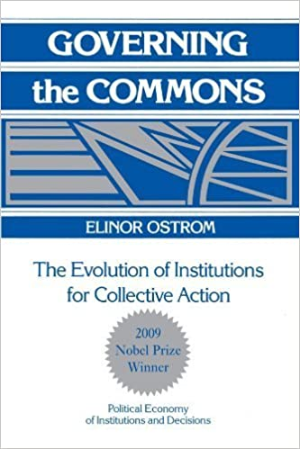

```{R, setup, include = F}
# devtools::install_github("dill/emoGG")
library(pacman)
p_load(
  broom, tidyverse,rmarkdown,
  ggplot2, ggthemes, ggforce, ggridges,
  latex2exp, viridis, extrafont, gridExtra,
  kableExtra, snakecase, janitor,
  data.table, dplyr, estimatr,
  lubridate, knitr, parallel,
  lfe,dslabs,
  here, magrittr,pammtools)

options(htmltools.dir.version = FALSE)

# Notes directory
dir_slides <- "/Users/zhouzhengqing/Desktop/SportsEconAnalysis/2024spring/Lec09"
# Define pink color
red_pink <- "#e64173"
turquoise <- "#20B2AA"
orange <- "#FFA500"
red <- "#fb6107"
blue <- "#3b3b9a"
green <- "#8bb174"
grey_light <- "grey70"
grey_mid <- "grey50"
grey_dark <- "grey20"
purple <- "#6A5ACD"
slate <- "#314f4f"
met_slate <- "#272822" # metropolis font color 

# Dark slate grey: #314f4f

# Knitr options
opts_chunk$set(
  comment = "#>",
  fig.align = "center",
  fig.height = 7,
  fig.width = 10.5,
  warning = F,
  message = F
)
opts_chunk$set(dev = "svg")
options(device = function(file, width, height) {
  svg(tempfile(), width = width, height = height)
})
options(crayon.enabled = F)
options(knitr.table.format = "html")
# A blank theme for ggplot
library("mosaic")
demand_1=function(x){10-x}
supply_1=function(x){x}

theme_slides <- theme_light() + 
  theme(
    text = element_text(family = "Fira Sans", size = 24)
  )
changes<-ggplot(data.frame(x=c(0,10)), aes(x=x))+
  stat_function(fun=demand_1, geom="line", size=2, color = "blue")+
    geom_label(aes(x=9,y=demand_1(9)), color = "blue", label="MSB", size = 8)+
  stat_function(fun=supply_1, geom="line", size=2, color = "#e64173")+
    geom_label(aes(x=9,y=supply_1(9)), color = "#e64173", label="MSC", size = 8)+
  geom_segment(x=0, xend=5, y=5, yend=5, size=1, linetype="dotted")+
  geom_segment(x=5, xend=5, y=0, yend=5, size=1, linetype="dotted")+
    scale_x_continuous(breaks=seq(0,10,1),
                     limits=c(0,10),
                     expand=expand_scale(mult=c(0,0.1)))+
  scale_y_continuous(breaks=seq(0,10,1),
                     limits=c(0,10),
                     expand=expand_scale(mult=c(0,0.1)),
                     labels = function(x){paste("$", x, sep="")})+
  labs(x = "Quantity (q)",
       y = "Price (p)")+
  theme_slides

theme_empty <- theme_bw() + theme(
  line = element_blank(),
  rect = element_blank(),
  strip.text = element_blank(),
  axis.text = element_blank(),
  plot.title = element_blank(),
  axis.title = element_blank(),
  plot.margin = structure(c(0, 0, -0.5, -1), unit = "lines", valid.unit = 3L, class = "unit"),
  legend.position = "none"
)
theme_simple <- theme_bw() + theme(
  line = element_blank(),
  panel.grid = element_blank(),
  rect = element_blank(),
  strip.text = element_blank(),
  axis.text.x = element_text(size = 18, family = "STIXGeneral"),
  axis.text.y = element_blank(),
  axis.ticks = element_blank(),
  plot.title = element_blank(),
  axis.title = element_blank(),
  # plot.margin = structure(c(0, 0, -1, -1), unit = "lines", valid.unit = 3L, class = "unit"),
  legend.position = "none"
)
theme_axes_math <- theme_void() + theme(
  text = element_text(family = "MathJax_Math"),
  axis.title = element_text(size = 22),
  axis.title.x = element_text(hjust = .95, margin = margin(0.15, 0, 0, 0, unit = "lines")),
  axis.title.y = element_text(vjust = .95, margin = margin(0, 0.15, 0, 0, unit = "lines")),
  axis.line = element_line(
    color = "grey70",
    size = 0.25,
    arrow = arrow(angle = 30, length = unit(0.15, "inches")
  )),
  plot.margin = structure(c(1, 0, 1, 0), unit = "lines", valid.unit = 3L, class = "unit"),
  legend.position = "none"
)
theme_axes_serif <- theme_void() + theme(
  text = element_text(family = "MathJax_Main"),
  axis.title = element_text(size = 22),
  axis.title.x = element_text(hjust = .95, margin = margin(0.15, 0, 0, 0, unit = "lines")),
  axis.title.y = element_text(vjust = .95, margin = margin(0, 0.15, 0, 0, unit = "lines")),
  axis.line = element_line(
    color = "grey70",
    size = 0.25,
    arrow = arrow(angle = 30, length = unit(0.15, "inches")
  )),
  plot.margin = structure(c(1, 0, 1, 0), unit = "lines", valid.unit = 3L, class = "unit"),
  legend.position = "none"
)
theme_axes <- theme_void() + theme(
  text = element_text(family = "Fira Sans Book"),
  axis.title = element_text(size = 18),
  axis.title.x = element_text(hjust = .95, margin = margin(0.15, 0, 0, 0, unit = "lines")),
  axis.title.y = element_text(vjust = .95, margin = margin(0, 0.15, 0, 0, unit = "lines")),
  axis.line = element_line(
    color = grey_light,
    size = 0.25,
    arrow = arrow(angle = 30, length = unit(0.15, "inches")
  )),
  plot.margin = structure(c(1, 0, 1, 0), unit = "lines", valid.unit = 3L, class = "unit"),
  legend.position = "none"
)
theme_market <- theme_bw() + theme(
  axis.line = element_line(color = met_slate),
  panel.grid = element_blank(),
  rect = element_blank(),
  strip.text = element_blank(),
  text = element_text(family = cnfont, color = met_slate, size = 17),
  axis.title.x = element_text(hjust = 1, size = 17),
  axis.title.y = element_text(hjust = 1, angle = 0, size = 17),
  # axis.text.x = element_text(size = 12),
  # axis.text.y = element_text(size = 12),
  axis.ticks = element_blank()
)
theme_gif <- theme_bw() + theme(
  axis.line = element_line(color = met_slate),
  panel.grid = element_blank(),
  rect = element_blank(),
  text = element_text(family = cnfont, color = met_slate, size = 17),
  axis.text.x = element_text(size = 12),
  axis.text.y = element_text(size = 12),
  axis.ticks = element_blank()
)

theme_goods <- theme_bw() + theme(
  axis.line = element_line(),
  panel.grid = element_blank(),
  rect = element_rect(size = 1),
  strip.text = element_blank(),
  text = element_text(size = 17, family = cnfont), 
  axis.text.x = element_text(size = 17),
  axis.text.y = element_text(size = 17, angle = 90, hjust = 0.5),
  axis.title.x = element_text(color = purple, size = 19),
  axis.title.y = element_text(color = red_pink, size = 19),
  axis.ticks = element_blank(),
  plot.title = element_blank(),
  legend.position = "none"
)
theme_game <- theme_bw() + theme(
  axis.line = element_line(),
  panel.grid = element_blank(),
  rect = element_rect(size = 1),
  strip.text = element_blank(),
  text = element_text(size = 20, family = cnfont), 
  axis.text.x = element_text(size = 20, color = met_slate),
  axis.text.y = element_text(size = 20, angle = 90, color = met_slate, hjust = 0.5),
  axis.title.x = element_text(color = met_slate, size = 20),
  axis.title.y = element_text(color = met_slate, size = 20),
  axis.ticks = element_blank(),
  plot.title = element_blank(),
  legend.position = "none"
)

shift_axis <- function(p, y=0){
  g <- ggplotGrob(p)
  dummy <- data.frame(y=y)
  ax <- g[["grobs"]][g$layout$name == "axis-b"][[1]]
  p + annotation_custom(grid::grobTree(ax, vp = grid::viewport(y=1, height=sum(ax$height))), 
                        ymax=y, ymin=y) +
    geom_hline(aes(yintercept=y), data = dummy, size = 0.5, color = met_slate) +
    theme(axis.text.x = element_blank(), 
          axis.ticks.x = element_blank())
}
wrapper <- function(x, ...) paste(strwrap(x, ...), collapse = "\n")
game_box_1 <- function(x) 5 - x
game_box_2 <- function(x) 10 - x
game_box_3 <- function(x) 15 - x
w <- seq(0, 5, 0.01)
z <- seq(5, 10, 0.01)
# functions
demand <- function(x) 10 - x
demand_2 <- function(x) 9 - x
demand_3 <- function(x) 8 - x
demand_inc <- function(x) 11 - x
demand_dec <- function(x) 5 - x
supply <- function(x) 1 + (4/5)*x
step_demand <- tibble(x = c(0, 1, 2, 3, 4, 5, 6, 7, 8), mv = c(8, 7, 6, 5, 4, 3, 2, 1, 0))
step_demand2 <- tibble(x = c(0, 1, 2, 3, 4, 5, 6, 7, 8, 9, 10, 11, 12), mv = c(10, 10, 9, 9, 8, 8, 7, 7, 6, 6, 5, 4, 4))
step_supply <- tibble(x = c(0, 1, 2, 3, 4, 5, 6, 7, 8, 9, 10, 11, 12), mv = c(2, 2, 3, 3, 4, 4, 5, 5, 6, 6, 7, 8, 8))
step_supply_tax <- step_supply %>% 
  mutate(mv = mv + 2)

# data <- read_csv("/Users/zhouzhengqing/Desktop/SportsEconAnalysis/Activity_Pit_Market/Results.csv") %>% 
#   dplyr::filter(!is.na(price))

theme_set(theme_gray(base_size = 20))
# Column names for regression results
reg_columns <- c("Term", "Est.", "S.E.", "t stat.", "p-Value")
# Function for formatting p values
format_pvi <- function(pv) {
  return(ifelse(
    pv < 0.0001,
    "<0.0001",
    round(pv, 4) %>% format(scientific = F)
  ))
}
format_pv <- function(pvs) lapply(X = pvs, FUN = format_pvi) %>% unlist()
# Tidy regression results table
tidy_table <- function(x, terms, highlight_row = 1, highlight_color = "black", highlight_bold = T, digits = c(NA, 3, 3, 2, 5), title = NULL) {
  x %>%
    tidy() %>%
    select(1:5) %>%
    mutate(
      term = terms,
      p.value = p.value %>% format_pv()
    ) %>%
    kable(
      col.names = reg_columns,
      escape = F,
      digits = digits,
      caption = title
    ) %>%
    kable_styling(font_size = 20) %>%
    row_spec(1:nrow(tidy(x)), background = "white") %>%
    row_spec(highlight_row, bold = highlight_bold, color = highlight_color)
}

```

class:center,middle, inverse

# 市场失灵

Market failures

---
### 市场失灵
- **体育场馆建设的市场失灵**：
  
  - 表现为公共资金的使用低效率、竞争恶性循环等造成了市场效率和福利损失 → 为什么？

--

- 在市场分析中，我们已经知道：
  - 完全竞争市场 → 社会总剩余最大化
  - 独占市场中 → 无谓损失 + 社会总剩余损失
  
- 之前单元分析对象要么是**市场本身**，要么是**市场内部的经济单位**
  - **隐含假定**：每个市场行为人在进行消费和生产决策时**无需顾虑他人行为后果**
  - **放宽 → 隐含假定**：
  - 市场主体决策的时候，必须考虑该市场或者其他市场的主体带来的影响


---
### 市场失灵 Market Failure

#### 定义

> 监管不充分的市场无法达到最大化社会总剩余，即市场效率低下

--

#### 原因

1. 市场力量导致 Market power
2. 产权缺失导致 Absence of property rights
  - **外部性 Externalities**<sup>.hi-pink[†]</sup>
  - 公共物品 Public goods 
3. 信息不对称导致 Asymmetric information

.footnote[<sup>.hi-pink[†]</sup> 我通常把公共物品与信息不对称视为外部性的**特例**]

!!! 会叠加 !!!

---
class:center,middle, inverse

# 认识外部性 
Exter'nalities

---
### 外部性

- 定义：经济活动对局外人产生的溢出成本或者溢出收益
  - **经济单位**而且**至少两个**：个人或者厂商；消费者或者生产者
  - **可正可负** → 正的代表一个单位行为直接造成另一单位的福利增加
      - 负外部性代表存在**外部成本**(external costs)；正外部性代表存在**外部收益**(external benefits)
  - **消费性**或**生产性**：赛事堵车是消费性的、建造场馆设施是生产性的
  - **直接性**：.hi-purple[不透过]市场机制或价格信号
      - 通过价格机制，只要相关条件满足且市场达到**帕累托最优状态**，新均衡仍然是有经济效率的
      - 例如，若害怕拥堵而减少看比赛，使得门票价格下降，便会降低球队收入与福利，就**不是外生性**；因为门票需求减少，改善了场地周边的交通和环境污染则是**负外部性减少**
  - **相互性**：与**财产权**(property right)的判定密切关联
      - 如：二手烟与清洁空气权

---
### 回忆

- 完全竞争市场下，工厂生产扩大直到： $MC=MR=P$ 
  - 代表性厂商的 $MC$ 右上倾斜， 加总得到行业供给曲线依然右上倾斜
  - 行业需求是所有代表性消费者需求的加总 → 右下倾斜 → 决定了市场价格  $P$  → 代表性厂商 $MR$ 是水平的
  
- 长期均衡状态下：
  - 经济利润 **Economic profit** → 0
  - 生产有效状态 **Productive efficiency**： $P=AC^{long}_{min}$ 
  - 配置有效状态 **Allocative efficiency**： $P=MC$ 同时  $(CS+PS)_{max}$
      - $边际收益MB=边际成本MC$ → 通过将资源分配给最有价值的用途，可以最大化资源的**社会价值**！
        - 资源从最不重视它们的人（最低**接受意愿**WTA）流向最重视它们的人（最高**支付意愿**WTP）
          - 创造了 $WTP - P = CS；WTA - MC = PS$

---
### 题外话：生产效率与配置效率

https://mp.weixin.qq.com/s/OoVOaQ0l233vAL07Zxtfzg

- 生产效率（Productive esfficiency）关注的是从给定的资源存量中可以生产出多少产品。一个经济实体(个人、公司或国家)如果使用“成本最低”的生产方式，就被称为生产效率高。

- 配置效率（Allocative efficiency）。当资源被分配到最有价值的用途时，配置效率就实现了。这是通过消费者对商品或服务的价值来衡量的(反映在他们愿意支付的价格上)。基本理念是，当资源流向出价最高的人时（这是其价值最高的用途)，总经济福利最大化，即达到配置效率

---
### 题外话：生产效率与配置效率


---
### 题外话：生产效率与配置效率


---
### 题外话：市场结构 → 生产效率与配置效率


---
### 需求与供给的另一面（不存在外部性）: 社会收益 & 社会成本

.pull-left[

```{r, echo=F, fig.width=10,fig.height=10}

changes
```

]

.pull-right[

- .hi-blue[需求: 边际社会收益 (marginal social benefit，MSB)]
  - 消费行为对消费者带来的价值

- .hi-pink[供给: 边际社会成本( marginal social cost，MSC)]
  - 生产行为将资源从其他用途中抽离出的机会成本
- **均衡状态**: $MSB=MSC$

  - 使用效率的最大, 没有其他更好的替代使用
]

---

### 需求与供给的另一面（不存在外部性）: 社会收益 & 社会成本

.pull-left[

```{r, echo=F, fig.width=10,fig.height=10}

changes
```

]

.pull-right[
.small[
- .hi[理想的社会计价原则：按**产品或服务使用计酬**] → 配置资源
  - 消费侧在市场定位成本：你消费了产品，就要补偿它的社会边际成本（是一种社会机会，其他人使用机会）
  - 供给侧在市场定位收益：社会应该补偿你所创造的边际收益

- 当市场运行良好时，利润率可以作为一种激励措施，以促进企业和个人承担更多社会责任，同时奖励那些为社会带来正面影响的行为，惩罚那些导致负面社会影响的行为。
  - 与责任responsibility；奖励reward/惩罚punishment

]
]

---

### 需求与供给的另一面（不存在外部性）: 社会收益 & 社会成本

.pull-left[

```{r, echo=F, fig.width=10,fig.height=10}

changes
```

]

.pull-right[

- 价格体系引导人们行为 
  - 是否进入并与现任者竞争 
  - 发现新赛道 → 企业家精神

- .hi[**金钱外部性（money  externalities）**]：当购买一件商品的人越多，越对他人造成负面市场影响的情况 → 对他人财务状况的负影响

  - 那么这是真正的外部性么？
  - 任何市场行为几乎都有外部性
  ]

---
### 外部性会作用在哪里？

- 假设市场结构依然是完全竞争：**存在负外部性时，均衡结果不再最有效率**
  - 生产性负外部性 → 作用在 MC 上
      
      - 供给曲线MC → 边际社会成本MSC=私人边际成本MPC + 边际**负外部性**

  -  消费性正外部性 → 作用在 **私人边际收益MPB（mrgnl privt benefit）** 上
      - 需求曲线MPB → 边际社会收益MSB = 私人边际收益MPB + 边际**正外部性**

---

### 方法论：经济学家喜欢上帝视角

- **Social optimal** vs. **Decentralized (market) equi'librium**
  
  - Where are market failures?
  
  - What are differences?
  
  - How to correct it?

---
### 理解消费的负外部性

.left[
- 假设1 个消费者，边际社会收益要从MPB中**扣除**MSD → **边际社会收益**MSB(marginal social benefit) 
- 结果 $x_c$ 变为 $x_s$ (MSB=MC决定) ，原本市场决策数量**超过**了社会最适消费数量
- $x_s$ 下的社会总体损失是多少? 
]
.right[

]

---
### 理解消费的负外部性
.center[

]

- 上述结论扩展到整个行业依然成立(MC成为单调递增)
- 同理，推广到消费的正外部性
- 市场均衡数量与社会最适数量不一致根本原因是：**消费者没有将外部性纳入消费决策**


---
### 练习(5')

- 图示解释，理解生产负外部性

- 判断是否是外部性及其正负，同时判断属于生产还是消费？

  1.高尔夫球场每天维护需要大量用水 →     在热带国家过度取水，导致土地盐碱化

  2.球队购买超级明星，导致增加该俱乐部市场影响力和门票收入

  3.超级明星带来联赛整个联赛的影响力和市场吸引力，带来电视转播权增加，但球队并未获得相应补偿

  4.球队买通裁判，导致比赛结果事先确定，该行为获得了比赛胜利与收益，但其行为造成对方球队付出代价，还使得联盟、协会、观众、赞助商、电视转播商等联赛利益相关者付出代价，但这些相关者并未因为“黑哨”获得补偿


---
class:middle,center
### 是否该补贴 Sofi Stadium 

<video controls width="900" height="500">
  <source src="./video/sofi1.mp4" type="video/mp4">
</video>


---
class:center,middle, inverse

# 外部性的解决方案

Externalities Solution

---
### 无论  .bb[私人解决方案] 还是 .bb[政府解决方案] 的逻辑


- 负外部性时 → 过多
- 正外部性时 → 过少

- 无论政府还是私人的解决方案，都有一个核心主题: 

  - **外部性问题内部化**：除了考虑自己的收益和成本，同时将为其他人带来的成本和收益全部考量
  
  - 关键问题是私人自愿揭露还是他人施加？

---
### 庇古系 vs 科斯系

#### 庇古的外部性理论:

1. 庇古认为,外部性是市场失灵的表现,会导致资源配置的无效率
2. 主张政府应该通过征税或补贴等方式进行干预,以内部化外部性,使市场达到最优均衡。
3. 庇古税(Pigovian Tax)就是根据外部成本向造成负外部性的一方征收税款,以矫正资源配置扭曲。

#### 科斯的外部性理论:

1. 科斯认为,只要财产权明晰,交易费用为零,外部性问题就可以通过市场自发地解决,无需政府干预。
2. 他提出了著名的**科斯定理**,认为在财产权明晰且交易成本为零时,不管财产权初始分配如何,通过自愿交易可实现资源的最优配置。
3. 科斯主张通过协商和交易解决外部性,而不赞成庇古税那样的政府干预。

#### 总体

- 庇古侧重于政府干预以矫正外部性,科斯则强调市场机制和产权界定在解决外部性中的作用。
- 庇古的理论在现实中更多被采纳,如环境税等。而科斯的理论对产权制度的完善和交易成本的降低提出了更高要求,在现实中往往难以完全满足

---
### 私人解决方案I：谈判

- 谈判机制有效的前提依据的是**科斯定理**

  - .bb[**通过自愿协商分配产权**]。科斯（Ronald Coase）思想：在1960年的《社会成本问题》中，通过交易成本的选择和私人谈判、私有产权适当界定、签订可执行合同的方式来解决外部性问题 

- 那么**科斯定理**成立的前提是？
      - 当事人必须能够进行谈判，交易成本不能太大
      - 产权能够清晰界定
      - 谈判双方的人数不能涉及太多
      - 策略性行为和信息不对称
    
  - 财产权可能恶化收入分配差距

---
### 私人解决方案II：做正确的事

  - 斯蒂格利茨（Joseph Stiglitz）思想，**社会准则**或**道德约束**来解决外部性问题
  
    - 社会、道德和舆论压力可以影响个体行为，使得他们更加意识到自己的行为可能对他人造成负面影响
    
    - 鼓励社会发生、政府引导舆论方向：NGO、环保组织、动物保护协会、道德教育


---
### 政府解决方案I

1. .bb[**矫正性税收**]。（Arthur Cecil Pigou）思想：负外部性时，征收特别税收增加生产的成本，从而抑制消费或者生产
  - step1：估计边际外部成本是多少
  - step2：征收等于边际外部成本的税款
  
1. .bb[**矫正性补贴**]。政府补贴创新、助学贷款等


---
### 政府解决方案II

- 基于市场的政策：政府为民间组织提供激励，内在化其外部性

1. .bb[**命令控制型政策**]。直接控制资源分配 → 限制技术、限制生产数量
  - **行政管制**。
  -  **法律与监管**。限定配额或者行政处罚等方式
  - 斯蒂格勒（George Stigler，芝加哥学派代表性人物）思想：采取总量控制或发放生产许可证。其中许可证是可以转让的，通过市场进行交易 → 无法通过税收实现

---
### 其他解决方案

  - .bb[企业合并]：将外部性产生者与承受者联合一体，实现内部化。比如[中体产业集团](https://www.csig158.com/)是商业设施的所有者、奥林匹克花园的开发商，通过将大型场馆设施的建设、运营和商业开发整合，部分实现场地设施外部性的内部化

---
### 思考：如何测量外部性的货币价值？

- 研究商品价格如何收到空气质量的影响

  - 1970 年，《清洁空气法案》提出后，空气明显改善，在县级人均收入没有改变的情况下，房价明显提升。估计，房价增加大概带来 450 亿元的价值影响

- 体育设施、体育赛事的外部性如何估算？

---
class:center,middle, inverse

# 庇古 还是 科斯

Pigou or Coase

---
### 瑜伽房 与 KTV 的争议

1. 分成两组
2. 假设你和你的搭档是相邻的体育相关企业：一个瑜伽房和一个KTV
  - 和你的搭档协商好谁经营瑜伽房，谁经营KTV

3. KTV的噪音让健身房的客户感到不满，导致瑜伽房失去会员，估计损失 40万元

 - **必须**就资源分配（如隔音设施安装费）达成共识

---
class: clear-slide,middle

.pull-left[
```{r, echo=F, echo = F, escape = F}
tab <- data.frame(
  v1 = c("法院将产权判给了瑜伽房老板"),
  v2 = c("法院将财产权判给了 KTV 经理")
) %>% kable(
  escape = F,
  col.names = c("房间左侧", "房间右侧"),
  align = c("c", "c")
) %>%
  kable_styling() %>% 
  row_spec(1, extra_css = "line-height: 110%;")
tab 
```

- KTV的噪音让瑜伽房无法做生意，估计损失 40万元

- 建造隔音墙需要花费 30万元

- KTV 搬迁需要花费 90万元
]

.pull-right[

问：结果是什么？ 

> **A**. KTV搬家

> **B**. KTV 经理赔偿瑜伽房的损失

> **C**. 瑜伽房老板支付KTV经理搬迁费

> **D**. 某人建造隔音墙

]

---

### 庇古解决方案

.left-column[
.center[


A.C. Pigou

1877-1959
]
]

.right-column[

- 1920, *The Economics of Welfare*
- 外部性：.hi-red[边际私人成本/收益 与 社会成本/收益  之差] 
- 人们应该为自己的行为产生的外部性买单 
  - 市场会让你自动这样做：在理想情况下，市场会自动纳入外部性的成本或收益
      - 例如，如果消费者对某种产品的负面外部性感到不满，他们可能会减少购买量，这可能会迫使生产商改善产品或减少外部性。
  - 如果市场失败，政策可以迫使市场重新运作
      - 政府可以通过政策干预来纠正市场失灵，例如征收污染税、实施排放配额等。这些政策可以迫使市场重新考虑外部性，并在一定程度上修正市场的运作。
- 外部性的问题在于 .hi-purple[缺少正确的价格！]
]

---

### 生产负外部性

.pull-left[

```{r, echo=F, fig.width=10,fig.height=10}
supply_up=function(x){x-2}

changes+
  stat_function(fun=supply_up, geom="line", size=2, color = "#fb6107")+
    geom_label(aes(x=9,y=supply_up(9)), color = "#fb6107", label="MPC", size = 8)+
  geom_segment(x=0, xend=6, y=4, yend=4, size=1, linetype="dotted")+
  geom_segment(x=6, xend=6, y=0, yend=4, size=1, linetype="dotted")+
  geom_point(aes(x = c(5,6),
                 y = c(5,4)),
             size = 4)+
  geom_text(x=5,y=5.5, label="A", size=8)+
  geom_text(x=6,y=4.5, label="B", size=8)
```

]

.pull-right[

- 生产者的.hi-pink[边际私人成本]低于社会承担的 .hi-red[边际社会成本]

]

---

### 生产负外部性

.pull-left[

```{r, echo=F, fig.width=10,fig.height=10}
changes+
  stat_function(fun=supply_up, geom="line", size=2, color = "#fb6107")+
    geom_label(aes(x=9,y=supply_up(9)), color = "#fb6107", label="MPC", size = 8)+
  geom_segment(x=0, xend=6, y=4, yend=4, size=1, linetype="dotted")+
  geom_segment(x=6, xend=6, y=0, yend=4, size=1, linetype="dotted")+
  geom_point(aes(x = c(5,6),
                 y = c(5,4)),
             size = 4)+
  geom_text(x=5,y=5.5, label="A", size=8)+
  geom_text(x=6,y=4.5, label="B", size=8)+
  
  annotate("segment", x = 6, xend = 6, y = 4, yend = 6, colour = "purple", size=2, alpha=1, arrow=arrow(length=unit(0.5,"cm"), ends="both", type="closed"))+
  geom_label(x=8, y=5, label="External Cost", color = "purple", size =8)+
    geom_segment(x=0, xend=6, y=6, yend=6, size=1, linetype="dotted")


```

]

.pull-right[

- 生产者的.hi-pink[边际私人成本]低于社会承担的 .hi-red[边际社会成本]
- 在**市场（去中心化）均衡状态**（B）中，商品或服务的供应量 $q$ 过大，价格 $p$ 过低，这与**社会最优状态**（A）相比显著不同。

- 外部成本导致的生产过剩
]

---

### 生产负外部性

.pull-left[

```{r, echo=F, fig.width=10,fig.height=10}
dwl_neg<-tribble(
  ~x, ~y,
  5, 5,
  6, 6,
  6, 4
)

changes+
  geom_polygon(data = dwl_neg,
               aes(x = x,
                   y = y),
               fill = "black",
               alpha = 0.7)+
  stat_function(fun=supply_up, geom="line", size=2, color = "#fb6107")+
    geom_label(aes(x=9,y=supply_up(9)), color = "#fb6107", label="MPC", size = 8)+
  geom_segment(x=0, xend=6, y=4, yend=4, size=1, linetype="dotted")+
  geom_segment(x=6, xend=6, y=0, yend=4, size=1, linetype="dotted")+
  geom_point(aes(x = c(5,6),
                 y = c(5,4)),
             size = 4)+
  geom_text(x=5,y=5.5, label="A", size=8)+
  geom_text(x=6,y=4.5, label="B", size=8)+
  
  annotate("segment", x = 6, xend = 6, y = 4, yend = 6, colour = "purple", size=2, alpha=1, arrow=arrow(length=unit(0.5,"cm"), ends="both", type="closed"))+
  geom_label(x=8, y=5, label="External Cost", color = "purple", size =8)+
    geom_segment(x=0, xend=6, y=6, yend=6, size=1, linetype="dotted")
```

]

.pull-right[

- 生产者的.hi-pink[边际私人成本]低于社会承担的 .hi-red[边际社会成本]

- 在**市场（去中心化）均衡状态**（B）中，商品或服务的供应量 $q$ 过大，价格 $p$ 过低，这与**社会最优状态**（A）相比显著不同。

- 外部成本导致的生产过剩

- 生产过剩造成的无谓损失

]

---

### 生产负外部性：庇古观点（传统）

.left-column[
.center[


A.C. Pigou

1877-1959
]
]

.right-column[

- 针对外部性的政策解决方案应 .hi-purple[关注缺失的价格] 
  
  - 针对性地制定政策以创造或修改价格`
  
  - “庇古”税或补贴
]

---

### 生产负外部性：庇古观点（传统）

.pull-left[

```{r, echo=F, fig.width=10,fig.height=10}
ggplot(data.frame(x=c(0,10)), aes(x=x))+
  stat_function(fun=demand_1, geom="line", size=2, color = "blue")+
    geom_label(aes(x=9,y=demand_1(9)), color = "blue", label="MSB", size = 8)+
  stat_function(fun=supply_1, geom="line", size=2, color = "red")+
    geom_label(aes(x=9,y=supply_1(9)), color = "red", label="MSC=MPC+t", size = 8)+
  geom_segment(x=0, xend=5, y=5, yend=5, size=1, linetype="dotted")+
  geom_segment(x=5, xend=5, y=0, yend=5, size=1, linetype="dotted")+
    scale_x_continuous(breaks=seq(0,10,1),
                     limits=c(0,10),
                     expand=expand_scale(mult=c(0,0.1)))+
  scale_y_continuous(breaks=seq(0,10,1),
                     limits=c(0,10),
                     expand=expand_scale(mult=c(0,0.1)),
                     labels = function(x){paste("$", x, sep="")})+
  labs(x = "Quantity (q)",
       y = "Price (p)")+
  theme_slides
```

]

.pull-right[

- 设置特别税率
$$t = MSC-MPC$$

- 消除 DWL

- .hi-purple[外部性内部化] 进入价格体系

- 生产者（和消费者）现在考虑了对社会的真实成本

  - $MPC$ ( + tax) $=MSC$
]


---
class: middle
### 外部性的法律裁决

.pull-left[
.small[
- 大部分外部性问题在美国司法系统中使用**普通法 common law**
-  **由法院评估损害**：损害程度 → 评估个人的行为是否对他人产生了负面影响
- 两种偿方式：
  - **补偿性赔偿 compensatory： damages**：尽可能恢复受害者到伤害前状况
  - **惩罚性赔偿 punitive damages**：阻止施害者行为的**发生**

- **执法有效性的保证**：很大程度上依赖于产权的清晰性和执行力

]
]

.pull-right[
.center[

]
]

---
### 产权的重要性

.pull-left[
.small[
> .hi[财产]是**一组**法律权利，所有者可以自由行使，并且其行使**不受他人干涉**的保护

- **一组权利**包含了：

> 拥有possess、使用use、开发develop、改进improve、转化transform、消耗consume、耗尽deplete、破坏destroy、出售sell、捐赠donate、遗赠bequeath、转让transfer，抵押mortgage，租赁lease，借贷loan或排除他人exclude others


]

.source[Coooter, Robert 和 Douglas Ulen, 2012, 法与经济学, 6<sup>th</sup> ed.]
]

.pull-right[
.center[

]
]

---
### 财产权的三件要素对经济产生影响

.pull-left[
.small[

- **非人格化的(impersonal)依附性**。旧社会的财产权与身份地位绑定 → 有利于促进市场交易和经济发展

- 业主对其财产享**有完全的支配权**。政府不得任意干预剥夺。只有财产权得到有效保护,市场主体才有积极性去创造财富。当然,财产权的行使不能违反法律法规,损害社会公共利益

- 产权的**排他性**特征。他人被禁止干涉业主行使其权利

]

.source[Coooter, Robert 和 Douglas Ulen, 2012, 法与经济学, 6<sup>th</sup> ed.]
]

.pull-right[
.center[

]
]


---

class:center,middle, inverse

# 应用：污染(生产性负外部性)

Pollution

---
### 背景

上游养猪场 $x$ 和下游养鱼场 $y$ 的情景，其中养猪场的排放（猪粪 $z$）对河流造成污染，这种污染影响了下游养鱼场的运营成本。以下是对模型的更为清晰和精简的刻画：

1. **生产与成本函数：**
   - 养猪场的生产成本 $c^x$ 依赖于其生产量 $x$ 和排放量 $z$，具体为 $c^x(x, z)$。生产成本随生产量增加而增加，且边际成本递增。排放量 $z$ 越大，养猪场的处理成本越低，但节省效果递减。
   - 养鱼场的成本 $c^y$ 依赖于其生产量 $y$ 和受到的污染 $z$，具体为 $c^y(y, z)$。成本随生产量和污染程度增加而增加，且两者的边际成本都在增加。

2. **利润函数：**
   - 养猪场的利润 $\pi^x$ 由其产品市场价格 $p_x$ 乘以生产量 $x$ 减去成本 $c^x(x, z)$ 确定。
   - 养鱼场的利润 $\pi^y$ 由其产品市场价格 $p_y$ 乘以生产量 $y$ 减去成本 $c^y(y, z)$ 确定。

???
- 生产成本函数分别为
$\begin{aligned} & c^x=c^x(x, z), \frac{\partial c^x}{\partial x}>0, \frac{\partial^2 c^x}{\partial x^2}>0, \frac{\partial c^x}{\partial z}<0, \frac{\partial^2 c^x}{\partial z^2} \geq 0 \\ & c^y=c^y(y, z), \frac{\partial c^y}{\partial y}>0, \frac{\partial^2 c^y}{\partial y^2}>0, \frac{\partial c^y}{\partial z}>0, \frac{\partial^2 c^y}{\partial z^2}>0\end{aligned}$
- 利润函数分别为 $\begin{aligned} & \pi^x=p_x x-c^x(x, z) \\ & \pi^y=p_y y-c^y(y, z)\end{aligned}$

---
### 背景

3. **决策过程与边际收益：**

   - 两家厂商都是价格接受者，即他们不能控制市场价格。养猪场和养鱼场的生产决策使得他们的边际成本等于市场价格，从而实现利润最大化。
   
   - 由于污染对双方的利益均有影响，因此仅核算污染给养猪厂带来的**私人边际收益（MPB）**：其增加一单位污染排放能降低的生产成本，计算为 $\frac{\partial \pi^x}{\partial z} = -\frac{\partial c^x}{\partial z}$。


???
- 猪粪排泄到河流中科防污设备成本(假设节省成本的效果是递减的)，但下游养鱼厂的边际成本会增加

- 假定2家均为产品市场价格接受者，则决策过程为
$\frac{\partial \pi^x}{\partial x}=p_x-\frac{\partial c^x}{\partial x}=0, \frac{\partial \pi^y}{\partial y}=p_y-\frac{\partial c^y}{\partial y}=0, \frac{\partial \pi^x}{\partial z}=-\frac{\partial c^x}{\partial z}=0$
(前2式分别表示2家厂商必须生产到边际成本等价格的水准，会获得利润最大化)
- .bb[私人边际收益(MPB)] 就是养猪厂增加1单位污染排放量可以降低的产品X的生产成本 $\frac{\partial \pi^x}{\partial z}=-\frac{\partial c^x}{\partial z}$ 


---
### 应用：整治污染(生产性外部性)

.left[

#### 去中心化决策（由两家厂商独立决策）
- 养猪场将基于私人利益进行污染排放的决策。当私人边际收益（MPB）等于零时，表明增加一单位污染对养猪场的成本节约已经没有增加效果，即 $-\frac{\partial c^x}{\partial z} = 0$ 

- 此时对养鱼场来说，意味着其所承受的污染伤害达到最高，即**边际社会损害（MSD）**（养鱼场因增加一单位污染而增加的成本）最大，为 $\frac{\partial c^y}{\partial z}$ 

- 去中心化决策时养猪场不会考虑其污染对养鱼场造成的社会损害 → 导致养鱼厂福利的减少

]


.right[

]

---
### 应用：整治污染(生产性外部性)
#### 为什么.bb[内部化]可以解决? 
1. **合并后的利润函数：**
   - 合并后，公司的利润函数变为 $\pi = p_x x + p_y y - c^x(x, z) - c^y(y, z)$。这意味着公司现在同时考虑养猪和养鱼的收入与成本。
2. **决策调整：**
   - 在合并后，决策过程中包括了 $\frac{\partial \pi}{\partial x} = 0$ 和 $\frac{\partial \pi}{\partial y} = 0$，这与之前相同，确保了每个产品的生产都达到边际成本等于价格的水平。
   - 关键的变化在于污染决策 $\frac{\partial \pi}{\partial z} = -\frac{\partial c^x}{\partial z} - \frac{\partial c^y}{\partial z} = 0$。这个条件意味着污染的边际私人收益（节省来自养猪场的成本）必须刚好等于边际社会成本（增加的养鱼场成本）。
3. **社会最适排污量 $z_s$：**
   - 当 $\frac{\partial c^x}{\partial z} = -\frac{\partial c^y}{\partial z}$ 时，实现了边际私人收益等于边际社会损害的条件，这就是社会最优的污染水平 $z_s$。这意味着污染量在此水平时，社会总福利（收益减成本）最大化。
4. **极端情况的处理：**
   - 如果负外部性非常强，即 $MSD \gg MPB$ → ?

---
### 应用：整治污染(生产性外部性)
#### 为什么.bb[内部化]可以解决?

- .bb[只要2厂商生产决策影响彼此利润，通过合并或合作，可以获得较独自行动更大的总利润 → 1+1>2]

- 但该模型过于理想化

  - 养猪厂的MSD就是对下游养鱼厂的利润损害 <br> .mono[<==>] 没有牵涉到**第三方利益**，负外部性的社会福利损害就等同于对下游私人厂商的利润损害 → 因此通过.bb[合并]可以实现利润扩大 <br> → 暗含着.bb[科斯定理]的思想

---
### 应用：整治污染(生产性外部性)
#### 为什么.bb[政府收税]可以解决?

1. **价格机制失灵的原因：**
   - 将粪便视为要素时，养猪场在选择排泄量 $z_0$ 时的边际要素成本（MFC，Marginal Factor Cost）为零，因为排放污染本身对养猪场没有直接成本。这种情况下，价格机制失灵，因为它没有反映排放对社会造成的真实成本。
2. **庇古税的原理与实施：**
   - 政府可以设立一个税率 $t$，使得排泄物的**边际私人成本**（税后成本）等于其**边际社会损害** $MSD$。这个税率应当设为对下游厂商（养鱼场）造成的边际损害，即 $t = -\frac{\partial c^y}{\partial z}$。
   - 这种税的征收改变了养猪场关于排泄量的决策：养猪场现在需要支付额外的税费，因此排泄物的边际成本不再是零，而是等于税率 $t$。

---
### 应用：整治污染(生产性外部性)
#### 为什么.bb[政府收税]可以解决?

3. **经济激励的调整：**
   - 当政府征收庇古税后，养猪场的利润函数变为 $\pi^x = p_x x - c^x(x, z) - t z$。这迫使养猪场在决策时考虑到排泄对社会的成本。
   - 在税后，养猪场的排泄量决策需满足 $\frac{\partial \pi^x}{\partial z} = -\frac{\partial c^x}{\partial z} - t = 0$，这意味着污染量会比没有征税的情况 $z_0$ 更小，从而减少了总体的环境损害。
4. **社会最优排放量的实现：**
   - 如果税率被正确设置，与社会最优排放量 $z_s$ 相对应的税收会使得养猪场的边际私人成本等于其边际社会损害。这样，税后的污染水平应接近或等于社会最优水平，从而实现社会福利的最大化
5. 现实情况：这种税收政策在理论上非常美好，但其成功实施需要准确评估污染的社会成本，并设立合适的税率，同时考虑实施中的行政成本和可能的市场反应


---
### 应用：整治污染(生产性外部性)
#### 为什么还需要.bb[行政管制]?

 税率确定的困难性
- **精确性**：正确设定庇古税需要精确知道社会最适污染量 $z_s$ 和相关的社会损害 $MSD$
- **实际的挑战**：即使理论上可以设定正确的税率，实际中的执行也可能受到避税、欺诈等行为的影响，降低政策的有效性 → 暗访、突击检查等

复杂的外部性源头
- **多元化的污染源和受害者**：现实中，污染的源头和受影响的群体通常不止一个，不同类型的污染（如空气、水、土壤污染）可能需要不同的管理策略。庇古税可能难以针对所有类型的污染制定有效的税率
- **不同污染的交互作用**：不同的污染源之间可能存在交互作用，使得单一税率难以反映所有外部成本

---
### 应用：整治污染(生产性外部性)
#### 为什么还需要.bb[行政管制]?

行政管制的优势
- **直接性和明确性**：行政管制如排放标准和直接限制提供了清晰的法规界限，为企业和个人提供明确的环境保护要求
- **更容易实施和监管**：设定具体的排放限制或操作标准比起试图通过税率影响行为更直接，容易监督和执行
- **适应性和灵活性**：根据不同行业和区域的具体情况调整，更具有针对性和适应性

税收与管制的比较
- 税收和管制选择哪一种取决于政策目标、可用信息的质量、行政资源、法律框架等
  - 税收通过**经济激励**改变行为，更适合于可以**量化**外部成本和收益的情况
  - 管制则在那些需要**立即和明确**减少污染的情况下更有效，特别是在难以科学界定限制的情况下

---
### 应用：整治污染(生产性外部性)
.less-right[

]
.center[在信息不完全情况下，.bb[<br>征税更有效]]

**政府税率和征税的影响：**
   
   - 政府设定一个统一的税率 $t$，影响两个养猪厂的排污行为。每家厂的最优排放量 $z_1$ 和 $z_2$ 可能根据其边际私人收益 $MPB_1$ 和 $MPB_2$ 而不同 → 排污量不同
   
   - 税收的目标是使每家厂的边际私人成本等于边际社会损害，即 $t = -MSD$，理想情况下应当促使每个厂商减少其污染到社会最优水平。

---
### 应用：整治污染(生产性外部性)
.less-right[

]
.center[在信息不完全情况下，.bb[<br>征税更有效]]

**行政管制的设定与影响：**
   
   - 政府不知道每家的 $MPB$，因此它不能为每家定制个性化的排污限额来达到预期目标。
   - 相反，它设定一个平均排污标准 $z_3$，这个标准等于两家厂商当前总排污量的一半
   - 这种“一刀切”的方法可能导致资源配置不最优，原因是：
    
    - 第二家厂的排污量减少，如果 $z_3 < z_2$，则第二家厂的利润会因为减少排污而减少（B）
    - 第一家厂如果 $z_3 > z_1$，则其利润可能增加（A）

---
### 应用：整治污染(生产性外部性)
.less-right[

]
.center[在信息不对称情况下，.bb[<br>征税更有效]]

**社会福利的计算与误区：**

   - 如果考虑社会总福利，仅从总排污量保持不变来评估的话，可能会有误导。真实的社会福利应该考虑**环境损害的减少**和**生产效率的提高**。原因是：

   - 当B>A时，即第二家厂的利润减少大于第一家的增加，社会总福利相较于征税而言减少
   - 在实际政策制定中，可能需要结合这两种方法，或者采用更灵活的政策工具来解决这种信息不对称和效率问题，确保环境保护的同时也优化经济效益。


---
### 应用：整治污染(生产性外部性)
#### 为什么有时候.bb[仍采用行政管制]?

.right[

]
.center[伤害更快、更大时，.bb[<br> 管制更有效率]]
.left[
- 图示解释：MSD相较于MPB更陡峭 → 排污带来的社会损害比私人收益增长的更快
- **征税**：政府制定税率 $t_0$ 比理想的庇古税 $t_s$ 更低，导致上游排放量 $z_0$ 高于最优排放量 $z_s$ ，产生了大量社会损失（区域eab）
- **管制**：政府设置排放标准 $z_1$ ，即使该标准高于 $z_s$ ，但是它比 $z_0$ 的福利损失小很多（区域ecd）
- 外部性社会危害程度，政府应尽可能了解的更多
]

---
### 应用：整治污染(生产性外部性)
#### .bb[政府]还有其他选择么?

.less-right[

]
.center[征税不可行时，还可以.bb[可交易的排放许可!]]
.more-left[
- **政府设定总排污量**：政府首先确定一个可接受的总排污量限制，比如 $Q_{total}$，并将这个总量分配成多个排污许可证。

- **初始配额分配**：政府根据某种标准（如历史排放水平、生产能力等）将排污许可证初步分配给各个排污企业。在这个假设中，政府将总排污量 $Q_{total}$ 均等地分配给两个厂商，即在 $0_1 0_2/2$ 的中点 $M$。
]

---
### 应用：整治污染(生产性外部性)
#### .bb[政府]还有其他选择么?

.less-right[

]
.center[征税不可行时，还可以.bb[可交易的排放许可!]]
.more-left[
- **市场交易**：厂商根据自身的边际私人收益 $MPB$ 决定买入或卖出许可证。第一家厂商由于 $MPB_1$ 较低，意味着其增加污染的边际成本低于其从市场上出售许可证可以获得的收益，因此倾向于**卖出**许可证。第二家厂商由于 $MPB_2$ 较高，将倾向于买入许可证。

- **价格形成和成交**：市场上的许可证交易活动将形成一个均衡价格，第一家厂商将以**不低**于 $Mb$ 的价格出售许可证，第二家厂商愿意以**不高**于 $Ma$ 的价格购买许可证。交易将持续进行，直到达到一个新的均衡点 $e$，此时市场上没有更多愿意以当前价格交易的买家或卖家。
]

---
### 应用：整治污染(生产性外部性)
#### .bb[政府]还有其他选择么?

.less-right[

]
.center[征税不可行时，还可以.bb[可交易的排放许可!]]
.more-left[
#### 福利效果

- **成本效率**：通过许可证市场，排污权将从边际成本较低的污染者转移到边际成本较高的污染者手中，从而在整个经济系统中减少了减排成本的总和。
- **福利增加**：在图中，从初始点 $M$ 到新均衡点 $e$ 的交易将导致福利的增加，表示为面积 $eab$。这是因为许可证交易使得污染控制成本最小化，同时满足了政府设定的环境标准。

]

---
### 应用：整治污染(生产性外部性)
#### 科斯定理与庇古税比较及其争议

1. 科斯定理的核心在于,如果交易费用为零,产权明晰,无论产权初始分配如何,当事人都可以通过自愿谈判实现资源的有效配置。与庇古税相比,科斯谈判更能充分利用当事人的信息优势,达成符合双方利益最大化的契约安排。

2. 但现实中交易费用**总是正**的。谈判过程中存在信息不对称、机会主义行为等问题,达成协议的成本可能很高。即使达成协议,事后的履约监督也有成本。因此能否仅仅依靠科斯谈判达到最优状态值得怀疑。庇古税简化了治理流程,减少了交易费用。

3. 外部性的相互性是科斯定理的重要引申。传统观念认为养猪场是污染的制造者,应该被征税。但换个角度,如果养鱼场不在下游开设,就不会有污染纠纷。这表明污染的产生是养猪场和养鱼场相互作用的结果。单方面归因有失偏颇。

4. 产权明晰是科斯谈判的前提。产权界定了谁有权获得补偿,谁有义务支付补偿。**谁拥有不受污染的财产权,谁就有权禁止他人排污或获得补偿**。这种补偿在性质上等同于课征的庇古税 → 征税与产权明晰是一体两面,应该相互匹配

---
### 应用：整治污染(生产性外部性)
#### 科斯定理与庇古税比较及其争议

5. 如果对养猪场征税,就默认了养鱼场拥有不受污染的产权,反之亦然。征收庇古税时不一定会明确界定产权,这是其**不足之处**。如果产权界定不清晰、不合理,征税对象就可能出错,扭曲激励,导致更大的效率损失。

6. 现实中，制造污染通常被认为应该承担治污责任 → **社会舆论（道德、社会规范）**默认污染者没有排污的产权。

总的来说,**产权界定、交易成本大小**是决定是否诉诸科斯谈判的关键因素。在交易费用低、产权明晰的情形,科斯谈判优于庇古税。而在现实中交易费用普遍存在,征税成为一种**必要的次优选择**。即便如此,在征税政策的设计中仍应重视相关方的产权界定,尽量降低交易费用。

针对体育领域的政策设计？
- 混合模式。征税 + 鼓励当事人谈判 = 自愿达成的治污协议给予税收优惠
- 各有利弊，切忌教条化、一刀切

---
class:center,middle, inverse
# 外部性常见于公共物品

Externalities are common in public goods

---
### 公共物品 public goods

- 生产或消费不同类别产品，出现外部性问题的可能性是不同的

- 截止目前，讨论的所有范畴都是**私有物品**

- 通常由两个维度考虑

  - **排他性**（excludability）：拥有该产品就.bb[**阻碍**]别人消费、享用该产品的程度 → 无法分享
  
  - **敌对性** （rivalry）：一个人消费某产品就会.bb[**降低**]别人消费该产品的**能力**的程度 → 恶化他人体验
  
.center[
]

---
### 排他性与敌对性
#### 排他性
- .hi.green[可排他的](excludable):获得产品的好处仅限于那些为该商品付费的人(一般食品杂货、公寓、车辆等)
- .hi.purple[非排他的](non-excludable): 无论是否付费，任何人都可以享受好处(国防、阳光等)

#### 敌对性
- .hi.green[敌对的](rival):（1）阻碍他人进行消费的可能性;（2）降低该产品对别人的价值(你的笔记本、你的牙刷、高峰期道路等)
- .hi.purple[非敌对的](non-rival): 人们可以同时消费该物品而不减损其价值(灯塔, 风景, 知识等)

---
### 不同属性的物品

```{r, echo=F, echo = FALSE, fig.height = 5.5, fig.width = 5.5, dev = "svg"}
strategies_p1 <- c("非排他的", "可排他的")
strategies_p2 <- c("敌对的", "非敌对的")

ggplot() + 
  scale_x_continuous(limits = c(0, 10), expand = c(0,0), breaks = c(2.5, 7.5), labels = strategies_p2, position = "top")+
  scale_y_continuous(limits = c(0, 10), expand = c(0,0), breaks = c(2.5, 7.5), labels = strategies_p1) +
  labs(x = "", y = "") +
  # Player 1 payoffs
  annotate("text", label = expression("私有物品"), x = 2.5, y = 7.5, family =cnfont, size = 6, color = purple) +
  annotate("text", label = expression("俱乐部物品"), x = 7.5, y = 7.5, family =cnfont, size = 6, color = purple) +
  annotate("text", label = wrapper(expression("公共池资源"), 10), x = 2.5, y = 2.5, family =cnfont, size = 6, color = red_pink) +
  annotate("text", label = expression("(纯)公共物品"), x = 7.7, y = 2.5, family =cnfont, size = 6, color = red_pink) +
  # theme stuff
  theme_goods +
  geom_segment(aes(x = 5, y = 0, xend = 5, yend = 10), linetype  = "solid", size = 1) +
  geom_segment(aes(x = 0, y = 5, xend = 10, yend = 5), linetype  = "solid", size = 1) +
  geom_ribbon(aes(x = w, ymin = 0, ymax = 5), fill = red_pink, alpha = 0.2, linetype = "blank") +
  geom_ribbon(aes(x = z, ymin = 0, ymax = 5), fill = red_pink, alpha = 0.2, linetype = "blank") +
  geom_ribbon(aes(x = w, ymin = 5, ymax = 10), fill = purple, alpha = 0.2, linetype = "blank") +
  geom_ribbon(aes(x = z, ymin = 5, ymax = 10), fill = purple, alpha = 0.2, linetype = "blank")
```


---
### 私有物品

.pull-left[
```{r, echo=F, echo = FALSE, fig.height = 4.5, fig.width = 4.5, dev = "svg"}
strategies_p1 <- c("非排他的", "可排他的")
strategies_p2 <- c("敌对的", "非敌对的")

ggplot() + 
  scale_x_continuous(limits = c(0, 10), expand = c(0,0), breaks = c(2.5, 7.5), labels = strategies_p2, position = "top")+
  scale_y_continuous(limits = c(0, 10), expand = c(0,0), breaks = c(2.5, 7.5), labels = strategies_p1) +
  labs(x = "", y = "") +
  # Player 1 payoffs
  annotate("label", label = expression("私有物品"), x = 2.5, y = 7.5, family =cnfont, size = 6, color = purple) +
  annotate("text", label = expression("俱乐部物品"), x = 7.5, y = 7.5, family =cnfont, size = 6, color = purple) +
  annotate("text", label = wrapper(expression("公共池资源"), 10), x = 2.5, y = 2.5, family =cnfont, size = 6, color = red_pink) +
  annotate("text", label = expression("(纯)公共物品"), x = 7.7, y = 2.5, family =cnfont, size = 6, color = red_pink) +
  # theme stuff
  theme_goods +
  geom_segment(aes(x = 5, y = 0, xend = 5, yend = 10), linetype  = "solid", size = 1) +
  geom_segment(aes(x = 0, y = 5, xend = 10, yend = 5), linetype  = "solid", size = 1) +
  geom_ribbon(aes(x = w, ymin = 0, ymax = 5), fill = red_pink, alpha = 0.2, linetype = "blank") +
  geom_ribbon(aes(x = z, ymin = 0, ymax = 5), fill = red_pink, alpha = 0.2, linetype = "blank") +
  geom_ribbon(aes(x = w, ymin = 5, ymax = 10), fill = purple, alpha = 0.2, linetype = "blank") +
  geom_ribbon(aes(x = z, ymin = 5, ymax = 10), fill = purple, alpha = 0.2, linetype = "blank")
```
]

.pull-right[

- .hi[产权]：明确
- .hi[使用者]：在边际上承担所有成本并获得所有收益
- .hi[提供者]：通常由市场中公司提供
- .hi[市场机制]：若不存在外部性，完全竞争市场可以**有效**分配私有物品
- .hi[代表性产品]：大多数消费品都是私有物品产
]

---
### 公共物品 Public goods

.pull-left[
```{r, echo=F, echo = FALSE, fig.height = 4.5, fig.width = 4.5, dev = "svg"}
strategies_p1 <- c("非排他的", "可排他的")
strategies_p2 <- c("敌对的", "非敌对的")

ggplot() + 
  scale_x_continuous(limits = c(0, 10), expand = c(0,0), breaks = c(2.5, 7.5), labels = strategies_p2, position = "top")+
  scale_y_continuous(limits = c(0, 10), expand = c(0,0), breaks = c(2.5, 7.5), labels = strategies_p1) +
  labs(x = "", y = "") +
  # Player 1 payoffs
  annotate("text", label = expression("私有物品"), x = 2.5, y = 7.5, family =cnfont, size = 6, color = purple) +
  annotate("text", label = expression("俱乐部物品"), x = 7.5, y = 7.5, family =cnfont, size = 6, color = purple) +
  annotate("text", label = wrapper(expression("公共池资源"), 10), x = 2.5, y = 2.5, family =cnfont, size = 6, color = red_pink) +
  annotate("label", label = expression("(纯)公共物品"), x = 7.7, y = 2.5, family =cnfont, size = 6, color = red_pink) +
  # theme stuff
  theme_goods +
  geom_segment(aes(x = 5, y = 0, xend = 5, yend = 10), linetype  = "solid", size = 1) +
  geom_segment(aes(x = 0, y = 5, xend = 10, yend = 5), linetype  = "solid", size = 1) +
  geom_ribbon(aes(x = w, ymin = 0, ymax = 5), fill = red_pink, alpha = 0.2, linetype = "blank") +
  geom_ribbon(aes(x = z, ymin = 0, ymax = 5), fill = red_pink, alpha = 0.2, linetype = "blank") +
  geom_ribbon(aes(x = w, ymin = 5, ymax = 10), fill = purple, alpha = 0.2, linetype = "blank") +
  geom_ribbon(aes(x = z, ymin = 5, ymax = 10), fill = purple, alpha = 0.2, linetype = "blank")
```
]

.pull-right[
- .hi[产权]：无法界定
- .hi[使用者]：享受到**所有边际利益**，但**完全不承担边际成本**
- .hi[提供者]：通常由政府提供
- .hi[市场机制]：不存在市场机制
  - **原因是:** 存在**搭便车问题** → 私人部门提供公共物品无利可图，且成本过高导致单个个体无力提供
  - **结果**：私人供给不足
  - **解决思路**：通常由政府提供,并通过税收融资 → 确定最优社会水平
- .hi[代表性产品]：社区健身设施
]


---

### Public Goods $\neq$ “Good for the Public”

```{r, echo=F, fig.width=10}
red_pink <- "#e64173"
blue <- "#2b59c3"

venn_colors <- c(red_pink, blue)
venn_lines <- rep("solid", 10)
# Locations of circles
venn_df <- tibble(
  x  = c( 0.0,   2.0),
  y  = c( 0.0,   0.0),
  r  = c( 2.0,   2.0),
  l  = c( "Things Governments \n Provide", "Public Goods"),
  xl = c( -1.0,    3.0),
  yl = c( 0.0,   0.0))
# Venn
ggplot(data = venn_df, aes(x0 = x, y0 = y, r = r, fill = l, color = l)) +
ggforce::geom_circle(aes(linetype = l), alpha = 0.3, size = 0.75) +
theme_void() +
theme(legend.position = "none") +
scale_fill_manual(values = venn_colors) +
scale_color_manual(values = venn_colors) +
scale_linetype_manual(values = venn_lines) +
  geom_text(aes(x = xl, y = yl, label = l), size = 8, family = "Fira Sans Condensed") +
coord_equal()
```

.source[Safner, 2021, “‘Public Good’ or ‘Good for the Public?’ Political Entrepreneurship and the Public Funding of Scientific Research,” *Journal of Private Enterprise* 36(1): 17-44]

---

### 公共物品 Public goods

.left-column[
.center[


.smallest[
Paul A. Samuelson

1915-2009

 Economics Nobel 1970
]
]
]

.right-column[

> “.hi[集体消费品 Collective consumption goods] 是指所有人共同享用的物品,某个人对该物品的消费并不会减少其他人对该物品的消费"(第387页)” (p.387).


.source[Samuelson, Paul A, 1954, “公共支出的纯理论,” *Review of Economics and Statistics* 36(4): 387-89]
]

---

### 公共物品 Public goods

.left-column[
.center[


.smallest[
Paul A. Samuelson

1915-2009

 Economics Nobel 1970
]
]
]

.right-column[

>任何**去中心化的定价系统**都无法用来确定**集体消费的最优水平**。必须尝试其他形式的'投票'或'信号传递'。但是...每个人的自利动机是发出错误信号,假装对某种集体消费活动的兴趣比实际少等等。"

> 定价失灵:由于公共物品的非排他性,即无法将未付费者排除在外,私人供给者难以通过市场价格收回成本,因此缺乏供给动力。分散的市场定价机制无法实现公共物品的最优供给。

> 偏好显示困难:为确定最优供给,需要了解人们对公共物品的需求偏好。但由于非排他性和**搭便车**问题,个人缺乏诚实表达偏好的动机,常常倾向于低报自己的需求,回避成本分摊。传统的市场需求**显示机制**在公共物品供给决策中不起作用。

.source[Samuelson, Paul A, 1954, “A Pure Theory of Public Expenditures,” *Review of Economics and Statistics* 36(4): 387-89]
]

---

### 公共物品 Public goods

.left-column[
.center[


.smallest[
Paul A. Samuelson

1915-2009

 Economics Nobel 1970
]
]
]

.right-column[

> 集体决策困境:公共物品的最优供给决策需要求助于投票等集体抉择方式,以汇总个人偏好。但个人出于**自利动机而歪曲偏好表达**,会导致集体决策扭曲,难以达成真正的帕累托最优(Pareto optimum)。

> - 克拉克税(Clarke tax)机制,以诱导人们真实表达偏好

> - 隐形机制设计(mechanism design)来激励相容等。

> 但总的来说,在公共物品的最优供给上实现个人理性和集体理性的统一仍然是一个巨大的理论和实践难题

.source[Samuelson, Paul A, 1954, “A Pure Theory of Public Expenditures,” *Review of Economics and Statistics* 36(4): 387-89]
]

---

###  搭便车问题

.pull-left[
- 需要公共物品，但人们不愿意付费使用 

- 个人承担私人成本来做出贡献，但只能获得一小部分（分散的）收益 

- 如果个人可以在不支付的情况下获得该物品（非排他性），可能会导致...

  - .hi[搭便车]：个人在不支付的情况下消费该物品
  
]

.pull-right[
.center[

]
]

---
### 公共物品由市场供给不足的必然性
.center[
]

- 公共物品的最优供给量应该由边际社会收益(MSB)和边际社会成本(MSC)的均衡决定
  - SMB=SMC,即公共物品的边际社会价值恰等于提供该物品边际社会成本
  - 确保了公共资源配置的帕累托效率(Pareto efficiency)。
- 但是搭便车问题的存在,单纯依靠市场机制难以实现均衡
  - 自愿供给公共物品的个人无法将**所有**受益者的支付意愿(willingness to pay)**内部化**为自己的私人收益,
  - 缺乏足够的供给动力
  - 市场均衡下的供给量将低于社会最优水平

---

### Adam Smith 关于公共物品

.left-column[
.center[


.smallest[
Adam Smith

1723-1790
]
]
]
.right-column[

.smaller[
> 国家或公权力的一个重要职责是.hi[创建和维持那些公共机构和工程]

> 虽然这些设施对大社会极为有益，但.hi[其性质决定了个人或少数人的利润无法抵偿投入的成本]，

> 因此.hi[不应期待个人或少数人来建立或维护这些设施]。

> 此外，根据社会发展的不同阶段，执行这一职责所需的开支也大不相同
  - 在经济起飞阶段,公共物品应更多投向基础设施、产业政策等经济建设领域
  - 经济发展水平提高,教育、医疗等民生领域和生态环保等可持续发展领域应逐渐成为供给重心
  - 公共物品供给应与经济发展水平相适应
]

.source[Smith, Adam, 1776, *An Enquiry into the Nature and Causes of the Wealth of Nations*]

]


---
### 政府三种主要手段来提供公共物品

- 直接供给、合同外包和凭单补贴。

  - 直接供给是指政府自己生产供给公共物品

  - 合同外包是指政府付费给私人企业提供

  - 凭单补贴是指政府直接补贴消费者,而由消费者用补贴去购买私人供给的公共物品

---
### 应用：凭单补贴

- 全民健身补贴:为鼓励全民健身,提高国民身体素质,某些国家为健身卡或体育场馆消费提供补贴。
  - 比如日本实施"体育健身券"制度,为老年人、未成年人的健身消费提供定额补贴,补贴资金直接发放到个人,用于购买健身服务
- 青少年体育培训补贴:为支持青少年体育事业发展,许多国家为参加体育培训的青少年提供专项补贴。
  - 澳大利亚的"体育培训凭单计划"(Sports Voucher Program),为符合条件的5-17岁青少年提供体育培训补贴,资金直接发放给家长,用于支付孩子参加体育俱乐部或协会的培训费用。
- 体育旅游补贴
  - 意大利的"体育旅游补贴计划",为在指定旅行社报名参加体育旅游项目的消费者提供定额补贴,以刺激体育旅游消费。
- 体育彩票补贴
  - 中国体彩,部分彩票公益金以"体育健身卡"的形式直接补贴给特定人群,包括老年人、学生、低收入者等,用于购买健身服务


---
### 应用：社区（公共物品）还是俱乐部：青少年运动的分异


```{r, echo=FALSE}
library(knitr)
library(htmltools)

video_url <- "https://www.youtube.com/watch?v=AGxxBER5xJU"
video_id <- gsub(".*\\?v=|&.*", "", video_url)

iframe_html <- tags$iframe(
  src = paste0("https://www.youtube.com/embed/", video_id),
  width = "100%",
  height = "100%",
  frameborder = "0",
  allowfullscreen = "true"
)

div(style = "position: relative; padding-bottom: 56.25%; height: 0; overflow: hidden;",
  iframe_html
)
```


---
class:center,middle, inverse

# 引申的核心议题：集体行动的逻辑

The Logic of Collective Action

---

### 公共物品供给中的集体行动问题

.pull-left[

- 公共物品的非排他性和非敌对性导致了"搭便车"动机。个人可以不付成本而享受他人供给的公共物品,因而缺乏主动提供的积极性。而当所有人都持搭便车心态时,公共物品就会供给不足。

- 集体行动问题：集体行动的结果影响每一个成员,但要实现群体利益最大化,需要成员做出个人牺牲,而个人未必有足够动力这样做 → 个人动机与集体目标的张力

- 个人偏好整合为集体偏好,把个人决策汇总为集体决策
]

.pull-right[
.center[

]
]

---

### 例子：节假日出游

.center[


]

---

### 集体行动的逻辑

.left-column[
.center[


Mancur Olson

1932-1998
]
]

.right-column[

.small[

> .hi[理性且自私自利的个人不会采取行动来实现他们的共同或集体利益]

 - 通常认为，有共同利益的群体会自发地采取集体行动。像个人通常有望代表其个人利益采取行动一样
 - 但事实上，群体将根据其自身利益采取行动的想法并不合乎理性且自私自利的行为前提.

]

.source[奥尔森, 1962, 集体行动的逻辑]

]

---

### 集体行动的逻辑

.left-column[
.center[


Mancur Olson

1932-1998
]
]

.right-column[

>  在小群体中,个体贡献的重要性更容易被察觉,集体行动更容易实现;在大群体中,个体的搭便车行为更难识别,组织成本更高,集体行动更难达成（第 48 页）。

> 一般来说，**社会压力和社会激励**只在较小规模的团体中起作用，在这些团体中，成员可以彼此面对面接触

.source[奥尔森, 1962, 集体行动的逻辑]

]

---

### 集体行动的逻辑

.left-column[
.center[


Mancur Olson

1932-1998
]
]

.right-column[
.smaller[
> 在异质群体中,成员的贡献能力和受益水平往往是不平等的。较大或较富有的成员拥有更多资源,因而有能力为集体利益做出更大贡献。而较小或较贫穷的成员资源有限,贡献能力不足。

> 然而,一旦集体利益实现,所有成员都能平等地享受集体利益带来的好处,无论其贡献大小。这就产生了**大对小的剥削**效应:资源雄厚者多付出而资源匮乏者少付出甚至不付出,却能平等受益。这实际上是一种利益的转移。

> 如果所有较小成员都选择搭便车,集体利益的供给就全靠大成员的贡献。这对大成员是不公平的。从长远看,大成员也会因此丧失贡献的积极性,导致集体利益供给不足甚至完全中止

> 成员禀赋的不平等加剧了搭便车问题
]
.source[奥尔森, 1962, 集体行动的逻辑]

]

---

### 应对思路：选择性激励

.pull-left[

- 选择性激励创造排他性，能够将个人贡献与个人利益挂钩,从而激励成员积极参与集体行动
  - 奖励贡献并惩罚**搭便车**行为

  - 向缴纳会费的成员提供附加级私人商品（保险计划、获取行业出版物、折扣、津贴等）  <br> → 将公共物品变为俱乐部

- 积极和消极激励
]

.pull-right[
.center[

]

]

---

### 宗教和社会团体

.pull-left[
.smaller[
- 团体为个人提供非物质的“社会/精神产品”，例如安慰、社区、友谊、支持系统、疗法、良好氛围 
  - 例如：宗教、俱乐部、邪教、兄弟会/姐妹会、社会团体等 
- 要成为一名好成员，您必须为团体做出贡献，而不仅仅是消耗其资源
- 团体通常会采取以下措施的某种组合来克服搭便车的问题： 
  - 牺牲机制：成员投资于昂贵且显眼的行为（信号）：穿着特定服装、参加会议、学习仪式、缴纳会费、食用特定饮食等 
  - 耻辱机制：通过道德压力督促成员履行责任。没有尽到贡献义务的成员会受到谴责、排斥乃至开除。担心遭受名誉损失,成员往往会自觉地参与贡献。

]

]

.pull-right[
.center[

]


]

.source[Iannaconne, 1992, “Sacrifice and Stigma: Reducing Free-riding in Cults, Communes, and Other Collectives,” *Journal of Political Economy* 100(2):271-291]


---
### 应用: 社区足球场的建造

.more-left[
- 假设建社区足球场总共需要2万元
- 集体的边际社会收益为 <br> $\quad$ .mono[=] 0.5w .mono[+] 0.5w .mono[+] 0.4w .mono[+] 0.4w .mono[+] 0.3w .mono[+] 0.3w .mono[+] 0.3w .mono[+] 0.2w .mono[=] 2.9w

- 建设费用低于**社会总收益** <br> .mono[-->]  **建设社区足球场是划算的！**

- 然而，建设费用超过了每个邻居的愿意支付意愿 <br> .bb[.mono[--> 没有任何居民愿意投资建造社区足球场！]]

- 私人部门不愿意提供公共物品 → 社会总福利受损

]

.less-right[
```{r, echo=F, echo = F, escape = F}
tab <- data.frame(
  v1 = c("A ", "B", "C", "D", "E", "F", "G", "H"),
  v2 = c("0.5w", "0.5w", "0.4w", "0.4w", "0.3w", "0.3w", "0.3w", "0.2w")
) %>% kable(
  escape = F,
  col.names = c("居民", "最大支付意愿"),
  align = c("l", "c")
) %>%
  kable_styling() %>% 
  kableExtra::row_spec(1:4, extra_css = "line-height: 110%;")
tab 
```

]

---
class:center,middle, inverse

# 俱乐部物品 

Club Goods

---

### 俱乐部物品 Club Goods

.pull-left[
```{r, echo=F, echo = FALSE, fig.height = 4.5, fig.width = 4.5, dev = "svg"}
strategies_p1 <- c("非排他的", "可排他的")
strategies_p2 <- c("敌对的", "非敌对的")

ggplot() + 
  scale_x_continuous(limits = c(0, 10), expand = c(0,0), breaks = c(2.5, 7.5), labels = strategies_p2, position = "top")+
  scale_y_continuous(limits = c(0, 10), expand = c(0,0), breaks = c(2.5, 7.5), labels = strategies_p1) +
  labs(x = "", y = "") +
  # Player 1 payoffs
  annotate("text", label = expression("私有物品"), x = 2.5, y = 7.5, family =cnfont, size = 6, color = purple) +
  annotate("label", label = expression("俱乐部物品"), x = 7.5, y = 7.5, family =cnfont, size = 6, color = purple) +
  annotate("text", label = wrapper(expression("公共池资源"), 10), x = 2.5, y = 2.5, family =cnfont, size = 6, color = red_pink) +
  annotate("text", label = expression("(纯)公共物品"), x = 7.7, y = 2.5, family =cnfont, size = 6, color = red_pink) +
  # theme stuff
  theme_goods +
  geom_segment(aes(x = 5, y = 0, xend = 5, yend = 10), linetype  = "solid", size = 1) +
  geom_segment(aes(x = 0, y = 5, xend = 10, yend = 5), linetype  = "solid", size = 1) +
  geom_ribbon(aes(x = w, ymin = 0, ymax = 5), fill = red_pink, alpha = 0.2, linetype = "blank") +
  geom_ribbon(aes(x = z, ymin = 0, ymax = 5), fill = red_pink, alpha = 0.2, linetype = "blank") +
  geom_ribbon(aes(x = w, ymin = 5, ymax = 10), fill = purple, alpha = 0.2, linetype = "blank") +
  geom_ribbon(aes(x = z, ymin = 5, ymax = 10), fill = purple, alpha = 0.2, linetype = "blank")
```
]

.pull-right[
- .hi[产权]：不明确
- .hi[使用者]：支付加入俱乐部的费用，一旦加入后就不一定支付边际成本
- .hi[提供者]： 通常由私人提供，但提供者通常具有**市场势力**
- .hi[市场机制]：厂商会在 MV .mono[>] MC 处定价 <br> .mono[-->] 人为造成稀缺性 <br> .mono[-->] 市场无谓损失
- .hi[代表性产品]：大部分的订阅或会员制服务都是俱乐部物品( HBO、健身房、高尔夫俱乐部等) 
]


---

### 俱乐部物品 Club Goods

.center[

]

---


---
### 应用：俱乐部

```{r, echo=FALSE}
library(knitr)
library(htmltools)

video_url <- "https://www.youtube.com/watch?v=ZvgFTxhQw1s"
video_id <- gsub(".*\\?v=|&.*", "", video_url)

iframe_html <- tags$iframe(
  src = paste0("https://www.youtube.com/embed/", video_id),
  width = "100%",
  height = "100%",
  frameborder = "0",
  allowfullscreen = "true"
)

div(style = "position: relative; padding-bottom: 56.25%; height: 0; overflow: hidden;",
  iframe_html
)
```


---

### 俱乐部物品的经济学分析


- 非敌对性 (潜在排他性)：非敌对性 意味着一个成员的消费不会减少其他成员可消费的数量,而排他性允许提供者收取费用并控制访问

- 俱乐部物品的成本结构：即高固定成本和低可变成本,意味着规模经济的显著作用。随着越来越多的成员加入俱乐部,平均到每个成员的提供成本下降。这使得拥有更大成员基础的俱乐部物品在财务上更加可行,因为固定成本可以分摊到更多的个人身上。

- 虽然俱乐部物品最初是非敌对性的,但随着成员数量的增加,它们可能会变得拥挤
  - 面临扩大会员和保持质量的权衡取舍
  - 排他性还允许价格歧视和针对性供：分层会员 + 基于使用强度的定价

- 虽然俱乐部物品能够由私人提供，但如果存在显著的正外部性或公平问题，则需要政府干预

  


---

### 应用：俱乐部最优规模边际决策的三体维度

- .hi-purple[容量提供Provision]:提供最优容量，使为减少拥挤成本congestion costs给成员带来的边际收益总和(**sum of MB**)等于提供额外容量的边际成本(**MC**)
  - 在保持成员数量不变下,更大的容量意味着更少的拥挤,但提供额外的容量的成本是高昂的

- .hi-purple[容量利用Utilization]:收取最优费用,使成员消费的边际收益(**MB**)等于施加于其他成员的拥挤成本的边际成本(**MC**)
  - 在给定容量下，收费太低会导致过度拥挤/过度利用;收费太高则会导致利用不足

- .hi-purple[成员资格Membership]:新成员加入,直到成员资格的边际收益(**MB**)(会员均摊固定成本的降低)等于会员规模扩大带来的额外拥挤成本(**MC**)


---

### 最优会员费经济学

.left-column[
.center[
membershipfee
]
]

.right-column[


- 通常采用两部分定价方案 
  
  1. （高）固定预付会员费 
      - 涵盖容量成本 
  
  2. （低）每单位使用费 
      - 确保容量得到最优利用

]

---

### 美国人组建协会的倾向 → 生产关系

.left-column[
.center[
tocqueville.jpg

.smallest[

托克维尔

1805-1859
]
]
]

.right-column[

.smaller[
> 1.协会的多样性:涵盖了商业、宗教、道德、教育和慈善等领域

> 2.结社自由:组建协会的便利性和自由度被视为民主社会的标志，它反映了集会自由和公民社会相对于国家控制的自主性

> 3.参与文化:将协会视为公民积极参与公共事务的载体，通过为共同事业而联合,培养了公民参与和共同责任的意识。

> 4.个人主义的制衡:协会被视为对个人主义原子化倾向的解药,在民主的个体化力量面前培育社会凝聚力、互助和社区意识

> 5.自愿精神:源于公民的自愿倡议,而非国家权力的强加。这种自愿精神是美国公民社会理念的核心

> 6.社会资本:预示了社会资本的概念——协会所产生的信任、互惠和合作的网络,是健康民主的支柱 

]

.source[de Tocqueville, Alexis, 1840, *Democracy in America*]
]

---

class: inverse, center, middle

# 公共池资源

Common Pool Resources

---
### 公共池资源 Common Pool Resources

.pull-left[
```{r, echo=F, echo = FALSE, fig.height = 4.5, fig.width = 4.5, dev = "svg"}
strategies_p1 <- c("非排他的", "可排他的")
strategies_p2 <- c("敌对的", "非敌对的")

ggplot() + 
  scale_x_continuous(limits = c(0, 10), expand = c(0,0), breaks = c(2.5, 7.5), labels = strategies_p2, position = "top")+
  scale_y_continuous(limits = c(0, 10), expand = c(0,0), breaks = c(2.5, 7.5), labels = strategies_p1) +
  labs(x = "", y = "") +
  # Player 1 payoffs
  annotate("text", label = expression("私有物品"), x = 2.5, y = 7.5, family =cnfont, size = 6, color = purple) +
  annotate("text", label = expression("俱乐部物品"), x = 7.5, y = 7.5, family =cnfont, size = 6, color = purple) +
  annotate("label", label = wrapper(expression("公共池资源"), 10), x = 2.5, y = 2.5, family =cnfont, size = 6, color = red_pink) +
  annotate("text", label = expression("(纯)公共物品"), x = 7.7, y = 2.5, family =cnfont, size = 6, color = red_pink) +
  # theme stuff
  theme_goods +
  geom_segment(aes(x = 5, y = 0, xend = 5, yend = 10), linetype  = "solid", size = 1) +
  geom_segment(aes(x = 0, y = 5, xend = 10, yend = 5), linetype  = "solid", size = 1) +
  geom_ribbon(aes(x = w, ymin = 0, ymax = 5), fill = red_pink, alpha = 0.2, linetype = "blank") +
  geom_ribbon(aes(x = z, ymin = 0, ymax = 5), fill = red_pink, alpha = 0.2, linetype = "blank") +
  geom_ribbon(aes(x = w, ymin = 5, ymax = 10), fill = purple, alpha = 0.2, linetype = "blank") +
  geom_ribbon(aes(x = z, ymin = 5, ymax = 10), fill = purple, alpha = 0.2, linetype = "blank")
```
]

.pull-right[
- .hi[产权]：不够明确
- .hi[使用者]：享受到**所有边际利益**，但**完全不承担边际成本**
- .hi[提供者]： 自然或者集体
- .hi[市场机制]：通常没有规范化市场，也就无法有效地管理
  - **敌对性**会让使用者有**紧张感**(每个人都想比其他人更早使用资源)
  - **非排他性**导致没人愿意去维护
  - **结果**不是**过度使用**就是**被遗弃**；拥堵、污染或闲置
- .hi[代表性产品]：道路、清洁水源、国家公园、集体宿舍
]


---

### 公共池资源
.left-column[
.center[


.smallest[
Elinor Ostrom

1933—2012

 Economics Nobel 2009
]
]
]

.right-column[

.smaller[
- 管理公共池资源的有效解决方案有很多 
  - 政府管理 
  - 纯的私有财产 
  - 公民社会组织 

- 解决搭便车问题、**消除过度使用**资源的动机、**缺乏维护**
  - 数字技术：区块链、物联网等技术
]

.center[

]
]

---

### 公共池资源

.left-column[
.center[


.smallest[
Elinor Ostrom

1933—2012

 Economics Nobel 2009
]
]
]

.right-column[

.smaller[

> 经典经济学模型倾向于将个人简化为理性经济人,假设他们总是追求自身利益最大化。这种假设忽视了人们在现实生活中展现出的道德情操、同理心、互帮互助等丰富特质。个人不仅仅是理性的,也是情感的、道德的存在

> 在分析公共资源困境时,经典模型过于聚焦个人决策,而忽视了群体的自组织能力。现实中,个人不是孤立存在的,而是嵌入在社群网络之中。人们可以通过组建志愿团体、制定公约、培育互信等方式,实现公共资源的有效治理

> 面对公共资源挑战,与其预设个人无法合作,不如去分析人们在何种条件下能够实现合作。这需要我们深入剖析个人偏好、战略互动、制度演化的动态过程,而不是简单套用静态模型

> 彰显了政府、市场二分法的局限。国家与私有化并非公共资源治理的唯一出路,**志愿组织、社群自治**同样大有可为

]

.source[Ostrom, Elinor, 2009, “超越市场与国家：复杂经济系统的多中心治理,” 诺贝尔奖演讲]

]

---


### 公共池资源

.left-column[
.center[


.smallest[
Elinor Ostrom

1933—2012

 Economics Nobel 2009
]
]
]

.right-column[
.smaller[

> 加勒特·哈丁在1968年提出的"公地悲剧"理论 → 悲观主义
  - 牧场是一种公共池塘资源,每个牧民都有动机过度放牧以获取私人利益,但最终导致牧场退化,陷入"公地悲剧"
  - 与囚徒困境博弈的逻辑类似,即追求个体利益最大化的策略导致集体利益受损

> 如果个人无法实现合作,避免公共资源悲剧,那么就需要外部力量(如国家)的强制干预,或者通过明晰产权将公共资源私有化

> Ostrom通过大量实证研究发现,在现实生活中,人们在面临公共资源困境时,通过自主组织、制定规则等方式,实现了合作治理,避免了"公地悲剧

]

.source[Ostrom, Elinor, 2009, “超越市场与国家：复杂经济系统的多中心治理,” 诺贝尔奖演讲]

]

---
### 制度规则对行动情境(action situations)结构的影响

.left-column[
.center[


.smallest[
Elinor Ostrom

1933—2012

 Economics Nobel 2009
]
]
]

.right-column[

.smallest[
-  制度分析发展框架(IAD)的核心思想,即通过分析制度规则如何塑造行动者的互动,来理解社会现象

- IAD框架为分析规则提供了一个强大的思维工具。既然行动情境可以划分为七个工作部件,那么我们就可以相应地划分出七种一般性规则,分别影响行动情境的不同部件。这为比较分析具体规则、研究规则的系统效应开辟了一条思路

- 七种一般性规则包括**界定规则、地位规则、选择规则、聚合规则、信息规则、支付规则和范围规则**。分别回答了谁有资格参与、参与者的地位差异、参与者可采取的行动、行动如何形成集体决策、参与者掌握何种信息、参与者获得何种收益、行动情境产生何种结果等问题。

- 不同的规则组合,会形成不同的激励结构、信息结构和权力结构,进而导致不同的互动模式和社会绩效

- 决策者在设计制度时,需要综合考虑七种规则,力求系统平衡,避免顾此失彼。好的制度应激励个体合作、促进信息共享、确保公平回报,同时防止寻租、遏制腐败。这需要在不同规则之间进行智慧的权衡组合。

]

.source[Ostrom, Elinor, 2009, “超越市场与国家：复杂经济系统的多中心治理,” 诺贝尔奖演讲]


]

---

### 七种一般性规则

.left-column[
.center[


.smallest[
Elinor Ostrom

1933—2012

 Economics Nobel 2009
]
]
]

.right-column[

.smallest[

1. 界定规则(Boundary rules):界定谁有资格进入或离开特定行动位置。这决定了参与者的范围和行动情境的开放程度。例如,一些职业准入规则设定了从业者的资质要求。
2. 地位规则(Position rules):设定行动情境中的地位数量和类型。不同地位意味着不同的权责义务。例如,公司组织结构规定了不同岗位的职权划分。
3. 选择规则(Choice rules):规定每个地位的行动者可以采取哪些行动。这界定了个体的行动空间。例如,公司授权规定了不同岗位的决策权限。
4. 信息规则(Information rules):规定行动者之间的沟通渠道,以及信息共享的要求。这影响了行动情境的信息结构。例如,政府信息公开条例规定了哪些信息必须公开,哪些可以公开。
5. 范围规则(Scope rules):规定行动情境可能影响哪些结果。这界定了互动的外部性边界。例如,环保法规定了排污者需要承担的环境责任。
6. 聚合规则(Aggregation rules):规定行动者的决策如何形成集体决策。常见的聚合规则包括多数规则、一致同意规则等。例如,股东会通常采取多数表决规则。
7. 回报规则(Payoff rules):规定行动者的收益和成本如何分配。这直接影响参与者的激励。例如,税收制度规定了不同群体的税收义务和财政待遇。
]

.source[Ostrom, Elinor, 2009, “超越市场与国家：复杂经济系统的多中心治理,” 诺贝尔奖演讲]

]


---


---
### 概念：公地悲剧

```{r, echo=FALSE}
library(knitr)
library(htmltools)

video_url <- "https://www.youtube.com/watch?v=CxC161GvMPc"
video_id <- gsub(".*\\?v=|&.*", "", video_url)

iframe_html <- tags$iframe(
  src = paste0("https://www.youtube.com/embed/", video_id),
  width = "100%",
  height = "100%",
  frameborder = "0",
  allowfullscreen = "true"
)

div(style = "position: relative; padding-bottom: 56.25%; height: 0; overflow: hidden;",
  iframe_html
)
```


---

### 一个例子：维基百科

.pull-left[
.center[

]
]

.pull-right[
.center[

]
]

.source[Safner, Ryan, 2016, [“Institutional Entrepreneurship, Wikipedia, and the Opportunity of the Commons,”](https://ryansafner.com/publication/institutional-entrepreneurship-wikipedia-and-the-opportunity-of-the-commons/) *Journal of Institutional Economics* 12(4): 743-771]

---

# An Example: 19th C. American Piracy of British Books

.pull-left[
.smallest[
- 1790—1891 U.S. did not recognize copyrights to foreign authors

- U.S. publishing industry largely pirated famous British authors
 - Set up “courtesy of the trade” system of voluntary norms to avoid tragedy of commons
 - Created pseudo-property rights in foreign authors works
 - Ended up paying authors despite no obligation to, nor any legal protection earned

]


]
.pull-right[
.center[

]
]

.source[Safner, Ryan, 2021, “Honor Among Thieves: How 19th Century American Pirate Publishers Simulated Copyright Protection”]

---
### 应用: 公共池资源的悲剧（社区健身设施的过度使用）

.more-left[
- 社区健康收益函数： 想象一个社区里有一些健身设施，每增加一台设施，居民的整体健康会产生一定的增益。这个增益被称为健康收益，用函数 $f(x)$ 来表示，其中 $x$ 是设施数量
- 货币价值： 如果我们把健康收益用货币价值来表示，每单位健康增益的价值是 $p$。这意味着每多健康一点，你会得到 $p$ 的收益。
- 场地私有情况下： 如果健身设施是私有的，社区可以选择出租一定数量的设施。这时，社区会考虑每多一台设施带来的额外收益（边际收益），记作 $MRP(x_s)$，其中 $x_s$ 是设施数量。这个边际收益等于每单位健康增益乘以边际效用的变化，也就是 $p f^{\prime}(x_s)$。社区会选择出租设施数量，使得边际收益等于每台设施的成本 $c$
]

.less-right[

**公共池资源的实际使用超出了最适使用**
]


---
### 应用: 公共池资源的悲剧（社区健身设施的过度使用）

.more-left[

- 场地开放使用情况： 如果社区决定开放所有设施供居民使用，那么只要居民从锻炼中获得的健康收益超过了成本，就会有人加入使用。这意味着只要平均每台设施带来的健康收益大于成本，即 $ARP(x_s+1) > c$，就会有人加入。这个平均生产收益 $ARP$ 就是每增加一台设施，整体收益的变化。这一步骤会一直进行，直到平均生产收益等于成本，即 $ARP(x_c) = c$
- 边际收益递减： 通常情况下，健康收益函数 $f(x)$ 会呈现出边际收益递减的性质，也就是说，随着设施数量的增加，每增加一台设施带来的边际收益逐渐减少。这会导致边际收益曲线 $MRP(x)$ 一般会位于平均生产收益曲线 $ARP(x)$ 下方

- 在最终决策中，实际出租或使用的设施数量 $x_s$ 会小于达到平均生产收益等于成本时的设施数量 $x_c$ 
]

.less-right[

**公共池资源的实际使用超出了最适使用**
]

---
### 应用：政府代替市场提供公共物品
#### 林达均衡原理

.left[
- 假设有两个人，A 和 B，他们都可以消费公共物品（比如公园、道路等）和私有物品（比如食物、衣服等），这两类物品的价格都是1

- 消费愿望和价格： A 愿意为公共物品支付一定比例 $\alpha$ 的价格，而 B 愿意支付剩下的比例 $1-\alpha$ 的价格，表示他们的愿意付出程度。在图表上，横轴代表公共物品的价格比率，纵轴代表公共物品的数量
]


.right[

]


???
.smaller[
- 首先从**消费者选定负担的价格比率看**。当政府选定A消费者承担的公共物品比率为a1，此时其公共物品需求将超过B消费者。但因为两个消费者对公共物品需求量必须相同，政府就必须提高a以降低消费者A对X的需求
- 其次**从政府提供公共数量看**，假定政府决定提供公共物品的数量是xb，此时消费者A愿意承担的价格比率为a2，消费者B愿意承担的价格比率为1-a1，a2+(1-a1)>1，表示两人合起来愿意支付的价格超过xb的公共物品成本了，因此消费者就会要求政府提供超过xb的公共物品
]

---
### 应用：政府代替市场提供公共物品
#### 林达均衡原理

.left[
- 林达均衡： 林达均衡是指在图表上，消费者 A 和 B 愿意支付的价格比率的曲线（ $d^A$ 和 $d^B$）相交的点。在这个点上，两位消费者都愿意为了公共物品付出一定的代价，而资源的分配也就达到了平衡

- 帕累托最优效率： 在林达均衡交汇的点上，资源的分配达到了帕累托最优效率。这意味着没有人可以通过改变他们的消费选择，而不使其他人变得更糟。换句话说，没有一方可以单方面改变而使整体变得更好
]


.right[

]

---
### 应用：政府代替市场提供公共物品
#### 林达均衡原理

.left[
- **政府随机选定价格比率**：假设政府决定让消费者 A 承担一部分公共物品的价格，为 $\alpha_1$。但如果按照这个比率，A 消费者的需求量会超过 B ，会不公平。为了使两个消费者的需求量相等，政府必须提高 $\alpha_1$，也就是降低 A 消费者对公共物品的需求

- **政府随机提供公共数量**：假设政府决定提供公共物品的数量为 $x_b$。消费者 A 愿意支付的价格比率变成 $\alpha_2$，消费者 B 愿意支付的价格比率变成 $1-\alpha_1$。 $\alpha_2+(1-\alpha_1)>1$ 意味着两消费者愿意支付价格超过提供公共物品 $x_b$ 的成本。消费者会要求政府提供更多公共物品原本的 $x_b$
]


.right[

]


---
### 应用：政府代替市场提供公共物品
#### 林达均衡原理

- 林达均衡似乎提供了一个解决公共物品的可靠方法，即：政府能够了解每一人对公共物品的**真实**偏好，进而刻画其**需求函数**，**代替市场机制**进行定价

- 假设政府在考虑修建一个足球场，但其建设成本不知如何分担。假设有100个球迷，且对球赛的支付意愿不同。一个球迷可以支付10美元，而另一个可能愿意支付20美元。每个球迷的支付意愿都是建立在其自己的使用场地的边际成本基础上的。那么政府就可以根据这些支付意愿分摊建设成本

- 当使用者意识到要为其使用支付成本时，就会**掩盖偏好** → **低报支付意愿** → 两条需求曲线同时下移 → 实际供给量必然低于社会最适供给量 → <br> .bb[因此处理公共物品最重要的是诱导消费者展现真实偏好]

---
### 应用：政府代替市场提供公共物品
#### 克拉克税

- 政府建造体育场馆问题： 假设有三位消费者 A、B 和 C，政府在考虑是否建造一个体育场馆，消费者愿意支付的价格分别为 $v_A$、 $v_B$ 和 $v_C$。只要消费者的愿意支付的总额大于建造成本 $c$，政府就会建造体育场馆
- **诱导消费者透露真实评价**： 问题在于，政府怎样才能让消费者诚实地透露他们愿意支付的价格，从而确保正确的决策。如果未来的费用与透露的评价成正比，消费者可能会低报自己的愿意支付价格，这可能导致建设决策的失误，造成社会福利损失
- **事前机制和克拉克税**： 为了解决这个问题，需要设计一个事前机制，使得消费者未来的费用与他们当前的支付愿望无关。这就引入了**克拉克税**的概念
  - 克拉克税的基本思想是，对于隐瞒或谎言行为，引入一种内部化成本，使得消费者考虑到隐瞒真实信息会带来代价
- **成本内部化**： 克拉克税的核心思想是让消费者意识到他们隐瞒真实信息会带来成本，从而让他们更倾向于透露真实的支付意愿。这样，政府可以通过合理的费用信息来做出决策，从而实现资源的正确分配

---
### 应用：政府提供公共物品方式
#### 克拉克税

- **分摊建设成本**： 假设政府要求三位消费者 A、B 和 C 共同分摊场馆的建设成本，每个人分摊的费用分别为 $c_A$、 $c_B$ 和 $c_C$，而总成本为 $c$
- **考虑净剩余价值**： 考虑到建设成本，每个人的净剩余价值是他们愿意支付的价格减去他们分摊的成本。用 $v^{net}_i$ 表示。如果总的净剩余价值满足 $v^{net}_A+v^{net}_B+v^{net}_C \geq 0$，则不管个人的 $v^{net}_i$ 是多少，都不会影响决定是否建设场馆。反之，如果不成立，各人的净剩余价值也不重要，因此关键在于影响是否能建设场馆的那个人 
- **关键者**定义： 在这种情况下，被称为关键者的人，就是在某种情况下会改变决策结果的人。例如，当 $v^{net}_B+v^{net}_C < 0$ 和 $v^{net}_A+v^{net}_B+v^{net}_C \geq 0$ 同时成立，A 消费者就是关键者。类似地， $v^{net}_B+v^{net}_C \geq 0$ 和 $v^{net}_A+v^{net}_B+v^{net}_C < 0$ 同时成立时，A 也是关键者。
- **非关键者损害**： 由于关键者的决策会影响建设决策，非关键者会受到损害。例如，在第一种情况下，因为 A 的决策导致建设，B 和 C 都会受到损害，损害程度是 $-(v^{net}_B+v^{net}_C)$ 

---
### 应用：政府提供公共物品方式
#### 克拉克税

- 克拉克税的应用： 根据克拉克税的精神，关键者需要为其决策的影响付出代价。因此，作为关键者的 A 需要支付的税额 $T_A = |v^{net}_B+v^{net}_C|$，以内部化其决策对其他人的影响
- 克拉克税听上去很陌生，但实际使用中却非常熟悉
- 例如：促进球队的竞争力和公平竞争，防止球队投资过度，以及维护联盟的竞争均衡
- **工资帽**。规定每个球队在薪酬方面的支出总额不能超过特定的上限。如果球队超过了这个上限，就需要向联盟缴纳一定的克拉克税。这可以防止富有的球队在薪酬方面过度投资，从而确保竞争的公平性
- **奢侈税**。联盟对球队的支出额度设置一个阈值，超过这个阈值的球队需要向联盟缴纳奢侈税。这也可以防止球队过度投资，并促进联盟内的公平竞争
- 由于竞争均衡是联盟生存的“必需品”，但并不**直接**是各支球队生存的依赖。而一个竞争均衡的联盟有助于吸引更多球迷和投资方。通过**克拉克税**的方式，将各个球队(每支球队都是关键者)**过度投资行为**造成的**外部性内部化**

---

### 解决公共物品供给不足的方式

- 政府供给。直接供给：国企或非国企来提供生产，如教育、保健和医院等；间接供给：利用预算安排、政策或合约安排行程经济激励，引导私人企业参与生产
- 私人供给。一般形式有合同承包、公私竞争、特许经营、公私合营的基础设施发展与运营（PPP）
- 联合供给。德姆塞茨：在非排他性的场所出售私有物品，实现混合搭配销售
- 自愿供给。自愿组织 → 给个人去开发**赛事活动** → 火人节

---
### 物品分类与分类供给

.right[

]

.left[
- 公共物品：政府供给 .mono[+] 联合供给
- 非俱乐部物品：联合供给 .mono[+] 私人供给
- 公共池资源：政府供给 .mono[+] 联合供给 .mono[+] 自愿供给
]

---
### 场馆的投融资
### 综合体的规模效应
### 修建场馆的寻租

## 投融资
## 智慧场馆建设