```{R, setup, include = F}
# devtools::install_github("dill/emoGG")
library(pacman)
p_load(
  broom, tidyverse,rmarkdown,
  ggplot2, ggthemes, ggforce, ggridges,
  latex2exp, viridis, extrafont, gridExtra,
  kableExtra, snakecase, janitor,
  data.table, dplyr, estimatr,
  lubridate, knitr, parallel,
  lfe,dslabs,
  here, magrittr,pammtools)

options(htmltools.dir.version = FALSE)

# Notes directory
dir_slides <- "/Users/zhouzhengqing/Desktop/SportsEconAnalysis/2024spring/Lec10"
# Define pink color
red_pink <- "#e64173"
turquoise <- "#20B2AA"
orange <- "#FFA500"
red <- "#fb6107"
blue <- "#3b3b9a"
green <- "#8bb174"
grey_light <- "grey70"
grey_mid <- "grey50"
grey_dark <- "grey20"
purple <- "#6A5ACD"
slate <- "#314f4f"
met_slate <- "#272822" # metropolis font color 

# Dark slate grey: #314f4f

# Knitr options
opts_chunk$set(
  comment = "#>",
  fig.align = "center",
  fig.height = 7,
  fig.width = 10.5,
  warning = F,
  message = F
)
opts_chunk$set(dev = "svg")
options(device = function(file, width, height) {
  svg(tempfile(), width = width, height = height)
})
options(crayon.enabled = F)
options(knitr.table.format = "html")
# A blank theme for ggplot
theme_empty <- theme_bw() + theme(
  line = element_blank(),
  rect = element_blank(),
  strip.text = element_blank(),
  axis.text = element_blank(),
  plot.title = element_blank(),
  axis.title = element_blank(),
  plot.margin = structure(c(0, 0, -0.5, -1), unit = "lines", valid.unit = 3L, class = "unit"),
  legend.position = "none"
)
theme_simple <- theme_bw() + theme(
  line = element_blank(),
  panel.grid = element_blank(),
  rect = element_blank(),
  strip.text = element_blank(),
  axis.text.x = element_text(size = 18, family = "STIXGeneral"),
  axis.text.y = element_blank(),
  axis.ticks = element_blank(),
  plot.title = element_blank(),
  axis.title = element_blank(),
  # plot.margin = structure(c(0, 0, -1, -1), unit = "lines", valid.unit = 3L, class = "unit"),
  legend.position = "none"
)
theme_axes_math <- theme_void() + theme(
  text = element_text(family = "MathJax_Math"),
  axis.title = element_text(size = 22),
  axis.title.x = element_text(hjust = .95, margin = margin(0.15, 0, 0, 0, unit = "lines")),
  axis.title.y = element_text(vjust = .95, margin = margin(0, 0.15, 0, 0, unit = "lines")),
  axis.line = element_line(
    color = "grey70",
    size = 0.25,
    arrow = arrow(angle = 30, length = unit(0.15, "inches")
  )),
  plot.margin = structure(c(1, 0, 1, 0), unit = "lines", valid.unit = 3L, class = "unit"),
  legend.position = "none"
)
theme_axes_serif <- theme_void() + theme(
  text = element_text(family = "MathJax_Main"),
  axis.title = element_text(size = 22),
  axis.title.x = element_text(hjust = .95, margin = margin(0.15, 0, 0, 0, unit = "lines")),
  axis.title.y = element_text(vjust = .95, margin = margin(0, 0.15, 0, 0, unit = "lines")),
  axis.line = element_line(
    color = "grey70",
    size = 0.25,
    arrow = arrow(angle = 30, length = unit(0.15, "inches")
  )),
  plot.margin = structure(c(1, 0, 1, 0), unit = "lines", valid.unit = 3L, class = "unit"),
  legend.position = "none"
)
theme_axes <- theme_void() + theme(
  text = element_text(family = "Fira Sans Book"),
  axis.title = element_text(size = 18),
  axis.title.x = element_text(hjust = .95, margin = margin(0.15, 0, 0, 0, unit = "lines")),
  axis.title.y = element_text(vjust = .95, margin = margin(0, 0.15, 0, 0, unit = "lines")),
  axis.line = element_line(
    color = grey_light,
    size = 0.25,
    arrow = arrow(angle = 30, length = unit(0.15, "inches")
  )),
  plot.margin = structure(c(1, 0, 1, 0), unit = "lines", valid.unit = 3L, class = "unit"),
  legend.position = "none"
)
theme_market <- theme_bw() + theme(
  axis.line = element_line(color = met_slate),
  panel.grid = element_blank(),
  rect = element_blank(),
  strip.text = element_blank(),
  text = element_text(family = cnfont, color = met_slate, size = 17),
  axis.title.x = element_text(hjust = 1, size = 17),
  axis.title.y = element_text(hjust = 1, angle = 0, size = 17),
  # axis.text.x = element_text(size = 12),
  # axis.text.y = element_text(size = 12),
  axis.ticks = element_blank()
)
theme_gif <- theme_bw() + theme(
  axis.line = element_line(color = met_slate),
  panel.grid = element_blank(),
  rect = element_blank(),
  text = element_text(family = cnfont, color = met_slate, size = 17),
  axis.text.x = element_text(size = 12),
  axis.text.y = element_text(size = 12),
  axis.ticks = element_blank()
)

theme_goods <- theme_bw() + theme(
  axis.line = element_line(),
  panel.grid = element_blank(),
  rect = element_rect(size = 1),
  strip.text = element_blank(),
  text = element_text(size = 17, family = cnfont), 
  axis.text.x = element_text(size = 17),
  axis.text.y = element_text(size = 17, angle = 90, hjust = 0.5),
  axis.title.x = element_text(color = purple, size = 19),
  axis.title.y = element_text(color = red_pink, size = 19),
  axis.ticks = element_blank(),
  plot.title = element_blank(),
  legend.position = "none"
)
theme_game <- theme_bw() + theme(
  axis.line = element_line(),
  panel.grid = element_blank(),
  rect = element_rect(size = 1),
  strip.text = element_blank(),
  text = element_text(size = 20, family = cnfont), 
  axis.text.x = element_text(size = 20, color = met_slate),
  axis.text.y = element_text(size = 20, angle = 90, color = met_slate, hjust = 0.5),
  axis.title.x = element_text(color = met_slate, size = 20),
  axis.title.y = element_text(color = met_slate, size = 20),
  axis.ticks = element_blank(),
  plot.title = element_blank(),
  legend.position = "none"
)
shift_axis <- function(p, y=0){
  g <- ggplotGrob(p)
  dummy <- data.frame(y=y)
  ax <- g[["grobs"]][g$layout$name == "axis-b"][[1]]
  p + annotation_custom(grid::grobTree(ax, vp = grid::viewport(y=1, height=sum(ax$height))), 
                        ymax=y, ymin=y) +
    geom_hline(aes(yintercept=y), data = dummy, size = 0.5, color = met_slate) +
    theme(axis.text.x = element_blank(), 
          axis.ticks.x = element_blank())
}
wrapper <- function(x, ...) paste(strwrap(x, ...), collapse = "\n")
# functions
demand <- function(x) 10 - x
demand_2 <- function(x) 9 - x
demand_3 <- function(x) 8 - x
demand_inc <- function(x) 11 - x
demand_dec <- function(x) 5 - x
supply <- function(x) 1 + (4/5)*x
step_demand <- tibble(x = c(0, 1, 2, 3, 4, 5, 6, 7, 8), mv = c(8, 7, 6, 5, 4, 3, 2, 1, 0))
step_demand2 <- tibble(x = c(0, 1, 2, 3, 4, 5, 6, 7, 8, 9, 10, 11, 12), mv = c(10, 10, 9, 9, 8, 8, 7, 7, 6, 6, 5, 4, 4))
step_supply <- tibble(x = c(0, 1, 2, 3, 4, 5, 6, 7, 8, 9, 10, 11, 12), mv = c(2, 2, 3, 3, 4, 4, 5, 5, 6, 6, 7, 8, 8))
step_supply_tax <- step_supply %>% 
  mutate(mv = mv + 2)

# data <- read_csv("/Users/zhouzhengqing/Desktop/SportsEconAnalysis/Activity_Pit_Market/Results.csv") %>% 
#   dplyr::filter(!is.na(price))

theme_set(theme_gray(base_size = 20))
# Column names for regression results
reg_columns <- c("Term", "Est.", "S.E.", "t stat.", "p-Value")
# Function for formatting p values
format_pvi <- function(pv) {
  return(ifelse(
    pv < 0.0001,
    "<0.0001",
    round(pv, 4) %>% format(scientific = F)
  ))
}
format_pv <- function(pvs) lapply(X = pvs, FUN = format_pvi) %>% unlist()
# Tidy regression results table
tidy_table <- function(x, terms, highlight_row = 1, highlight_color = "black", highlight_bold = T, digits = c(NA, 3, 3, 2, 5), title = NULL) {
  x %>%
    tidy() %>%
    select(1:5) %>%
    mutate(
      term = terms,
      p.value = p.value %>% format_pv()
    ) %>%
    kable(
      col.names = reg_columns,
      escape = F,
      digits = digits,
      caption = title
    ) %>%
    kable_styling(font_size = 20) %>%
    row_spec(1:nrow(tidy(x)), background = "white") %>%
    row_spec(highlight_row, bold = highlight_bold, color = highlight_color)
}
```
class: title-slide-section,center, middle, inverse

# 大纲

---
### 大纲

- Level 1
  - 一个例子
- Level 2
  - 基本概念
- Level 3
  - 具体实战

---
class: title-slide-section,inverse,center,middle
# 潜在结果框架帮助理解“真相”   

---

### 个体处置效应

-   $Y_{i}$: 对个体的 $i$ **观察结果**, 每个个体都有2个**潜在结果**
-   $D_{i}$: 二元 **干预状态** 

1. $\color{#e64173}{{Y}_{i}(1)}$ .pink[若] $\color{#e64173}{{D}_i = 1}$
<br> 表示： $\color{#e64173}{i}$  .pink[ 干预后的结果]


2. $\color{#6A5ACD}{{Y}_{i}(0)}$ .purple[若] $\color{#6A5ACD}{{D}_i = 0}$
<br> 表示： $\color{#6A5ACD}{i}$  .purple[没有被干预的结果]


两者之差就是 .hi-orange[个体处置效应], 
$$
\begin{align}
  \color{#FFA500}{\tau_i} = \color{#e64173}{{Y}_{i}(1)} - \color{#6A5ACD}{{Y}_{i}(0)}
\end{align}
$$

- 个体处置效应存在异质性

---

### 因果推断的根本难点在于反事实无法观测

.hi-slate[问题是] 无法直接计算: $\color{#FFA500}{\tau_i} = \color{#e64173}{{Y}_{i}(1)} - \color{#6A5ACD}{{Y}_{i}(0)}$

- 数据上只能同时观察每个个体的 $(Y_{i},D_{i})$ 

- 永远无法**同时**观 ${Y}_{i}(0)$ 和 ${Y}_{i}(1)$, 必须借助**反事实（conterfactual）**概念


.mono[-->] **两个潜在结果只能观测其一**，这就是Holland(1986)提出的**因果推断的根本难点**

---
### 系数的重新命名

-   **个体处置效应：** $\color{#FFA500}{\tau_i} = \color{#e64173}{{Y}_{i}(1)} - \color{#6A5ACD}{{Y}_{i}(0)}$ 
    -   关键点: **因人而异**
    -   由于潜在结果根本矛盾而永远无法获得
    
    
-   作为替代转向**总体平均处置效应 (Average Treatment Effect)**： 用于描述处置效应的平均效果
    - $ATE=E[{Y}_{i}(1)-{Y}_{i}(0)]$ ，ATE只是这些异质性干预的平均值。
-   干预组平均处置效应(最关注的效应，是干预行为的直接后果): 
    - $ATT=E[{Y}_{i}(1)-{Y}_{i}(0)|D_{i}=1]$
-   控制组平均处置效应:  
    - $ATU=E[{Y}_{i}(1)-{Y}_{i}(0)|D_{i}=0]$
-   协变量条件平均处置效应:  
    - $ATE(x)=E[{Y}_{i}(1)-{Y}_{i}(0)|D_{i}=1,X_{i}=x]$
    
---
### ATE与ATT、ATU的关系

-   总体平均处置效应 (ATE)
$$
\begin{aligned}
A T E &=E\left[Y_{i}(1)-Y_{i}(0)\right] \\
&=E\left[Y_{i}(1)\right]-E\left[Y_{i}(0)\right] \\
&=\omega \times A T T+(1-\omega) \times A T U
\end{aligned}
$$
- ATE是ATT和ATU的加权平均

---
### 观察结果

- 个体根据是否接受了干预而表现出来的潜在结果
- 可表示为潜在结果和干预状态的函数
 $Y_{i}=Y_{i}(0)+\left[Y_{i}(1)-Y_{i}(0)\right] \times D_{i}$
- $D_{i}=0$ 表示个体 $i$ 没有接受干预, $Y_{i}=Y_{i}(0)$ 
- $D_{i}=1$ 表示接受了干预, $Y_{i}=Y_{i}(1)$ 

---

### 所谓的“朴素”估计量

.hi-slate[问题] 既然 ATE、ATT和ATU均无法获得

<br>.hi-slate[简单方案]:

直接比较 .pink[干预组] $\left( \color{#e64173}{{Y}_{i}(1)\mid \color{#e64173}{{D}_{i}=1}} \right)$ 和 .purple[控制组] 均值, 即: $\left( \color{#6A5ACD}{{Y}_{i}(0)\mid \color{#6A5ACD}{{D}_{i}=0}} \right)$.

$$
\begin{align}
  \mathop{E}\left[ {Y}_{i} \mid \color{#e64173}{{D}_{i}=1} \right] - \mathop{E}\left[ {Y}_{i}\mid \color{#6A5ACD}{{D}_{i}=0} \right]
\end{align}
$$

---
### 3种“朴素”估计偏误形式

$\mathop{E}\left[ {Y}_{i} \mid \color{#e64173}{{D}_{i}=1} \right] - \mathop{E}\left[ {Y}_{i}\mid \color{#6A5ACD}{{D}_{i}=0} \right]$
<br>  $= \underbrace{\mathop{E}\left[ \color{#e64173}{{Y}_{i}(1)}\mid \color{#e64173}{{D}_{i}=1} \right] - \mathop{E}\left[ \color{#6A5ACD}{{Y}_{i}(0)}\mid \color{#e64173}{{D}_{i}=1} \right]}_{ATT\ 😀} + \underbrace{\mathop{E}\left[ \color{#6A5ACD}{{Y}_{i}(0)}\mid \color{#e64173}{{D}_{i}=1} \right] - \mathop{E}\left[ \color{#6A5ACD}{{Y}_{i}(0)}\mid \color{#6A5ACD}{{D}_{i}=0} \right]}_{ATT估计偏差\ 😞}$
<br>  $= \underbrace{\mathop{E}\left[ \color{#e64173}{{Y}_{i}(1)}\mid \color{#6A5ACD}{{D}_{i}=0} \right] - \mathop{E}\left[ \color{#6A5ACD}{{Y}_{i}(0)}\mid \color{#6A5ACD}{{D}_{i}=0} \right]}_{ATU\ 😀} + \underbrace{\mathop{E}\left[ \color{#e64173}{{Y}_{i}(1)}\mid \color{#e64173}{{D}_{i}=1} \right] - \mathop{E}\left[ \color{#e64173}{{Y}_{i}(1)}\mid \color{#6A5ACD}{{D}_{i}=0} \right]}_{ATU估计偏差\ 😞}$
<br>  $= \scriptsize {\underbrace{\omega \times(\mathop{E}\left[ \color{#e64173}{{Y}_{i}(1)}\mid \color{#e64173}{{D}_{i}=1} \right]-\mathop{E}\left[ \color{#6A5ACD}{{Y}_{i}(0)}\mid \color{#e64173}{{D}_{i}=1} \right]) + (1-\omega) \times(\mathop{E}\left[ \color{#e64173}{{Y}_{i}(1)}\mid \color{#6A5ACD}{{D}_{i}=0} \right]-\mathop{E}\left[ \color{#6A5ACD}{{Y}_{i}(0)}\mid \color{#6A5ACD}{{D}_{i}=0} \right])}_{ATE\ 😀}}$ 
<br>  $+ \scriptsize {\underbrace{\omega \times(\mathop{E}\left[ \color{#6A5ACD}{{Y}_{i}(0)}\mid \color{#e64173}{{D}_{i}=1} \right]-\mathop{E}\left[ \color{#6A5ACD}{{Y}_{i}(0)}\mid \color{#6A5ACD}{{D}_{i}=0} \right])+(1-\omega) \times(\mathop{E}\left[ \color{#e64173}{{Y}_{i}(1)}\mid \color{#e64173}{{D}_{i}=1} \right]-\mathop{E}\left[ \color{#e64173}{{Y}_{i}(1)}\mid \color{#6A5ACD}{{D}_{i}=0} \right])}_{ATE估计偏差\ 😀}}$

---
### 选择偏误

- ATE估计偏差 $= \omega \times$ ATT估计偏差 $+ (1-\omega)$ ATU估计偏差 

    - 造成ATE 估计偏差的原因包含造成 ATT 和 ATU  估计偏差的原因
    
- 造成“朴素”估计量估计处置效应产生偏差的原因：

  1. **是否接受干预**不是随机的
  2. 原因都源于**接受干预与否**是个体自我选择的后果，称之为**选择偏误**（selection bias）
  
---
### 例子： 吃药 .mono[->] 健康


- “上帝”视角
- 阴影部分为观测结果，有下划线的部分为无法观测到的反事实结果

---
### 例子： 吃药 .mono[->] 健康

- 干预组：  $T1=\mathop{E}\left[ \color{#e64173}{{Y}_{i}(1)}\mid \color{#e64173}{{D}_{i}=1} \right]; \quad T0=\mathop{E}\left[ \color{#6A5ACD}{{Y}_{i}(0)}\mid \color{#e64173}{{D}_{i}=1} \right]（反事实）$ 
  
- 控制组：  $C0=\mathop{E}\left[ \color{#6A5ACD}{{Y}_{i}(0)}\mid \color{#6A5ACD}{{D}_{i}=0} \right]; \quad C1=\mathop{E}\left[ \color{#e64173}{{Y}_{i}(1)}\mid \color{#6A5ACD}{{D}_{i}=0} \right]（反事实）$ 


---
### 例子： 吃药 .mono[->] 健康

若知道所有个体的潜在结果, 就可以得到准确的平均处置效应
- ATT $($接受干预的个体的平均处置效应 $)=T 1-T 0=3.3$
- ATU $($未接受干预的个体的平均处置效应 $)=C 1-C 0=3$
- ATE $($ 总体平均处置效应 $)=\omega \times A T T+(1-\omega) \times A T U$ $=3.18$


但在实际情况中, 无法观测到反事实结果。
- “朴素” 估计量 $=T 1-C 0=2.8$
- ATT 估计误差 $=T 0-C 0=-0.5$
- ATU 估计误差 $=T 1-C 1=-0.2$
- ATE 估计误差 $=\omega \times(T 0-C 0)+(1-\omega) \times(T 1-C 1)$ $=-0.38$ 

- 三组有不同程度的偏差
---

<br><br><br><br><br><br><br>
.qa[问题：]既然由于反事实的根本问题存在，通常使用"朴素"估计量又会存在估计偏差，那么如何通过观测数据识别处置效应?

.hi-pink[回答：] 通过实验设计 .mono[--] 例如，随机分配 

---

### 随机实验从理论到实战

- 理解一：潜在结果独立性假设（independence assumption）

 $$\left\{{Y}_{{i}}(1), Y_{i}(0)\right\} \perp D_{i}$$

- 理解二：**可观测特征、不可观测特征和处置效应**完全独立于是否接受干预，也就是说那些干扰因素在随机分配后都要被控制
  
  - 若潜在结果可以表示为可观测特征 $X_{i}$ 、不可观测特征 $e_{i}$ 和处置效应 $\tau_{i}$ 的函数
$$
\begin{aligned}
&Y_{i}(0)=a+b X_{i}+{e}_{{i}}, D_{i}=0 \\
&Y_{i}(1)=a+\tau_{i}+b X_{i}+{e}_{{i}}, D_{i}=1 \\
&\left(X_{i}, e_{i}, \tau_{i}\right) \perp D_{i}
\end{aligned}
$$
  - 通俗理解: 将总体随机分为干预组和控制组, 个体的特征在总体、干预组、控制组均一致

---
### 随机实验从理论到实战

研究问题是：班级人数对学生成绩的影响？
.pull-left[

]

.pull-right[

- 总体随机抽取各1000人
- 可观测特征：性别、年龄、教育程度
- 不可观测特征：个性、学习动力
- 处置效应：在两组分布没有差异
]
---
### 潜在结果独立假设包含的两个“独立”(1)

- 独立性维度1: 未接受干预(的个体)的潜在结果独立于干预变量
 $$\left\{Y_{i}(0)\right\} \perp D_{i}$$

    - 意味着, 它的均值也和 $D_{i}$ 不相关

 $$\mathop{E}\left[ \color{#6A5ACD}{{Y}_{i}(0)}\mid \color{#6A5ACD}{{D}_{i}=0} \right]=\mathop{E}\left[ \color{#6A5ACD}{{Y}_{i}(0)}\mid \color{#e64173}{{D}_{i}=1} \right]$$

    - 化简为: ${E}\left[Y_{i}(0) \mid {D}_{i}\right]={E}\left[Y_{i}(0)\right]$
    
    - 该条件就意味着， ${T} 0={C} 0$ 

- 通俗理解: 可以用控制组的观测结果 $C0$ 来衡量不可观测的反事实结果 ${T}0$, 此时干预组的平均处置效应ATT无偏
$$T 1-C 0=\underbrace{({T} 1-{T} 0)}_{\text {ATT }}+\underbrace{({T} 0-{C} 0)}_{\text {ATT的偏差 }=0}=A T T$$

---
### 潜在结果独立假设包含的两个“独立”(2)
- 独立性维度2: 接受干预(的个体)的潜在结果独立于干预变量
 $$\left\{Y_{i}(1)\right\} \perp D_{i}$$

    - 意味着, 它的均值也和 $D_{i}$ 不相关

 $$\mathop{E}\left[ \color{#e64173}{{Y}_{i}(1)}\mid \color{#e64173}{{D}_{i}=1} \right]=\mathop{E}\left[ \color{#e64173}{{Y}_{i}(1)}\mid \color{#6A5ACD}{{D}_{i}=0} \right]$$

    - 同理: ${E}\left[Y_{i}(1) \mid {D}_{i}\right]={E}\left[Y_{i}(1)\right]$
    
    - 该条件就意味着， ${C} 1={T} 1$ 

- 通俗理解: 可以用干预组的观测结果 $T1$ 来衡量不可观测的反事实结果 ${C}1$, 此时控制组的平均处置效应ATU无偏
$$T 1-C 0=\underbrace{({C} 1-{C} 0)}_{\text {ATU }}+\underbrace{({T} 1-{C} 1)}_{\text {ATU的偏差 }=0}=A T T$$

---
### 从随机实验到回归
<br><br><br><br>
由于RCT实验昂贵且以人为实验对象会受伦理审查委员会的保护。那么当不是随机分配时候，能够使用"朴素"估计量呢？

--

.hi-pink[回答：] 可以。只要潜在结果的差异是由是否接受干预和可观测的个体特征造成时，就可以通过控制可观测的个体特征来消除选择偏差。

---
### 控制可观测特征可以消除选择偏差

- 药物效果实验
    - 服药个体普遍年龄偏大，年龄大的个体普遍的潜在健康状况差
    - 对干预组和控制组的年龄进行分类，控制年龄以消除不同年龄段潜在健康状况的差异。同一个年龄段，干预组和控制组可以看成随机分配，满足前一节的独立性假设
.center[

]
- $ATT(30)=ATU(30)=ATE(30)=T1(30) - C0(30)$ 
- $ATT(40)=ATU(40)=ATE(40)=T1(40) - C0(40)$ 
- $ATT=P(30 | D = 1 ) × ATT(30) + P (40 | D = 1) × ATT(40)$ 

---
### 控制可观测特征在CMI假设下消除选择偏差

对于给定的可观测特征条件 $X_{i}=x$ 的干预组和控制组
$$
\begin{aligned}
&A T T(x)=T 1(x)-C 0(x) \\
&A T T=\sum_{x} P(x \mid D=1) \times {ATT}(x)
\end{aligned}
$$

- 则有, $A T E={E}_{x}[{ATE}(X)]=\sum_{x} P(x) \times ATE(x)$

该假设称为: **条件均值独立假设(CMI)**
${E}\left[Y_{i}(0) \mid D_{i}=1, X_{i}=x\right]={E}\left[Y_{i}(0) \mid D_{i}=0, X_{i}=x\right]={E}\left[Y_{i}(0)=x\right]$
${E}\left[Y_{i}(1) \mid D_{i}=1, X_{i}=x\right]={E}\left[Y_{i}(1) \mid D_{i}=0, X_{i}=x\right]={E}\left[Y_{i}(0)=x\right]$

- 满足CMI最直接的方式是条件随机分配, 如给定30岁群体, 从中随机抽取 一些人服药、一些人不服药
- CMI只能估计该条件下ATE, 更强的假设是**条件独立假设（CIA）**

---
### 想要更多：需要条件独立假设 CIA

.note[定义]:

-  在 ${X}_{i}$ 的条件下,潜在结果 $\left(\color{#6A5ACD}{{Y}_{i}(0)},\, \color{#6A5ACD}{{Y}_{i}(1)} \right)$ 与干预变量 $\color{#e64173}{{D}_{i}}$ 独立(选择偏误消失), 数学形式为:

$$
\begin{align}
  \def\ci{\perp\mkern-10mu\perp}
  \left\{ \color{#6A5ACD}{{Y}_{i}(0)},\,\color{#6A5ACD}{{Y}_{i}(1)} \right\} \ci  \color{#e64173}{{D}_{i}} | {X}_{i}
\end{align}
$$
 <br>
选择偏误 $= \mathop{E}\left[ \color{#6A5ACD}{{Y}_{i}(0)} \mid {X}_{i},\, \color{#e64173}{{D}_{i}= 1} \right] - \mathop{E}\left[ \color{#6A5ACD}{{Y}_{i}(0)} \mid {X}_{i},\, \color{#e64173}{{D}_{i}= 0} \right]$
<br>.white[选择偏误] $= \mathop{E}\left[ \color{#6A5ACD}{{Y}_{i}(0)} \mid {X}_{i} \right] - \mathop{E}\left[ \color{#6A5ACD}{{Y}_{i}(0)} \mid {X}_{i} \right]$
<br>.white[选择偏误] $= 0$

???
前面假设我们只能获得ATT，但是想要ATE或者ATU呢？

---
### 想要更多：需要条件独立假设 CIA

CIA意思是：在控制某些协变量 ${X}_{i}$ 后, 干预措施的分配就像  .it[.hi-slate[随机分配一样]].

将之前的"朴素"估计量写为在控制 ${X}_{i}$ 的条件下

$$
\begin{align}
  &\mathop{E}\left[ \color{#6A5ACD}{{Y}_{i}} \mid {X}_{i},\, \color{#e64173}{{D}_{i}=1} \right] - \mathop{E}\left[ \color{#6A5ACD}{{Y}_{i}} \mid {X}_{i},\, \color{#e64173}{{D}_{i}=0} \right] \\[0.5em]
  &= \mathop{E}\left[ \color{#6A5ACD}{{Y}_{i}(1)} \mid {X}_{i} \right] - \mathop{E}\left[ \color{#6A5ACD}{{Y}_{i}(0)} \mid {X}_{i} \right] \\[0.5em]
  &= \mathop{E}\left[ \color{#6A5ACD}{{Y}_{i}(1)} - \color{#6A5ACD}{{Y}_{i}(0)} \mid {X}_{i} \right]
\end{align}
$$

RCT + CIA 才完整！

---
### 多次干预呢？CIA扩展-多值干预变量

.hi[继续考虑：] 教育程度对收入的例子

 现在，将CIA拓展到干预变量取多值的情况，比如受教育年数.pink[教育] $\left( \color{#e64173}{s_i} \right)$ 取值为整数 t $\in\left\{ 0,\,1,\,\ldots,\, T \right\}$。由于受教育水平和收入之间的因果关系可能因人而异，所以我们用个体的收入函数：
$$
\begin{align}
  \color{#6A5ACD}{{Y}_{si}} \equiv \mathop{f_i}(\color{#e64173}{s})
\end{align}
$$
$\color{#6A5ACD}{{Y}_{i}(1)}$ 为个体 $i$ 接受教育(是否干预)后的潜在结果, $\color{#6A5ACD}{{Y}_{si}}$ 代表个体 $i$ 接受 $s$ 年教育后会获得的潜在收入，函数 $\mathop{f_i}(\color{#e64173}{s})$ 告诉我们：每个人任意的受教育水平 $s$ 下个体 $i$ 可能的收入，是依据教育与收入的理论建立的。

换句话说, $\mathop{f_i}(\color{#e64173}{s})$  回答了“如果……，就会……”这样的一个因果性问题。

模型建构具有一般性，适用于不同理论：在人力资本和收入之间关系的理论模型中， $i$ 教育回报率的函数形式是不同的，可能由个体行为某个特点决定，也可能被市场力量决定，或二者兼而有之。

---
### 多次干预呢？CIA扩展-多值干预变量

以上将 CIA 扩展到干预变量的多值情形(multi-value). 

CIA表示在给定控制变量集合 $X_i$的条件下，潜在结果 $\color{#6A5ACD}{{Y}_{si}}$ 和 $\color{#e64173}{s_i}$ 是相互独立的，在更一般的条件下，CIA变为∶

.center[
$\color{#6A5ACD}{{Y}_{si}} \ci \color{#e64173}{s_i} \mid {X}_{i}\enspace$ 对于所有 $\color{#e64173}{s}$
]

在RCT中，由于 $s_i$ 是在给定 $X_i$  下随机分配的，所以CIA自然成立。在使用观察数据进行的研究中，CIA意味着给定 $X_i$  下 $s_i$ “就像被随机分配的那样好”。

---
### 多次干预呢？CIA扩展-多值干预变量

给定 $X_i$  ，多接受一年教育带来的平均处置效应就是 $\mathop{E}\left[ \mathop{f_i}(\color{#e64173}{s}) - \mathop{f_i}(\color{#e64173}{s-1}) \mid {X}_{i} \right]$ ，多接受四年教育带来的平均处置效应就是 $\mathop{E}\left[ \mathop{f_i}(\color{#e64173}{s}) - \mathop{f_i}(\color{#e64173}{s-4}) \mid {X}_{i} \right]$ 。

数据只能告诉我们 $\color{#6A5ACD}{{Y}_{i}} = f_i(\color{#e64173}{s_i})$ ，也就是当 $\color{#e64173}{s}=\color{#e64173}{s_i}$ 时的 $f_i(\color{#e64173}{s_{i}})$ 。

在CIA"护身符"下，给定 $X_i$ ，不同教育水平下平均收入的差异就可解释为教育的处置效应。因此多接受1年教育的处置效应可以写为:
$$
\begin{align}
  \mathop{E}\left[ \color{#6A5ACD}{{Y}_{i}} \mid {X}_{i},\, \color{#e64173}{s_i = s} \right] - \mathop{E}\left[ \color{#6A5ACD}{{Y}_{i}} \mid {X}_{i},\, \color{#e64173}{s_i = s-1} \right]=
  \mathop{E}\left[ \mathop{f_i}(\color{#e64173}{s}) - \mathop{f_i}(\color{#e64173}{s-1}) \mid {X}_{i} \right]
\end{align}
$$

对任何的 $s$ 都成立。下面证明。
---
### 多次干预呢？CIA扩展-多值干预变量

在CIA下，给定 ${X}_{i}$, $\color{#6A5ACD}{{Y}_{si}}$ (潜在结果) 和 $\color{#e64173}{s_i}$ (理解为用药的剂量)是独立的:

$$
\begin{align}
\def\ci{\perp\mkern-10mu\perp}
  &\mathop{E}\left[ \color{#6A5ACD}{{Y}_{i}} \mid {X}_{i},\, \color{#e64173}{s_i = s} \right] - \mathop{E}\left[ \color{#6A5ACD}{{Y}_{i}} \mid {X}_{i},\, \color{#e64173}{s_i = s-1} \right] \\[0.5em]
  &=\mathop{E}\left[ \color{#6A5ACD}{f_{i}(s_{i})} \mid {X}_{i},\, \color{#e64173}{s_i = s} \right] - \mathop{E}\left[ \color{#6A5ACD}{f_{i}(s_{i})} \mid {X}_{i},\, \color{#e64173}{s_i = s-1} \right] \\[0.5em] 
  &=\mathop{E}\left[ \color{#6A5ACD}{f_{i}(s)} \mid {X}_{i},\, \color{#e64173}{s_i = s} \right] - \mathop{E}\left[ \color{#6A5ACD}{f_{i}(s-1)} \mid {X}_{i},\, \color{#e64173}{s_i = s-1} \right] \\[0.5em]
  &=\mathop{E}\left[ \color{#6A5ACD}{{Y}_{si}} \mid {X}_{i},\, \color{#e64173}{s_i = s} \right] - \mathop{E}\left[ \color{#6A5ACD}{{Y}_{(s-1)i}} \mid {X}_{i},\, \color{#e64173}{s_i = s-1} \right] \\[0.5em]
  {CIA:} f_{i}(s) \ci s_{i} \mid X_{i} \\[0.5em] 
  &=\mathop{E}\left[ \color{#6A5ACD}{{Y}_{si}} \mid {X}_{i} \right] - \mathop{E}\left[ \color{#6A5ACD}{{Y}_{(s-1)i}} \mid {X}_{i} \right] \\[0.5em]
  &=\mathop{E}\left[ \color{#6A5ACD}{{Y}_{si}} - \color{#6A5ACD}{{Y}_{(s-1)i}} \mid {X}_{i} \right] \\[0.5em]
  &=\mathop{E}\left[ \mathop{f_i}(\color{#e64173}{s}) - \mathop{f_i}(\color{#e64173}{s-1}) \mid {X}_{i} \right]
\end{align}
$$

CIA下, 不同教育水平下的平均收入的差异可能解释为教育的处置效果

---
### 多次干预呢？CIA扩展-多值干预变量

.hi-pink[例子] 可以比较教育水平为11年和12年的个体间平均收入的差别，以此来了解高中毕业带来的平均处置效应
.big-left[
$\mathop{E}\left[ \color{#6A5ACD}{{Y}_{i}} \mid {X}_{i},\, \color{#e64173}{s_i = 12} \right] -   \mathop{E}\left[ \color{#6A5ACD}{{Y}_{i}} \mid {X}_{i},\, \color{#e64173}{s_i = 11} \right]$
]
.big-left[
$=\mathop{E}\left[ f_i(\color{#e64173}{12}) \mid {X}_{i},\, \color{#e64173}{s_i = 12} \right] -   \mathop{E}\left[ f_i(\color{#e64173}{11}) \mid {X}_{i},\, \color{#e64173}{s_i = 11} \right]$
]
.big-left[
$=\mathop{E}\left[ f_i(\color{#e64173}{12}) \mid {X}_{i},\, \color{#e64173}{s_i = 12} \right] -   \mathop{E}\left[ f_i(\color{#e64173}{11}) \mid {X}_{i},\, \color{#e64173}{s_i = 12} \right]$  .grey-light[(CIA)]
]
.big-left[
$=\mathop{E}\left[ f_i(\color{#e64173}{12}) - f_i(\color{#e64173}{11}) \mid {X}_{i},\, \color{#e64173}{s_i = 12} \right]$
]
.big-left[
$=$ .hi[给定] $X_{i}$ .hi[下] , .hi[已高中毕业学生]因高中毕业带来的平均处置效应 
]
.big-left[
$=\mathop{E}\left[ f_i(\color{#e64173}{12}) - f_i(\color{#e64173}{11}) \mid {X}_{i} \right]$ .grey-light[(再次CIA)]
]
.big-left[
$=$ .hi[给定] $X_{i}$ .hi[下] , 高中是否毕业（为条件）的平均处置效应
]

---
### 多次干预呢？CIA扩展-多值干预变量（从多条件到无条件）

到目前为止，对 $X_i$ 可取的每一个值都构造了一个处置效果 $ATE_{X_i=x}$ 。这样做的结果是协变量 $X_i$ 取多少值就可能会存在多少处置效果。

对上面的例子而言，如果CIA假设满足，我们可以计算任意条件(组合)下的教育年限为12和11的人的平均收入的差来得到该条件下的处置效应。例如 $X_i$ 包含的变量为（Sex，Age）。那么，Sex=1表示女性，Age的取值范围从20-60。在上面的条件下，一个因果关系可以表示为：

- $E[f_i(\color{#e64173}{12})-f_i(\color{#e64173}{11}) \mid$ Sex $=1$, Age $=20至30]$ 表示年龄段为20~30岁的女性，高中毕业比高中肄业的平均教育回报水平。
- $E[f_i(\color{#e64173}{12})-f_i(\color{#e64173}{11}) \mid$ Sex $=0$, Age $=65岁以上]$ 表示65岁以上的男性，高中毕业比高中肄业的平均教育回报水平。
- 能不能用相对综合的指标概括一系列处置效应？

---

### 多次干预呢？CIA扩展-多值干预变量（从多条件到无条件）

.qa[Q] 那么.hi-pink[无条件]的高中毕业相对于高中肄业的平均处置效应是什么?

.qa[A] 我们可以利用迭代期望定理对不同的因果效果进行综合。首先, 回忆下刚证明的...

$$
\begin{align}
  \mathop{E}\left[ \color{#6A5ACD}{{Y}_{i}} \mid {X}_{i},\, \color{#e64173}{s_i = 12} \right] -  \mathop{E}\left[ \color{#6A5ACD}{{Y}_{i}} \mid {X}_{i},\, \color{#e64173}{s_i = 11} \right] = \mathop{E}\left[ f_i(\color{#e64173}{12}) - f_i(\color{#e64173}{11}) \mid {X}_{i} \right]
\end{align}
$$

现在取两边的期望值并应用迭代期望法则(LIE)

.big-left[
$E_X\!\bigg(\mathop{E}\left[ \color{#6A5ACD}{{Y}_{i}} \mid {X}_{i},\, \color{#e64173}{s_i = 12} \right] -  \mathop{E}\left[ \color{#6A5ACD}{{Y}_{i}} \mid {X}_{i},\, \color{#e64173}{s_i = 11} \right] \bigg)$
]
.big-left[
$=E_X\! \bigg( \mathop{E}\left[ f_i(\color{#e64173}{12}) - f_i(\color{#e64173}{11}) \mid {X}_{i}\right] \bigg)$
]
.big-left[
$=\mathop{E}\left[ f_i(\color{#e64173}{12}) - f_i(\color{#e64173}{11}) \right]$ .grey-light[(迭代期望)]
]
---

### LPF + CIA .mono[->] 因果效应

现在我们将LPF与随机实验的研究设计整合在一起。假设我们能够根据理论提炼出，总体的、线性的、**同质因果效应**模型：

$$
\begin{align}
  f_i(\color{#e64173}{s}) = \alpha + \tau \color{#e64173}{s} + \eta_i \tag{A}
\end{align}
$$

- 总体模型是因为 $(\text{A})$ 式告诉我们的是个体 $i$ 在 $\color{#e64173}{s}$ 的任意值下能够赚得的收入(这里是潜在收入)， 而不是依据 $\color{#e64173}{s_i}$ 观测值，所以省略了 $\color{#e64173}{s}$ 的下标 $i$ 。
- 该式假设在 $f_i(\color{#e64173}{s})$ 中唯一因人而异的部分是干扰项 $\eta_{i}$ , 其均值为 0 , 用以捕捉决定潜在收入水平 $f_i(\color{#e64173}{s})$ 的其他不可观测因素。将观察到的 $\color{#e64173}{s_i}$ 和观察值 $\color{#6A5ACD}{{Y}_{i}}$  代入模型，就得到了**样本回归模型**:

$$
\begin{align}
  \color{#6A5ACD}{{Y}_{i}} = \alpha + \tau \color{#e64173}{s_i} + \eta_i \tag{B}
\end{align}
$$
- 其中 $(\text{A})$ 式中 $\tau$ 是**真实的处置效应**，而 $(\text{B})$ 式中 $\tau$ 
通常由于 $s_i$ 存在的内生性问题(遗漏变量、测量偏误和反向因果)不是真实的处置效应。在文章的**研究设计**部分要说明如何才能得到真实的处置效应。

---
### LPF + CIA .mono[->] 因果效应

现在就可以加入多个**可观察**的协变量 $X_{i}$ ， 它们CIA成立，意图排除**干扰因素**。我们将潜在收入水平 $f_i(\color{#e64173}{s})$ 的随机项表达为可观察变量 $X_{i}$ (因人而异)和**残差项** $v_{i}$ 的线性函数：

$$
\begin{align}
  \eta_i = {X}_{i}'\beta + \nu_i \tag{C}
\end{align}
$$

其中 $\beta$ 是 $\eta_i$ 对 ${X}_{i}$ 回归的总体系数向量(意味着上式假设是可以通过最小二乘估计获得正确的系数估计)，所以有：

1.  $\mathop{E}\left[ \eta_i \mid {X}_{i} \right] = {X}_{i}'\beta$ 
1. 残差项 $v_{i}$ 与 $X_{i}$ 不相关

---
### LPF + CIA .mono[->] 因果效应

进一步，由CIA我们可以：

.big-left[
$\mathop{E}\left[ f_i(\color{#e64173}{s}) \mid {X}_{i},\, \color{#e64173}{s_i} \right]$
]
.big-left[
$=\mathop{E}\left[ f_i(\color{#e64173}{s}) \mid {X}_{i} \right]$ .grey-light[(根据CIA)]
]
.big-left[
$=\mathop{E}\left[ \alpha + \tau \color{#e64173}{s_i} + \eta_i \mid {X}_{i} \right]$ .grey-light[(代入B式)]
]
.big-left[
$=\alpha + \tau \color{#e64173}{s_i} + \mathop{E}\left[ \eta_i \mid {X}_{i} \right]$
]
.big-left[
$=\alpha + \tau \color{#e64173}{s_i} + {X}_{i}'\beta$ .grey-light[(最小二乘回归方程)]
]

.hi-pink[回忆] 这里再次使用到，若 $f_i(\color{#e64173}{s})$ 的CEF是线性的(如倒数第2行)，则意味着"正确.super[.pink[†]]" LPF就是CEF。


.footnote[
.pink[†] 这里"正确"是指若控制了 ${X}_{i}$ 就像RCT一样。
]

---
### LPF + CIA .mono[->] 因果效应

所以我可以把模型设置如下： 
$$
\begin{align}
  {Y}_{i} = \alpha + \tau \color{#e64173}{s_i} + {X}_{i}'\beta + \nu_i
\end{align}
$$

通过限制扰动项 $\nu_i$ 的性质:
1. $\color{#e64173}{s_i}$ (根据 CIA)
2. ${X}_{i}$ (根据定义 $\beta$ 是 $\eta$ 对 ${X}_{i}$ 回归的总体系数向量)

 就是
来得到我们最感兴趣的因果效应 $\tau$

---
### LPF.super[ols] 与 "朴素"估计量的关系

.hi-pink[回忆："朴素"估计量是干预组与控制组的观测结果均值之差] $E[Y_{i}|D_{i}=1]-E[Y_{i}|D_{i}=0]$

当干预变量为二值时，可以证明回归系数 $\hat\tau_{{OLS}}$ 等于处理组与控制组样本均值之差(by Mixtape)。在样本视角下：
$$\hat\tau_{{OLS}} = \frac{1}{N_{T}} \sum_{i=1}^{n}\left(y_{i} \mid d_{i}=1\right)-\frac{1}{N_{C}} \sum_{i=1}^{n}\left(y_{i} \mid d_{i}=0\right) = \bar{Y}_{T}-\bar{Y}_{C}$$
在大样本下:
$$\hat\tau_{{OLS}} = \bar{Y}_{T}-\bar{Y}_{C} \stackrel{p}{\longrightarrow} E\left[Y_{i} \mid D_{i}=1\right]-E\left[Y_{i} \mid D_{i}=0\right]=\tau_{{OLS}}$$
综上, $\hat\tau_{{OLS}} = \bar{Y}_{T}-\bar{Y}_{C} \stackrel{p}{\longrightarrow}\tau_{{OLS}} = “朴素”估计量$  

"朴素"估计量 .mono[=] ATE + 选择偏误 +异质性干预偏误 (by Mixtape) , 基于SUTVA第三项为零

---
### LPF.super[ols]+控制变量+假设 .mono[->] 因果效应

现在我们已经知道在：
${E}\left[Y_{i}(0) \mid D_{i}=1\right] \neq {E}\left[Y_{i}(0) \mid D_{i}=0\right]$ 时, 无法识别处置效应。

假如造成差异的原因: 个体未干预时的潜在结果 $Y_i(0)$  是可观测特征和不可观测特征的线性函数
$$Y_{i}(0)=\alpha+\beta X_{i}+e_{i}$$ 
代入方程:  ${Y}_{{i}}=\underbrace{{E}\left[{Y}_{{i}}(0)\right]}_{a}+\underbrace{\left[Y_{i}(1)-Y_{i}(0)\right] \times {D}_{i}}_{\tau}+\underbrace{Y_{i}(0)-{E}\left[Y_{i}(0)\right]}_{u_{i}}$

得: $Y_{i}=\alpha+\tau D_{i}+\beta X_{i}+e_{i}$  （观测结果、干预状态、可观测特征、不可观测特征的关系）

将 $Y_{i}$ 对 $D_{i} 、 X_{i}$ 归回: ${E}\left({Y}_{{i}} \mid {D}_{{i}}, {X}_{{i}}\right)=\alpha+\ D_{i}+\beta X_{i}+{E}\left[e_{i} \mid {D}_{{i}}, {X}_{{i}}\right]$

---
### LPF.super[ols]+控制变量+假设 .mono[->] 因果效应

- 与CIA思路一样，若要使得条件期望函数的 $D_i$ 的系数等于 $\tau$ ,需要 以观测结果、干预状态、可观测特征为基础的LPF的干扰项 $e_i$ 的条件均值独立于干预变量：

  $E[e_i \mid D_i,X_i] = E[e_i \mid X_i]$ 

- 可证明：**(建立在LPF.super[ols]基础上的)干扰项条件均值独立于干预变量**和 **平均未干预潜在结果条件独立**（ $E\left[Y_{i}(0) \mid D_{i}=1\right] = E\left[Y_{i}(0) \mid D_{i}=0\right]$  ）是等价的

- 这个条件使得LPF.super[ols]可以通过加入控制变量X 来达到估计处置变量D 的真实因果效应系数 $\tau$ 的目的

- **CMI** 与 **CIA** 是直接建立在 **潜在结果**上的；**干扰项条件均值独立于干预变量** 和 **平均潜在结果条件独立** 是建立在**平均潜在结果**基础上（是在CEF-LPF 框架下能够识别处置效应的关键条件）

---
class: title-slide-section,inverse,center,middle
# 条件期望的性质（自学）

---
### 条件期望值函数的性质

- **性质1** (期望迭代法则,law of iterated expectation)
$$
E[E[Y \mid X]]=E[Y]
$$

 $E[Y|X]$ 的期望值是 $[Y]$ 的无条件期望值。
 <br/><br/>
例如：

---
- **性质1**推论
$$E\left[E[Y|X_{1},X_{2}]|X_{1}\right]=E[Y|X_{1}]$$
    - 内部期望值以X1和X2同时为条件,外部期望值只以X1为条件。迭代后的期望值可以得到简单的答案E[Y|X1],即只以X1为条件的期望值。《E》表述为"较小的信息集获胜" → 以小谋大
<br/><br/>
例：


---
- **性质2** (线性) $$E[a(X)Y+b(X)|X]=a(X)E[Y|X]+b(X)$$ 对于函数 $a(\cdot)$ and $b(\cdot)$. 
 <br/><br/>
 <br/><br/>

- **性质3**（独立意味着均值独立）
 <br/><br/>
若 $X$ 与 $Y$ 独立, 则 $E[Y|X]=E[Y]$

---
- **性质3**的证明 (以离散变量为例): 
$$
\begin{eqnarray}
E[Y|X]&=&\sum_{i=1}^{N}y_{i}P(Y=y_{i}|X) \\
	  &=&\sum_{i=1}^{N}y_{i}\frac{P(Y=y_{i},X)}{P(X)} \\
	  &=&\sum_{i=1}^{N}y_{i}\frac{P(Y=y_{i})\times P(X)}{P(X)} 
	  &=&E[Y].
\end{eqnarray}
$$
用到了 $P(Y=y,X=x)=P(X=x)P(Y=y)$ .

---
    
- **性质4** （均值独立意味着不相干）
<br/>
若 $E[Y|X]=E[Y]$, 则 $Cov(X,Y)=0$.
    -  $E[Y|X]=E[Y]$ is 均值独立(**mean independence**)
    - 记住: 均值独立意味着不相干，反过来不一定成立.

- **性质5** （条件期望值是最小均值平方误差）
<br/>
假设对于任意函数 $g$ 有 $E[Y^{2}]<\infty$ 并 $E[g(X)]<\infty$ , 那么 $$E[(Y-\mu(X))^{2}]\leq E[(Y-g(X))^{2}]$$ 
其中 $\mu(X)=E[Y|X]$
<br/>
解读:
    - 假设使用某种函数形式 $g$ 和数据 $X$ 来解释 $Y$
    -  那么 $g$ 的最小均方误（ **the mean squared error** ）就是条件期望。


---

- **性质5**的证明:
$$
\begin{eqnarray}
E[(Y-g(X))^{2}]	&=&E[\left\{ \left(Y-\mu(X)\right)+\left(\mu(X)-g(X)\right)\right\} ^{2}]\\
	&=&E\left[\left(Y-\mu(X)\right)^{2}\right]+E\left[\left(\mu(X)-g(X)\right)^{2}\right]\\
	&+& 2E\left[\left(Y-\mu(X)\right)\left(\mu(X)-g(X)\right)\right].
\end{eqnarray}
$$
使用期望迭代法则
$$
\begin{eqnarray}
E\left[\left(Y-\mu(X)\right)\left(\mu(X)-g(X)\right)\right]	&=&E\left\{E\left[\left(Y-\mu(X)\right)\left(\mu(X)-g(X)\right)|X\right]\right\} \\
	&=&E\left\{ \left(\mu(X)-g(X)\right)\left(E[Y|X]-\mu(X)\right)\right\} \\
	&=&0
\end{eqnarray}
$$
所以，
$$
E[(Y-g(X))^{2}]=E\left[\left(Y-\mu(X)\right)^{2}\right]+E\left[\left(\mu(X)-g(X)\right)^{2}\right]
$$ 
上式取最小值，当且仅当 $g(X)=\mu(X)$.


---

- **概率迭代法则**
$$P(Y)=\sum_{i=1}^{N}P(Y|x_{i})P(x_{i})$$   
$X$是离散随机变量
<br/><br/>
- **方差加法法则**
$$Var(Y)=E[V(Y|X)]+V[E(Y|X)]$$

---

class: title-slide-section,inverse, middle
# SUTVA

---

在之前的例子中，都是假设个体处置效应是相同的，即 $\tau_i= \tau$。这里正式提出 **SUTVA** 假设。

- **稳定个体干预值假设（The Stable Unit Treatment Value Assumption， SUTVA）**:简单说，每个个体的潜在结果不依赖于其他个体的干预状态。有两层含义：1. 不同个体的潜在结果之间不会有交互影响。2. 干预水平对所有个体都是相同的。

- 第1个含义：它排除了**外部性**或**均衡效应**。

    - 例：研究班级规模对个体学习效果的影响，同学之间往往存在外部性，如果班级里好学生多，相互讨论、相互促进，产生正外部性，从而提高了整体学习效率。
    - 例：如果劳动力培训项目规模很大，改变整改市场技能结构，使得技能劳动力供给很多，则接受培训的个体干预效果就不显著。

---

- 第2层含义：处置效应对所有个体相同。

    - 例如：教育对个人收入影响。要求纳入的教育程度要求教育质量相同.

- 社会科学，实际中对第1项更为关注.

---

class: title-slide-section,inverse, middle
# 偏误类型与解决办法

---
### 有向无环图表达偏误类型
  
  - 因果路径
  - 混淆路径: A .mono[<-] B .mono[->] C , B是A和C的混淆变量; 混淆变量会导致相关关系
  - 对撞路径: A .mono[->] B .mono[<-] C , B是A和C的对撞变量; 对撞变量不会产生相关性

- 估计X与Y的因果关系的本质是找到二者间所有的因果路径，同时去 除二者间的非因果关系路径。

---
### 混淆偏误（好的控制）

- 混淆偏误是指在X和Y之间存在未截断的混淆路径，造成X和Y的相关性不仅包含因果关系，还包含非因果关系。

- 截断混淆路径是通过给定混淆变量（conditional on confounding variable）为条件，从而排除混淆变量的干扰。给定混淆变量可以简单的理解为固定混淆变量的值。在关系图中，我们加个方框表示这个变量是给定的。

- 当混淆变量给定时，X和Y的相关性就与混淆变量无关，二者相关性就是因果关系。

.center[

]

---
## 过度控制偏误

- 过度控制偏误是指控制了因果路径上的变量造成的偏误

- 在研究中我们要避免控制受X影响并会影响Y的中介变量，否则会造成过度控制偏差。
<br><br><br>
.center[

.center[.cap[图：过度控制偏差]]
]

- 控制了生活规律，就截断了一条因果路径，估计得到的只是锻炼对健康的直接因果关系，相当于低估真实值
---
### 对撞偏误

- 对撞偏误可以理解为当给定两个变量的共同结果（对撞变量） 时（或者对撞变量的延伸因变量），两个变量间会产生一个衍生路径。 衍生路径会造成两个原本不相关的变量变为相关，或造成两个原本相关 的变量的相关性发生改变。
<br><br><br>
.center[
.center[.cap[图：对撞偏误]]
]
---
### 对撞偏误

.center[

]
.center[

]

---
### 解决办法

- 文献寻找偏误潜在来源 .mono[<=>] 建立有向无环图 .mono[<=>] 寻找对应解决办法 .mono[<=>] 深挖**数据生成过程**

.pull-left[
- .hi-pink[回忆：] 教育程度对收入

- 假设最初只是通过建立如下LPF.super[0]来估计处置效应
$$I N C_{i t}=\alpha+\beta_{1} E D U_{i t}+\varepsilon_{i t}$$

- 当可观测变量（性别、年龄）和不可观测变量，同时进入扰动项 $\varepsilon_{i t}$ ，导致 $\varepsilon_{i t}$ , 所以无法识别因果影响系数 $\beta$ 。
$$\varepsilon_{i t}=\beta_{2} A G E_{i t}+\beta_{3} G E N D E R_{i}+e_{i t}$$
]

.pull-right[
.center[]
.center[.cap[图：LPF等价于在DAC中忽略了年龄和性别]]
]

---
### 例子：解决办法

- 可以将 $\varepsilon_{i t}$ 中的可观测变量分离进行控制，得到 LPF.super[1]

 $I N C_{i t}=\alpha+\beta_{1} E D U_{i t}+\beta_{2} A G E_{i t}+\beta_{3} G E N D E R_{i}+e_{i t}$ ，其中 $e_{i t}$ 为不可观测变量，如（个性、竞争意识）.

- $A G E_{i t}$ 和 $E D U_{i t}$ 为时变变量； $G E N D E R_{i}$ 为非时变变量（虚拟变量、类别变量）

.center[

]
---
### 例子：解决办法

- 倘若真实关系是右图，仍无法识别因果关系
- 将 $\varepsilon_{i t}$ 进一步分解为：不可观测的非时变变量 $\alpha_i$ 和不可观测的时变变量 $u_{it}$ ，即 $e_{it}=\alpha_i+u_{it}$
$$I N C_{i t}=\alpha+\beta_{1} E D U_{i t}+\beta_{2} A G E_{i t}+\beta_{3} G E N D E R_{i}+\alpha_{i}+u_{i t}$$

- 如果混淆路径是 $\alpha_i$ 造成的，我们希望控制 $\alpha_i$ 截断混淆路径。即采用面板数据分析法可以达到控制不可观测的非时变变量。

.center[

]

---
### 例子：解决办法

- 实际上，大部分社会研究不太能轻易地在 $\varepsilon_{i t}$ 中分离出不可观测和可观测变量
- 引入入具变量 $Z_{i}$ 分解出 $E D U_{i t}$ 变化中与 $e_{i t}$ 无关的部分, 即 $E D U_{i t}=$ $\widehat{E D U_{i t}}+v_{i t}$, 其中 $\widehat{E D U_{i t}}$ 是 $E D U_{i t}$ 与 $e_{i t}$ 无关的部分。通过工具变量分解出 自变量中不被 $e_{i t}$ 混淆的信息来估计解释和因变量的因果关系。
    - 工具变量要符合两个条件：外生性和相关性
    - 这意味着 $Z$ 对 $Y$ 的作用 $=Z$ 对 $X$ 的作用  $\times$ $X$ 对 $Y$ 的作用

.center[

]
---
### 解决办法

- 倘若样本从总体随机抽取的，会导致样本里自变量和不可观测因素 $e$ 存在相关性。下图刻画该情形。
- 由于样本中只包括了参加工作的个体，是否参加工作则有效用变量 Utility 表示。

<br/>
.center[

.center[.cap[图：对撞偏误]]
]

---
### 解决办法小结

<br><br><br>

<br>
