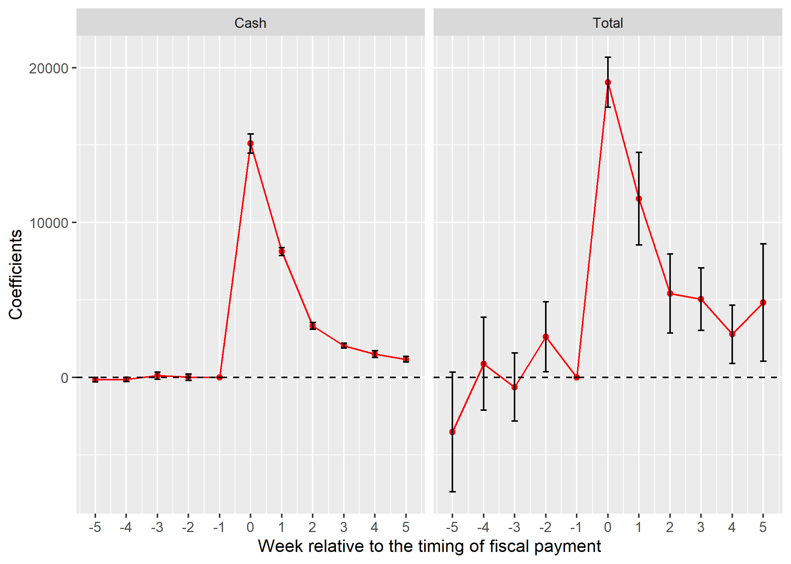

```{R, setup, include = F}
# devtools::install_github("dill/emoGG")
library(pacman)
p_load(
  broom, tidyverse,rmarkdown,
  ggplot2, ggthemes, ggforce, ggridges,
  latex2exp, viridis, extrafont, gridExtra,
  kableExtra, snakecase, janitor,
  data.table, dplyr, estimatr,
  lubridate, knitr, parallel,
  lfe,dslabs,
  here, magrittr,pammtools,Statamarkdown)

options(htmltools.dir.version = FALSE)
stataexe <- "/Applications/Stata/StataMP.app/Contents/MacOS/StataMP"
# Notes directory
dir_slides <- "./Users/zhouzhengqing/Desktop/SportsEconAnalysis/2024spring/Lec10"
# Define pink color
red_pink <- "#e64173"
turquoise <- "#20B2AA"
orange <- "#FFA500"
red <- "#fb6107"
blue <- "#3b3b9a"
green <- "#8bb174"
grey_light <- "grey70"
grey_mid <- "grey50"
grey_dark <- "grey20"
purple <- "#6A5ACD"
slate <- "#314f4f"
met_slate <- "#272822" # metropolis font color 

# Dark slate grey: #314f4f

# Knitr options
opts_chunk$set(
  comment = "#>",
  fig.align = "center",
  fig.height = 7,
  fig.width = 10.5,
  warning = F,
  message = F
)
opts_chunk$set(dev = "svg")
options(device = function(file, width, height) {
  svg(tempfile(), width = width, height = height)
})
options(crayon.enabled = F)
options(knitr.table.format = "html")

```
class: title-slide-section,center, middle, inverse

# 大纲

---
### 大纲

- Level 1
  - 一个例子
- Level 2
  - 基本概念
- Level 3
  - 具体实战

---
class: title-slide-section, middle, inverse
# 潜在结果框架帮助理解“真相”   
---

# 因果识别方法

- 随着计量经济学“可信性革命”（credibility revolution）席卷经济学的各个领域，基于潜在因果模型的因果效应识别策略，如匹配法（matching）、工具变量法（instrumental variable）、双重差分法（difference-in-differences）和断点回归设计（regression discontinuity design）等，逐渐成为了经济学等社会科学领域实证研究的通行研究范式。

---
class: title-slide-section,middle,inverse
# 面板数据框架

---
### 面板数据框架

- 因果推断工具包中最重要的工具之一就是**面板数据估计量**（panel data estimator）
  - 该估计量为**纵贯数据**（longitudinal data）
专门设计
  - 不同时间点上对个体的重复观测
- 面板数据的优点:
    1. 更多的变化 (横截面数据和时间序列变化)
    2. 可以处理**特定类型数据带来的遗漏变量偏差**（不可观测的且不随时间推移而变化的因素）
- 示例:
    1. 个体（球员） $i$ 在年份 $t$ 的收入
    2. 公司（球队） $i$ 在年份 $t$ 的业绩
    3. 国家 $i$ 在年份 $t$ 的GDP
    4. 学校 $i$ 在年份 $t$ 的升学率

---
### 纵贯数据的有向无环图（Imai 和 Kim，2017）

.less-right[
.center[
第 s 组别

]
]

.more-left[
- 结果变量 $Y_i$ 
  + 包含 3 期，分别是 $Y_{i1}, Y_{i2}, Y_{i3}$ 
- 协变量矩阵 $D_i$ 随时间推移而变化 $D_{i1}, D_{i2}, D_{i3}$  
- 随个体变化但不随时间变化，可被观测的 $X_i$
- 随个体变化但不随时间变化，但无法被观测到的 $u_i$
  + 无法观测
  + 随个体而变动
  + 给定个体 $i$ ，不随时间推移而变化
]

---
### 纵贯数据的有向无环图（Imai 和 Kim，2017）

.less-right[
.center[
第 s 组别

]
]
.more-left[
- 第1层： $Y_{i1}$ 与 $Y_{i2}$ 和 $Y_{i3}$ 相互不影响
- 第2层： $D_{i1}$ 影响第1层 $Y_{i1}$ 和同层 $D_{i2}$
- 第3层： $X_{i}$  影响第2层 $D_{i1}-D_{i3}$ 和第1层 $Y_{i1}-Y_{i3}$
- 第4层：不可观测的混杂因子 $u_{i}$  影响第3层 $X_i$ 和 第2层 $D_{i1}-D_{i3}$ 以及第1层 $Y_{i1}-Y_{i3}$ 
- 处理变量 $D$ 产生了**内生性**问题 → 直接估计存在偏误
- **注意几点**
  + **不存在**与第2层 $D_{it}$ 相关的、不能被观测到且**随时间的推移而变化的其他混杂因素**
  + 第1层**过去结果 $Y_{it-1}$ 不直接影响当前结果 $Y_{it}$ **
  + 1→2**过去结果 $Y_{it-1}$ 不直接影响当前处理变量 $D_{it}$** 
  + 2→1**过去处理变量 $D_{it-1}$ 不直接影响当前结果 $Y_{it}$ **
]

---
### 纵贯数据的有向无环图（Imai 和 Kim，2017）

.less-right[
.center[

]
]

.more-left[
- 基于数据的特殊结构和假设：可以使用**固定效应**（fixed effects）的特定面板方法来分离 $D$ 对 $Y$的因果效应
- 若固定效应中包含**年份固定效应**，该估计量通常称为**双向固定效应估计量**（Two-Way Fixed Effects Estimator，简称TWFE ）
- 回归方程为： $Y_{it}=\alpha_0+\delta D_{it}+\alpha_i+\alpha_t+X_{i t}+\varepsilon_{it}$
  - $u_i=\alpha_i+\alpha_t$
  - $u_i$ 称**未观测到的异质性**(unobserved heterogeneity)
  - $\varepsilon_{it}$ 称**特异性误差**（idiosyncratic error）
]

---
- 在 $Y_{it}$ 对 $D_{it}$ 回归时会发生什么？

### 估计方法 1：合并普通最小二乘（pooled OLS）
- 考虑**综合误差项** $\eta_{i t} \equiv c_i + \varepsilon_{it}$
  - 这里的 $c_i$ **视具体研究情境**而定。若以双向固定效应模型视角，则写作 $c_i = \alpha_i+\alpha_t$ 
- 则TWFE 可以改写为 $Y_{i t}=\delta D_{i t}+\eta_{i t} ; \quad t=1,2, \ldots, T$
- 如果 $$E\left[\eta_{i t} \mid D_{i 1}, D_{i 2}, \ldots, D_{i T}\right]=E\left[\eta_{i t} \mid D_{i t}\right]=0 \quad \text { 对于所有的 } t=1,2, \ldots, T$$
用 pooled OLS 估计该模型可以获得一致的 $\delta$ 估计值
  + 这相当假设**未观测到的异质性任何时期的 $D_{it}$ 都不相关**，但前面的 DAG 并不支持该假设 → 存在**内生性**问题 → **遗漏变量偏差**
  + **序列相关问题**： $u_i$ 在每个时期的 $\eta_{it}$ 中，序列相关问题导致**异方差稳健标准误偏小** → **系数不显著**

---
### 估计方法 2：固定效应（组内估计量）[fixed effects（within estimator）]
- 假设没有年份固定效应，因此 TWFE 变为 $Y_{i t}=\delta D_{i t}+u_i+\varepsilon_{i t}$
- 对该式进行**时间中心化**处理
\begin{aligned}
Y_{i t} & =\delta D_{i t}+u_i+\varepsilon_{i t} \\
\bar{Y}_i & =\delta \bar{D}_i+u_i+\bar{\varepsilon}_i \\
\left(Y_{i t}-\bar{Y}_i\right) & =\left(\delta D_{i t}-\delta \bar{D}\right)+\left(u_i-u_i\right)+\left(\varepsilon_{i t}-\bar{\varepsilon}_i\right) \\
\ddot{Y}_{i t} & =\delta \ddot{D}_{i t}+\ddot{\varepsilon}_{i t}
\end{aligned}
- 注意：
  - “组内”估计量=“固定效应”估计量=“双向固定效应”估计量（当含年份固定效应时）
  - 由于每个作者的遵循的命名传统不同，若文献中出现时，要该识别的方程具体形式
- 操作：
  - 对数据时间中心化处理后，进行 $\ddot{Y}_{i t}$ 对 $\ddot{D}_{i t}$ 的回归（需要矫正自由度）
  - 对原始方程添加个体虚拟变量来估计，**最小二乘虚拟变量 (LSDV) 估计量**
  - 在 STATA 固定效应模型中选择 fe 选项

---
### 识别假设1: 所有“右手变量”严格外生

-  $E\left[\varepsilon_{i t} \mid D_{i 1}, D_{i 2}, \ldots, D_{i T}, u_i\right]=0$
- 比一般OLS中的假设更宽松，允许 $D_{it}$ 与 $u_i$ 任意相关
  - 含义：所有不可观测的影响因素中，那些不随时间推移而变化的固定效应全部都可以被 $u_i$ 捕获，不存在遗漏。在这种情况下，回归过程中只限定与 $\varepsilon_{it}$ 的相关性，不涉及与 $u_i$ 的相关性

### 识别假设2: 无完全多重共线性与秩条件
- 考虑模型
$wage_{it} = \beta_0 + \beta_1 experience_{it} + \beta_2 male_{i} + \beta_3 white_{i} + u_i + \varepsilon_{i t}$
  - 由于 $male_{i}$ 和 $white_{i}$，存在多重共线性问题。
  - 不能一致性估计系数 $\beta_2$ 和 $\beta_3$，因为这些**时间恒定的不可观测因素固定效应 $u_i$ 捕获**
- $\operatorname{rank}\left(\sum_{t=1}^T E\left[\ddot{D}_{i t}^{\prime} \ddot{D}_{i t}\right]\right)=K$
  - 估计系数 $\widehat{\beta_1}=\frac{\sum_{i=1}^n\left(x_i-\bar{x}\right) y_i}{\sum_{i=1}^n\left(x_i-\bar{x}\right)^2}$ 总是一个**缩放的**（scaled）协方差，而缩放要用到方差项 
  <br>.mono[→] 进入回归的变量至少有部分的个体 $i$ 是要随时间推移而变化的，并且不共线，才能确保 $\hat \delta \approx \delta$

---
### 推断与要点

- 该数据框架中的标准误必须以面板中的个体进行聚类，以允许同一个个体 $i$ 的 $\varepsilon_{it}$ 可以随时间相关
- 只要聚类的数量足够大，就可以产生有效推断
  - 经验法则：聚类数量要大于 30 个
  - 比如省级面板
- **要点 #1**: Fixed effects cannot solve reverse causality
  - 当存在反向因果关系时，DAG 就不再是前面提供的样子，会有 Y → D 的渠道出现
- **要点 #2**: Fixed effects cannot address time-variant unobserved heterogeneity
  - 变量中心化处理只是简单去除了一个未被观察到的随时间推移而变化的变量的均值
  - 当 $u_i$ → ${u}_{i t}$ 时，中心化后的 $\ddot{u}_{i t}$ 仍然与 $\ddot{D}_{i t}$ 相关，所以后者仍然产生内生性


---
### 面板数据的总结

- 作用：
  - 固定效应（组内）能够消除所有与处理变量相关的**不随时间推移而变化的协变量**，无论该这些变量是否被观测到
  - 只要处理和结果随时间推移而变化，并且存在严格的外生性，那么固定效应（组内）估计量就能识别处理对结果的因果效应

- 限制：
  1. 不能处理.b.purple[随时间推移而变化的未被观测到的异质性]
  2. 不能处理.b.purple[强反向因果关系]

- 当存在上述2点限制时，固定效应（组内）不能估计一致因果效应，必须专项其他框架

---
class: title-slide-section,middle,inverse
# DiD

---
### 介绍

- **差分法** (DiD) 是在非实验环境中估计因果效应的最受欢迎的策略之一。
  + 在NBER WPs中使用率超过20% 
- 近几年，关于DiD的计量经济学研究激增
- 出现时间比随机实验还要早大约 85 年
- 区分为经典模型（一组个体同时受处理）和常见模型（一组个体在不同时间接受处理）

---
## DiD 图示

.middle[
.center[

]
]
---
### 经典 2&times;2 DiD 模型

- Goodman-Bacon(2019)
  - 处理组和控制组各有2个时期：
  - 处理组有一个前期pre(k)和一个后期post(k)
  - 控制组有一个前期pre(U)和一个后期post(U)

---
### 经典 2&times;2 DiD 模型

$$
\begin{align}
\hat{\delta}_{k U}^{2 \times 2} &(1)= (\bar{y}_k^{\mathrm{post}(k)}-\bar{y}_k^{\mathrm{pre}(k)})-(\bar{y}_U^{\mathrm{post}(k)}-\bar{y}_U^{\mathrm{pre}(k)})   \\ 
&(2)=(E[Y_k \mid \text { Post }]-E[Y_k \mid \text { Pre }])-(E[Y_U \mid \text { Post }]-E[Y_U \mid \text { Pre }])  \\
&(3)=(\underbrace{E[Y_k^1 \mid \text { Post }]-E[Y_k^0 \mid \text { Pre }])-(E[Y_U^0 \mid \text { Post }]-E[Y_U^0 \mid \text { Pre }].}_{\text {潜在结果转换方程 }}) \\
&\quad \quad +\underbrace{E[Y_k^0 \mid \text { Post }]-E[Y_k^0 \mid \text { Post }]}_{\text {加上一个 “0”}} \\
&(4)=\underbrace{E[Y_k^1 \mid \text { Post }]-\overbrace{E[Y_k^0 \mid \text { Post }]}^{\color{#FF0000}{反事实}}}_{\text {ATT }} \\
&\quad \quad +[\underbrace{E[Y_k^0 \mid \text { Post }]-E[Y_k^0 \mid \text { Pre }]]-[E[Y_U^0 \mid \text { Post }]-E[Y_U^0 \mid \text { Pre }]}_{ 2 \times 2 \text { 情况下的非平行趋势偏差 }}] 
\end{align}
$$

- 等号（1）： $\hat{\delta}_{k U}^{2 \times 2}$ 为 $k$ 组估计的 ATT，右边第一项为处理组k 处理后减去处理前的差值
- 等号（2）： 重新写成条件期望形式

---
### 经典 2&times;2 DiD 模型

$$
\begin{align}
\hat{\delta}_{k U}^{2 \times 2} &(1)= (\bar{y}_k^{\mathrm{post}(k)}-\bar{y}_k^{\mathrm{pre}(k)})-(\bar{y}_U^{\mathrm{post}(k)}-\bar{y}_U^{\mathrm{pre}(k)})   \\ 
&(2)=(E[Y_k \mid \text { Post }]-E[Y_k \mid \text { Pre }])-(E[Y_U \mid \text { Post }]-E[Y_U \mid \text { Pre }])  \\
&(3)=(\underbrace{E[Y_k^1 \mid \text { Post }]-E[Y_k^0 \mid \text { Pre }])-(E[Y_U^0 \mid \text { Post }]-E[Y_U^0 \mid \text { Pre }].}_{\text {潜在结果转换方程 }}) \\
&\quad \quad +\underbrace{E[Y_k^0 \mid \text { Post }]-E[Y_k^0 \mid \text { Post }]}_{\text {加上一个 “0”}} \\
&(4)=\underbrace{E[Y_k^1 \mid \text { Post }]-\overbrace{E[Y_k^0 \mid \text { Post }]}^{\color{#FF0000}{反事实}}}_{\text {ATT }} \\
&\quad \quad +[\underbrace{E[Y_k^0 \mid \text { Post }]-E[Y_k^0 \mid \text { Pre }]]-[E[Y_U^0 \mid \text { Post }]-E[Y_U^0 \mid \text { Pre }]}_{ 2 \times 2 \text { 情况下的非平行趋势偏差 }}] 
\end{align}
$$
.tiny[
- 等号（3）：潜在结果转换方程讲 Y 的历史取值转换成潜在结果形式
- 等号（4）：重新派丽，根据潜在结果的条件期望对 2&times;2 DiD进行分解 → 第二项包含两个差值，第一个差值（涉及处理组 k，是**反事实**），第二个差值（涉及控制组）
]

---
### 例子: Card and Kruger (1994, AER)

- 问题：最低工资增加对就业的影响
- 竞争性的理论
  - 在完全竞争市场中，最低工资提高会使得向右下方倾斜的需求曲线左移 → 就业率下降
  - 垄断市场中，最低工资提高导致就业增加
- 政策背景
  - 1992年 11 月，新泽西州的最低工资从4.25美元上涨到5.05美元
  - 相邻的宾夕法尼亚州最低工资仍然保持在 4.25 美元
- 比较新泽西州（处理组）和宾夕法尼亚东部（控制组）的快餐店在涨薪前后的情况

---
class:middle

.left[
.middle[
.center[

]]]

.right[
.middle[
.center[

]]]
---
### 估计方法 1 : 样本均值之差
.center[
 
]
.small[
|   a     | PA | NJ | NJ-PA |
|--------|----|----|-------|
|Pre | $E\left[Y_{PA}^0 \mid \text { Pre }\right]$  | $E\left[Y_{NJ}^0 \mid \text { Pre }\right]$ |  $E\left[Y_{NJ}^0 \mid \text { Pre }\right] - E\left[Y_{PA}^0 \mid \text { Pre }\right]$ |
|Post| $E\left[Y_{PA}^0 \mid \text { Post }\right]$   |  $E\left[Y_{NJ}^1 \mid \text { Post }\right]$ | $E\left[Y_{NJ}^1 \mid \text { Post }\right] - E\left[Y_{PA}^0 \mid \text { Post }\right]$ |
|变动均值  | ？  |？| 作差后，为什么要强调满足平行趋势假设? |
]

---
### 估计方法 1 : 样本均值之差

- **共同趋势假设**：在没有事件影响的情况下，处理组和控制组在事件发生前后的平均潜在结果变化程度是相同的
  - 意味着其他因素（非事件造成）对处理组和控制组在处理时期前后Y 变化的影响是相同
  - 也意味着，在事件没有发生或政策没有实施的情况下，处理组和控制组的 Y 有相同的时间趋势

$$
\begin{aligned}
& \hat{\delta}_{N J, P A}^{2 \times 2}=\underbrace{E\left[Y_{N J}^1 \mid \text { Post }\right]-E\left[Y_{N J}^0 \mid \text { Post }\right]}_{\text {ATT }} \\
& +\underbrace{\left[E\left[Y_{N J}^0 \mid \text { Post }\right]-E\left[Y_{N J}^0 \mid \text { Pre }\right]\right]-\left[E\left[Y_{P A}^0 \mid \text { Post }\right]-E\left[Y_{P A}^0 \mid \text { Pre }\right]\right.}_{\text {不满足共同趋势假设产生的偏误 }}]
\end{aligned}
$$


---
### 估计方法 2 : 线性回归
- 除了满足**共同趋势假设**外，还希望：
  - 控制**随时间推移而变化的内生协变量**，避免**遗漏变量偏差**
  - 通过控制适当的协变量，**减小残差方差**，提高 DiD 的估计精度
-   假设州固定效应和时间固定效应为常数，将 2&times;2 以线性回归方程来表达
   $$Y_{i t s}=\alpha+\gamma N J_s+\lambda D_t+\delta(N J \times D)_{s t}+\varepsilon_{i t s}$$
    -   $NJ$: 观测值来自 NJ 为 1
    -   $D:$ 观测值来自 11 月（Post） 为 1

1. PA Pre: $\alpha$
2. PA Post: $\alpha+\lambda$
3. NJ Pre: $\alpha+\gamma$
4. NJ Post: $\alpha+\gamma+\lambda+\delta$

---
class:middle,center
### DiD回归的理论图示


$$\delta=E\left[Y_{N J, \mathrm{Post}}^1\right]-E\left[Y_{N J, \mathrm{Post}}^0\right]$$

---
### 共同趋势假设对于 $\hat \delta_{OLS}$ 去一致性估计 $\delta_{ATT}$ 非常重要

.center[
]

- OLS总是会估计出一个 $\delta$ 的值，关键是这个 $\hat \delta_{OLS}$ 是不是能够反映NJ 的反事实斜率

---
## Two-way Fixed Effects Estimator

-   With panel data
    $$y_{it}=\alpha D_{it}+\beta X_{it}+\epsilon_{i}+\epsilon_{t}+\epsilon_{it}$$

  - $\epsilon_{i}$ is individual FE 
  - $\epsilon_{t}$ is time FE.


-   Use the cluster-robust standard errors for inference! (Bertrand, Duflo, and Mullainathan 2004, QJE)


---
## Event Study (イベントスタディ) Specification

- With multiple periods, we can estimate **the treatment effect in the post-treatment periods**


- The specification with $k$-periods lags and leads
$$y_{it}= \epsilon_{i}+\epsilon_{t}+ \sum_{\tau = -k}^k \gamma^\tau  D_{it}^\tau + \beta X_{it} + \epsilon_{it}$$
  - $D_{it}^\tau$ takes 1 if unit $i$ is in treatment group and period $t$ is $\tau$ period far from the treatment timing.
  - Normalize $\gamma^{-1} = 0$. 
  
- Why include lags (i.e., $\tau = -k, \cdots, -1$)? See this later.


---
class: title-slide-section, center, middle
name: logistics
# Discussion on Parallel Trend Assumption

---
## Discussions on Parallel Trend

- Parallel trend assumption can be violated in various situations.


- If treatment status depends on **time-varying factors**, treatment and control group may have differential time trend in their outcome.
  - Note: DID can only deal with **time-invariant factors**.


- Example: Self-selection into treatment based on time-varying factor
  - People participate in worker training program because they expected a future decrease in earnings before they enter the program.


---
## Diagnostics for Parallel Trends: Pre-treatment trends

-   Check if the trends are parallel in the pre-treatment periods (プレトレンド)

-   Requires data on multiple pre-treatment periods.

-   Should do this if you have multiple pre-treatment periods.

-   Note: this is only **diagnostics**. NOT a direct test of the assumption!
    - Remember: Parallel trend assumption is not testable.
    - You **should never say** "the key assumption for DID is satisfied if
        the pre-treatment trends are parallel.

---
## Other Diagnostics: Placebo Effects in Pre-Treatment

-   Idea: If both groups are indeed similar, there should be **no treatment effect in the pre-treatment period.** (placebo outcome)

- We run the following event-study specification
$$y_{it}= \epsilon_{i}+\epsilon_{t}+ \sum_{\tau = -k}^k \gamma^\tau  D_{it}^\tau + \beta X_{it} + \epsilon_{it}$$
    
    
- The estimates of $\gamma^{\tau}$ should be close to zero up to the beginning of treatment 

---
## Example: Autor (2003) (from Angrist and Pischke MHE)

- Figure 5.2.4: Estimated impact of state courtsí adoption of an implied-contract exception to the employmentat-
will doctrine on use of temporary workers (from Autor 2003). The dependent variable is the log of state
temporary help employment in 1979 - 1995. Estimates are from a model that allows for e§ects before, during,
and after adoption.

.middle[
.center[

]
]


---
## Example: Kubota, Onishi, and Toyama (2021)

- To estimate the effect of receiving the SCP (特別定額給付金) on consumption, we run $$y_{itw} = \alpha_i + \alpha_{iw} + \alpha_{tpw} + \sum_{k=-5}^5 \gamma^k D_{itw}^k + u_{itw}$$
  - Household $i$ in week $w$ in year $t (=2019, 2020)$.
  - $D_{itw}^k = \mathbb{1} \{ T_i - w = k\}$, $T_i$ is the timing of receiving the SCP (i.e., treatment)
  - $y_{itw}$: consumption measure (total withdrawal, ATM withdrawal)

---

.middle[
.center[

]
]

---
# Application


---
## Application: JAL-JAS Merger (Doi and Ohashi 2019)

- Question: What is the effects of JAL-JAS merger on market outcome in airline industry.


- They use both DID and structural estimation (構造推定) approach to answer the question.


- Here, I only discuss their DID analysis.


---
## Identification


- Under what assumptions can we the ATT?

---
## Simple Comparisons


- Within period comparison 
  - If $E[Y_{i2}(0)|G_{i}=1]=E[Y_{i2}(0)|G_{i}=0]$, ATT is identified by $$ATT = E[Y_{i2}(1)|G_{i}=1]-E[Y_{i2}(0)|G_{i}=0]$$
  - Selection bias?
  
  
- Before-after comparison
  - If $E[Y_{i2}(0)|G_{i}=1]=E[Y_{i1}(0)|G_{i}=1]$, ATT is identified by $$ATT = E[Y_{i2}(1)|G_{i}=1]-E[Y_{i1}(0)|G_{i}=1]$$
  - Time trend?
  
- More resonable assumption?


---
## Parallel Trend (並行トレンド) Assumption

- 假设： $$E[Y_{i2}(0)-Y_{i1}(0)|G_{i}=0]=E[Y_{i2}(0)-Y_{i1}(0)|G_{i}=1]$$ 
- 解释： 未接受治疗的结果变化在两组中是相同的

- 这对于如果治疗组没有接受治疗，反事实趋势有一个假设


---
## Difference-in-differences

- Note that

\begin{aligned}
    \underbrace{E[Y_{i2}(1)-Y_{i2}(0)|G_{i}=1]}_{ATT}= & E[Y_{i2}(1)|G_{i}=1]-E[Y_{i2}(0)|G_{i}=1]\\
    = & E[Y_{i2}(1)|G_{i}=1]-E[Y_{i1}(0)|G_{i}=1]\\
     & -\underbrace{(E[Y_{i2}(0)|G_{i}=1]-E[Y_{i1}(0)|G_{i}=1])}_{=E[Y_{i2}(0)-Y_{i1}(0)|G_{i}=0]\ (pararell\ trend)}
\end{aligned}

-   Thus, 
\begin{aligned}
    ATT= & E[Y_{i2}(1)-Y_{i1}(0)|G_{i}=1]-E[Y_{i2}(0)-Y_{i1}(0)|G_{i}=0]
\end{aligned}

- ATT is identified by **the difference of two differences**

---
class: title-slide-section, center, middle
name: logistics
# Estimation


---
## Estimation Approach 1: Plug-in Estimator

-   Remember that the ATT is identified by

\begin{aligned}
    ATT= & E[Y_{i2}(1)-Y_{i1}(0)|G_{i}=1]-E[Y_{i2}(0)-Y_{i1}(0)|G_{i}=0]
\end{aligned}

-   Replace them with the sample average. 

\begin{aligned}
    \hat{ATT=} & \left\{ \bar{y}(t=2,G=1)-\bar{y}(t=1,G=1)\right\} \\
     & -\left\{ \bar{y}(t=2,G=0)-\bar{y}(t=1,G=0)\right\}
\end{aligned}

where $\bar{y}(t,G)$ is the sample average for group $G$ in period
    $t$ .


---
## Robustness Check
- Pretrend: Regress the outcome on route-FE, time FE, and time FE interacted with the dummy for control routes. 

- Placebo test: Use the period b.w. April 2000 to July 2002. Consider placebo merger in July 2001 and see its effects using DID.


---
## Limitations of DID in this context

- Is the choice of control group appropriate?


- How to interpret the results?


- Further analysis using structural estimation approach.

---

## 课程计划

- 框架

- R 语言的实现

- **差分法 (DID, 差の差分法)**

---
### 选择性偏差

- **选择性偏差**（selection bias）：样本选择过程中的非随机而导致的结论偏差，包括**自选择偏差**（self-selection bias）和**样本选择偏差**（sample-selection bias）
  - 自选择偏差：实验组的非随机分配导致的 → 是否进入实验组是个体选择的结果或是与个体相关的因素（包括可观测和不可观测两类）导致的
    - 例子
  - 样本选择偏差：非随机选择的样本不能够反映总体的特征，从而使结果估计量产生偏差
    - 例子
- 评估政策处理效应的方法就是尽可能的降低选择性偏差    

---
### 选择性偏差的表达

- 直接面对数据时，通常使用处理样本结果变量的均值与未处理样本结果变量的均值之差来估计 ATE
  - differen-in-mean，简称 DIM 
  - simple-difference-in-outcome，简称 SDO
  - Naiive comprison
  
$$
\begin{aligned}
DIM & =E\left[Y^1 \mid D=1\right]-E\left[Y^0 \mid D=0\right] \\
& =\frac{1}{N_T} \sum_{i=1}^n\left(y_i \mid d_i=1\right)-\frac{1}{N_C} \sum_{i=1}^n\left(y_i \mid d_i=0\right)
\end{aligned}
$$

- 当满足**独立性假设**（independence assumption，简称 IA）时： $\left(Y_1 ; Y_0\right) \perp D$ 
  - DIM = ATE = ATT = ATU

---

