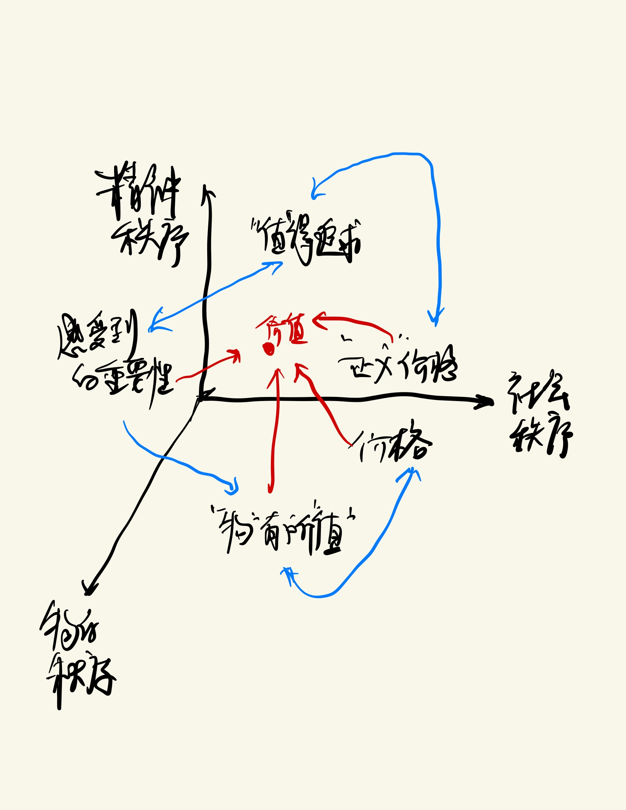

```{R, setup, include = F}
# devtools::install_github("dill/emoGG")
library(pacman)
p_load(
  broom, tidyverse,rmarkdown,
  ggplot2, ggthemes, ggforce, ggridges,
  latex2exp, viridis, extrafont, gridExtra,
  kableExtra, snakecase, janitor,
  data.table, dplyr, estimatr,
  lubridate, knitr, parallel,
  lfe,dslabs,
  here, magrittr,pammtools)

options(htmltools.dir.version = FALSE)

# Notes directory
dir_slides <- "/Users/zhouzhengqing/Desktop/SportsEconAnalysis/2024spring/Lec13"
# Define pink color
red_pink <- "#e64173"
turquoise <- "#20B2AA"
orange <- "#FFA500"
red <- "#fb6107"
blue <- "#3b3b9a"
green <- "#8bb174"
grey_light <- "grey70"
grey_mid <- "grey50"
grey_dark <- "grey20"
purple <- "#6A5ACD"
slate <- "#314f4f"
met_slate <- "#272822" # metropolis font color 

# Dark slate grey: #314f4f

# Knitr options
opts_chunk$set(
  comment = "#>",
  fig.align = "center",
  fig.height = 7,
  fig.width = 10.5,
  warning = F,
  message = F
)
opts_chunk$set(dev = "svg")
options(device = function(file, width, height) {
  svg(tempfile(), width = width, height = height)
})
options(crayon.enabled = F)
options(knitr.table.format = "html")
```
class: title-slide-section, middle, inverse

# 大纲

---
class: animated slideInRight fadeOutLeft

### 大纲

- 经济思想史
- 
  
---
class: title-slide-section, middle, inverse

# 价格的维度


---
### 价值从何而来？
- 正义和道德反映了人的价值  → 古希腊人认为价值与荣誉相关。荣誉是对理想道德人格的角色扮演（英雄、政治家）的嘉奖。扮演的好，就应该嘉奖 
    - 好人的奖赏谁来认定？社会的人来认定 → 合理的价值就是有社会其他人对理想人格完美实现的，符合公正、正义的评价。谁来代表社会？权威、统治阶级
    - 坏人的处罚谁来认定？法庭上的量刑，相当于为他的犯罪行为支付代价 → 法官
    - 人的价值的判定包含了对正义、道德与犯罪代价的认定，是由**社会秩序**和**精神秩序**
- 那么物的价值如何确定？
  - 随着平民交易的广泛，更多的实物的价值需要被定义 。这时，价值不仅是人与人之间进行的交易的前提，还是社会秩序的反映<br>→ 荷马时代（公元前8世纪到7世纪），“重量”成为物的价值 <br>→ 随着时间的演进，物的重量延伸到了心理的重量，即事务的意义或重要性 <br>→ 物的价值不仅是**物的秩序（生产）**的反映，同时也是**社会秩序（交换）**和**精神秩序（重要性）**

---
### 价格与价值的分离

- 公元前 4 世纪，希腊人开始收到亚里士多德的思想 影响，认为价值是事物的本质，而价格是价值的市场表象
→ 人们重新审视所有看得见的东西，而把看不见的东西提升为理念 → 崇尚理性 **→** 价值本体论
- 区分使用价值和交换价值 <br>→ 前者是每个人都可以感受的物品的使用价值；后者是供求相等时候的价值表达，是使用价值的派生价值 <br>→ 使用价值是实质价值，或者是理性意义上的价值，而交换价值在现实中体现为价格 <br>→ 要加太高违反社会公理，要加太低社会良心过不去 <br>→ 社会秩序给予一个社会“正义”价值 
  - 两个批判：当时的贱买贵卖和高利贷 
  - 一个困难：相同的劳动未必有获得相同的质，很可能一个人的劳动比另一个人高级，就需要寻找一种普遍适用的价值尺度
  - **思想种子**： 论证追求财富行为的正当性（允许在某物品价值之上出售、售卖瑕疵物、贱买贵卖） + 论证价格的正义性

---
### 现代经济理论的思路延续（价值的正义性）

- 在追去对行为正当性和价格正义性的一系列解释过程中，有一些非常重要的历史人物和历史事件产生的思想一致延续至今，隐含在现代经济理论中：
- 中世纪的蛮族入侵让人们意识到**物的价值依赖于占有者的社会地位**。蛮族扩张不依赖生产，而依赖抢占。社会地位高的人能获得更多物的价值，即便具有相同的使用价值 → 决定社会秩序的因素（制度，包括习俗、传统）会影响价值（价格）
- 11 世纪开始，世俗化的逐利行为威胁到了宗教统治 → 具体是，“正义”价格应当由负责世俗社会规则的法学家确定，而不应该由负责神圣社会的神学家确定 → 世俗社会决定的价格具有正义性，促使一部分开明的神学家开始论证**什么样的世俗逐利行为是与教会立场相容的**，其中包含三个维度
  - **宗教与逐利行为密切相关** → 《新教伦理与资本主义精神》
  - 既然价格是具有正当性的逐利行为的产物，那么什么是这种正义性的体现？ → 价格不应该偏离价值太多，**价格长期应该趋向稳定**（斯密从长期价格开始讨论价值）。一旦偏离较多，一定是使用者的需求与出售者对该物品的**需求不一致**（暗含了交换价值的判断与参与者对物品的主观判断相关）

---
### 现代经济理论的思路延续（定价权的合法性）

- 中世纪的商路开路使得神学家发现存在**多重价格**。开明的神学家在思考，既然“符合正义原则的交换”要求相等价值，那么为什么商人路过每一个邻国需要交税，并且税的设定标准并不唯一 <br>→ 抽税过高的封建国就不在贸易路线上 <br>→  只有金银首饰类的奢侈品价格是由市场定价，其他价格都被政府所定

- 16-17世纪的地理大发现、文艺复兴和宗教改革，促使欧洲更多**国家民族意识的唤醒** <br>→ 国家间贸易线路的竞争加剧 <br>→ 国际间必须有通行的法学基础，进一步的经济与法学的分离 <br>→ 不再关心价值应该是什么样，而是关系价值实质是什么样 <br>→ 关心正义性价格的法学家开始把注意力放到**自然法则**上 <br>→ 自然法则是上帝植入人心的一种法则，并且被人的理性所揭示、所理解 <br>→ 按照自然法则的揭示的价格自然带有正义性 <br>→ **只要平民的逐利行为是自愿的，那么价格不仅具有正义性，而且定价权最好有他们自己决定，不再由世俗政府的法学家来决定**

---
### 价格变体Variant

- **空间维度（space）**。价格具有复杂性，在古典时期，就发现价格会因地域而产生产业 → Stigler 提出了一个应用性的问题，对于同一件商品而言，怎样划分不同市场？最简单的方式，产地不同会产生产品差异性，后来就依据产品差异性界定市场
- **时间维度（time）**。特别在金融市场，会体现出这一特性。就必须进行连续性的分析
- **不确定性（uncertainty）**。不同于风险，风险是可预知的概率判断，而不确定性是不可预期、不可重复的。因此，基于价格判断带来的投资在未来不仅不可逆转，而且回报不确定。在人力资本投资情境下，哪怕是完全竞争市场中，对于人力资本的定价问题都是非常困难的。Becker 就指出，人力投资率在各国普遍较低，在5%左右，在投资人才方面，不可预期性导致了 underinvestment。在体育市场中，人才的投资过去是在体制内，公共（学校）体育投资不足 + 体育系统选材基础不够且试错成本巨大，导致各项目普遍效率低下

---
### 价格变体Variant

- **因量还是因质定价？（quantity or quality）**。在互联网流媒体时代，商品服务的质量标准显得非常重要。通过 Quality of Service（QoS）来确定服务价格。质与量之间有替代关系，免费或低价获得基础产品或服务，收费或高价获得优质产品或服务。利用人们的消费习惯和心理，制造价格
- **交易费用（transaction costs）**。确保交易主体了解信息的渠道畅通，体现在交易费用比较小。比如交易双方建立在信用基础上（金融将信用作用放大）、技术监督可行（监督成本足够低廉）、市场制度支撑体系完全（包括家族、亲缘、宗教、政府、统计、会计、法院等）
- **社会选择（social choice）的结果**。公用设施能够被私人经营的前提是正确定价。在民主体制下，公用事业的定价必须经过听证会，保证管制下的价格足够高效反映该领域的社会要求。
- **社会地位（social status）**。推销时，说产品怎样好；赠予时，说产品为什么贵

---
### 三维体系

- 价值 → 有形的价值 → （物的秩序+社会秩序+精神秩序） → 有形的价值+无形的价值

- 在经济领域中，是从物的秩序中讨论价值。流通领域中，交易是有形的。大家共识在于交易基础是“等质等价”交换，价格是价值的货币形态。价格与价值应该相符。
<br> → 但价格会波动，难道是价值在波动？

---
class:center


科学的发展，将物的秩序向更加微观（纳米）、更加宏大的视角延伸 → 体育中的价值创造是什么？


---
# 价格变动的效应


---

---
### 价格变动的两种效应

.more-left[
```{r, echo = FALSE, fig.height = 5, fig.width = 5, dev = "svg"}
demand <- function(x) 10 - x
inv_demand <- function(x) 10 - x
p_1 <- 7
p_2 <- 9
q_1 <- inv_demand(p_1) 
q_2 <- inv_demand(p_2)
ggplot(data = data.frame(x = 0), mapping = aes(x = x)) +
  scale_x_continuous(limits = c(0, 10.5), expand = c(0, 0), breaks = seq(0, 10, 1)) +
  scale_y_continuous(limits = c(0, 10.5), expand = c(0, 0), breaks = seq(0, 10, 1)) +
  theme_market +
  labs(x = "x", y = "$") +
  # geom_rect(aes(xmin = 0, xmax = q_1, ymin = 0, ymax = p_1), alpha = 0.2, fill = green) +
  geom_rect(aes(xmin = 0, xmax = q_2, ymin = 0, ymax = p_2), alpha = 0.2, fill = green) +
  stat_function(fun = demand, color = red_pink, size = 1) +
  # geom_point(x = q_1, y = p_1, color = met_slate, size = 2) +
  geom_point(x = q_2, y = p_2, color = met_slate, size = 2) +
  # geom_segment(x = 0, xend = q_1, y = p_1, yend = p_1, color = met_slate, linetype = "dashed", size = 1) +
  geom_segment(x = 0, xend = q_2, y = p_2, yend = p_2, color = met_slate, linetype = "dashed", size = 1) +
  # geom_segment(x = q_1, xend = q_1, y = 0, yend = p_1, color = met_slate, linetype = "dashed", size = 1) +
  geom_segment(x = q_2, xend = q_2, y = 0, yend = p_2, color = met_slate, linetype = "dashed", size = 1) +
  annotate("text", label = "D=AR", x = 8, y = 3.65, color = red_pink, family = cnfont, size = 9) 
```
]

.less-right[
$\pi(x) =xP_x-TC(x)$ ，但 $P_x$ 与 $x$ **反方向**运动，那么乘积如何?

.pink.hi[价格效应] 是指产品价格下降，**已有**消费者支付更少了

.purple.hi[产出效应] 是指产品价格下降，会**新增加**消费者购买产品

]

---
count: false
### 价格变动的两种效应

.more-left[
```{r, echo = FALSE, fig.height = 5, fig.width = 5, dev = "svg"}
demand <- function(x) 10 - x
inv_demand <- function(x) 10 - x
p_1 <- 7
p_2 <- 9
q_1 <- inv_demand(p_1) 
q_2 <- inv_demand(p_2)
ggplot(data = data.frame(x = 0), mapping = aes(x = x)) +
  scale_x_continuous(limits = c(0, 10.5), expand = c(0, 0), breaks = seq(0, 10, 1)) +
  scale_y_continuous(limits = c(0, 10.5), expand = c(0, 0), breaks = seq(0, 10, 1)) +
  theme_market +
  labs(x = "x", y = "$") +
  geom_rect(aes(xmin = 0, xmax = q_1, ymin = 0, ymax = p_1), alpha = 0.2, fill = green) +
  # geom_rect(aes(xmin = 0, xmax = q_2, ymin = 0, ymax = p_2), alpha = 0.2, fill = green) +
  stat_function(fun = demand, color = red_pink, size = 1) +
  geom_point(x = q_1, y = p_1, color = met_slate, size = 2) +
  geom_point(x = q_2, y = p_2, color = met_slate, size = 2) +
  geom_segment(x = 0, xend = q_1, y = p_1, yend = p_1, color = met_slate, linetype = "dashed", size = 1) +
  geom_segment(x = 0, xend = q_2, y = p_2, yend = p_2, color = met_slate, linetype = "dashed", size = 1) +
  geom_segment(x = q_1, xend = q_1, y = 0, yend = p_1, color = met_slate, linetype = "dashed", size = 1) +
  geom_segment(x = q_2, xend = q_2, y = 0, yend = p_2, color = met_slate, linetype = "dashed", size = 1) +
  annotate("text", label = "D=AR", x = 8, y = 3.65, color = red_pink, family = cnfont, size = 9) 
```
]

.less-right[
$\pi(x) =xP_x-TC(x)$ ，但 $P_x$ 与 $x$ **反方向**运动，那么乘积如何?

.pink.hi[价格效应] 是指产品价格下降，**已有**消费者支付更少了

.purple.hi[产出效应] 是指产品价格下降，会**新增加**消费者购买产品

]

---
count: false
### 价格变动的两种效应

.more-left[
```{r, echo = FALSE, fig.height = 5, fig.width = 5, dev = "svg"}
demand <- function(x) 10 - x
inv_demand <- function(x) 10 - x
p_1 <- 7
p_2 <- 9
q_1 <- inv_demand(p_1) 
q_2 <- inv_demand(p_2)
ggplot(data = data.frame(x = 0), mapping = aes(x = x)) +
  scale_x_continuous(limits = c(0, 10.5), expand = c(0, 0), breaks = seq(0, 10, 1)) +
  scale_y_continuous(limits = c(0, 10.5), expand = c(0, 0), breaks = seq(0, 10, 1)) +
  theme_market +
  labs(x = "x", y = "$") +
  geom_rect(aes(xmin = 0, xmax = q_2, ymin = p_1, ymax = p_2), alpha = 0.2, fill = red_pink) +
  geom_rect(aes(xmin = q_1, xmax = q_2, ymin = 0, ymax = p_1), alpha = 0.2, fill = purple) +
  stat_function(fun = demand, color = red_pink, size = 1) +
  geom_point(x = q_1, y = p_1, color = met_slate, size = 2) +
  geom_point(x = q_2, y = p_2, color = met_slate, size = 2) +
  geom_segment(x = 0, xend = q_1, y = p_1, yend = p_1, color = met_slate, linetype = "dashed", size = 1) +
  geom_segment(x = 0, xend = q_2, y = p_2, yend = p_2, color = met_slate, linetype = "dashed", size = 1) +
  geom_segment(x = q_1, xend = q_1, y = 0, yend = p_1, color = met_slate, linetype = "dashed", size = 1) +
  geom_segment(x = q_2, xend = q_2, y = 0, yend = p_2, color = met_slate, linetype = "dashed", size = 1) +
  annotate("text", label = "D=AR", x = 8, y = 3.65, color = red_pink, family = cnfont, size = 9) 
```
]

.less-right[
$\pi(x) =xP_x-TC(x)$ ，但 $P_x$ 与 $x$ **反方向**运动，那么乘积如何?

.pink.hi[价格效应] 是指产品价格下降，**已有**消费者支付更少了

.purple.hi[产出效应] 是指产品价格下降，会**新增加**消费者购买产品

.purple.hi[产出效应]  .mono[>] .pink.hi[价格效应] .mono[==>]  厂商降价导致 .green.hi[总收益增加]

]

---
### 价格变动的两种效应

.more-left[
```{r, echo = FALSE, fig.height = 5, fig.width = 5, dev = "svg"}
demand <- function(x) 10 - x
inv_demand <- function(x) 10 - x
p_1 <- 4
p_2 <- 6
q_1 <- inv_demand(p_1) 
q_2 <- inv_demand(p_2)
ggplot(data = data.frame(x = 0), mapping = aes(x = x)) +
  scale_x_continuous(limits = c(0, 10.5), expand = c(0, 0), breaks = seq(0, 10, 1)) +
  scale_y_continuous(limits = c(0, 10.5), expand = c(0, 0), breaks = seq(0, 10, 1)) +
  theme_market +
  labs(x = "x", y = "$") +
  # geom_rect(aes(xmin = 0, xmax = q_1, ymin = 0, ymax = p_1), alpha = 0.2, fill = green) +
  geom_rect(aes(xmin = 0, xmax = q_2, ymin = 0, ymax = p_2), alpha = 0.2, fill = green) +
  stat_function(fun = demand, color = red_pink, size = 1) +
  # geom_point(x = q_1, y = p_1, color = met_slate, size = 2) +
  geom_point(x = q_2, y = p_2, color = met_slate, size = 2) +
  # geom_segment(x = 0, xend = q_1, y = p_1, yend = p_1, color = met_slate, linetype = "dashed", size = 1) +
  geom_segment(x = 0, xend = q_2, y = p_2, yend = p_2, color = met_slate, linetype = "dashed", size = 1) +
  # geom_segment(x = q_1, xend = q_1, y = 0, yend = p_1, color = met_slate, linetype = "dashed", size = 1) +
  geom_segment(x = q_2, xend = q_2, y = 0, yend = p_2, color = met_slate, linetype = "dashed", size = 1) +
  annotate("text", label = "D=AR", x = 8, y = 3.65, color = red_pink, family = cnfont, size = 9) 
```
]

.less-right[
$\pi(x) =xP_x-TC(x)$ ，但 $P_x$ 与 $x$ **反方向**运动，那么乘积如何?

.pink.hi[价格效应] 是指产品价格下降，**已有**消费者支付更少了

.purple.hi[产出效应] 是指产品价格下降，会**新增加**消费者购买产品

]

---
count: false
### 价格变动的两种效应

.more-left[
```{r, echo = FALSE, fig.height = 5, fig.width = 5, dev = "svg"}
demand <- function(x) 10 - x
inv_demand <- function(x) 10 - x
p_1 <- 4
p_2 <- 6
q_1 <- inv_demand(p_1) 
q_2 <- inv_demand(p_2)
ggplot(data = data.frame(x = 0), mapping = aes(x = x)) +
  scale_x_continuous(limits = c(0, 10.5), expand = c(0, 0), breaks = seq(0, 10, 1)) +
  scale_y_continuous(limits = c(0, 10.5), expand = c(0, 0), breaks = seq(0, 10, 1)) +
  theme_market +
  labs(x = "x", y = "$") +
  geom_rect(aes(xmin = 0, xmax = q_1, ymin = 0, ymax = p_1), alpha = 0.2, fill = green) +
  # geom_rect(aes(xmin = 0, xmax = q_2, ymin = 0, ymax = p_2), alpha = 0.2, fill = green) +
  stat_function(fun = demand, color = red_pink, size = 1) +
  geom_point(x = q_1, y = p_1, color = met_slate, size = 2) +
  geom_point(x = q_2, y = p_2, color = met_slate, size = 2) +
  geom_segment(x = 0, xend = q_1, y = p_1, yend = p_1, color = met_slate, linetype = "dashed", size = 1) +
  geom_segment(x = 0, xend = q_2, y = p_2, yend = p_2, color = met_slate, linetype = "dashed", size = 1) +
  geom_segment(x = q_1, xend = q_1, y = 0, yend = p_1, color = met_slate, linetype = "dashed", size = 1) +
  geom_segment(x = q_2, xend = q_2, y = 0, yend = p_2, color = met_slate, linetype = "dashed", size = 1) +
  annotate("text", label = "D=AR", x = 8, y = 3.65, color = red_pink, family = cnfont, size = 9) 
```
]

.less-right[
$\pi(x) =xP_x-TC(x)$ ，但 $P_x$ 与 $x$ **反方向**运动，那么乘积如何?

.pink.hi[价格效应] 是指产品价格下降，**已有**消费者支付更少了

.purple.hi[产出效应] 是指产品价格下降，会**新增加**消费者购买产品

]

---
count: false
### 价格变动的两种效应

.more-left[
```{r, echo = FALSE, fig.height = 5, fig.width = 5, dev = "svg"}
demand <- function(x) 10 - x
inv_demand <- function(x) 10 - x
p_1 <- 4
p_2 <- 6
q_1 <- inv_demand(p_1) 
q_2 <- inv_demand(p_2)
ggplot(data = data.frame(x = 0), mapping = aes(x = x)) +
  scale_x_continuous(limits = c(0, 10.5), expand = c(0, 0), breaks = seq(0, 10, 1)) +
  scale_y_continuous(limits = c(0, 10.5), expand = c(0, 0), breaks = seq(0, 10, 1)) +
  theme_market +
  labs(x = "x", y = "$") +
  geom_rect(aes(xmin = 0, xmax = q_2, ymin = p_1, ymax = p_2), alpha = 0.2, fill = red_pink) +
  geom_rect(aes(xmin = q_1, xmax = q_2, ymin = 0, ymax = p_1), alpha = 0.2, fill = purple) +
  stat_function(fun = demand, color = red_pink, size = 1) +
  geom_point(x = q_1, y = p_1, color = met_slate, size = 2) +
  geom_point(x = q_2, y = p_2, color = met_slate, size = 2) +
  geom_segment(x = 0, xend = q_1, y = p_1, yend = p_1, color = met_slate, linetype = "dashed", size = 1) +
  geom_segment(x = 0, xend = q_2, y = p_2, yend = p_2, color = met_slate, linetype = "dashed", size = 1) +
  geom_segment(x = q_1, xend = q_1, y = 0, yend = p_1, color = met_slate, linetype = "dashed", size = 1) +
  geom_segment(x = q_2, xend = q_2, y = 0, yend = p_2, color = met_slate, linetype = "dashed", size = 1) +
  annotate("text", label = "D=AR", x = 8, y = 3.65, color = red_pink, family = cnfont, size = 9) 
```
]

.less-right[
$\pi(x) =xP_x-TC(x)$ ，但 $P_x$ 与 $x$ **反方向**运动，那么乘积如何?

.pink.hi[价格效应] 是指产品价格下降，**已有**消费者支付更少了

.purple.hi[产出效应] 是指产品价格下降，会**新增加**消费者购买产品

.purple.hi[产出效应]  .mono[=] .pink.hi[价格效应] .mono[==>]  厂商降价导致 .green.hi[总收益不变]

]

---
### 价格变动的两种效应

.more-left[
```{r, echo = FALSE, fig.height = 5, fig.width = 5, dev = "svg"}
demand <- function(x) 10 - x
inv_demand <- function(x) 10 - x
p_1 <- 1
p_2 <- 3
q_1 <- inv_demand(p_1) 
q_2 <- inv_demand(p_2)
ggplot(data = data.frame(x = 0), mapping = aes(x = x)) +
  scale_x_continuous(limits = c(0, 10.5), expand = c(0, 0), breaks = seq(0, 10, 1)) +
  scale_y_continuous(limits = c(0, 10.5), expand = c(0, 0), breaks = seq(0, 10, 1)) +
  theme_market +
  labs(x = "x", y = "$") +
  # geom_rect(aes(xmin = 0, xmax = q_1, ymin = 0, ymax = p_1), alpha = 0.2, fill = green) +
  geom_rect(aes(xmin = 0, xmax = q_2, ymin = 0, ymax = p_2), alpha = 0.2, fill = green) +
  stat_function(fun = demand, color = red_pink, size = 1) +
  # geom_point(x = q_1, y = p_1, color = met_slate, size = 2) +
  geom_point(x = q_2, y = p_2, color = met_slate, size = 2) +
  # geom_segment(x = 0, xend = q_1, y = p_1, yend = p_1, color = met_slate, linetype = "dashed", size = 1) +
  geom_segment(x = 0, xend = q_2, y = p_2, yend = p_2, color = met_slate, linetype = "dashed", size = 1) +
  # geom_segment(x = q_1, xend = q_1, y = 0, yend = p_1, color = met_slate, linetype = "dashed", size = 1) +
  geom_segment(x = q_2, xend = q_2, y = 0, yend = p_2, color = met_slate, linetype = "dashed", size = 1) +
  annotate("text", label = "D=AR", x = 8, y = 3.65, color = red_pink, family = cnfont, size = 9) 
```
]

.less-right[
$\pi(x) =xP_x-TC(x)$ ，但 $P_x$ 与 $x$ **反方向**运动，那么乘积如何?

.pink.hi[价格效应] 是指产品价格下降，**已有**消费者支付更少了

.purple.hi[产出效应] 是指产品价格下降，会**新增加**消费者购买产品

]

---
count: false
### 价格变动的两种效应

.more-left[
```{r, echo = FALSE, fig.height = 5, fig.width = 5, dev = "svg"}
demand <- function(x) 10 - x
inv_demand <- function(x) 10 - x
p_1 <- 1
p_2 <- 3
q_1 <- inv_demand(p_1) 
q_2 <- inv_demand(p_2)
ggplot(data = data.frame(x = 0), mapping = aes(x = x)) +
  scale_x_continuous(limits = c(0, 10.5), expand = c(0, 0), breaks = seq(0, 10, 1)) +
  scale_y_continuous(limits = c(0, 10.5), expand = c(0, 0), breaks = seq(0, 10, 1)) +
  theme_market +
  labs(x = "x", y = "$") +
  geom_rect(aes(xmin = 0, xmax = q_1, ymin = 0, ymax = p_1), alpha = 0.2, fill = green) +
  # geom_rect(aes(xmin = 0, xmax = q_2, ymin = 0, ymax = p_2), alpha = 0.2, fill = green) +
  stat_function(fun = demand, color = red_pink, size = 1) +
  geom_point(x = q_1, y = p_1, color = met_slate, size = 2) +
  geom_point(x = q_2, y = p_2, color = met_slate, size = 2) +
  geom_segment(x = 0, xend = q_1, y = p_1, yend = p_1, color = met_slate, linetype = "dashed", size = 1) +
  geom_segment(x = 0, xend = q_2, y = p_2, yend = p_2, color = met_slate, linetype = "dashed", size = 1) +
  geom_segment(x = q_1, xend = q_1, y = 0, yend = p_1, color = met_slate, linetype = "dashed", size = 1) +
  geom_segment(x = q_2, xend = q_2, y = 0, yend = p_2, color = met_slate, linetype = "dashed", size = 1) +
  annotate("text", label = "D=AR", x = 8, y = 3.65, color = red_pink, family = cnfont, size = 9) 
```
]

.less-right[
$\pi(x) =xP_x-TC(x)$ ，但 $P_x$ 与 $x$ **反方向**运动，那么乘积如何?

.pink.hi[价格效应] 是指产品价格下降，**已有**消费者支付更少了

.purple.hi[产出效应] 是指产品价格下降，会**新增加**消费者购买产品

.purple.hi[产出效应]  .mono[<] .pink.hi[价格效应] .mono[==>]  厂商降价导致 .green.hi[总收益减少]

]

---
count: false
### 价格变动的两种效应

.more-left[
```{r, echo = FALSE, fig.height = 5, fig.width = 5, dev = "svg"}
demand <- function(x) 10 - x
inv_demand <- function(x) 10 - x
p_1 <- 1
p_2 <- 3
q_1 <- inv_demand(p_1) 
q_2 <- inv_demand(p_2)
ggplot(data = data.frame(x = 0), mapping = aes(x = x)) +
  scale_x_continuous(limits = c(0, 10.5), expand = c(0, 0), breaks = seq(0, 10, 1)) +
  scale_y_continuous(limits = c(0, 10.5), expand = c(0, 0), breaks = seq(0, 10, 1)) +
  theme_market +
  labs(x = "x", y = "$") +
  geom_rect(aes(xmin = 0, xmax = q_2, ymin = p_1, ymax = p_2), alpha = 0.2, fill = red_pink) +
  geom_rect(aes(xmin = q_1, xmax = q_2, ymin = 0, ymax = p_1), alpha = 0.2, fill = purple) +
  stat_function(fun = demand, color = red_pink, size = 1) +
  geom_point(x = q_1, y = p_1, color = met_slate, size = 2) +
  geom_point(x = q_2, y = p_2, color = met_slate, size = 2) +
  geom_segment(x = 0, xend = q_1, y = p_1, yend = p_1, color = met_slate, linetype = "dashed", size = 1) +
  geom_segment(x = 0, xend = q_2, y = p_2, yend = p_2, color = met_slate, linetype = "dashed", size = 1) +
  geom_segment(x = q_1, xend = q_1, y = 0, yend = p_1, color = met_slate, linetype = "dashed", size = 1) +
  geom_segment(x = q_2, xend = q_2, y = 0, yend = p_2, color = met_slate, linetype = "dashed", size = 1) +
  annotate("text", label = "D=AR", x = 8, y = 3.65, color = red_pink, family = cnfont, size = 9) 
```
]

.less-right[
$\pi(x) =xP_x-TC(x)$ ，但 $P_x$ 与 $x$ **反方向**运动，那么乘积如何?

.pink.hi[价格效应] 是指产品价格下降，**已有**消费者支付更少了

.purple.hi[产出效应] 是指产品价格下降，会**新增加**消费者购买产品

.purple.hi[产出效应]  .mono[<] .pink.hi[价格效应] .mono[==>]  厂商降价导致 .green.hi[总收益减少]

]

---
### 数学理解：一般独占厂商均衡与需求弹性

- 已知：反需求函数 $p_x=p_x(x)$ ,
总收益 $TR=p_x(x) \cdot x$ ,已知市场需求弹性 $\varepsilon_d= - \frac{dx}{d p_x}\frac{p_x}{x}$ (其中 $\varepsilon_d>0$ ),那么边际收益：
$$
\begin{aligned}
MR(x) & =\frac{d TR(x)}{d x}=p_x+x \frac{d p_x}{d x} \\
& =p_x+p_x \cdot \frac{x}{p_x} \frac{d p_x}{d x} \\
& =p_x (1 - \frac{1}{\varepsilon_d})
\end{aligned}
$$
- 由于MR=MC且MC>0,P>0（想想一般厂商生产过程），上式隐含 $\varepsilon_d > 1$ <br>→ **独占厂商必然生产在需求富有弹性的时候**
- 若 $\varepsilon_d \leq 1$ ，厂商会通过减产的方式增加利润，直到市场中产品少到 $\varepsilon_d > 1$ → 所以一般厂商不会在 $\varepsilon_d \leq 1$ 时生产

---
### 数学理解：根据MR理解更多

- $MR(x)=p_x(x)+\underbrace{x\cdot p^{\prime}(x)}_{negtive}=MC(x)$
所以有 $p_x(x) > MC(x)$

- MR公式由两部分组成
    - 独占厂商多生产1单位能夠多得这1单位的收益（边际单位的价格）
    - 但是为了多销售这1单位，之前所有销售量（超边际单位 inframarginal units）都只能以更低价格卖出（超边际单位 inframarginal units）
    - 前者是直接效应(正)，后者是间接效应(负)
    
- 因此**独占厂商定价始终大于边际成本**
<br> 需求价格越富有弹性， $\varepsilon_d$  越大，独占厂商定价超过边际成本的程度

- 进一步可知<br>在完全竞争市场的均衡时有 $p(x^*)=MC(x^*)$ ，因此 $p^m>p^*$ 并且 $x^m<x^*$

---
### 数学理解：从一阶条件到二阶条件

- 已知 $p_x(x)+p_x^{\prime}(x) x-MC(x)\leq 0$ 再对 $x$ 全微分，得到：

- $\underbrace{p_x^{\prime}(x)+p_x^{\prime}(x)+p_x^{\prime \prime}(x) x}_{\frac{d M R}{d x}}-{\frac{d MC}{d x}} \leq 0$

- $\frac{d M R}{d x} \leq \frac{d M C}{d x}$

- 由于MR曲线是递减的、MC曲线是弱增加的，所以二阶条件对于所有的x是满足的

- 思考：假如采用凸技术且存在递增规模收益，如果MC曲线在 $x$ 处下降，会发生什么？

--

- MR和MC曲线的斜率都会下降。在均衡处，MR曲线必须比MC曲线更陡峭

---
### 价格变动对个人的效应
