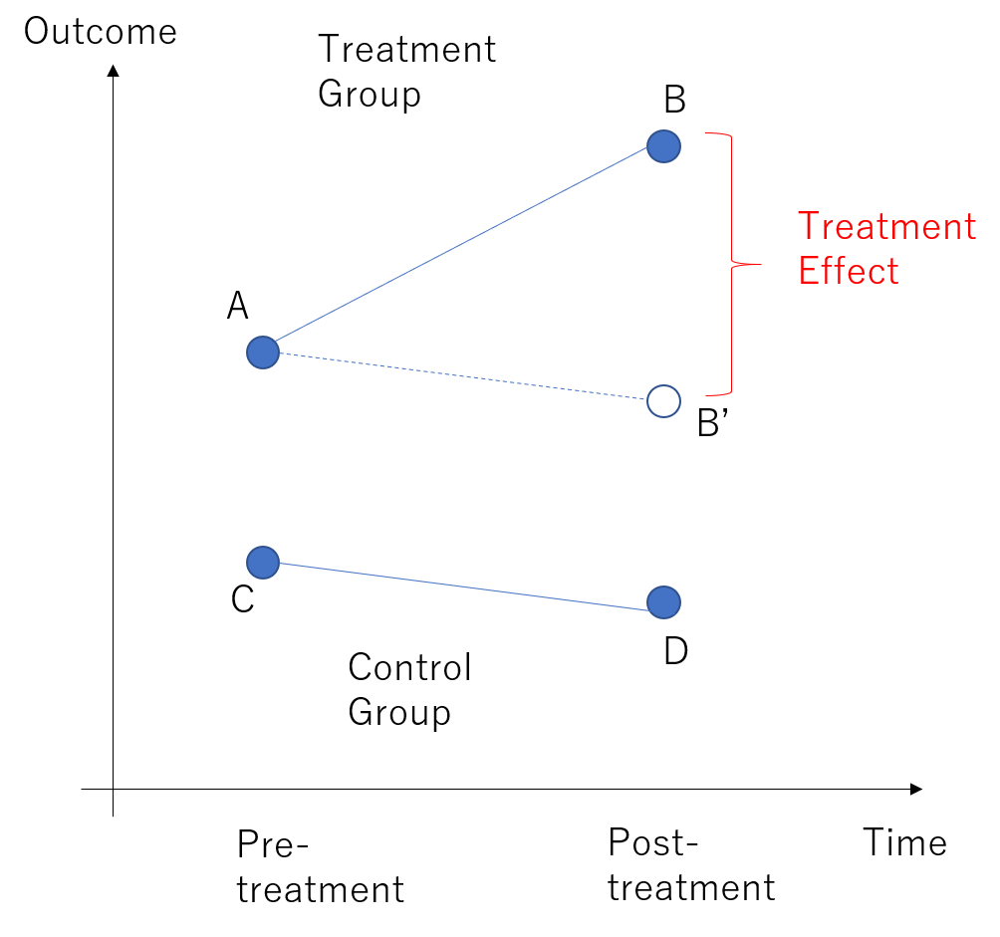
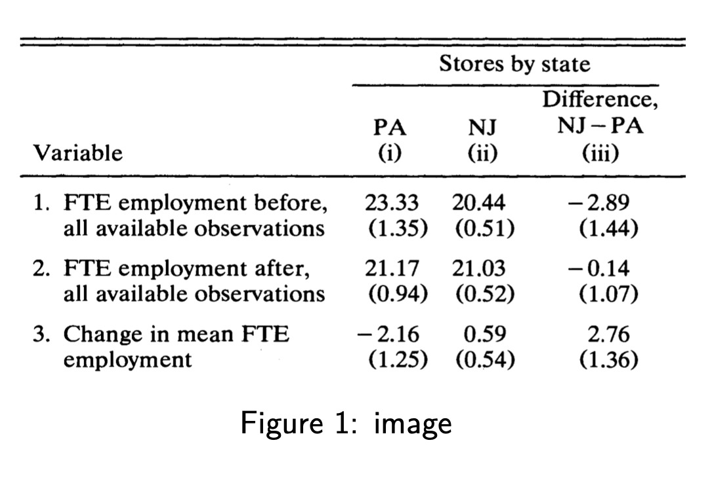
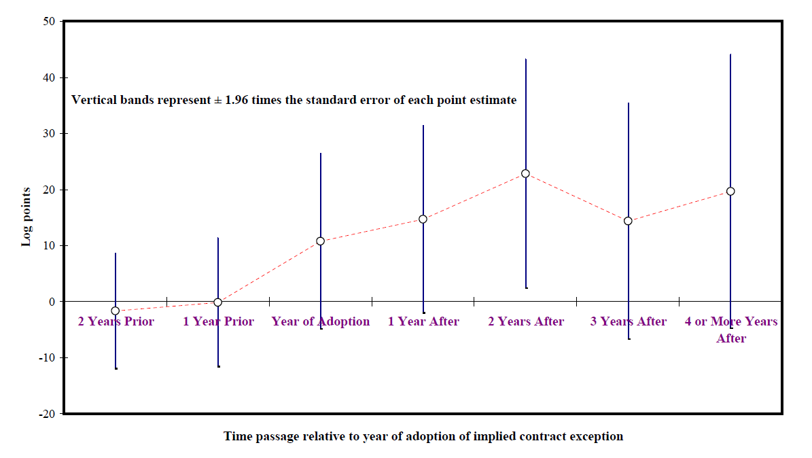

class: center, middle, inverse

```{R, setup, include = F}
# devtools::install_github("dill/emoGG")
library(pacman)
p_load(
  broom, tidyverse,
  ggplot2, ggthemes, ggforce, ggridges,
  latex2exp, viridis, extrafont, gridExtra,
  kableExtra, snakecase, janitor,
  data.table, dplyr, estimatr,
  lubridate, knitr, parallel,
  lfe,dslabs,
  here, magrittr
  # , RcmdrPlugin.KMggplot2
)

options(htmltools.dir.version = FALSE)

# Notes directory
dir_slides <- "~/Users/zhouzhengqing/Desktop/SportsEconAnalysis-master/CausalityPlus_02_Panel_DID"
# Define pink color
red_pink <- "#e64173"
turquoise <- "#20B2AA"
orange <- "#FFA500"
red <- "#fb6107"
blue <- "#3b3b9a"
green <- "#8bb174"
grey_light <- "grey70"
grey_mid <- "grey50"
grey_dark <- "grey20"
purple <- "#6A5ACD"
slate <- "#314f4f"
met_slate <- "#272822" # metropolis font color 
pink  <- "#e64173"
# Dark slate grey: #314f4f

# Knitr options
opts_chunk$set(
  comment = "#>",
  fig.align = "center",
  fig.height = 7,
  fig.width = 10.5,
  warning = F,
  message = F
)
opts_chunk$set(dev = "svg")
options(device = function(file, width, height) {
  svg(tempfile(), width = width, height = height)
})
options(crayon.enabled = F)
options(knitr.table.format = "html")
# A blank theme for ggplot
theme_empty <- theme_bw() + theme(
  line = element_blank(),
  rect = element_blank(),
  strip.text = element_blank(),
  axis.text = element_blank(),
  plot.title = element_blank(),
  axis.title = element_blank(),
  plot.margin = structure(c(0, 0, -0.5, -1), unit = "lines", valid.unit = 3L, class = "unit"),
  legend.position = "none"
)
theme_simple <- theme_bw() + theme(
  line = element_blank(),
  panel.grid = element_blank(),
  rect = element_blank(),
  strip.text = element_blank(),
  axis.text.x = element_text(size = 18, family = cnfont),
  axis.text.y = element_blank(),
  axis.ticks = element_blank(),
  plot.title = element_blank(),
  axis.title = element_blank(),
  # plot.margin = structure(c(0, 0, -1, -1), unit = "lines", valid.unit = 3L, class = "unit"),
  legend.position = "none"
)
theme_axes_math <- theme_void() + theme(
  text = element_text(family = "MathJax_Math"),
  axis.title = element_text(size = 22),
  axis.title.x = element_text(hjust = .95, margin = margin(0.15, 0, 0, 0, unit = "lines")),
  axis.title.y = element_text(vjust = .95, margin = margin(0, 0.15, 0, 0, unit = "lines")),
  axis.line = element_line(
    color = "grey70",
    size = 0.25,
    arrow = arrow(angle = 30, length = unit(0.15, "inches")
  )),
  plot.margin = structure(c(1, 0, 1, 0), unit = "lines", valid.unit = 3L, class = "unit"),
  legend.position = "none"
)
theme_axes_serif <- theme_void() + theme(
  text = element_text(family = "MathJax_Main"),
  axis.title = element_text(size = 22),
  axis.title.x = element_text(hjust = .95, margin = margin(0.15, 0, 0, 0, unit = "lines")),
  axis.title.y = element_text(vjust = .95, margin = margin(0, 0.15, 0, 0, unit = "lines")),
  axis.line = element_line(
    color = "grey70",
    size = 0.25,
    arrow = arrow(angle = 30, length = unit(0.15, "inches")
  )),
  plot.margin = structure(c(1, 0, 1, 0), unit = "lines", valid.unit = 3L, class = "unit"),
  legend.position = "none"
)
theme_axes <- theme_void() + theme(
  text = element_text(family = "Fira Sans Book"),
  axis.title = element_text(size = 18),
  axis.title.x = element_text(hjust = .95, margin = margin(0.15, 0, 0, 0, unit = "lines")),
  axis.title.y = element_text(vjust = .95, margin = margin(0, 0.15, 0, 0, unit = "lines")),
  axis.line = element_line(
    color = grey_light,
    size = 0.25,
    arrow = arrow(angle = 30, length = unit(0.15, "inches")
  )),
  plot.margin = structure(c(1, 0, 1, 0), unit = "lines", valid.unit = 3L, class = "unit"),
  legend.position = "none"
)
theme_set(theme_gray(base_size = 20))
# Column names for regression results
reg_columns <- c("Term", "Est.", "S.E.", "t stat.", "p-Value")
# Function for formatting p values
format_pvi <- function(pv) {
  return(ifelse(
    pv < 0.0001,
    "<0.0001",
    round(pv, 4) %>% format(scientific = F)
  ))
}
format_pv <- function(pvs) lapply(X = pvs, FUN = format_pvi) %>% unlist()
# Tidy regression results table
tidy_table <- function(x, terms, highlight_row = 1, highlight_color = "black", highlight_bold = T, digits = c(NA, 3, 3, 2, 5), title = NULL) {
  x %>%
    tidy() %>%
    select(1:5) %>%
    mutate(
      term = terms,
      p.value = p.value %>% format_pv()
    ) %>%
    kable(
      col.names = reg_columns,
      escape = F,
      digits = digits,
      caption = title
    ) %>%
    kable_styling(font_size = 20) %>%
    row_spec(1:nrow(tidy(x)), background = "white") %>%
    row_spec(highlight_row, bold = highlight_bold, color = highlight_color)
}
```

```{css, echo = F, eval = T}
@media print {
  .has-continuation {
    display: block !important;
  }
}
```

# 引言


---
name: schedule

# 大纲

## 上次实证方法

- 匹配估计 (*MHE* 3.2 和 C&T 25.4).

## 今天

- panel data + DID 


---
layout: true
# 引言

---
class: inverse, middle
---
layout: false
## 初识面板数据分类

- 面板数据(Panel data)
    - 同时包含横截面(cross-section)和时间序列(time series)

- 有用的
  - 更多变异（包括横截面和时间序列的变化）
  - 可以处理**非时变的不可观察到的因素**。
  
---
layout: false
## 面板数据分类

- 分类1：短面板和长面板
  - 短面板是指个体维度 ${N}$ 较大， 时间维度 ${T}$ 较小
  - 长面板是指数据的 ${N}$ 较小， ${T}$ 较大

- 分类2：平衡面板与非平衡面板
  - 平衡面板: 每个个体都有相同时间 ${T}$ 的观测点
  - 非平衡面板: 有部分个体没有相同时间 ${T}$ 的观测点
  - 若非平衡面数据由随机原因造成的，那么处理方法和平衡面板一样，但是如果数据缺失由非随机原因造成的，则必须考虑缺失的原因: 如**样本选择偏差**

---
layout: false
## 面板数据 与 合并横截面数据

.pull-left[
- 平衡面板数据，大T小N


]

.pull-right[
- 合并横截面数据，没有追踪同一个个体


]

---
layout: false
## 面板数据信息来源


- 两个维度的信息
  
  - 不同个体间的差异和同一个个体在不同时间上的差异

- 总方差可以分解为个体间方差和个体内方差

- 总方差(total variation) .mono[=] 个体间方差(between variation) .mono[+] 个体内方差(within variation)

---

layout: false
## 面板数据信息来源


$$s_{0}^{2}=\frac{1}{N T-1} \sum_{t=1}^{N} \sum_{t=1}^{T}\left(X_{i t}-\overline{\overline{X}}\right)^{2} \tag{总方差}$$
$$s_{B}^{2}=\frac{1}{N-1} \sum_{i=1}^{N}\left(\overline{X}_{i}-\overline{\overline{X}}\right)^{2} \tag{组间方差}$$
$$s_{W}^{2}=\frac{1}{N T-1} \sum_{i=1}^{N} \sum_{t=1}^{T}\left(X_{i t}-\overline{X}_{i}\right)^{2} \tag{组内方差}$$

$$s_{0}^{2} \approx s_{B}^{2}+s_{W}^{2}$$
---
layout: true
# 基本架构

---
class: inverse, middle
---
layout: false
## 因果分析的直接理解

$$I N C_{i t}=\alpha+\beta E D U_{{it}}+\gamma G E N D E R_{i}+\theta T A L E N T_{i}+\varphi L U C K_{i t}$$
- 上式中i表示个体，t表示时间

- 收入 $INC_t$ 和受教育程度 $EDU_t$ 的值可观测并随时间变化，称为.b[可观测的随时间变化的变量]

- 性别: $GENDER$ 可观测到，但不随时间变化，称为.b[可观测的不随时间变化的变量]

- 个人天赋: $TALENT$ 观测不到，且不随时间变化，称为.b[不可观测且不随时间变化的变量]

- 个人运气: $LUCK_{it}$ 不可观测且随时间变化的，称为.b[不可观测且随时间变化的]

---
## 因果分析的直接理解

$$I N C_{i t}=\alpha+\beta E D U_{{it}}+\gamma G E N D E R_{i}+{e}_{{it}}$$

- 上式把所有不可观测的因素, 包括TALENT和LUCK都归于干扰项 ${e}$, 那么要得到 $\beta$ 的正确估计，需要EDU和 ${e}$ 不相关, 即EDU与天赋和运气都不相关

$$I N C_{i t}=\alpha+\beta E D U_{{it}}+\gamma G E N D E R_{i}+\alpha_{i}+u_{i t}$$

- 将干扰项 ${e}$ 分解为 $\alpha_{i}$ 和 ${u}$, 其中 $\alpha_{i}$ (个体效应) 是个体不可观测且不随时间变化的因素 $\theta T A L E N T_{i}, {u}$ 是个体不可观测且随时间变化的因素 $\varphi L U C K_{i t}$

- 此时 $\alpha_{i}$ 控制了天赋因素, 要正确估计 $\boldsymbol{\beta}$ 只需要满足EDU与 LUCK不相关

---
## 因果分析的直接理解

- $I N C_{i t}=\alpha+\beta E D U_{{it}}+\gamma G E N D E R_{i}+{e}_{{it}}$ (简单回归模型）

- 图示:
.center[


]


---
## 因果分析的直接理解

- $I N C_{i t}=\alpha+\beta E D U_{{it}}+\gamma G E N D E R_{i}+\alpha_{i}+u_{i t}$ (固定效应模型）


.center[

]

- 面板数据的变量路径图：通过控制不可观测且不随时间变化的变量截断混淆路径

---
layout: false
## 正式的

- 考虑以下模型
$$Y_{i t}=X_{i t}^{T} \beta+Z_{i}^{T} \gamma+ \varepsilon_{it}, \quad E[\varepsilon_{it} |X_{i t}] = 0 \tag{1}$$
其中 $X_{i t}$ K维度向量

- 如果 $X_{i t}$ 与 $\varepsilon_{it}$ 不相关，直接通过OLS就的得到无偏的系数估计，这里的OLS称之为**(pooled OLS)**

- 这里唯一担心是：是否存在遗漏变量偏差
---

## 固定效应模型

- 假设干扰项 $\varepsilon_{it}$ 可以分解为
$$\varepsilon_{it} = \alpha_i + u_{it}$$
其中 $\alpha_i$ 为 **个体固定效应**，意味着 **[无法观测 + 不随时间变动 + 异质性]**

- 模型(1)变为
$$Y_{i t}=X_{i t}^{T} \beta+Z_{i}^{T} \gamma+\alpha_{i}+u_{i t} \tag{2}$$
- $X_{i t}^{T} \beta$ 是可观测随时间变化的变量 
- $Z_{i}^{T} \gamma$ 可观测不随时间变化的变量 
- $\alpha_{i}$ 不可观测不随时间变化的变量 
- $u_{i t}$ 不可观测随时间变化的变量
  - 应满足1: $E\left(\alpha_{i} \mid X_{i t}, Z_{i}\right) \neq 0$
  - 应满足2: $E\left(u_{i t} \mid X_{i t}, Z_{i}, \alpha_{i}\right)=0$

---
layout: true
# 几种常见的固定效应估计方法

---
class: inverse, middle
---
layout: false
## 几种常见的固定效应估计方法


- 组内差分估计法 .mono[->]  组内变换**within transformation**.

- 可以通过添加每个人的虚拟变量来估计模型

    - **最小二乘虚拟变量估计法(LSDV)**
    
- 引入时间固定效应 .mono[->] 双向固定效应

- 对比：一阶差分估计法


- 个体效应残差

---
## 组内差分估计法

- 定义新的变量 $\tilde{Y}_{it}$  
$$\tilde{Y}_{it} = Y_{it} - \bar{Y}_i$$
其中 $\bar{Y}_i = \frac{1}{T} \sum_{t=1}^T Y_{it}$. 

- 应用组内变换，可以消除个体固定效应 $\alpha_i$
$$\tilde{Y}_{i t}=\tilde{X}_{i t}^{T} \beta+\tilde{u}_{{it}}$$

- 对上式使用OLS求 $\beta$
$$
\begin{aligned}
&\hat{\beta}^{i}=\left(\tilde{X}^{T} \tilde{X}\right)^{-1}\left(\tilde{X}^{T} \tilde{Y}\right)=\left(\sum_{i=1}^{N} \sum_{i=1}^{T} \tilde{X}_{i t} \tilde{X}_{i t}^{T}\right)^{-1}\left(\sum_{i=1}^{N} \sum_{i=1}^{T} \tilde{X}_{i t} \tilde{Y}_{i t}\right)= \\
&\left(\sum_{i=1}^{N} \sum_{t=1}^{T}\left(X_{i t}-\bar{X}_{i}\right)\left(X_{i t}-\bar{X}_{i}\right)^{T}\right)^{-1}\left(\sum_{i=1}^{N} \sum_{t=1}^{T}\left(X_{i t}-\bar{X}_{i}\right)\left(Y_{i t}-\bar{Y}_{i}\right)\right)
\end{aligned}
$$

---
## 组内变异度对估计精度的重要性

- 解释变量的组内变异程度是精确估计的关键

- 内部转换消除了时间不变的未观察到的因素
    - 大部分时候，它是内生性来源

- 然而，组内转换也吸收了一部分 $X_{it}$ 的变化。

- 回忆下
$$\tilde{X}_{it} = X_{it} - \bar{X}_i$$
    - 变换后的变量 $\tilde{X}_{it}$ 在个体 $i$ 内有随时间 $t$ 的变化 。
    - 如果 $X_{it}$ 在个体 $i$ 内随时间固定(或者几乎变异度很小)， $\tilde{X}_{it}=0$ 这样就没有变化，估计就会有偏

---
## 最小二乘虚拟变量估计法

- 相较于简便的组内差分估计，另一种方式是不进行组内变换，直接用N个个体的虚拟变量来估计固定效应模型。
$$Y_{i t}=X_{{i} t}^{T} \beta+\sum_{i=1}^{N} d_{i} D_{i}+u_{i t} \tag{3}$$ 

- 模型(3)中个体固定效应不再是 $\alpha_i$ ，而是 $\sum_{i=1}^{N} d_{i} D_{i} = Z_{i}^\prime \gamma + \alpha_i$ ，既包含可观测又包含不可观测的不随时间变化的因素

- 没有在模型(2)中直接增加个体虚拟变量 $\left(D_{1} \ldots D_{N}\right)$ 是考虑其与可观测且不随时间变换的变量 $Z_{i}$ 存在共线性

- **LSDV方法与组内差分估计法得到的估计值一样**

- LSDV缺点：N很大时引入虚拟变量过多，使得估计的计算量变得很大。.b[实际运用中多使用组内差分法(within)]
---
## 引入时间固定效应 .mono[->] 双向固定效应模型

- 模型(3)控制了可**个体不随时间变化的异质性变量**。类似地，通过引入时间固定效应，可以控制**(不可观测的)在同一时间不随个体变化的变量**(比如每年宏观经济环境)

- 考虑到可以将模型(3)中的 $\sum_{i=1}^{N} d_{i} D_{i}$ 可以变换为 $d_i$ ，因此模型(3)写为(3’)
$$Y_{i t}=X_{{i} t}^{T} \beta+{d}_{i}+u_{i t} \tag{3'}$$
- 引入时间固定效应，成为双向固定效应模型

$$Y_{i t}=X_{{i} t}^{T} \beta+{d}_{i}+T_{t}+u_{i t}$$

- 通过引入T-1个时间虚拟变量控制年固定效应
$$Y_{i t}=X_{{i} t}^{T} \beta+{d}_{i}+\sum_{t=2}^{T} \gamma_{t} T_{t}+u_{i t} \tag{4}$$

---
## 对比：一阶差分估计法

- 对个体前后两期做差分以去除个体固定效应

- $$Y_{i t}=X_{{i} t}^{T} \beta+{d}_{i}+u_{i t} \tag{A}$$

- $$Y_{i t-1}=X_{{i} t-1}^{T} \beta+{d}_{i}+u_{i t-1} \tag{B}$$

- (A) .mono[-] (B) 得到： $\Delta Y_{i t}=\Delta X_{{i} t}^{T} \beta+\Delta u_{i t}$ 

- 由于 $\Delta X_{i t}$ 与 $\Delta u_{i t}$ 不相关, 故使用 OLS 方法得到的 $\hat{\beta}^{FD}$ 是 $\beta$ 的一致估计量

- T .mono[=] 2是 $\hat{\beta}^{FD}$ 与 $\hat{\beta}^{within}$ 是一样的；T.mono[>] 2时，两者不一样。

---
## 偶发参数问题 .mono[->] 只控制，不估计FE

- 根据固定效应模型(2)是表达式，模型(3)、(3')和(4)才是估计式

- 加入可以一致估计 $\hat \beta$ 

- $Z_{i}$ 系数的估计值通过以下获得
  - $\hat{d}_{i}=\bar{Y}_{i}-\bar{X}_{i}^{T} \hat{\beta}$
  - $\hat{d}_{i}$ 是 ${d}_{i}=Z_{i}^{T} \gamma+\alpha_{i}$ 的一致估计量
  - 当 $Z_i$ 与 $\alpha_i$ 不相关是，通过 $\hat{d}_{i}$ 对 $Z_i$ 回归可以估计 $\gamma$ ；然而，正如前面所讲， $Z_i$ 与 $\alpha_i$ 通常有共线性，因此无法估计  $\gamma$ 
  
- 只有面板数据时间维度够大， $\hat{d}_{i}$ 才是一致估计量；通常面板数据时间维度不够大，因此**只控制，不估计FE** 

---
layout: true
# 固定效应模型使用注意事项

---
class: inverse, middle
---
layout: false
## 1.系数数大小和显著性发生变化

.hi.qa[问题:]有些变量在使用固定效应模型后系数大小和显著性发生很大变化，应当如何理解这些变化？

  ❶ 加入固定效应后，系数大小和方向可能会发生变化

  - 未使用固定效应模型时 .mono[->] 自变量系数**不是** $\beta$ 一致估计量: <br> $E\left(I N C_{i t} \mid E D U_{{it}}, G E N D E R_{i}\right)=\left(\alpha+\theta \phi_{0}\right)+\left(\beta+\theta \phi_{1}\right) E D U_{i t}+\left(\gamma+\theta \phi_{2}\right) G E N D E R_{i}$

  - 加入固定效应后 .mono[->] 自变量系数**是** $\beta$ 一致估计量: <br>  $E\left(I N C_{i t} \mid E D U_{i t}, G E N D E R_{i}\right)=\alpha+\beta E D U_{i t}+$ $\gamma G E N D E R_{i}+\alpha_{i}$
  
  ❷ 使用固定效应模型，通常估计系数方差会变大 .mono[->] 不显著
  
  - 依赖组内差异 .mono[->] 组间平均差异未被用来估计X和Y的关系，使用的信息变少了，造成估计系数方差变大


---
## 2.系数不显著是否意味没有因果关系

.hi.qa[问题:]当使用固定效用模型后，有些变量系数变为不显著，是否就意味着该变量和被解释变量没有因果关系？

- 原因❶: 变量 $X_{i t}$ 对 $Y_{i t}$ 确实没有因果影响

- 原因❷: 变量 $X_{i t}$ 对 $Y_{i t}$ 有因果影响，但变量 $X_{i t}$ 的组内变异太小，控制固定效应后，由于信息不够造成估计系数方差太大而导致 $Y_{i t}$ 系数不显著

  - 例如：教育对收入影响中 $\left(E D U_{i t}-\overline{E {D} U_{i}}\right)$ 变化很小

- 运用固定效应模型需要变量有充分的组内变化信息

---
## 3.使用Cluster-Robust标准误

- 在OLS中，我们考虑了两种类型的误差结构：
  1. 同方差 $Var(u_i) = \sigma^2$
  2. 异方差 $Var(u_i | x_i) = \sigma(x_i)$


- 假设干扰项间是独立的，也就是说 $Cov(u_{i},u_{j} ) = 0$.


- 面板数据中，干扰项必须考虑 **autocorrelation (自相关)**.
  - 个体 $i$ 的 $u_{it}$ 和 $u_{it'}$ 间在不同时期的关联性


- **Cluster-robust standard error (集群的稳健标准误差)** 就考虑了自相关
    - 集群是个体 $i$ 内，允许组内误差相互关联
    
- 因此使用回归时候要使用 **cluster**

---
layout: true
# Difference-in-Differences

---
class: inverse, middle
---
layout: false
## 简要

-   **Difference-in-differences (DID, 双重差分)** 利用面板数据结构来估计因果效应

- 两种类型的单重差分

    - 干预组和控制组差分
    - 干预前与干预后的差分

-   DID 结合上述两种类型的差分刻画处置效应

---
## DID 图示

.middle[
.center[

]
]


---
## 计划

- 架构

- 在回归框架下执行

- 平行趋势假定

---
class: inverse, middle
name: logistics
# DID基本框架

---
## 基本框架

-   2期时间: $t=1,2$ 。在 $t=2$ 时执行干预政策
-   $Y_{it}$: 个体 $i$ 在 $t$ 期的观测结果
-   $G_{i}$: 是否是干预组的虚拟变量
-   $D_{it}$: 干预状态
    -   $D_{it}=1$ 意味着如果 $t=2$ 并且 $G_{i}=1$
-   **潜在结果**
    -   $Y_{it}(1)$: 当个体 $i$ 被干预时的结果
    -   $Y_{it}(0)$: 当个体 $i$ 没有被干预时的结果
- 那么
\begin{aligned}
    Y_{it} & =D_{it}Y_{it}(1)+(1-D_{it})Y_{it}(0)
\end{aligned}

---
## DID识别

-   目标是估计: 在 $t=2$ 时的ATT 
    $$E[Y_{i2}(1)-Y_{i2}(0)|G_{i}=1]=E[Y_{i2}(1)|G_{i}=1]-E[Y_{i2}(0)|G_{i}=1]$$
-   数据中可以观测到是
       
|        | Pre-period ( $t=1$ )    |      Post ( $t=2$ ) |
|----------------------- | ------------------------ |------------------------|
|干预组 ( $G_{i}=1$ )  | $E[Y_{i1}(0) \mid G_{i}=1]$  | $E[Y_{i2}(1)\mid G_{i}=1]$ |
|控制组 ( $G_{i}=0$  )   | $E[Y_{i1}(0) \mid G_{i}=0]$  | $E[Y_{i2}(0)\mid G_{i}=0]$|


- 在什么样的假设下，我们可以对ATT进行估计呢？

---
## 先看朴素估计量


- 同期内，干预组与控制组差分
  - 若 $E[Y_{i2}(0)|G_{i}=1]=E[Y_{i2}(0)|G_{i}=0]$, ATT为 $$ATT = E[Y_{i2}(1)|G_{i}=1]-E[Y_{i2}(0)|G_{i}=0]$$
  - 几乎会存在选择偏误问题，因为进入干预组还是控制没有随机分配！
  
  
- 同组的，干预后与干预前差分
  - If $E[Y_{i2}(0)|G_{i}=1]=E[Y_{i1}(0)|G_{i}=1]$, ATT为 $$ATT = E[Y_{i2}(1)|G_{i}=1]-E[Y_{i1}(0)|G_{i}=1]$$
  - 几乎会存在时间趋势偏误，因为通常控制组和干预组会有不同的时间趋势效应。某些宏观因素与干预措施是**同时生效的** .mono[->] 干预措施会导致宏观环境产生变化
  
- DID需要更多假设！！！


---
## Parallel Trend Assumption (平行趋势假定)

- 假设:
    $$E[Y_{i2}(0)-Y_{i1}(0)|G_{i}=0]=E[Y_{i2}(0)-Y_{i1}(0)|G_{i}=1]$$
    
- 直观理解是: 在干预组和控制组中，**没有干预**的结果变化是相同的

- 该假设对干预组的**反事实**趋势提供了支持

---
## DID

- 注意到

\begin{aligned}
    \underbrace{E[Y_{i2}(1)-Y_{i2}(0)|G_{i}=1]}_{ATT}= & E[Y_{i2}(1)|G_{i}=1]-E[Y_{i2}(0)|G_{i}=1]\\
    = & E[Y_{i2}(1)|G_{i}=1]-E[Y_{i1}(0)|G_{i}=1]\\
     & -\underbrace{(E[Y_{i2}(0)|G_{i}=1]-E[Y_{i1}(0)|G_{i}=1])}_{=E[Y_{i2}(0)-Y_{i1}(0)|G_{i}=0]\ (pararell\ trend)}
\end{aligned}

-   所以有, 
\begin{aligned}
    ATT= & E[Y_{i2}(1)-Y_{i1}(0)|G_{i}=1]-E[Y_{i2}(0)-Y_{i1}(0)|G_{i}=0]
\end{aligned}

- ATT能够被正确识别

---
class: inverse,middle
name: logistics
# 估计

---
## 估计方法1: 插入样本均值

-   回忆ATT为
$$\begin{aligned}
    ATT= & E[Y_{i2}(1)-Y_{i1}(0)|G_{i}=1]-E[Y_{i2}(0)-Y_{i1}(0)|G_{i}=0] \end{aligned}$$

-   对应位置用样本均值替代 
$$\begin{aligned}
    \hat{ATT=} & \left\{ \bar{y}(t=2,G=1)-\bar{y}(t=1,G=1)\right\} \\
     & -\left\{ \bar{y}(t=2,G=0)-\bar{y}(t=1,G=0)\right\}
\end{aligned}$$
其中 $\bar{y}(t,G)$ 是 $G$ 组别在第 $t$ 期的样本均值

---
### 应用: Card和Kruger (1994, AER)

- 问题: 提高最低工资对就业的影响。

- 1992年4月1日，新泽西州的最低工资从4.25美元上升到5.05美元。

- 比较新泽西州（干预组）和宾夕法尼亚州东部（控制组）的快餐店在上升前和上升后

.middle[
.center[

]
]

---
## 估计方法2: 线性回归

-   回归时执行下面方程
    $$Y_{i t}=\alpha_{0}+\alpha_{1}G_{i}+\alpha_{2}T_{t}+\alpha_{3}D_{it}+X_{{i} t}^{T} \beta+\varepsilon_{it}$$
    -   $G_{i}$: 干预组虚拟变量
    -   $T_{t}$: 进入干预期的虚拟变量
    -   $D_{it}=G_{i}\times T_{t}$， $\alpha_{3}$ 刻画ATT


-   回归框架可以纳入协变量 $X_{it}$ ，这对控制观察到的混杂因素很重要。对控制可观察到的混杂因素非常重要。

- 比较下与双向固定效应的区别 .mono[->] **DID真正的干预变量D是干预组与干预时间的交互项 + 截距项** 
$$Y_{i t}={G}_{i}+T_{t}+X_{{i} t}^{T} \beta+u_{i t}$$
---
## Event Study (事件研究) 模型设置

- 干预政策通过会持续多期,  可以估计**干预后不同时期的处置效应**。


- 模型设置为具有 $k$ 个持续期和提前期
$$Y_{it}= \varepsilon_{i}+\varepsilon_{t}+ \sum_{\tau = -k}^k \gamma^\tau  D_{it}^\tau + X_{it}^T\beta  + \varepsilon_{it}$$
  - 模型控制了个体固定效应 $\varepsilon_{i}$ 和时间固定效应 $\varepsilon_{t}$
  -  $D_{it}^\tau$ 取值 1：如果个体 $i$ 在干预组并且 $t$ 是指远离干预时机的 $\tau$ 时间。

  - 将 $\gamma^{-1} = 0$ 归一化
  
- 为什么要包含滞后期 (如, $\tau = -k, \cdots, -1$)? 之后分析


---
class: inverse,, middle
name: logistics
# 平行趋势的讨论

---
## 平行趋势的讨论

- 平行趋势假设在多种情况下都可能被违反


- 如果干预状态取决于**随时间变化的因素**，干预组和对照组的结果可能有不同的时间趋势。

  - 注意: DID 只能处理 **不随时间变化的因素(可观测+不可观测)**.


- 例如：基于时间变化的因素，自我选择去接受干预与否

  - 人们参加培训计划，是因为在进入该计划之前预期未来的收入会减少<br> .mono[->] 存在一个随时间变动的、负面影响未来收入的(不可观测的)因素


---
## 平衡趋势假设诊断: 比较干预组和控制事前趋势差异

-   检查干预前的趋势是否是平行的 (pre-treatment trend)

-   要求有多个事件发生前的数据

-   如果你有多个事件发生前的数据，应该这样做。

-   注意: 这只是**诊断**，不是对假设的直接**检验**!
    - 请记住: 平行趋势假设是不可检验的
    - 文章中不能写作"如果干预前趋势是平行的，就满足了DID的关键假设" **[×]**

---
## 其他诊断: 干预前的安慰剂效应

-   想法：如果两组确实相似，那么在干预前阶段应该没有**处置效应**（安慰剂结果）

- 就可以执行以下事件研究设置
$$Y_{it}= \varepsilon_{i}+\varepsilon_{t}+ \sum_{\tau = -k}^k \gamma^\tau  D_{it}^\tau + X_{it}^T\beta  + \varepsilon_{it}$$
    
    
- $\gamma^{\tau}$ 估计值应该在干预开始前接近于零 

---
## 应用: Autor (2003) (from *MHE*)

- 图5.2.4：州法院采用默示合同例外对雇佣临时工意愿的影响（来自Autor 2003）。因变量是1979-1995年各州临时工就业人数的对数。估计数来自采纳之前、期间和之后的影响。
.middle[
.center[

]
]

---
class: inverse, middle
name: logistics
# DDD
---
## 应用场景：混淆事件

- 双重差分法的问题：存在其他混淆事件，并只发生在干预组，由此导致平行趋势假设不成立。即使干预未发生，混淆事件也会导致干预组和控制组有差异。

- 三重差分DDD可以解决这类问题

---
### 例子

- 如果2014年后，A省不仅通过了新税法，还有其他利好因素发生。

- 即使没有新税法，A省企业业绩在2014年后也会比B省企业业绩增长得快：平行趋势假设不成立，双重差分法无法识别出新税法对业绩的作用。

- 如果新税法并不影响原本就有免税优惠的企业，可以将样本分为普通企业和免税企业，并对每个子样本使用双重差分法。

- 对普通企业样本得到的双重差分结果反映了新税法和其他利好因素的作用；通过免税企业样本得到的双重差分结果反映了其他利好因素的作用。将前一个结果减去后一个结果（三重差分），反映了新税法对普通企业业绩的影响。

$$
\begin{aligned}
Y_{i t}=& \beta_{0}+\beta_{1}  { Treat }_{\mathrm{i}}+\beta_{2}  { After }_{\mathrm{t}}+\beta_{3}  { High }_{i}+\beta_{4}  { Treat }_{i} * \\
&  { After }+\beta_{5}  { Treat }_{i} *  { High }_{i}+\beta_{6}  { High }_{i} *  { Ater }_{\mathrm{t}}+\\
& \beta_{7}  { Treat }_{i} *  { High }_{\mathrm{i}} *  { After }_{\mathrm{t}}+e_{i t}
\end{aligned}
$$

- 如果个体受事件影响， $H i g h_{i}=1$; 否则 $H i g h_{i}=0$

---
.middle[
.center[

]
]

---
## 应用场景：混淆事件

- 变量 $High_i$ 必须是外生的，即不受事件影响的变量。本例中，普通企业和免税企业的划分是不受新税法影响的。


- .b[如果是会受事件影响的变量，可以使用它们在事件发生前的值进行分组。]

- **三重差分法另一目的：估计事件对不同个体处置效应的差异性**。例如，税法改革对省属企业的作用相较于央企的作用可能更大。如果定义 $High_i=1$ ,如果省属；否则，$High_i=0$.通过三重差分法回归得到的系数 $\beta_7$,反映了税法对省企和央企业绩影响的差异。

---
class: inverse, middle
name: logistics
# 实战
---
## 参考

-   Ishise, Kitamura, Kudamatsu, Matsubayashi, and Murooka (2019) 

    - 关于如何用DID进行政策评估的指导意见 
    - [Slide](https://slides.com/kudamatsu/did-manual/fullscreen)
    - [Paper](https://docs.google.com/viewer?a=v&pid=sites&srcid=ZGVmYXVsdGRvbWFpbnxta3VkYW1hdHN1fGd4OjM4YzkwYmVjM2ZmMzA2YWQ)


---
exclude: true

```{r, generate pdfs, include = F, eval = F}
pagedown::chrome_print("CausalityPlus_02_Panel_DID.html", output = "CausalityPlus_02_Panel_DID.pdf")
```