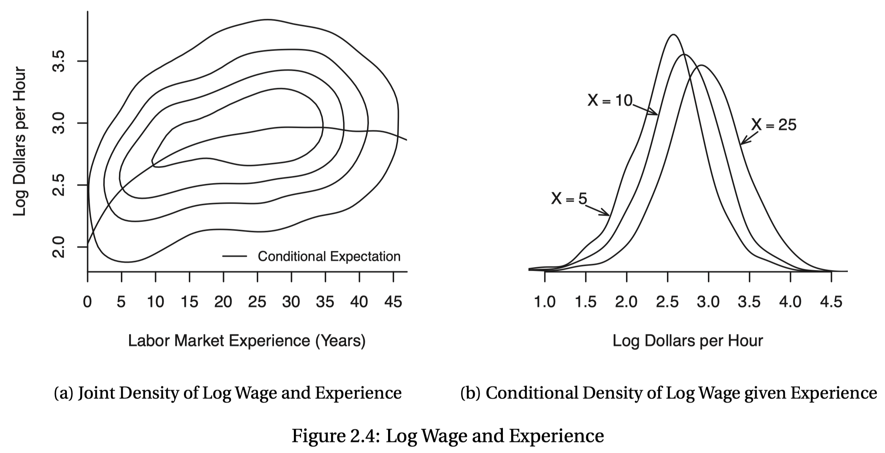

class: center, middle, inverse

```{R, setup, include = F}
# devtools::install_github("dill/emoGG")
library(pacman)
p_load(
  broom, tidyverse,
  ggplot2, ggthemes, ggforce, ggridges,
  latex2exp, viridis, extrafont, gridExtra,
  kableExtra, snakecase, janitor,
  data.table, dplyr, estimatr,
  lubridate, knitr, parallel,
  lfe,dslabs,
  here, magrittr, RcmdrPlugin.KMggplot2
)

options(htmltools.dir.version = FALSE)

# Notes directory
dir_slides <- "~/Users/zhouzhengqing/Desktop/SportsEconAnalysis-master/01_Introduction/"
# Define pink color
red_pink <- "#e64173"
turquoise <- "#20B2AA"
orange <- "#FFA500"
red <- "#fb6107"
blue <- "#3b3b9a"
green <- "#8bb174"
grey_light <- "grey70"
grey_mid <- "grey50"
grey_dark <- "grey20"
purple <- "#6A5ACD"
slate <- "#314f4f"
met_slate <- "#272822" # metropolis font color 

# Dark slate grey: #314f4f

# Knitr options
opts_chunk$set(
  comment = "#>",
  fig.align = "center",
  fig.height = 7,
  fig.width = 10.5,
  warning = F,
  message = F
)
opts_chunk$set(dev = "svg")
options(device = function(file, width, height) {
  svg(tempfile(), width = width, height = height)
})
options(crayon.enabled = F)
options(knitr.table.format = "html")
# A blank theme for ggplot
theme_empty <- theme_bw() + theme(
  line = element_blank(),
  rect = element_blank(),
  strip.text = element_blank(),
  axis.text = element_blank(),
  plot.title = element_blank(),
  axis.title = element_blank(),
  plot.margin = structure(c(0, 0, -0.5, -1), unit = "lines", valid.unit = 3L, class = "unit"),
  legend.position = "none"
)
theme_simple <- theme_bw() + theme(
  line = element_blank(),
  panel.grid = element_blank(),
  rect = element_blank(),
  strip.text = element_blank(),
  axis.text.x = element_text(size = 18, family = "STIXGeneral"),
  axis.text.y = element_blank(),
  axis.ticks = element_blank(),
  plot.title = element_blank(),
  axis.title = element_blank(),
  # plot.margin = structure(c(0, 0, -1, -1), unit = "lines", valid.unit = 3L, class = "unit"),
  legend.position = "none"
)
theme_axes_math <- theme_void() + theme(
  text = element_text(family = "MathJax_Math"),
  axis.title = element_text(size = 22),
  axis.title.x = element_text(hjust = .95, margin = margin(0.15, 0, 0, 0, unit = "lines")),
  axis.title.y = element_text(vjust = .95, margin = margin(0, 0.15, 0, 0, unit = "lines")),
  axis.line = element_line(
    color = "grey70",
    size = 0.25,
    arrow = arrow(angle = 30, length = unit(0.15, "inches")
  )),
  plot.margin = structure(c(1, 0, 1, 0), unit = "lines", valid.unit = 3L, class = "unit"),
  legend.position = "none"
)
theme_axes_serif <- theme_void() + theme(
  text = element_text(family = "MathJax_Main"),
  axis.title = element_text(size = 22),
  axis.title.x = element_text(hjust = .95, margin = margin(0.15, 0, 0, 0, unit = "lines")),
  axis.title.y = element_text(vjust = .95, margin = margin(0, 0.15, 0, 0, unit = "lines")),
  axis.line = element_line(
    color = "grey70",
    size = 0.25,
    arrow = arrow(angle = 30, length = unit(0.15, "inches")
  )),
  plot.margin = structure(c(1, 0, 1, 0), unit = "lines", valid.unit = 3L, class = "unit"),
  legend.position = "none"
)
theme_axes <- theme_void() + theme(
  text = element_text(family = "Fira Sans Book"),
  axis.title = element_text(size = 18),
  axis.title.x = element_text(hjust = .95, margin = margin(0.15, 0, 0, 0, unit = "lines")),
  axis.title.y = element_text(vjust = .95, margin = margin(0, 0.15, 0, 0, unit = "lines")),
  axis.line = element_line(
    color = grey_light,
    size = 0.25,
    arrow = arrow(angle = 30, length = unit(0.15, "inches")
  )),
  plot.margin = structure(c(1, 0, 1, 0), unit = "lines", valid.unit = 3L, class = "unit"),
  legend.position = "none"
)
theme_market <- theme_bw() + theme(
  axis.line = element_line(color = met_slate),
  panel.grid = element_blank(),
  rect = element_blank(),
  strip.text = element_blank(),
  text = element_text(family = cnfont, color = met_slate, size = 17),
  axis.title.x = element_text(hjust = 1, size = 17),
  axis.title.y = element_text(hjust = 1, angle = 0, size = 17),
  # axis.text.x = element_text(size = 12),
  # axis.text.y = element_text(size = 12),
  axis.ticks = element_blank()
)
theme_gif <- theme_bw() + theme(
  axis.line = element_line(color = met_slate),
  panel.grid = element_blank(),
  rect = element_blank(),
  text = element_text(family = cnfont, color = met_slate, size = 17),
  axis.text.x = element_text(size = 12),
  axis.text.y = element_text(size = 12),
  axis.ticks = element_blank()
)
theme_goods <- theme_bw() + theme(
  axis.line = element_line(),
  panel.grid = element_blank(),
  rect = element_rect(size = 1),
  strip.text = element_blank(),
  text = element_text(size = 17, family = cnfont), 
  axis.text.x = element_text(size = 17),
  axis.text.y = element_text(size = 17, angle = 90, hjust = 0.5),
  axis.title.x = element_text(color = purple, size = 19),
  axis.title.y = element_text(color = red_pink, size = 19),
  axis.ticks = element_blank(),
  plot.title = element_blank(),
  legend.position = "none"
)
theme_game <- theme_bw() + theme(
  axis.line = element_line(),
  panel.grid = element_blank(),
  rect = element_rect(size = 1),
  strip.text = element_blank(),
  text = element_text(size = 20, family = cnfont), 
  axis.text.x = element_text(size = 20, color = met_slate),
  axis.text.y = element_text(size = 20, angle = 90, color = met_slate, hjust = 0.5),
  axis.title.x = element_text(color = met_slate, size = 20),
  axis.title.y = element_text(color = met_slate, size = 20),
  axis.ticks = element_blank(),
  plot.title = element_blank(),
  legend.position = "none"
)
shift_axis <- function(p, y=0){
  g <- ggplotGrob(p)
  dummy <- data.frame(y=y)
  ax <- g[["grobs"]][g$layout$name == "axis-b"][[1]]
  p + annotation_custom(grid::grobTree(ax, vp = grid::viewport(y=1, height=sum(ax$height))), 
                        ymax=y, ymin=y) +
    geom_hline(aes(yintercept=y), data = dummy, size = 0.5, color = met_slate) +
    theme(axis.text.x = element_blank(), 
          axis.ticks.x = element_blank())
}
wrapper <- function(x, ...) paste(strwrap(x, ...), collapse = "\n")
# functions
demand <- function(x) 10 - x
demand_2 <- function(x) 9 - x
demand_3 <- function(x) 8 - x
demand_inc <- function(x) 11 - x
demand_dec <- function(x) 5 - x
supply <- function(x) 1 + (4/5)*x
step_demand <- tibble(x = c(0, 1, 2, 3, 4, 5, 6, 7, 8), mv = c(8, 7, 6, 5, 4, 3, 2, 1, 0))
step_demand2 <- tibble(x = c(0, 1, 2, 3, 4, 5, 6, 7, 8, 9, 10, 11, 12), mv = c(10, 10, 9, 9, 8, 8, 7, 7, 6, 6, 5, 4, 4))
step_supply <- tibble(x = c(0, 1, 2, 3, 4, 5, 6, 7, 8, 9, 10, 11, 12), mv = c(2, 2, 3, 3, 4, 4, 5, 5, 6, 6, 7, 8, 8))
step_supply_tax <- step_supply %>% 
  mutate(mv = mv + 2)

data <- read_csv("/Users/zhouzhengqing/Desktop/SportsEconAnalysis-master/05_MicroeconBasics2/Activity_Pit_Market/Results.csv") %>% 
  dplyr::filter(!is.na(price))

theme_set(theme_gray(base_size = 20))
# Column names for regression results
reg_columns <- c("Term", "Est.", "S.E.", "t stat.", "p-Value")
# Function for formatting p values
format_pvi <- function(pv) {
  return(ifelse(
    pv < 0.0001,
    "<0.0001",
    round(pv, 4) %>% format(scientific = F)
  ))
}
format_pv <- function(pvs) lapply(X = pvs, FUN = format_pvi) %>% unlist()
# Tidy regression results table
tidy_table <- function(x, terms, highlight_row = 1, highlight_color = "black", highlight_bold = T, digits = c(NA, 3, 3, 2, 5), title = NULL) {
  x %>%
    tidy() %>%
    select(1:5) %>%
    mutate(
      term = terms,
      p.value = p.value %>% format_pv()
    ) %>%
    kable(
      col.names = reg_columns,
      escape = F,
      digits = digits,
      caption = title
    ) %>%
    kable_styling(font_size = 20) %>%
    row_spec(1:nrow(tidy(x)), background = "white") %>%
    row_spec(highlight_row, bold = highlight_bold, color = highlight_color)
}
```

```{css, echo = F, eval = T}
@media print {
  .has-continuation {
    display: block !important;
  }
}
```

# Welcome to the Course!!

---

## 关于我

- 兴趣领域: 体育经济，数据分析

---

## 课程进度

- 前期：方法和理论的基础

  其中涉及到部分计量经济学基本内容，略有涉及到 **causal inference (因果推论) ** 的部分

  - 目标 1: 建立理论与实证的基本分析思路，掌握一定分析技能
      - 工具：R 或者 STATA
      - 数据科学与实证分析能力 

  - 目标 2: 批判性地审查现有研究和新闻中的陈述
      - **我所陈述 "因果关系"真的对吗?**
      - 透过资料分析找出变数间的因果关系，了解分析因果关系常见方法

---

## 课程进度

- 中期：微观经济学的基础


- 后期：体育经济各专题

    - 职业体育的市场结构
      
    - 体育与城市发展
  
    - 大型赛事
---
## 为什么这么安排

  - 没有传统定式。只讲欧美不适合国情，只谈国情缺乏严谨的推导。
  
  - 背景不同。更偏向体育经济中的经济维度，希望能够达到大部分同学的"公约数"。
  
  - 体育经济是社会经济活动的一部分。桥梁和纽带。
  
  - 时间。先计量基础可以读懂文章和深入确切的专题；中期微观基础加深经济直觉；后期专题帮助选题。
  
  一种尝试，不一定会成功!边走边看。
  
---
## 不担心与担心
  几个不用担心:
  
  - 性别与专项
  
  - 数理基础与学科差异
  
  - 作业太多！
  
几个担心：
  
  - 第一学期课程 .mono[-->] 充分准备 + 及时交流 
  
  - 实证经验 .mono[-->] 寻求帮助 + 网路查询
  
  - 不够务实 .mono[-->] 实战专家 + 同学分享

---

## 今天内容

1. 经验研究和**"因果关系"**

2. 统计概率回顾: 条件期望
    
    
  .mono[----]
    教材：

    1.因果推断实用计量方法(Qiu), by 邱嘉平
    2.Econometrics（E）和Introduction to Econometrics （IE）by Hansen
    3.基本有用的计量经济学(Zhao), by 赵西亮

    
  .mono[----]
    参考:
    
    1.Microeconometrics (C&T),by Cameron and Trivedi
    2.Mostly Harmless Econometrics: An Empiricist's Companion (MHE),by Angrist and Pischke
    3.Causal Inference: the Mixtap(Mixtape),by Scott Cunningham


---

class: title-slide-section, center, middle, inverse 
# 实证研究和**"因果关系"**

---

## 实证研究？经验研究？
当前，学术界对于 Empirical Research 通常翻译为实证研究。杨小凯（1998）和钱颖一（2002）指出 
Empirical Research 更应该翻译为经验研究，而实证研究英文是Positive Research 对应。

- 经验研究对应理论研究（Theoretical Research）

- 经验研究是指运用已有理论和模型来讨论某一个具体问题，讨论中往往运用了统计分析的方法，也可以视作是对已有理论和模型的检验（钱颖一，2002）；

- 理论研究多是指理论创新，即在对前人的观点进行吸收与评价的基础上，提出对新经济现象的解释或对早期经济现象提出更新的解释（杨小凯，1998）。

- 西方主流学界“套路”：计量方法对经济现象进行经验（实证）分析；用各种数理方法进行的理论演绎推理（如博弈论、产业组织）；更正统套路是理论模型演绎推理 .mono[+] 样本数据经验实证。

---

## 实证研究和规范研究

实证研究与规范研究（Normative Research）相对应。

- 实证研究通过观察（实验、调查问卷、访谈等）获得经验判断，再将经验结论归纳为理论。解决 “是什么”的问题。

- 规范研究通常代言一定的价值判断，提出某些分析和处理经济问题的标准，并以此树立起经济理论的前提，作为经济政策制定的依据。解决 “应该是什么”的问题。

    - 假设有两个人正在讨论最低工资法。甲：最低工资法引起了失业；乙：保证居民基本福利水平，应该提高最低工资。甲的说法像一个科学家(医生)：是关于世界是如何运行的表述。乙的说法象一个决策者，是如何改变世界的表述。

---

## 量化 + 质性

量化和质性都是科学研究，都是为了探求寻找因果关系。

经验研究既可以是量化（quantitative）的,也可以是质性（qualitative）的。

质性研究：倾向于描述某个主题，而非进行测量，就像是某个人的印象、意见与看法。收集资料时结构较松散，主轴是深入探讨一个主题，以获得动机、想法与态度等资讯。这种研究方式虽然能深入了解某个问题，但其结果有特殊性，难以推广和普世化。一般样本量比较小。

量化研究：收集客观、不容辩驳的事实——数字。定量资料是结构化的统计数据。当要归纳出总结论时，统计数据可拿来佐证你的结论。

质性研究常被当作是主观的。这其实是一种误解, 质性研究也是对质性数据的分析来得出研究结论的,也属于经验研究范畴。

人文社会科学类，好的研究两者都需要！

---

## 实证研究目的

经济学家关心的是：理解人类、社会的经济行为。
通常实证分析的目标有以下四种：

### 1.了解变量间共变性 (Measurement)

- 测算理论定义的参数。如竞争均衡指标等。

- 经济现象的助推器，即直接测量由经济理论提出的基本关系（已经估计出参数的模型，对所研究的经济关系进行定量的考察，以说明经济变量之间的数量比例关系，特别适用于验证常识性的基本经济概念）。初步了解领域和把握规律特别有帮助。

    - 培训行业价格随着竞争者数量的变化而变化的程度如何？
    - 体育服装制造业的生产力（如全要素生产率）在过去30年中是如何变化的？
    - 大学入学率对预期工资的影响是什么？
---

### 2.理解某种（理论）关系 (Model Testing)

特别是检验某种经济理论的含义是否正确。

利用计量经济模型去验证既有经济理论或者提出新的理论结论是推动经济理论发展的重要途径。

- 依据理论建立的模型能够很好的拟合数据，模型估计检验结果与理论相符合，也就验证了既有理论。

- 否则，就是理论不足？不一定，很大可能是在经验分析环节出问题。

.mono[----]

1和2点在逻辑上是：**理论置于证据前**，即：

- 经济理论(假设) .mono[-->] 基本概念 .mono[-->] 测量

- 经济理论(假设) .mono[-->] 找到支撑证据
---
### 3.预测结果 （Prediction of an Outcome of Interest）

.pink[X] .mono[-->] .purple[Y]

经济预测可以是对被解释变量未来时期的动态预测，也可以是对被解释变量在不同空间状况的空间预测。
    

---
### 4."因果"效应估计 (Model Estimation for Counterfactuals)

对某种政策的实施后果进行模拟测算，从而其作出评价。

计量经济模型当作经济运行的“实验室”,去模拟所研究的经济体系,分析整个经济体系对各种假设的政策条件的反应.


- 不同的激励措施，对学生体测的成绩会有怎样影响？

---
###  测量 vs.因果效应的估计

严格区分“因果”效应估计（estimation）和测量 (measurement)要格外小心，甚至通常情况是错误的。经济学中大多数 "测量 "问题都涉及反事实的形式，即"在条件都不变情况下，如果改变了X，世界会有什么不同？

回顾情境1的例子
- 进入市场对价格的影响：不能只比较竞争者数量不同的市场
- 生产力：不能只看投入和产出来了解生产函数（从而了解全要素生产率）,因为不可观察因素既影响企业选择的投入水平，也影响其实现的产出
- 上大学的回报：不能只比较上过学和没上过学的人的工资
    
大多数因果关系是由反事实问题定义：
**"如果某些事情被改变而其他事情保持不变，会发生什么？**

---

## 经验研究的基本类型 

- 描述性的: 基于可观测的数据估计相关性，例如：

  - 大学毕业生每小时的收入比没上大学的人多40%；
  - 现在的收入不平等比30年前要高；


- 结构性的: 对数据生成过程（data generating process）的特征的估计。如，理论模型的一些特征是否因为政策实施或者其他变量不变的情况下而改变。更可能反映因果关系。

---
class: title-slide-section, center, middle,inverse 
name: logistics

# 经验分析与数据

---
## 为什么要经验分析？

- __简单理由:__ 使用数据了解世界。

    - 观察数据（observational data）：一般来说，体育经济领域数据主要在个人水平、家庭水平以及企业水平，大多是属于__微观数据__。主要出自上述层面的调查数据（survey data），最常见还有是人口普查。
 
    - 实验数据（experimental data），条件可控。
---
### 微观数据特点
- 依据抽样方法获取样本，建立在有确定的分布的数据生成的基础上。
样本 $S_{t}$ 是从 $F\left( \boldsymbol{\theta}_{i}\right)$  总体参数向量中抽取的, $F$  一般假设是已知（如正态分布）。

    - 如多阶段调查：层（strata）、初级抽样单元（psu）、二级抽样单元（ssu）和最终抽样单元（usu）。大型调查还会加权（sampling weights）。

- 平稳总体（stationary population）假设：意味着每次随机抽样获得的参数都是一样的，即对于所有 $t$ ， $\boldsymbol{\theta}_{i}=\boldsymbol{\theta}$ ，强假设 .mono[-->] 识别参数 $\theta$ 的可能。不然因个体而变的 $\theta_i$ 需要的识别方程数量就太多了。

---
###  常见的微观数据结构

5大类：
- **横断面（cross-sectional）**：个体在某个时点的观察。调查和行政记录是横断面数据的典型来源。样本量n是相当大的。一般的假设是横截面观测值是相互独立的。

- 时间序列（time series）：单个个体持续时间的观察。股票价格等，它的数据频率很高（每天、每小时或每笔交易），所以样本量可能相当大。

- **面板数据（panel data）**：个体在一段时间内反复测量。假设是个体之间是相互独立的，但某个个体的观测值是相互依赖的。短面板是大N小T，长面板（国别研究）时小N大T, 性质倾向时间序列。面板数据重点是对误差项成分的处理。

- **聚类（clustered）**：面板数据中的聚类研究流行。观测值被分组为 "群组"，一般“组间独立，组内相关”。与面板数据的主要区别在于，聚类抽样通常不对误差项的结构进行明确建模，不对组内的依赖性（相关）进行建模，而是更关注对任意形式的群组内相关的稳健推断（robust）。

---

###  标准数据结构

- 空间数据（spatial data）：空间依赖性是特别相互依赖的模式，根据一个空间尺度（例如，地理上的接近性）。与聚类不同，空间模型允许所有个体都相互依赖，并且要对依赖关系的结构的明确建模。空间依赖性也可以被看作是时间序列依赖性的一般化。


 **.qa[Q]: ** 哪些分别举列子？

---

###  依靠观察数据推断**因果关系**很困难

从实验数据获得因果关系容易。
从观察数据中推断因果关系很困难的。因为无法操纵一个变量来观察其对另一个变量的直接影响。

- 例：教育回报率（returns to schooling）

估计教育程度对工资的影响。观测数据支持：受教育程度与工资正相关。

然而实际：受教育水平（至少部分）由这个人选择决定的，其中个人能力和工作态度决定着受教育的程度。高能力和勤奋刻苦的人在学校表现更好，因此选择获得更高的教育水平。仅从这点，就将高工资的**原因**归纳为是由于受教育程度高，因为"看不见的"能力和态度也同时影响受教育程度和工资。

---
###  现实很"残忍!

- 有偏样本（biased sampling）。“好”样本依赖随机抽样，保证样本与总体分布相同。但若是抽样中基于的分层变量与自变量X相关，观测结果Y除X外还会依赖于分层变量，导致有偏样本，引起**样本选择偏误（Sample Selection Bias）**。

- 此外：测量误差（measurement errors）、缺失数据（missing data）、删失（censored）和截断(truncated)、遗漏变量（omitted variables）、样本损耗（sample attrition）等都会造成有偏样本。


上述问题导致估计偏误统称为**内生性问题**。计量经济学就是围绕着**减轻**内生性问题带来的估计偏误而发展的。

.center[
**体育经济分析的目的：就是减少偏误或者确定偏误的方向。**
]


---
## 模型的作用


经验研究就是选择合适的模型，来捕捉总体的基本特征，并且允许通过抽取样本对结论进行验证。

只有通过具体某个模型，才能持续地、一致地讨论
某个假设是否成立、是否有替代的假设，数据测量是否合理，这就也就意味着科学的进步。
<br/><br/>

经验研究的走向：

- 简化式 reduced form: 常见的因素影响方程  .mono[-->] 完善研究设计（因果推断），寻找更好样本（社会实验数据和自然实验数据。

- 结构式 structural form，每个方程都有明确含义  .mono[-->] 完善模型结构（SEM），更好适配数据（类型、拟合度）。

- 大数据
---
class: title-slide-section, center, middle,inverse 
name: logistics

# 条件期望回顾

---
## 概率分布函数与概率密度函数

- 感兴趣的变量是工资
  - 它是个随机变量
  - 假设总体有确定的分布
  
**.qa[Q]: **要想了解总体特征，该如何实现？

- 可以抽样获得一个样本，用样本特征描述总体特征

    - 用样本分布估计总体分布，但两者之间是有“距离”的。之后解决。
    
    - 数学上的结论：概率分布函数（probability distribution function）可微，那么它的概率密度函数（probability density function）就能够反映概率分布函数的特点。
    
    - 可以制作频率直方图代表样本分布，来反映总体特征。（想象：将总体工资分成小区间，将抽到的值放入对应的区间，工资在每个区间内出现的次数）. 数学上 $f(w)=\frac{d}{d w} F(w)$ , $w$ 表示 $wage$ .
    

---

## 条件分布 (Conditional Distribution)

- 可以捕捉两个变量的关系。
- 假设 $Y$ 与 $X$ 是随机变项（量）.
    - $Y$ 是因变量（被解释变量|结果变量）; $X$ 是自变量（解释变量|干预变量）. 
    - 随机变量（r.v.），具有概率分布


- 可以建立联合概率分布函数（joint probability distribution function）和联合密度函数 ( joint density function) 来捕捉两个变量的关系。

    
---
## 条件期望（Conditional Expectation ）

- 概述

    - 更关心 $X$ 和 $Y$ 间的关系
    
    - 条件期望是描述这种关系的一种方法
    
---
## 工资（Y）和性别（X）差异的关系？

- 《E》p16:

工资对数的条件均值可以写成如下形式：

$$ E[ log(wage) \mid gender = man ] = 3.05 $$

$$ E[ log(wage) \mid gender = woman ] = 2.81 $$
<br/><br/>
关注条件均值的好处：将复杂分布的特点描述简单（均值），方便组间比较。 条件均值是经济分析和回归分析的主要关注点。还可以增加其他的条件，种族，后的工资比较。
$$ E[\log (wage ) \mid gender =\operatorname{man}, race = white]=3.07 $$
$$ E [\log ( wage ) \mid gender = woman, race = black ]=2.73 $$

    
---
## 条件期望函数（Conditional Expectation Function ）

当涉及多个“条件”时，可以写作：

$$E\left[Y \mid X_{1}=x_{1}, X_{2}=x_{2}, \ldots, X_{k}=x_{k}\right]=m\left(x_{1}, x_{2}, \ldots, x_{k}\right)$$

向量形式：

$$E[ Y \mid X=x]=m(x)$$
所以 CEF $m(x)=E[Y \mid X=x]$ 就是 $x \in \mathbb{R}^{k}$的函数 ，意味着“ 当 $X$ 取值 $x$ 时, $Y$ 的平均值为 $m(x)$ ”,由于 $X$ 可以取值任意的 $x$ , 因此将CEF视为随机变量 $X$ 的函数。

**.qa[Key]:  深刻理解条件期望函数是 $x$ 的函数 **  

例：三个种族， $x =$ (黑，白，其他) , $y =log(wage)$ ，每个种族都有一个工资的均值，均值与种族取值( $x$ )一一对应关系。


---

## 边缘密度函数与条件密度函数

给定联合密度函数 $f(y, x)$, 变量 $x$ 的边缘密度函数为:
$$f_{X}(x)=\int_{-\infty}^{\infty} f(y, x) d y$$

对于任意 $x$ 的 $f_{X}(x)>0$, 给定 $X$ , $Y$ 的条件密度函数为: 
$$f_{Y \mid X}(y \mid x)=\frac{f(y, x)}{f_{X}(x)}$$

条件密度相当于联合密度 $f(y, x)$ 在保持x不变情况下的随机化“切片”.

---
##条件密度函数
- 离散形式： $$P(y|x)=\frac{P(y,x)}{P(x)}$$ 其中 $P(x)=\sum_{i=1}^{N}P(y_{i},x)$


---


## 边缘密度函数与条件密度函数

 **.qa[Q]: **想象一下?

.middle[
.center[

]
]

---
## 条件期望值函数的性质

- **性质1** (期望迭代法则,law of iterated expectation)
$$
E[E[Y \mid X]]=E[Y]
$$

 $E[Y|X]$ 的期望值是 $[Y]$ 的无条件期望值。
 <br/><br/>
例如：

---
- **性质1**推论
$$E\left[E[Y|X_{1},X_{2}]|X_{1}\right]=E[Y|X_{1}]$$
    - 内部期望值以X1和X2同时为条件,外部期望值只以X1为条件。迭代后的期望值可以得到简单的答案E[Y|X1],即只以X1为条件的期望值。《E》表述为"较小的信息集获胜"  .mono[-->] 以小谋大
    
<br/><br/>
例：

---
- **性质2** (线性) $$E[a(X)Y+b(X)|X]=a(X)E[Y|X]+b(X)$$ 对于函数 $a(\cdot)$ and $b(\cdot)$. 
 <br/><br/>
 <br/><br/>

- **性质3**（独立意味着均值独立）
 <br/><br/>
若 $X$ 与 $Y$ 独立, 则 $E[Y|X]=E[Y]$

---
- 性质3证明 (以离散变量为例): 

\begin{eqnarray}
E[Y|X]&=&\sum_{i=1}^{N}y_{i}P(Y=y_{i}|X) \\
	  &=&\sum_{i=1}^{N}y_{i}\frac{P(Y=y_{i},X)}{P(X)} \\
	  &=&\sum_{i=1}^{N}y_{i}\frac{P(Y=y_{i})\times P(X)}{P(X)} 
	  &=&E[Y].
\end{eqnarray}

用到 $P(Y=y,X=x)=P(X=x)P(Y=y)$ .

---
    
- **性质4** （均值独立意味着不相干）
<br/><br/>
若 $E[Y|X]=E[Y]$, 则 $Cov(X,Y)=0$.
    -  $E[Y|X]=E[Y]$ is 均值独立(**mean independence**)
    - 记住: 均值独立意味着不相干，反过来不一定成立.

<br/><br/>
- **性质5** （条件期望值是最小均值平方误差）

假设对于任意函数 $g$ 有 $E[Y^{2}]<\infty$ 并 $E[g(X)]<\infty$ , 那么 $$E[(Y-\mu(X))^{2}]\leq E[(Y-g(X))^{2}]$$ 其中 $\mu(X)=E[Y|X]$.

- 解读:
    - 假设使用某种函数形式 $g$ 和数据 $X$ 来解释 $Y$
    -  那么 $g$ 的最小均方误（ **the mean squared error** ）就是条件期望。


---

- **性质5** 证明(自行推导):

\begin{eqnarray}
E[(Y-g(X))^{2}]	&=&E[\left\{ \left(Y-\mu(X)\right)+\left(\mu(X)-g(X)\right)\right\} ^{2}]\\
	&=&E\left[\left(Y-\mu(X)\right)^{2}\right]+E\left[\left(\mu(X)-g(X)\right)^{2}\right]\\
	&+& 2E\left[\left(Y-\mu(X)\right)\left(\mu(X)-g(X)\right)\right].
\end{eqnarray}

使用期望迭代法则
\begin{eqnarray}
E\left[\left(Y-\mu(X)\right)\left(\mu(X)-g(X)\right)\right]	&=&E\left\{E\left[\left(Y-\mu(X)\right)\left(\mu(X)-g(X)\right)|X\right]\right\} \\
	&=&E\left\{ \left(\mu(X)-g(X)\right)\left(E[Y|X]-\mu(X)\right)\right\} \\
	&=&0
\end{eqnarray}

所有,
$$E[(Y-g(X))^{2}]=E\left[\left(Y-\mu(X)\right)^{2}\right]+E\left[\left(\mu(X)-g(X)\right)^{2}\right],$$ which can take its minimum when $g(X)=\mu(X)$.


---
## 其他有用的性质

- **概率迭代法则**
$$P(Y)=\sum_{i=1}^{N}P(Y|x_{i})P(x_{i})$$   
$X$是离散随机变量
<br/><br/>
- **方差加法法则**
$$Var(Y)=E[V(Y|X)]+V[E(Y|X)]$$

---
class: title-slide-section, center, middle,inverse 
name: logistics

# 误差与模型构建

---

## 条件期望函数误差

.pull-left[
- Conditional Expectation Function Error （CEFE）
$$ e = Y - E(Y|X) = Y - m(x) $$
    - $X$ 是RVs, $E(Y|X)$ 也是RVs.对于二元变量 $D_i$ , CEF有两个值 $E[Yi|Di = 1]$和 $E[Y_i|D_i = 0]$

    - $e$ 是RVs，具有概率分布
]

.pull-right[
- CEFE性质

    1. $E(e|X)=0$
    
    1. $E(e)=0$
    
    1. 对于任意形式 $h(x)$ , $E(h(X)·e)=0$

]

---

## 条件期望函数误差（图示）

 **.qa[Key]: **注意条件分布的形状是随着工作经验如何变化？
 
.middle[
.center[

]
]

---

## 总结：模型构建（by Hansen）


step1: 定义条件期望函数 $m(x) = E(Y|X)$

step2: 定义条件期望函数误差 $e = Y - m(x)$

推导出：$$Y = m(x) + e$$

因此模型类别由 $m(x)$ 形式决定。

如截距模型，线性模型，Logit模型等。

---

exclude: true

```{R, generate pdfs, include = F, eval = F}

pagedown::chrome_print("01_introduction.html", output = "01_introduction.pdf")

```


